<p align="center">
  
</p>

<p align="center">
  <a href="#"></a>
  <a href="#"></a>
  <a href="#"></a>
  <a href="#"></a>
</p>

# 🏢 Master AI Agent Skills for Enterprise Systems & Software Engineering

> 🌐 **Interactive Animated Showcase Site**: Visit the live single-page web app in [`docs/index.html`](file:///d:/Exploring%20new%20ideas/All%20AI%20skills/docs/index.html) with 60 FPS interactive particle constellation animations, instant search, track filters, and 1-click prompt copies! Easily deployed to **GitHub Pages** via the `/docs` folder.

A comprehensive, production-grade suite of **115 AI Agent Skills** modeling an **entire modern technology organization**, **Super Expert Full-Stack Developer**, **Principal Cybersecurity & Threat Defense Architect**, **Mobile & Multi-Platform Application Engineer**, **Software Design Authority (SDA)**, **Professional QA & SDET Test Architect**, **Principal Anti-Slop Code Simplifier**, **AI Agent Token Optimization & Context Economics Specialist**, and **Architectural Vector Graphics & SVG Motion Specialist** collaborating on software and systems—spanning executive strategy, user research (UXR), AI/LLM architectures, distributed consensus, storage engines, mechanical sympathy, event sourcing, multi-tenant SaaS, end-to-end type safety (tRPC), React Server Components (RSC), real-time CRDTs (Yjs), local-first sync (Dexie), 60 FPS UI performance, WebAuthn Passkeys, media pipelines, Turborepos, GitOps, DevSecOps, SRE error budgets, OWASP API Top 10, WAF & L7 DDoS mitigation, PII/DLP tokenization vaults, offensive Red Teaming, eBPF Blue Team SOC, Zero Trust IAM, HashiCorp Vault, seccomp container hardening, EPSS vulnerability triage, React Native/Expo, native Android (Jetpack Compose), native iOS (SwiftUI), E-reader engines & reflowable pagination, Flutter, encrypted offline SQLite sync, APNs/FCM push notifications, mobile hardware keystores, Fastlane CI/CD store delivery, Object-Oriented Analysis & Design (OOAD), Craig Larman's GRASP patterns, ATAM architecture tradeoff evaluation, automated Architecture Fitness Functions (ArchUnit), ISO 29119 test planning, ISTQB black-box testing (ECP, BVA, Decision Tables), Behavior-Driven Development (BDD/Cucumber), Consumer-Driven Contract Testing (Pact), WireMock service virtualization, visual regression diffing, WCAG 2.2 digital accessibility (axe-core), mutation testing (Stryker), Maestro mobile QA automation, Session-Based Test Management (SBTM), ruthless elimination of AI code slop and phantom dependencies, and advanced AI agent token optimization (KV-cache prompt caching, AST repository maps, tool output distillation, multi-turn trajectory compaction, frugal model cascades, schema minification, line-range chunking, semantic RAG, scratchpad pruning, and token budget governance), and pure CSS vector motion engineering (pendulum kinematics, CAD/BIM architectural drafting, monochrome noir high-contrast design, vector particle simulation, and parametric SVG optimization).

Designed for modern AI coding agents (**Antigravity**, **Gemini CLI**, **Cursor**, **Claude Code**, **Copilot Workspace**, and **Windsurf**), this repository provides modular, standardized runbooks (`SKILL.md`) that instruct AI agents how to think and operate as domain experts across every organizational role.

---

## 🗺️ Organization-Wide Project Lifecycle Map

```mermaid
flowchart TD
    subgraph S1["1. Strategy, Customer Discovery & UXR"]
        S27["27: Product Strategy & Market Sizing"] --> S40["40: User Research & Usability (The Mom Test)"]
        S40 --> S26["26: Business Analysis & BPMN Modeling"]
        S26 --> S32["32: Executive Communication & BLUF Memos"]
    end

    subgraph S2["2. Deep Research, AI & Principal Systems Thinking"]
        S32 --> S24["24: Principal Systems Thinking (Mental Models)"]
        S24 --> S23["23: Deep Technical Research & RFCs"]
        S23 --> S25["25: Build vs Buy vs Open Source (TCO)"]
        S25 --> S33["33: LLM & Hybrid RAG System Architecture"]
        S33 --> S34["34: Autonomous AI Agent Design & Tool Use"]
        S34 --> S31["31: Team Topologies & Org Design"]
    end

    subgraph S3["3. Architecture, Contracts & Networking"]
        S31 --> S01["01: Requirements & PRD Spec"]
        S01 --> S02["02: Domain-Driven Design (DDD)"]
        S02 --> S03["03: System Architecture Design (C4)"]
        S03 --> S04["04: Architecture Decision Records (ADRs)"]
        S04 --> S05["05: API Contract Design (OpenAPI/gRPC)"]
        S04 --> S06["06: Event & Messaging Design (CloudEvents)"]
        S04 --> S44["44: Event Sourcing & CQRS Architecture"]
        S05 --> S37["37: Edge API Gateway & Service Mesh (mTLS)"]
    end

    subgraph S4["4. Data Storage, Storage Engines & Sharding"]
        S37 --> S07["07: Database Modeling & Migrations"]
        S07 --> S08["08: Distributed Caching & Stores"]
        S07 --> S42["42: Database Internals & Storage Engines (LSM)"]
        S07 --> S50["50: Database Sharding & Partitioning"]
        S07 --> S35["35: Data Pipeline & Streaming (Lakehouse)"]
    end

    subgraph S5["5. Distributed Consensus & Low-Latency Performance"]
        S08 --> S41["41: Distributed Consensus & Replication (Raft)"]
        S41 --> S43["43: High-Performance & Low-Latency (Zero-Copy)"]
    end

    subgraph S6["6. Multi-Tenancy, Security & Core Engineering"]
        S43 --> S45["45: Multi-Tenant SaaS Architecture (RLS)"]
        S45 --> S09["09: Security & STRIDE Threat Modeling"]
        S45 --> S47["47: Applied Cryptography & Envelope Encryption"]
        S09 --> S10["10: Clean Architecture & SOLID"]
        S10 --> S11["11: Design Patterns & Idioms"]
        S10 --> S12["12: Resilience & Error Handling"]
        S10 --> S13["13: Concurrency & Async Systems"]
    end

    subgraph S7["7. Super Expert Full-Stack & Modern Web"]
        S10 --> S59["59: Fullstack Monorepo & Turborepo"]
        S59 --> S51["51: End-to-End Type Safety & tRPC"]
        S51 --> S52["52: SSR, RSC & Modern Frameworks"]
        S52 --> S53["53: Advanced Form Architecture & Validation"]
        S52 --> S57["57: Fullstack Auth, Sessions & Passkeys"]
        S52 --> S58["58: Media Processing & Edge Delivery"]
        S52 --> S14["14: Frontend Architecture & State"]
        S14 --> S54["54: Realtime Collaboration & CRDTs"]
        S14 --> S55["55: Offline-First & Local Sync (Dexie)"]
        S14 --> S56["56: Web Animations & 60fps Performance"]
        S14 --> S49["49: Micro-Frontends & Modular Web"]
    end

    subgraph S8["8. Cybersecurity Engineering & Threat Defense"]
        S52 & S05 --> S61["61: API Security & Zero-Trust Gateways"]
        S61 --> S62["62: Cyber Attack Prevention & WAF"]
        S61 --> S63["63: Data Security, DLP & Tokenization"]
        S61 --> S66["66: IAM Zero Trust & ReBAC"]
        S66 --> S67["67: Secrets Lifecycle & Vault Architecture"]
        S62 --> S68["68: Runtime Defense & Container Hardening"]
        S68 --> S69["69: Cloud Security Posture & K8s Hardening"]
        S61 --> S64["64: Penetration Testing & Red Teaming"]
        S64 --> S65["65: SIEM Detection & eBPF Incident Response"]
        S64 --> S70["70: Vulnerability Management & CVSS/EPSS"]
    end

    subgraph S9["9. Testing, Diagnostics & Analytics"]
        S52 & S49 --> S15["15: Test-Driven Development (TDD)"]
        S15 --> S16["16: Integration & E2E Testing"]
        S16 --> S17["17: Performance & Load Testing (k6)"]
        S15 --> S18["18: Code Review & PR Audit"]
        S18 --> S19["19: Refactoring & Debt Reduction"]
        S18 --> S48["48: AST Tooling, Codemods & Custom Linters"]
        S16 --> S28["28: Data Analytics & Experimentation (A/B)"]
        S16 --> S60["60: Fullstack Debugging & DevTools Profiling"]
    end

    subgraph S10["10. DevOps, GitOps, SRE & Operations"]
        S17 & S18 --> S20["20: Containerization & CI/CD DevOps"]
        S20 --> S46["46: Infrastructure as Code & GitOps (ArgoCD)"]
        S20 --> S39["39: DevSecOps & Supply Chain Security (Cosign)"]
        S20 --> S29["29: Cloud Economics & FinOps (Infracost)"]
        S20 --> S21["21: Observability & Telemetry (OTel)"]
        S21 --> S38["38: SRE, SLOs & Error Budget Burn Rates"]
        S38 --> S36["36: Chaos Engineering & Disaster Recovery"]
        S21 --> S22["22: Incident Debugging & Runbooks"]
        S20 --> S30["30: Compliance, Governance & Risk (GRC)"]
    end

    subgraph S11["11. Mobile, Native & Multi-Platform Application Engineering"]
        S52 & S05 --> S71["71: React Native & Expo Architecture"]
        S05 --> S72["72: Native Android & Jetpack Compose"]
        S05 --> S73["73: Native iOS & SwiftUI"]
        S72 & S73 --> S74["74: E-Reader Document Engines & Pagination"]
        S71 --> S75["75: Flutter & Multiplatform Dart"]
        S71 & S72 & S73 --> S76["76: Mobile Offline Sync & SQLite"]
        S71 & S72 & S73 --> S77["77: Push Notifications & Deep Linking"]
        S76 --> S78["78: Mobile Security & Anti-Tamper"]
        S74 & S75 --> S79["79: Mobile Performance & Battery Profiling"]
        S78 & S79 --> S80["80: Mobile CI/CD & Fastlane Release"]
    end

    subgraph S12["12. Software Design & Architecture (SDA) Authority"]
        S03 --> S81["81: OOAD & GRASP Responsibility Design"]
        S81 --> S82["82: ATAM Architecture Tradeoff Analysis"]
        S82 --> S83["83: Architectural Styles & Fitness Functions"]
    end

    subgraph S13["13. Professional QA, SDET & Tester Operations"]
        S16 --> S84["84: ISO 29119 Test Planning & ISTQB"]
        S84 --> S85["85: BDD & Cucumber Acceptance Testing"]
        S84 --> S86["86: API Contract & Service Virtualization"]
        S85 --> S87["87: Visual Regression & Accessibility (a11y)"]
        S86 --> S88["88: Mutation Testing & Suite Resilience"]
        S87 & S71 --> S89["89: Mobile QA Automation (Maestro/Appium)"]
        S88 & S89 --> S90["90: Exploratory Testing & SBTM Charters"]
    end

    subgraph S14["14. AI Slop Removal, Code De-Bloating & Sanitization"]
        S18 --> S91["91: AI Code De-Slopping & Simplification"]
        S91 --> S92["92: Hallucinated Dependency & API Auditing"]
        S91 --> S93["93: AI Test De-Slopping & Mock Eradication"]
        S91 --> S94["94: AI Doc & PR Humanization (Anti-Buzzword)"]
        S91 --> S95["95: Anti-Slop Linters & AST Guardrails"]
        S95 --> S96["96: Context Window Pruning & Token Diet"]
        S95 --> S97["97: Synthetic Data Cleaning & Model Collapse"]
        S91 --> S98["98: AI Code Smell Deodorizing (Zombie Args)"]
        S91 --> S99["99: Insecure AI Defaults & ReDoS Remediation"]
        S98 & S99 --> S100["100: Vibe-Coding Recovery & Debt Rehabilitation"]
    end

    subgraph S15["15. AI Agent Token Optimization & Context Economics"]
        S96 --> S101["101: Prompt Caching & Prefix Alignment"]
        S101 --> S102["102: AST Repository Mapping & Code Compression"]
        S101 --> S103["103: Tool Output Distillation & Truncation"]
        S103 --> S104["104: Multi-Turn Trajectory Compaction"]
        S104 --> S105["105: Model Cascades & Frugal Agent Routing"]
        S105 --> S106["106: Schema Minification & Compact Tool Calling"]
        S106 --> S107["107: Scoped Line-Range & Diff Context"]
        S107 --> S108["108: Semantic Embedding RAG & Vector Pre-Filtering"]
        S108 --> S109["109: Attention De-Poisoning & Scratchpad Pruning"]
        S109 --> S110["110: Token Budgeting & Cost Telemetry"]
    end

    subgraph S16["16. Architectural Vector Motion & CAD/BIM Graphics"]
        S110 --> S111["111: SVG Motion & CSS Vector Physics"]
        S111 --> S112["112: Architectural CAD/BIM Drafting"]
        S112 --> S113["113: Monochrome Noir & High-Contrast Design"]
        S113 --> S114["114: Vector Particle Emitters & Volumetric Light"]
        S114 --> S115["115: Parametric SVG Generation & Optimization"]
    end

    S80 & S90 & S100 & S110 & S115 & S22 -.->|Continuous Feedback Loop| S27
```



---

## 🏗️ Commercial Building Architecture & Swarm Construction Site

<p align="center">
  
</p>

> 🏢 **Software Architecture as a High-Rise Construction Site**: Just as a commercial skyscraper requires foundational pilings (storage engines & distributed consensus), high-capacity tower cranes (CI/CD release pipelines), floor-by-floor structural steel erection (microservices, type-safe APIs & tRPC), double-glazed curtain wall cladding (frontend design tokens & RSC), and real-time BIM telemetry (observability, SLIs & GenAI cost governance), enterprise software engineering demands structured discipline across every layer.

---

## 🏛️ The 22 Functional Organizational Tracks

The 115 skills are organized into 22 distinct professional disciplines:

| Track | Focus Area | Skills Included |
| :--- | :--- | :--- |
| **Track A** | Executive Strategy, Market Inception & User Research | `27`, `40`, `26`, `32` |
| **Track B** | Deep Technical Research & Principal Systems Thinking | `23`, `24`, `25`, `31` |
| **Track C** | AI Systems, LLMs & Autonomous Agent Architectures | `33`, `34` |
| **Track D** | System Architecture, Domain Modeling & Event Sourcing | `01`, `02`, `03`, `04`, `05`, `06`, `44` |
| **Track E** | Edge Networking, API Gateways & Service Mesh | `37` |
| **Track F** | Data Engineering, Lakehouses, Storage Engines & Sharding | `07`, `08`, `35`, `42`, `50` |
| **Track G** | Distributed Systems, Consensus & Low-Latency Performance | `41`, `43` |
| **Track H** | Security Architecture, Applied Cryptography & GRC | `09`, `30`, `39`, `47` |
| **Track I** | Enterprise Multi-Tenancy & SaaS Architecture | `45` |
| **Track J** | Core Software Engineering & Clean Code | `10`, `11`, `12`, `13` |
| **Track K** | Super Expert Full-Stack Frameworks & Type Safety | `51`, `52`, `53`, `57`, `58`, `59` |
| **Track L** | Real-Time Multiplayer, Local-First Sync & UI Motion | `54`, `55`, `56`, `14`, `49` |
| **Track M** | Quality Engineering, Full-Stack Debugging & Product Analytics | `15`, `16`, `17`, `28`, `60` |
| **Track N** | Code Review, Quality Audit & AST Codemods | `18`, `19`, `48` |
| **Track O** | DevOps, GitOps, SRE, Chaos Engineering & Operations | `20`, `21`, `22`, `29`, `36`, `38`, `46` |
| **Track P** | Cybersecurity Engineering, Threat Defense & Data Protection | `61`, `62`, `63`, `64`, `65`, `66`, `67`, `68`, `69`, `70` |
| **Track Q** | Mobile, Native & Multi-Platform Application Engineering | `71`, `72`, `73`, `74`, `75`, `76`, `77`, `78`, `79`, `80` |
| **Track R** | Software Design & Architecture (SDA) & System Design Authority | `81`, `82`, `83` |
| **Track S** | Professional Software Testing, QA & SDET Excellence | `84`, `85`, `86`, `87`, `88`, `89`, `90` |
| **Track T** | AI Slop Removal, Code De-Bloating & LLM Output Sanitization | `91`, `92`, `93`, `94`, `95`, `96`, `97`, `98`, `99`, `100` |
| **Track U** | AI Agent Token Optimization, Context Compression & Token Economics | `101`, `102`, `103`, `104`, `105`, `106`, `107`, `108`, `109`, `110` |
| **Track V** | Architectural SVG Animation, CAD/BIM Motion Systems & Technical Vector Graphics | `111`, `112`, `113`, `114`, `115` |
| **Track V** | Architectural SVG Animation, CAD/BIM Motion Systems & Technical Vector Graphics | `111`, `112`, `113`, `114`, `115` |

---

## 📚 Master Skills Directory & Catalog (115 Skills)

| # | Skill Directory | Track | Role & Capabilities | Key Deliverables |
| :-: | :--- | :--- | :--- | :--- |
| `01` | [`01-requirements-spec`](file:///d:/Exploring%20new%20ideas/All%20AI%20skills/skills/01-requirements-spec/SKILL.md) | Specs & Arch | **Product Manager**: PRDs, MoSCoW scoping, Given-When-Then criteria, NFR quantification. | PRD Document, Acceptance Criteria Matrix |
| `02` | [`02-domain-driven-design`](file:///d:/Exploring%20new%20ideas/All%20AI%20skills/skills/02-domain-driven-design/SKILL.md) | Specs & Arch | **Domain Architect**: Strategic DDD (Bounded Contexts, ACL), Tactical DDD (Aggregates, Value Objects, Events). | Ubiquitous Language Glossary, Context Map |
| `03` | [`03-system-architecture-design`](file:///d:/Exploring%20new%20ideas/All%20AI%20skills/skills/03-system-architecture-design/SKILL.md) | Specs & Arch | **Software Architect**: High-level topology (Monolith vs Microservices), C4 diagrams, CAP/PACELC trade-offs. | System Architecture Document, C4 Diagrams |
| `04` | [`04-architecture-decision-records`](file:///d:/Exploring%20new%20ideas/All%20AI%20skills/skills/04-architecture-decision-records/SKILL.md) | Specs & Arch | **Enterprise Architect**: MADR/Nygard ADR templates, options comparison matrix, driver & consequence tracking. | Versioned ADRs (`docs/adr/XXXX.md`) |
| `05` | [`05-api-contract-design`](file:///d:/Exploring%20new%20ideas/All%20AI%20skills/skills/05-api-contract-design/SKILL.md) | Specs & Arch | **API Architect**: Contract-first REST, OpenAPI 3.1, gRPC/Protobuf, cursor pagination, RFC 7807 error taxonomy. | OpenAPI 3.1 YAML, Protobuf Contracts |
| `06` | [`06-event-and-messaging-design`](file:///d:/Exploring%20new%20ideas/All%20AI%20skills/skills/06-event-and-messaging-design/SKILL.md) | Specs & Arch | **Distributed Systems Engineer**: CloudEvents, Kafka/RabbitMQ brokers, Transactional Outbox, DLQs, Sagas. | CloudEvent Schemas, DLQ Retry Topologies |
| `07` | [`07-database-modeling-and-migrations`](file:///d:/Exploring%20new%20ideas/All%20AI%20skills/skills/07-database-modeling-and-migrations/SKILL.md) | Data & Storage | **Database Engineer**: 3NF & tactical denormalization, UUIDv7 PKs, index tuning, zero-downtime DDL. | Versioned Migrations, Index Optimization |
| `08` | [`08-caching-and-data-stores`](file:///d:/Exploring%20new%20ideas/All%20AI%20skills/skills/08-caching-and-data-stores/SKILL.md) | Data & Storage | **Cache Specialist**: Cache-aside, write-through, TTL jitter, thundering herd singleflight, Redis Redlock. | Cache Helpers, Distributed Lock Modules |
| `09` | [`09-security-and-threat-modeling`](file:///d:/Exploring%20new%20ideas/All%20AI%20skills/skills/09-security-and-threat-modeling/SKILL.md) | Security | **Application Security Engineer**: STRIDE threat modeling, OWASP Top 10 defenses, OAuth2/OIDC/JWT hardening. | STRIDE Matrix, Zod Schemas, Security Headers |
| `10` | [`10-clean-architecture-and-solid`](file:///d:/Exploring%20new%20ideas/All%20AI%20skills/skills/10-clean-architecture-and-solid/SKILL.md) | Core Engineering | **Principal Software Engineer**: Hexagonal / Ports-and-Adapters, Dependency Inversion Rule, SOLID layers. | Decoupled Domain Entities, Use Cases & Ports |
| `11` | [`11-design-patterns-and-idioms`](file:///d:/Exploring%20new%20ideas/All%20AI%20skills/skills/11-design-patterns-and-idioms/SKILL.md) | Core Engineering | **Senior Software Engineer**: GoF patterns (Builder, Strategy, Observer, Adapter), Specification pattern, Result type. | Strategy Calculators, Result/Either Monads |
| `12` | [`12-resilience-and-error-handling`](file:///d:/Exploring%20new%20ideas/All%20AI%20skills/skills/12-resilience-and-error-handling/SKILL.md) | Core Engineering | **Reliability Engineer**: Circuit Breaker, Exponential Backoff with Jitter, Bulkheads, Token Bucket rate limiting. | Resilient HTTP Clients, Fallback Handlers |
| `13` | [`13-concurrency-and-async-systems`](file:///d:/Exploring%20new%20ideas/All%20AI%20skills/skills/13-concurrency-and-async-systems/SKILL.md) | Core Engineering | **Backend Engineer**: Thread safety, Optimistic vs Pessimistic locks, Deadlock prevention, worker pools. | Bounded Concurrency Limiters, Worker Pools |
| `14` | [`14-frontend-architecture-and-state`](file:///d:/Exploring%20new%20ideas/All%20AI%20skills/skills/14-frontend-architecture-and-state/SKILL.md) | Frontend | **Staff Frontend Engineer**: Component hierarchy, 3-tier state (Server/Client/URL), design tokens, WCAG 2.1 AA. | Accessible Components, Design Tokens, Hooks |
| `15` | [`15-test-driven-development`](file:///d:/Exploring%20new%20ideas/All%20AI%20skills/skills/15-test-driven-development/SKILL.md) | Quality & QA | **Test Engineer / SDET**: Red-Green-Refactor loop, Arrange-Act-Assert, test doubles (Fakes/Stubs), behavior tests. | Deterministic Unit Suites, In-Memory Fakes |
| `16` | [`16-integration-and-e2e-testing`](file:///d:/Exploring%20new%20ideas/All%20AI%20skills/skills/16-integration-and-e2e-testing/SKILL.md) | Quality & QA | **SDET Lead**: Testcontainers for real DBs, MSW/WireMock HTTP mocking, Playwright Page Object Model. | Integration Test Suites, Playwright E2E Specs |
| `17` | [`17-performance-and-load-testing`](file:///d:/Exploring%20new%20ideas/All%20AI%20skills/skills/17-performance-and-load-testing/SKILL.md) | Quality & QA | **Performance Engineer**: k6 load scripts, p95/p99 latency percentiles, memory profiling, EXPLAIN ANALYZE. | k6 Load Scripts, Query Execution Benchmarks |
| `18` | [`18-code-review-and-audit`](file:///d:/Exploring%20new%20ideas/All%20AI%20skills/skills/18-code-review-and-audit/SKILL.md) | Quality & Audit | **Tech Lead / Staff Reviewer**: Multi-dimensional PR evaluation, Conventional Comments, actionable diffs. | PR Review Summaries, Quality Scorecards |
| `19` | [`19-refactoring-and-debt-reduction`](file:///d:/Exploring%20new%20ideas/All%20AI%20skills/skills/19-refactoring-and-debt-reduction/SKILL.md) | Quality & Audit | **Refactoring Specialist**: Fowler refactoring catalog, characterization tests, Strangler Fig, Branch by Abstraction. | Refactoring Plans, Characterization Tests |
| `20` | [`20-containerization-and-devops`](file:///d:/Exploring%20new%20ideas/All%20AI%20skills/skills/20-containerization-and-devops/SKILL.md) | DevOps & Infra | **DevOps Engineer**: Multi-stage Dockerfiles, non-root security, Docker Compose, GitHub Actions CI. | Production Dockerfiles, GitHub Actions CI |
| `21` | [`21-observability-and-telemetry`](file:///d:/Exploring%20new%20ideas/All%20AI%20skills/skills/21-observability-and-telemetry/SKILL.md) | DevOps & Infra | **Observability Architect**: Structured JSON logging, OpenTelemetry tracing, Prometheus RED metrics, health probes. | Telemetry Middleware, Health Probes |
| `22` | [`22-incident-debugging-and-runbooks`](file:///d:/Exploring%20new%20ideas/All%20AI%20skills/skills/22-incident-debugging-and-runbooks/SKILL.md) | Production Ops | **Incident Commander / SRE**: SEV triage, mitigation-first protocol (rollback, shed), 5 Whys RCA, postmortems. | Incident Postmortems, Operational Runbooks |
| `23` | [`23-deep-technical-research-and-rfcs`](file:///d:/Exploring%20new%20ideas/All%20AI%20skills/skills/23-deep-technical-research-and-rfcs/SKILL.md) | Research & Think | **Principal Research Engineer**: State-of-the-art whitepaper synthesis, empirical PoC spikes, formal RFC authoring. | Formal RFC Documents, Spike Reports |
| `24` | [`24-principal-systems-thinking`](file:///d:/Exploring%20new%20ideas/All%20AI%20skills/skills/24-principal-systems-thinking/SKILL.md) | Research & Think | **Distinguished Systems Fellow**: First-principles reasoning, Gall's Law, Conway's Law, Little's Law, Complexity Budgets. | First-Principles Assessment, Capacity Models |
| `25` | [`25-build-vs-buy-evaluation`](file:///d:/Exploring%20new%20ideas/All%20AI%20skills/skills/25-build-vs-buy-evaluation/SKILL.md) | Research & Think | **Enterprise Solution Architect**: Core vs Context differentiation, 3-5 yr TCO modeling, vendor lock-in audits. | 3-Year TCO Comparison, Vendor Scorecards |
| `26` | [`26-business-analysis-and-process-modeling`](file:///d:/Exploring%20new%20ideas/All%20AI%20skills/skills/26-business-analysis-and-process-modeling/SKILL.md) | Strategy & BA | **Lead Business Analyst (CBAP)**: BABOK standards, RACI matrices, AS-IS vs TO-BE BPMN 2.0 flows, Gap Analysis. | BPMN 2.0 Diagrams, RACI Matrices, DMN Tables |
| `27` | [`27-product-strategy-and-market-research`](file:///d:/Exploring%20new%20ideas/All%20AI%20skills/skills/27-product-strategy-and-market-research/SKILL.md) | Strategy & BA | **VP of Product**: Bottom-up TAM/SAM/SOM market sizing, Helmer's 7 Powers moat teardowns, RICE/Kano scoring. | Product Strategy Canvas, Competitive Matrices |
| `28` | [`28-data-analytics-and-experimentation`](file:///d:/Exploring%20new%20ideas/All%20AI%20skills/skills/28-data-analytics-and-experimentation/SKILL.md) | Quality & QA | **Lead Data Scientist**: North Star metric trees, object-action telemetry schemas, statistical A/B test design. | Experimentation Briefs, Tracking Plans |
| `29` | [`29-cloud-economics-and-finops`](file:///d:/Exploring%20new%20ideas/All%20AI%20skills/skills/29-cloud-economics-and-finops/SKILL.md) | DevOps & Infra | **FinOps Practitioner**: Cloud cost modeling, Unit Economics (Cost per Transaction/MAU), Infracost CI/CD gates. | Unit Economics Model, Infracost Workflows |
| `30` | [`30-compliance-governance-and-risk`](file:///d:/Exploring%20new%20ideas/All%20AI%20skills/skills/30-compliance-governance-and-risk/SKILL.md) | Security & GRC | **Chief Risk & Compliance Officer**: SOC 2 Type II, ISO 27001, GDPR Right to Erasure, OSS license audits. | Enterprise Risk Register, License CI Gates |
| `31` | [`31-team-topologies-and-org-design`](file:///d:/Exploring%20new%20ideas/All%20AI%20skills/skills/31-team-topologies-and-org-design/SKILL.md) | Research & Think | **VP of Engineering**: Reverse Conway Maneuver, Team Topologies (Stream-aligned, Platform, Enabling), cognitive load. | Team Topologies Map, Interaction Contracts |
| `32` | [`32-executive-stakeholder-communication`](file:///d:/Exploring%20new%20ideas/All%20AI%20skills/skills/32-executive-stakeholder-communication/SKILL.md) | Strategy & BA | **Technical Chief of Staff / CTO**: Minto Pyramid Principle, 1-page BLUF executive decision memos, Steering Committees. | 1-Page Executive Memos, Board Pitches |
| `33` | [`33-llm-and-rag-system-architecture`](file:///d:/Exploring%20new%20ideas/All%20AI%20skills/skills/33-llm-and-rag-system-architecture/SKILL.md) | AI & Agents | **AI Systems Engineer**: Semantic chunking, hybrid vector search (dense + BM25), Cross-Encoder reranking, Ragas evaluation. | Production RAG Pipelines, Evaluation Specs |
| `34` | [`34-ai-agent-design-and-tool-use`](file:///d:/Exploring%20new%20ideas/All%20AI%20skills/skills/34-ai-agent-design-and-tool-use/SKILL.md) | AI & Agents | **Agentic AI Engineer**: ReAct reasoning loop, JSON Schema tool calling, multi-tier memory, and HITL gates. | Autonomous Agent Runners, Tool Schemas |
| `35` | [`35-data-pipeline-and-streaming-architecture`](file:///d:/Exploring%20new%20ideas/All%20AI%20skills/skills/35-data-pipeline-and-streaming-architecture/SKILL.md) | Data & Storage | **Staff Data Engineer**: Medallion Lakehouse (Bronze/Silver/Gold), Apache Iceberg/Delta, Flink/Kafka event streaming, dbt. | Data Contracts, dbt Models, Lakehouse Topologies |
| `36` | [`36-chaos-engineering-and-disaster-recovery`](file:///d:/Exploring%20new%20ideas/All%20AI%20skills/skills/36-chaos-engineering-and-disaster-recovery/SKILL.md) | DevOps & SRE | **Resilience Architect**: Hypothesis-driven chaos experiments, fault injection (Chaos Mesh), blast radius stop criteria, GameDays. | Chaos Experiment Plans, GameDay Guides |
| `37` | [`37-api-gateway-and-service-mesh`](file:///d:/Exploring%20new%20ideas/All%20AI%20skills/skills/37-api-gateway-and-service-mesh/SKILL.md) | Networking | **Cloud Networking Architect**: North-South Edge Gateway (Envoy/Kong), East-West Service Mesh (Istio), zero-trust mTLS. | VirtualService Canary Specs, JWT Policies |
| `38` | [`38-sre-slo-and-error-budget-engineering`](file:///d:/Exploring%20new%20ideas/All%20AI%20skills/skills/38-sre-slo-and-error-budget-engineering/SKILL.md) | DevOps & SRE | **Lead SRE (Google SRE)**: SLIs, 30-day rolling SLOs, Error Budget multi-window burn rate alerts, feature freeze policies. | Prometheus Burn Rate Rules, Error Budget Policies |
| `39` | [`39-devsecops-and-supply-chain-security`](file:///d:/Exploring%20new%20ideas/All%20AI%20skills/skills/39-devsecops-and-supply-chain-security/SKILL.md) | Security & GRC | **DevSecOps Lead**: SAST (Semgrep), Trivy container scanning, CycloneDX SBOM generation, Cosign keyless signing. | DevSecOps CI Workflows, SBOM Attestations |
| `40` | [`40-user-research-and-usability-testing`](file:///d:/Exploring%20new%20ideas/All%20AI%20skills/skills/40-user-research-and-usability-testing/SKILL.md) | Strategy & BA | **Lead UX Researcher**: "The Mom Test" customer discovery, Opportunity Solution Trees, Think-Aloud tests, SUS benchmarks. | Research Syntheses, Usability Test Protocols |
| `41` | [`41-distributed-consensus-and-replication`](file:///d:/Exploring%20new%20ideas/All%20AI%20skills/skills/41-distributed-consensus-and-replication/SKILL.md) | Distributed Sys | **Principal Distributed Engineer**: Raft consensus algorithm, quorum math, split-brain fencing tokens, Vector Clocks. | Raft AppendEntries Handlers, Consensus State Machines |
| `42` | [`42-database-internals-and-storage-engines`](file:///d:/Exploring%20new%20ideas/All%20AI%20skills/skills/42-database-internals-and-storage-engines/SKILL.md) | Database Sys | **Storage Engine Architect**: B-Tree vs LSM-Tree, MemTable/SSTables, Leveled vs Size-Tiered compaction, RUM conjecture. | Storage Engine Evaluations, Compaction Profiles |
| `43` | [`43-high-performance-and-low-latency`](file:///d:/Exploring%20new%20ideas/All%20AI%20skills/skills/43-high-performance-and-low-latency/SKILL.md) | Performance | **Low-Latency Performance Fellow**: Mechanical sympathy, CPU cache lines (false sharing elimination), zero-copy I/O (`io_uring`), SIMD. | Cache-Padded Ring Buffers, Zero-Copy Pipelines |
| `44` | [`44-event-sourcing-and-cqrs`](file:///d:/Exploring%20new%20ideas/All%20AI%20skills/skills/44-event-sourcing-and-cqrs/SKILL.md) | Event Sourcing | **Event-Driven Architect**: Append-only Event Store, aggregate state reconstitution via reducers, snapshots, Upcasters. | Event Sourced Aggregate Roots, Projection Engines |
| `45` | [`45-multi-tenant-saas-architecture`](file:///d:/Exploring%20new%20ideas/All%20AI%20skills/skills/45-multi-tenant-saas-architecture/SKILL.md) | SaaS Arch | **SaaS Enterprise Architect**: Pool vs Silo vs Bridge models, PostgreSQL Row-Level Security (RLS), noisy neighbor throttling. | Multi-Tenant RLS Wrappers, Tenant Session Contexts |
| `46` | [`46-infrastructure-as-code-and-gitops`](file:///d:/Exploring%20new%20ideas/All%20AI%20skills/skills/46-infrastructure-as-code-and-gitops/SKILL.md) | GitOps & IaC | **Cloud Platform Architect**: Terraform state isolation with DynamoDB locks, ArgoCD declarative GitOps, Policy as Code (OPA). | Layered Terraform Backends, ArgoCD Application Specs |
| `47` | [`47-applied-cryptography-and-data-protection`](file:///d:/Exploring%20new%20ideas/All%20AI%20skills/skills/47-applied-cryptography-and-data-protection/SKILL.md) | Cryptography | **Cryptographic Security Architect**: Envelope Encryption (KEK/DEK via KMS), AES-256-GCM AEAD, Argon2id, HMAC signing. | Field-Level Crypto Wrappers, Webhook Signatures |
| `48` | [`48-ast-codemods-and-developer-tooling`](file:///d:/Exploring%20new%20ideas/All%20AI%20skills/skills/48-ast-codemods-and-developer-tooling/SKILL.md) | Developer DevEx | **Compiler & DevEx Engineer**: AST parsing/traversal, automated large-scale codemods (jscodeshift), custom architectural linters. | Automated jscodeshift Codemods, AST Transformers |
| `49` | [`49-micro-frontends-and-modular-web`](file:///d:/Exploring%20new%20ideas/All%20AI%20skills/skills/49-micro-frontends-and-modular-web/SKILL.md) | Frontend Arch | **Principal Web Architect**: Webpack/Vite Module Federation, shared dependency singletons (React), CustomEvents, CSS sandboxing. | Module Federation Webpack Specs, Remote Loaders |
| `50` | [`50-database-sharding-and-partitioning`](file:///d:/Exploring%20new%20ideas/All%20AI%20skills/skills/50-database-sharding-and-partitioning/SKILL.md) | Ultra-Scale Data | **Scale Infrastructure Fellow**: Shard Key selection, Consistent Hashing (Ketama ring), PostgreSQL partitioning, Citus/Vitess. | Automated Partition Maintenance SQL, Sharding Topologies |
| `51` | [`51-end-to-end-type-safety-and-trpc`](file:///d:/Exploring%20new%20ideas/All%20AI%20skills/skills/51-end-to-end-type-safety-and-trpc/SKILL.md) | Fullstack | **Principal Full-Stack Engineer**: tRPC v11 router topologies, shared Zod schemas, zero-runtime overhead type inference, unified errors. | Type-Safe Routers, Shared Schemas, Context Middleware |
| `52` | [`52-ssr-rsc-and-modern-fullstack-frameworks`](file:///d:/Exploring%20new%20ideas/All%20AI%20skills/skills/52-ssr-rsc-and-modern-fullstack-frameworks/SKILL.md) | Fullstack | **Senior Full-Stack Architect**: React Server Components (RSC), Suspense streaming, Server Actions, hydration mismatch debugging. | Streaming RSC Layouts, Server Actions, Hydration Guards |
| `53` | [`53-advanced-form-architecture-and-validation`](file:///d:/Exploring%20new%20ideas/All%20AI%20skills/skills/53-advanced-form-architecture-and-validation/SKILL.md) | Fullstack | **Full-Stack Dev Specialist**: Uncontrolled React Hook Form, nested field arrays, URL wizard state, direct S3 presigned uploads. | Accessible Form Architectures, Presigned Upload Handlers |
| `54` | [`54-realtime-collaboration-websockets-and-crdts`](file:///d:/Exploring%20new%20ideas/All%20AI%20skills/skills/54-realtime-collaboration-websockets-and-crdts/SKILL.md) | Real-Time Web | **Real-Time Systems Specialist**: WebSockets, SSE token streams, Yjs CRDT conflict-free editing, live cursor awareness, heartbeat ping/pong. | Resilient WS Providers, CRDT Document Hooks, Presence Trackers |
| `55` | [`55-offline-first-indexeddb-and-local-sync`](file:///d:/Exploring%20new%20ideas/All%20AI%20skills/skills/55-offline-first-indexeddb-and-local-sync/SKILL.md) | Real-Time Web | **Local-First Architect**: Dexie.js IndexedDB, offline mutation queue (outbox), optimistic UI rollbacks, LWW conflict resolution. | IndexedDB Storage Layers, Outbox Sync Workers |
| `56` | [`56-web-animations-and-60fps-ui-performance`](file:///d:/Exploring%20new%20ideas/All%20AI%20skills/skills/56-web-animations-and-60fps-ui-performance/SKILL.md) | UI Performance | **UI/UX Performance Engineer**: GPU compositor transforms, FLIP spring animations (Framer Motion), TanStack Virtual 100k+ DOM lists. | Hardware-Accelerated Springs, Virtualized Lists |
| `57` | [`57-fullstack-auth-sessions-and-passkeys`](file:///d:/Exploring%20new%20ideas/All%20AI%20skills/skills/57-fullstack-auth-sessions-and-passkeys/SKILL.md) | Fullstack | **Auth & Security Engineer**: HttpOnly Secure SameSite cookies, FIDO2/WebAuthn Passkeys, CSRF double-submit, SSR session hydration. | Passkey Registration/Auth, Cryptographic Cookie Sessions |
| `58` | [`58-media-processing-and-edge-delivery`](file:///d:/Exploring%20new%20ideas/All%20AI%20skills/skills/58-media-processing-and-edge-delivery/SKILL.md) | Fullstack | **Media & Edge Engineer**: Sharp AVIF/WebP image transforms, Blurhash LQIP, HLS adaptive bitrate streaming, Cloudflare Workers CDN caching. | Edge Image Transformers, HLS Transcode Pipelines |
| `59` | [`59-fullstack-monorepo-and-turborepo`](file:///d:/Exploring%20new%20ideas/All%20AI%20skills/skills/59-fullstack-monorepo-and-turborepo/SKILL.md) | Fullstack | **Fullstack Platform Engineer**: Turborepo task DAG orchestration, pnpm workspaces (`apps/*`, `packages/*`), remote build caching. | Monorepo Topology, `turbo.json` Pipeline, Shared Internal Packages |
| `60` | [`60-fullstack-debugging-and-devtools-profiling`](file:///d:/Exploring%20new%20ideas/All%20AI%20skills/skills/60-fullstack-debugging-and-devtools-profiling/SKILL.md) | Diagnostics | **Principal Diagnostics Engineer**: Chrome DevTools Performance flame charts (long tasks >50ms), Heap snapshots, Node.js V8 CPU profiling. | Flame Chart Audits, Memory Leak Remediations, V8 Profile Reports |
| `61` | [`61-api-security-and-zero-trust-gateways`](file:///d:/Exploring%20new%20ideas/All%20AI%20skills/skills/61-api-security-and-zero-trust-gateways/SKILL.md) | Cyber Defense | **Principal API Security Engineer**: OWASP API Top 10 mitigation, BOLA/IDOR elimination, SSRF safe URL fetchers, Redis JTI token revocation. | Ownership Middleware, Safe Fetchers, JTI Blocklists |
| `62` | [`62-cyber-attack-prevention-and-waf`](file:///d:/Exploring%20new%20ideas/All%20AI%20skills/skills/62-cyber-attack-prevention-and-waf/SKILL.md) | Cyber Defense | **Principal Cyber Defense Architect**: L3/L4 & L7 DDoS mitigation, HTTP/2 Rapid Reset defense, OWASP CRS WAF rules, JA4 TLS bot scoring. | Hardened NGINX Configs, JA4 Bot Gates, AWS WAFv2 HCL |
| `63` | [`63-data-security-dlp-and-tokenization`](file:///d:/Exploring%20new%20ideas/All%20AI%20skills/skills/63-data-security-dlp-and-tokenization/SKILL.md) | Cyber Defense | **Principal Data Protection Architect**: DLP log sanitization, Format-Preserving Tokenization, Field-Level AES-256-GCM, GDPR crypto-shredding. | DLP Redaction Engines, Token Vaults, Crypto Shredders |
| `64` | [`64-penetration-testing-and-red-teaming`](file:///d:/Exploring%20new%20ideas/All%20AI%20skills/skills/64-penetration-testing-and-red-teaming/SKILL.md) | Offensive Sec | **Principal Offensive Security Fellow**: Automated DAST, Schemathesis API fuzzing, custom Nuclei templates, MITRE ATT&CK mapping, Python PoCs. | Fuzz CI Pipelines, Custom Nuclei YAMLs, Exploit PoCs |
| `65` | [`65-siem-detection-and-incident-response`](file:///d:/Exploring%20new%20ideas/All%20AI%20skills/skills/65-siem-detection-and-incident-response/SKILL.md) | Blue Team SOC | **Principal Detection Engineer**: Sigma vendor-agnostic rules, eBPF Falco runtime threat detection, SOAR automated pod quarantine playbooks. | Falco Rules, Sigma YAMLs, Automated SOAR Handlers |
| `66` | [`66-iam-zero-trust-and-rbac-rebac`](file:///d:/Exploring%20new%20ideas/All%20AI%20skills/skills/66-iam-zero-trust-and-rbac-rebac/SKILL.md) | Cyber Defense | **Principal IAM Architect**: NIST SP 800-207 Zero Trust, Open Policy Agent (OPA/Rego) Policy-as-Code, Google Zanzibar ReBAC, ephemeral JIT sessions. | OPA Rego Policies, OpenFGA Schemas, JIT STS Brokers |
| `67` | [`67-secrets-lifecycle-and-vault-architecture`](file:///d:/Exploring%20new%20ideas/All%20AI%20skills/skills/67-secrets-lifecycle-and-vault-architecture/SKILL.md) | Cyber Defense | **Principal Secrets Architect**: HashiCorp Vault dynamic ephemeral DB credentials, automated lease renewal, Gitleaks CI scanning gates. | Vault Database HCL, Auto-Renewing Clients, Gitleaks Rules |
| `68` | [`68-runtime-defense-and-container-hardening`](file:///d:/Exploring%20new%20ideas/All%20AI%20skills/skills/68-runtime-defense-and-container-hardening/SKILL.md) | Cyber Defense | **Principal Workload Security Engineer**: Kubernetes Restricted PodSecurity, seccomp BPF syscall allowlists, rootless containers, gVisor microVMs. | Restricted Deployments, Seccomp JSON, gVisor Pods |
| `69` | [`69-cloud-security-posture-and-kubernetes-hardening`](file:///d:/Exploring%20new%20ideas/All%20AI%20skills/skills/69-cloud-security-posture-and-kubernetes-hardening/SKILL.md) | Cyber Defense | **Principal Cloud Security Architect**: CIS Benchmarks, Default-Deny K8s NetworkPolicies, Kyverno declarative admission control, Cloud Custodian. | Default-Deny Policies, Kyverno ClusterPolicies, CSPM Rules |
| `70` | [`70-vulnerability-management-and-cvss-triage`](file:///d:/Exploring%20new%20ideas/All%20AI%20skills/skills/70-vulnerability-management-and-cvss-triage/SKILL.md) | Cyber Defense | **Principal Vulnerability Lead**: CVSS v3.1/v4.0 scoring, FIRST.org EPSS exploit likelihood, CISA KEV catalog tracking, RFC 9116 security.txt. | EPSS Triage Engines, security.txt Policies, Exception Templates |
| `71` | [`71-cross-platform-mobile-react-native-expo`](file:///d:/Exploring%20new%20ideas/All%20AI%20skills/skills/71-cross-platform-mobile-react-native-expo/SKILL.md) | Mobile & Native | **Principal Mobile Architect**: React Native Fabric New Architecture, TurboModules C++ JSI, Expo Router v3, Reanimated 3 UI worklets. | Fabric Modules, Expo Router Layouts, Gesture Handlers |
| `72` | [`72-native-android-kotlin-and-jetpack-compose`](file:///d:/Exploring%20new%20ideas/All%20AI%20skills/skills/72-native-android-kotlin-and-jetpack-compose/SKILL.md) | Mobile & Native | **Lead Android Engineer**: Modern Kotlin, Jetpack Compose, Material 3, Unidirectional Data Flow (MVI), Room DB, WorkManager. | Compose Screen Hierarchies, Room DAOs, MVI ViewModels |
| `73` | [`73-native-ios-swift-and-swiftui`](file:///d:/Exploring%20new%20ideas/All%20AI%20skills/skills/73-native-ios-swift-and-swiftui/SKILL.md) | Mobile & Native | **Lead iOS Engineer**: Swift 6 structured concurrency, SwiftUI declarative views, NavigationStack, AppStorage, Keychain biometrics. | Swift Concurrency Services, SwiftUI Navigations |
| `74` | [`74-ereader-document-rendering-and-pagination`](file:///d:/Exploring%20new%20ideas/All%20AI%20skills/skills/74-ereader-document-rendering-and-pagination/SKILL.md) | Mobile & Native | **Principal Document & Reader Engineer**: EPUB3/PDF rendering, CSS multi-column reflowable pagination, EPUB CFI canonical bookmarks, AMOLED & E-Ink tuning. | Reflowable Reader Engines, CFI Resolvers, Theme Palettes |
| `75` | [`75-flutter-and-multiplatform-dart`](file:///d:/Exploring%20new%20ideas/All%20AI%20skills/skills/75-flutter-and-multiplatform-dart/SKILL.md) | Mobile & Native | **Principal Flutter Architect**: Flutter 3, Impeller GPU rendering, BLoC state management, platform channels, adaptive foldable layouts. | BLoC State Machines, Adaptive Responsive Layouts |
| `76` | [`76-mobile-offline-sync-and-sqlite-architecture`](file:///d:/Exploring%20new%20ideas/All%20AI%20skills/skills/76-mobile-offline-sync-and-sqlite-architecture/SKILL.md) | Mobile & Native | **Mobile Data Architect**: Local-first offline sync, SQLCipher AES-256 encryption, SQLite FTS5 full-text search, offline outbox sync workers. | Encrypted SQLite Helpers, FTS5 Search, Outbox Workers |
| `77` | [`77-push-notifications-and-deep-linking`](file:///d:/Exploring%20new%20ideas/All%20AI%20skills/skills/77-push-notifications-and-deep-linking/SKILL.md) | Mobile & Native | **Mobile Messaging Architect**: Apple APNs, Google FCM v1, Notification Service payload decryptors, iOS Universal Links, Android App Links. | Notification Services, App Site Associations, Deep Link Routers |
| `78` | [`78-mobile-security-and-tamper-resistance`](file:///d:/Exploring%20new%20ideas/All%20AI%20skills/skills/78-mobile-security-and-tamper-resistance/SKILL.md) | Mobile & Native | **Principal Mobile Security Architect**: Root/Jailbreak detection, Google Play Integrity attestation, SSL public key hash pinning, Secure Enclave/KeyStore, R8 rules. | Root/Jailbreak Detectors, HPKP Pinning Delegates, R8 Rules |
| `79` | [`79-mobile-performance-profiling-and-battery`](file:///d:/Exploring%20new%20ideas/All%20AI%20skills/skills/79-mobile-performance-profiling-and-battery/SKILL.md) | Mobile & Native | **Mobile Performance Engineer**: 120 FPS jank elimination, LeakCanary memory leak diagnosis, Macrobenchmarks, battery radio throttling, MetricKit. | MetricKit Subscribers, Macrobenchmarks, WorkManager Sync |
| `80` | [`80-mobile-cicd-fastlane-and-store-deployment`](file:///d:/Exploring%20new%20ideas/All%20AI%20skills/skills/80-mobile-cicd-fastlane-and-store-deployment/SKILL.md) | Mobile & Native | **Mobile Release Operations Engineer**: Fastlane automated release pipelines, Match encrypted code signing, TestFlight, staged rollouts, privacy manifests. | Fastfiles, Matchfiles, Privacy Manifests, GitHub Actions |
| `81` | [`81-software-design-and-architecture-ooad-grasp`](file:///d:/Exploring%20new%20ideas/All%20AI%20skills/skills/81-software-design-and-architecture-ooad-grasp/SKILL.md) | Software Design | **Principal SDA Architect**: OOAD, Craig Larman's GRASP patterns, UML 2.5 modeling, package coupling metrics (Ca/Ce, Instability, Abstractness). | UML Class & Sequence Models, Coupling Metrics |
| `82` | [`82-architecture-evaluation-and-atam`](file:///d:/Exploring%20new%20ideas/All%20AI%20skills/skills/82-architecture-evaluation-and-atam/SKILL.md) | Software Design | **Chief SDA Evaluator**: SEI ATAM evaluation, Quality Attribute Workshops (QAW), Utility Trees, sensitivity points, tradeoff points. | Utility Trees, Architecture Risk Registers |
| `83` | [`83-architectural-styles-and-component-governance`](file:///d:/Exploring%20new%20ideas/All%20AI%20skills/skills/83-architectural-styles-and-component-governance/SKILL.md) | Software Design | **SDA Governance Lead**: Architectural styles (Pipes & Filters, Blackboard, Space-Based, Microkernel), ARB memos, automated CI Fitness Functions (ArchUnit). | Architecture Fitness Tests, ARB Submissions |
| `84` | [`84-test-planning-and-istqb-test-design-techniques`](file:///d:/Exploring%20new%20ideas/All%20AI%20skills/skills/84-test-planning-and-istqb-test-design-techniques/SKILL.md) | QA & Testing | **Lead QA Architect**: ISO/IEC/IEEE 29119 Test Plans, Equivalence Partitioning (ECP), Boundary Value Analysis (BVA), Decision Tables, Traceability Matrix (RTM). | Master Test Plans, RTM Matrices, Defect Tickets |
| `85` | [`85-bdd-acceptance-testing-and-cucumber-gherkin`](file:///d:/Exploring%20new%20ideas/All%20AI%20skills/skills/85-bdd-acceptance-testing-and-cucumber-gherkin/SKILL.md) | QA & Testing | **BDD & Acceptance Test Lead**: Specification by Example, Cucumber Gherkin feature files, Scenario Outlines, Data Tables, Three Amigos loops. | Living Documentation, Cucumber Step Definitions |
| `86` | [`86-api-contract-and-service-virtualization-testing`](file:///d:/Exploring%20new%20ideas/All%20AI%20skills/skills/86-api-contract-and-service-virtualization-testing/SKILL.md) | QA & Testing | **Senior API SDET**: Automated API suites, Consumer-Driven Contract Testing (Pact / Pactflow), WireMock service virtualization, boundary fuzzing. | Pact Contract Specs, WireMock Stubs, API Test Suites |
| `87` | [`87-visual-regression-and-accessibility-testing`](file:///d:/Exploring%20new%20ideas/All%20AI%20skills/skills/87-visual-regression-and-accessibility-testing/SKILL.md) | QA & Testing | **Visual QA & Digital Accessibility Specialist**: Pixel-perfect visual regression (Playwright/Percy), WCAG 2.1/2.2 AA & AAA audits with axe-core, Pa11y CI gates. | Visual Baseline Snapshots, axe-core A11y Audits |
| `88` | [`88-mutation-testing-and-test-suite-resilience`](file:///d:/Exploring%20new%20ideas/All%20AI%20skills/skills/88-mutation-testing-and-test-suite-resilience/SKILL.md) | QA & Testing | **Test Quality Architect**: Mutation testing (Stryker, Pitest), eliminating surviving mutants, flaky test quarantine architectures, test parallelization. | Stryker Configs, Flaky Quarantine Pipelines |
| `89` | [`89-mobile-test-automation-appium-maestro`](file:///d:/Exploring%20new%20ideas/All%20AI%20skills/skills/89-mobile-test-automation-appium-maestro/SKILL.md) | QA & Testing | **Lead Mobile QA / SDET**: Declarative Maestro YAML flows, Appium 2.0, biometric simulation, airplane mode testing, cloud device farm orchestration. | Maestro Test Flows, Device Farm CI Workflows |
| `90` | [`90-exploratory-testing-and-session-based-test-management`](file:///d:/Exploring%20new%20ideas/All%20AI%20skills/skills/90-exploratory-testing-and-session-based-test-management/SKILL.md) | QA & Testing | **Principal Exploratory Tester**: Session-Based Test Management (SBTM), charter-driven exploration, testing tours, SFDIPOT/FEW HICCUPPS heuristics, Bug Bashes. | Test Charters, TBS Session Logs, Bug Bash Guides |
| `91` | [`91-ai-code-deslopping-and-simplification`](file:///d:/Exploring%20new%20ideas/All%20AI%20skills/skills/91-ai-code-deslopping-and-simplification/SKILL.md) | Anti-Slop | **Principal Code Simplifier**: Strip AI boilerplate, eliminate patronizing comments, remove redundant wrappers, enforce dense idiomatic logic. | De-Slopped Codebases, Complexity Reductions |
| `92` | [`92-hallucinated-dependency-and-phantom-api-auditing`](file:///d:/Exploring%20new%20ideas/All%20AI%20skills/skills/92-hallucinated-dependency-and-phantom-api-auditing/SKILL.md) | Anti-Slop | **Supply Chain Auditor**: Detect hallucinated npm/PyPI dependencies, eliminate phantom methods, audit lockfiles against supply chain attacks. | Dependency Verification Scripts, AST Audits |
| `93` | [`93-ai-test-deslopping-and-assertion-hardening`](file:///d:/Exploring%20new%20ideas/All%20AI%20skills/skills/93-ai-test-deslopping-and-assertion-hardening/SKILL.md) | Anti-Slop | **Test Integrity Auditor**: Eradicate AI mock theater, eliminate tautological `toBeDefined()` placebo tests, harden assertions with state verification. | Hardened Test Suites, Anti-Mock Guidelines |
| `94` | [`94-ai-documentation-and-pr-humanization`](file:///d:/Exploring%20new%20ideas/All%20AI%20skills/skills/94-ai-documentation-and-pr-humanization/SKILL.md) | Anti-Slop | **Technical Editor**: Purge robotic AI buzzwords (delve, testament, pivotal), replace generic bullet walls with BLUF summaries, fix dead links. | High-Signal PR Descriptions, BLUF Docs |
| `95` | [`95-anti-slop-linter-rules-and-ast-guardrails`](file:///d:/Exploring%20new%20ideas/All%20AI%20skills/skills/95-anti-slop-linter-rules-and-ast-guardrails/SKILL.md) | Anti-Slop | **DevEx Gatekeeper**: Automated Semgrep & ESLint anti-slop rules, block swallowed exceptions, enforce nesting and complexity budgets in CI. | Semgrep Anti-Slop YAMLs, ESLint AST Rules |
| `96` | [`96-context-window-pruning-and-token-diet`](file:///d:/Exploring%20new%20ideas/All%20AI%20skills/skills/96-context-window-pruning-and-token-diet/SKILL.md) | Anti-Slop | **Context Engineer**: Agent context pruning, token diet budgets, AST skeleton generation, eliminate prompt echoes, maximize prompt caching. | Token Diet Budgets, AST Skeleton Scripts |
| `97` | [`97-synthetic-data-cleaning-and-model-collapse-prevention`](file:///d:/Exploring%20new%20ideas/All%20AI%20skills/skills/97-synthetic-data-cleaning-and-model-collapse-prevention/SKILL.md) | Anti-Slop | **AI Data Engineer**: MinHash LSH deduplication, purge recursive synthetic data loops, prevent model collapse, filter AI cliché phrasing. | MinHash Dedup Pipelines, Degeneracy Filters |
| `98` | [`98-ai-code-smell-detection-and-deodorizing`](file:///d:/Exploring%20new%20ideas/All%20AI%20skills/skills/98-ai-code-smell-detection-and-deodorizing/SKILL.md) | Anti-Slop | **Code Quality Fellow**: Detect AI smells (zombie parameters, amnesiac reinvented helpers, placebo retries, hallucinated config keys). | Deodorized Refactoring Plans, Clean Signatures |
| `99` | [`99-insecure-ai-defaults-and-exploit-remediation`](file:///d:/Exploring%20new%20ideas/All%20AI%20skills/skills/99-insecure-ai-defaults-and-exploit-remediation/SKILL.md) | Anti-Slop | **Security Auditor**: Remediate insecure AI defaults (SQL template injection, fallback secret bypasses, disabled TLS checks, ReDoS regexes). | Hardened Parameterized Queries, Secret Validators |
| `100` | [`100-vibe-coding-remediation-and-technical-debt-recovery`](file:///d:/Exploring%20new%20ideas/All%20AI%20skills/skills/100-vibe-coding-remediation-and-technical-debt-recovery/SKILL.md) | Anti-Slop | **Architecture Recovery Fellow**: 5-phase rehabilitation of vibe-coded repositories, characterization test nets, schema extraction, god file strangler. | Characterization Suites, Schema Migrations |
| `101` | [`101-prompt-caching-and-prefix-alignment`](file:///d:/Exploring%20new%20ideas/All%20AI%20skills/skills/101-prompt-caching-and-prefix-alignment/SKILL.md) | Token Optimization | **Prompt Caching Architect**: Enforce byte-for-byte prefix invariance, volatility layering, eliminate dynamic timestamps, ephemeral cache breakpoints. | Cache-Aligned Prompts, Breakpoint Configurations |
| `102` | [`102-ast-repository-mapping-and-code-compression`](file:///d:/Exploring%20new%20ideas/All%20AI%20skills/skills/102-ast-repository-mapping-and-code-compression/SKILL.md) | Token Optimization | **AST Compression Engineer**: Extract Tree-sitter symbol graphs, PageRank repo maps, strip implementation bodies, 90-95% codebase token reduction. | AST Skeletons, PageRank Repo Maps |
| `103` | [`103-tool-output-distillation-and-truncation`](file:///d:/Exploring%20new%20ideas/All%20AI%20skills/skills/103-tool-output-distillation-and-truncation/SKILL.md) | Token Optimization | **Tool Output Distillation Specialist**: Intercept verbose test/build logs, extract FAIL assertions, Head-Tail slicing, tombstone historical tool outputs. | Distillation Middleware, Truncation Policies |
| `104` | [`104-multi-turn-agent-trajectory-compaction`](file:///d:/Exploring%20new%20ideas/All%20AI%20skills/skills/104-multi-turn-agent-trajectory-compaction/SKILL.md) | Token Optimization | **Trajectory Compaction Architect**: Eliminate O(N^2) token explosion, prune intermediate CoT thoughts, fold history into Anchored State Tuples. | Compaction Engines, Anchored State Checkpoints |
| `105` | [`105-model-cascades-and-frugal-agent-routing`](file:///d:/Exploring%20new%20ideas/All%20AI%20skills/skills/105-model-cascades-and-frugal-agent-routing/SKILL.md) | Token Optimization | **Model Routing & Cost Architect**: Multi-tiered cascades (FrugalGPT/RouteLLM), delegate scouting/git to Haiku/Flash, reserve frontier models for deep reasoning. | Frugal Cascade Routers, Cost Telemetry Handlers |
| `106` | [`106-schema-minification-and-compact-tool-calling`](file:///d:/Exploring%20new%20ideas/All%20AI%20skills/skills/106-schema-minification-and-compact-tool-calling/SKILL.md) | Token Optimization | **Tool Schema Optimizer**: Minify function calling schemas, strip verbose JSON metadata, compact TypeScript interfaces (TypeChat), 70% schema reduction. | Minified Tool Schemas, TypeChat Contracts |
| `107` | [`107-scoped-line-range-and-diff-anchored-context`](file:///d:/Exploring%20new%20ideas/All%20AI%20skills/skills/107-scoped-line-range-and-diff-anchored-context/SKILL.md) | Token Optimization | **Scoped Context Engineer**: Enforce targeted line-range reads (`StartLine`, `EndLine`), AST function boundary slicing, diff-only replacement. | Scoped Slice Extractors, Diff Anchor Guidelines |
| `108` | [`108-semantic-embedding-rag-and-vector-pre-filtering`](file:///d:/Exploring%20new%20ideas/All%20AI%20skills/skills/108-semantic-embedding-rag-and-vector-pre-filtering/SKILL.md) | Token Optimization | **Contextual RAG Architect**: Hybrid lexical (BM25) + dense vector pre-filtering, cross-encoder reranking, sub-500-token context clamping. | Token-Clamped Hybrid Retrievers, RRF Indices |
| `109` | [`109-attention-de-poisoning-and-scratchpad-pruning`](file:///d:/Exploring%20new%20ideas/All%20AI%20skills/skills/109-attention-de-poisoning-and-scratchpad-pruning/SKILL.md) | Token Optimization | **Attention Hygiene Specialist**: Prune historical reasoning chains, tombstone consumed tool results, replace thoughts with declarative state commits. | Attention De-Poisoners, Result Tombstones |
| `110` | [`110-agent-token-budgeting-and-cost-telemetry`](file:///d:/Exploring%20new%20ideas/All%20AI%20skills/skills/110-agent-token-budgeting-and-cost-telemetry/SKILL.md) | Token Optimization | **Token Governance Architect**: Hard token/spend ceilings per task, loop circuit breakers, OpenTelemetry GenAI telemetry, spend attribution. | Budget Governors, Loop Circuit Breakers |
| `111` | [`111-svg-motion-engineering-and-css-vector-physics`](file:///d:/Exploring%20new%20ideas/All%20AI%20skills/skills/111-svg-motion-engineering-and-css-vector-physics/SKILL.md) | Vector Motion & CAD | **SVG Motion Specialist**: Pure CSS vector motion, pendulum sway, cable tension, traveling trolleys, co-prime loop sync, GPU 60 FPS performance. | Kinematic Vector Engines, Pendulum Keyframes |
| `112` | [`112-architectural-cad-bim-technical-drafting-and-vector-modeling`](file:///d:/Exploring%20new%20ideas/All%20AI%20skills/skills/112-architectural-cad-bim-technical-drafting-and-vector-modeling/SKILL.md) | Vector Motion & CAD | **BIM Systems Modeler**: High-rise structural steel detailing (I-beams, K-bracing), slipforms, curtain walls, tower cranes, construction hoists, LOD-400 HUDs. | Structural CAD Blueprints, Heavy Plant Schematics |
| `113` | [`113-monochrome-noir-visual-design-and-high-contrast-systems`](file:///d:/Exploring%20new%20ideas/All%20AI%20skills/skills/113-monochrome-noir-visual-design-and-high-contrast-systems/SKILL.md) | Vector Motion & CAD | **High-Contrast Visual Architect**: 5-zone grayscale tonal hierarchy, obsidian blacks, stark white luminances, hazard chevrons, silhouette depth. | Monochrome Design Systems, Contrast Matrices |
| `114` | [`114-vector-particle-emitters-and-volumetric-lighting-effects`](file:///d:/Exploring%20new%20ideas/All%20AI%20skills/skills/114-vector-particle-emitters-and-volumetric-lighting-effects/SKILL.md) | Vector Motion & CAD | **Vector Particle Specialist**: Electric arc welding flares, gravity-accelerated spark streams, volumetric floodlight cones, sweeping laser leveling scans. | CSS Particle Generators, Atmospheric Shaders |
| `115` | [`115-parametric-svg-generation-and-asset-optimization`](file:///d:/Exploring%20new%20ideas/All%20AI%20skills/skills/115-parametric-svg-generation-and-asset-optimization/SKILL.md) | Vector Motion & CAD | **SVG Asset Engineer**: Parametric truss generation (Node/Python), CDATA shielding, entity escaping (&amp;), GitHub Camo compliance, sub-60KB payloads. | Parametric Vector Builders, XML CI Test Suites |
| `111` | [`111-svg-motion-engineering-and-css-vector-physics`](file:///d:/Exploring%20new%20ideas/All%20AI%20skills/skills/111-svg-motion-engineering-and-css-vector-physics/SKILL.md) | Vector Motion & CAD | **SVG Motion Specialist**: Pure CSS vector motion, pendulum sway, cable tension, traveling trolleys, co-prime loop sync, GPU 60 FPS performance. | Kinematic Vector Engines, Pendulum Keyframes |
| `112` | [`112-architectural-cad-bim-technical-drafting-and-vector-modeling`](file:///d:/Exploring%20new%20ideas/All%20AI%20skills/skills/112-architectural-cad-bim-technical-drafting-and-vector-modeling/SKILL.md) | Vector Motion & CAD | **BIM Systems Modeler**: High-rise structural steel detailing (I-beams, K-bracing), slipforms, curtain walls, tower cranes, construction hoists, LOD-400 HUDs. | Structural CAD Blueprints, Heavy Plant Schematics |
| `113` | [`113-monochrome-noir-visual-design-and-high-contrast-systems`](file:///d:/Exploring%20new%20ideas/All%20AI%20skills/skills/113-monochrome-noir-visual-design-and-high-contrast-systems/SKILL.md) | Vector Motion & CAD | **High-Contrast Visual Architect**: 5-zone grayscale tonal hierarchy, obsidian blacks, stark white luminances, hazard chevrons, silhouette depth. | Monochrome Design Systems, Contrast Matrices |
| `114` | [`114-vector-particle-emitters-and-volumetric-lighting-effects`](file:///d:/Exploring%20new%20ideas/All%20AI%20skills/skills/114-vector-particle-emitters-and-volumetric-lighting-effects/SKILL.md) | Vector Motion & CAD | **Vector Particle Specialist**: Electric arc welding flares, gravity-accelerated spark streams, volumetric floodlight cones, sweeping laser leveling scans. | CSS Particle Generators, Atmospheric Shaders |
| `115` | [`115-parametric-svg-generation-and-asset-optimization`](file:///d:/Exploring%20new%20ideas/All%20AI%20skills/skills/115-parametric-svg-generation-and-asset-optimization/SKILL.md) | Vector Motion & CAD | **SVG Asset Engineer**: Parametric truss generation (Node/Python), CDATA shielding, entity escaping (&amp;), GitHub Camo compliance, sub-60KB payloads. | Parametric Vector Builders, XML CI Test Suites |

---

## 💻 How to Install and Use in Other Projects

### Option 1: Automated Script (Fastest)

#### On Windows (PowerShell):
```powershell
# Copy all 115 skills to a target project:
.\install-skills.ps1 -Destination "C:\Path\To\MyProject"

# Or install globally for all projects on your machine:
.\install-skills.ps1 -Global

# Or copy just a specific skill:
.\install-skills.ps1 -Destination "C:\Path\To\MyProject" -SkillName "101-prompt-caching-and-prefix-alignment"
```

#### On Linux / macOS / Git Bash:
```bash
chmod +x install-skills.sh

# Copy all 115 skills:
./install-skills.sh /path/to/my-project

# Or install globally:
./install-skills.sh --global

# Or copy a specific skill:
./install-skills.sh --dest /path/to/my-project --skill 62-cyber-attack-prevention-and-waf
```

---

### Option 2: Standard Customization Path
- **Project Scope**: Copy the `skills/` folder to `<your-project>/.agents/skills/`
- **Global Scope**: Copy the `skills/` folder to `~/.gemini/config/skills/`

---

### Option 3: Cross-Agent Compatibility
- **Antigravity / Gemini CLI**: Automatically discovered and loaded on demand via progressive disclosure.
- **Cursor**: Reference skill markdown paths in `.cursorrules` or `.cursor/rules/`.
- **Claude Code**: Reference them in `CLAUDE.md` or instruct: `"Follow .agents/skills/61-api-security-and-zero-trust-gateways/SKILL.md"`.
- **GitHub Copilot / Windsurf**: Add skill files as `@workspace` prompt references.

---

## ⚡ Prompt Activation Examples

### Principal Cybersecurity & Threat Defense Prompts
```text
"Audit our REST API for OWASP API Security Top 10 vulnerabilities using api-security-and-zero-trust-gateways, eliminating BOLA and SSRF risks."
```
```text
"Protect our public edge against HTTP/2 Rapid Reset and credential stuffing bots using cyber-attack-prevention-and-waf with JA4 fingerprinting and AWS WAF."
```
```text
"Implement automated PII log sanitization and credit card tokenization using data-security-dlp-and-tokenization with GDPR crypto-shredding."
```
```text
"Set up an automated API fuzzing and DAST security pipeline using penetration-testing-and-red-teaming with Schemathesis and custom Nuclei templates."
```
```text
"Deploy kernel-level threat detection using siem-detection-and-incident-response with eBPF Falco rules and automated SOAR pod quarantine playbooks."
```
```text
"Enforce fine-grained zero-trust authorization using iam-zero-trust-and-rbac-rebac with Open Policy Agent (Rego) and ephemeral JIT AWS credentials."
```
```text
"Eliminate hardcoded database passwords using secrets-lifecycle-and-vault-architecture with HashiCorp Vault dynamic ephemeral credentials and Gitleaks CI."
```
```text
"Harden our production Kubernetes pods against container breakout using runtime-defense-and-container-hardening with seccomp BPF and rootless execution."
```
```text
"Isolate all cluster namespaces using cloud-security-posture-and-kubernetes-hardening with default-deny NetworkPolicies and Kyverno admission enforcement."
```
```text
"Prioritize our container vulnerability backlog using vulnerability-management-and-cvss-triage correlating CVSS scores with EPSS and CISA KEV."
```

### Super Expert Full-Stack Developer Prompts
```text
"Build an end-to-end type-safe API using end-to-end-type-safety-and-trpc with shared Zod schemas and automatic TanStack Query client bindings."
```
```text
"Architect a streaming Next.js App Router layout using ssr-rsc-and-modern-fullstack-frameworks with React Server Components and Server Actions."
```
```text
"Add real-time multi-user document editing and live cursor tracking using realtime-collaboration-websockets-and-crdts with Yjs and WebSockets."
```
```text
"Implement biometric FIDO2/WebAuthn passkeys and HttpOnly cookie sessions using fullstack-auth-sessions-and-passkeys with CSRF protection."
```
```text
"Evaluate B-Tree vs LSM-Tree storage engines using database-internals-and-storage-engines for our high-throughput time-series ingestion engine."
```
```text
"Optimize our network packet parser using high-performance-and-low-latency to eliminate False Sharing and leverage zero-copy io_uring buffers."
```
```text
"Implement Greg Young's Event Sourcing and CQRS architecture using event-sourcing-and-cqrs with in-memory Upcasters and projection engines."
```
```text
"Design PostgreSQL Row-Level Security policies and noisy neighbor mitigations using multi-tenant-saas-architecture for our enterprise B2B SaaS."
```
```text
"Design an automated pull-based GitOps engine using infrastructure-as-code-and-gitops with Terraform state layering and ArgoCD self-healing."
```
```text
"Encrypt sensitive patient healthcare data using applied-cryptography-and-data-protection implementing AES-256-GCM Envelope Encryption."
```
```text
"Write an automated jscodeshift codemod using ast-codemods-and-developer-tooling to migrate our legacy API calls across 200 repositories."
```
```text
"Decompose our monolithic web application using micro-frontends-and-modular-web with Webpack Module Federation and CSS sandboxing."
```
```text
"Scale our PostgreSQL database beyond 15 TB using database-sharding-and-partitioning with consistent hashing and declarative range partitioning."
```

### Mobile, Native & E-Reader App Developer Prompts
```text
"Build a cross-platform mobile reader using cross-platform-mobile-react-native-expo with TurboModules, Reanimated 3 UI worklets, and Expo Router v3."
```
```text
"Implement a modern native Android screen using native-android-kotlin-and-jetpack-compose with Material 3, Unidirectional Data Flow, and Room DB."
```
```text
"Develop an offline-first iOS reader using native-ios-swift-and-swiftui with Swift 6 structured concurrency and biometric Keychain authentication."
```
```text
"Architect an EPUB3/PDF pagination engine using ereader-document-rendering-and-pagination with CSS multi-column reflow, EPUB CFI bookmarks, and E-Ink tuning."
```
```text
"Create an adaptive multi-platform Flutter app using flutter-and-multiplatform-dart with Impeller GPU rendering and BLoC state management."
```
```text
"Implement local encrypted storage and background sync using mobile-offline-sync-and-sqlite-architecture with SQLCipher AES-256 and an atomic outbox queue."
```
```text
"Configure end-to-end push notifications and Universal Links using push-notifications-and-deep-linking with APNs decryptor extensions and assetlinks.json."
```
```text
"Harden our mobile apps against tampering using mobile-security-and-tamper-resistance with SSL public key pinning, root/jailbreak checks, and R8 rules."
```
```text
"Profile and eliminate UI jank at 120 FPS using mobile-performance-profiling-and-battery with Perfetto traces, Macrobenchmarks, and MetricKit."
```
```text
"Automate our release pipeline using mobile-cicd-fastlane-and-store-deployment with Fastlane Match code signing and staged App Store / Google Play rollouts."
```

### Software Design Authority (SDA) Prompts
```text
"Deconstruct our e-commerce domain using software-design-and-architecture-ooad-grasp applying Craig Larman's GRASP patterns and formal UML class/sequence models."
```
```text
"Conduct a rigorous architecture tradeoff evaluation using architecture-evaluation-and-atam with 6-part scenarios and utility trees to evaluate our database migration."
```
```text
"Evaluate our streaming data ingestion architecture using architectural-styles-and-component-governance and codify ArchUnit fitness functions in CI to prevent architectural drift."
```

### Professional Software Testing & SDET Prompts
```text
"Draft an ISO/IEC/IEEE 29119 master test plan using test-planning-and-istqb-test-design-techniques with Equivalence Partitioning, Boundary Value Analysis, and a Requirements Traceability Matrix."
```
```text
"Formulate customer-facing Gherkin acceptance criteria and automate step definitions using bdd-acceptance-testing-and-cucumber-gherkin following the Three Amigos workflow."
```
```text
"Write consumer-driven contract tests using api-contract-and-service-virtualization-testing with Pact and simulate flaky payment gateways using WireMock."
```
```text
"Set up pixel-perfect visual regression diffing and automated WCAG 2.2 AA accessibility audits using visual-regression-and-accessibility-testing with Playwright and axe-core."
```
```text
"Audit our unit test assertion quality using mutation-testing-and-test-suite-resilience with Stryker, eliminate surviving mutants, and configure a flaky test quarantine pipeline."
```
```text
"Automate our cross-platform mobile checkout flows using mobile-test-automation-appium-maestro with Maestro YAML scripts, biometric Face ID simulation, and offline mode assertions."
```
```text
"Conduct a charter-driven exploratory testing session using exploratory-testing-and-session-based-test-management with SFDIPOT heuristics and compile a quantified TBS session log."
```

### AI Slop Removal & Code Sanitization Prompts
```text
"De-slop our bloated services using ai-code-deslopping-and-simplification to strip patronizing comments, eliminate redundant wrappers, and refactor 80 lines into 15 lines of dense TypeScript."
```
```text
"Audit our dependencies using hallucinated-dependency-and-phantom-api-auditing to verify every npm/PyPI package against official registries and eliminate phantom library methods."
```
```text
"Eradicate mock theater and tautological tests using ai-test-deslopping-and-assertion-hardening to replace shallow toBeDefined assertions with state-verifying contracts."
```
```text
"Humanize our pull request descriptions and documentation using ai-documentation-and-pr-humanization to purge robotic buzzwords like 'delve' and 'testament' with concise BLUF memos."
```
```text
"Enforce automated anti-slop guardrails using anti-slop-linter-rules-and-ast-guardrails with custom Semgrep and ESLint rules to block swallowed exceptions and complexity bloat."
```
```text
"Prune our agent context window using context-window-pruning-and-token-diet with AST skeleton generation and optimized prompt cache ordering."
```
```text
"Clean our synthetic instruction-tuning dataset using synthetic-data-cleaning-and-model-collapse-prevention with MinHash LSH deduplication and linguistic degeneracy filters."
```
```text
"Deodorize our codebase using ai-code-smell-detection-and-deodorizing to eliminate zombie parameters, consolidate amnesiac reinvented helpers, and fix placebo retries."
```
```text
"Audit our application against insecure LLM code shortcuts using insecure-ai-defaults-and-exploit-remediation to eliminate SQL template injection and permissive CORS wildcards."
```
```text
"Rehabilitate our vibe-coded repository using vibe-coding-remediation-and-technical-debt-recovery through characterization test nets, schema extraction, and god file strangler refactoring."
```

### AI Agent Token Optimization & Context Economics Prompts
```text
"Structure our agent system prompts using prompt-caching-and-prefix-alignment to enforce byte-for-byte prefix invariance and achieve an 85%+ KV cache hit rate on Anthropic, OpenAI, and Gemini."
```
```text
"Generate an ultra-compact codebase map using ast-repository-mapping-and-code-compression to extract Tree-sitter AST symbol signatures and compress our 80k token repository to under 2.5k tokens."
```
```text
"Intercept and condense our verbose test runner and compiler logs using tool-output-distillation-and-truncation to extract only failed test assertions and prevent context window exhaustion."
```
```text
"Prevent quadratic multi-turn token explosion using multi-turn-agent-trajectory-compaction by pruning historical CoT monologues and maintaining an Anchored State Tuple checkpoint."
```
```text
"Implement a cost-efficient multi-model cascade using model-cascades-and-frugal-agent-routing to route file searches and git operations to Claude 3.5 Haiku and escalate to Claude 3.7 Sonnet only for complex debugging."
```
```text
"Minify our bloated function calling schemas using schema-minification-and-compact-tool-calling to adopt TypeChat compact TypeScript interfaces and save 70% tool definition overhead."
```
```text
"Prevent whole-file context dumping using scoped-line-range-and-diff-anchored-context to enforce StartLine/EndLine slice extraction and anchor edits to localized replacement diffs."
```
```text
"Implement token-clamped hybrid retrieval using semantic-embedding-rag-and-vector-pre-filtering with BM25 plus vector embeddings to inject sub-500-token contextual documentation slices."
```
```text
"De-poison our agent attention window using attention-de-poisoning-and-scratchpad-pruning to purge historical reasoning monologues and tombstone consumed tool outputs."
```
```text
"Enforce task-level financial guardrails using agent-token-budgeting-and-cost-telemetry to stop runaway tool loops and export OpenTelemetry GenAI spend metrics."
```

```text
"Architect a 60 FPS pure CSS vector animation using svg-motion-engineering-and-css-vector-physics to simulate crane hoist trolley travel and pendulum cable sway with co-prime loop timing."
```
```text
"Draft a technical high-rise structural schematic using architectural-cad-bim-technical-drafting-and-vector-modeling with exposed columns, K-bracing, climbing hoists, and LOD-400 telemetry."
```
```text
"Design an architectural black-and-white visual system using monochrome-noir-visual-design-and-high-contrast-systems featuring obsidian night skies, volumetric floodlight cones, and stark white highlights."
```
```text
"Simulate electric arc welding flashes and falling molten sparks using vector-particle-emitters-and-volumetric-lighting-effects entirely via CSS keyframes and multi-stage Gaussian bloom filters."
```
```text
"Build an automated parametric vector pipeline using parametric-svg-generation-and-asset-optimization with strict CDATA shielding, entity validation, and sub-60KB payload budgeting for GitHub README display."
```

---

## 🚀 How to Push to GitHub & Enable Animated GitHub Pages

### 1. Initialize & Push to Your GitHub Repository
Run these commands in PowerShell or your terminal inside this folder:

```bash
# Initialize git repository
git init

# Stage all files (skills, assets, animated docs, and configs)
git add .

# Create initial commit
git commit -m "feat: expand to 110 enterprise AI agent skills with Track U agent token optimization suite"

# Set primary branch to main
git branch -M main

# Add your GitHub remote repository
git remote add origin https://github.com/angkon101/All-AI-SKILLS.git

# Push to GitHub
git push -u origin main
```

### 2. Enable the Live Animated GitHub Pages Website
1. Open your repository on GitHub: [github.com/angkon101/All-AI-SKILLS](https://github.com/angkon101/All-AI-SKILLS)
2. Click on **Settings** (top right repository tab).
3. In the left sidebar, under **Code and automation**, click **Pages**.
4. Under **Build and deployment > Source**, choose:
   - **Branch**: `main`
   - **Folder**: `/docs`
5. Click **Save**.
6. GitHub will immediately build and deploy your site to:
   **`https://angkon101.github.io/All-AI-SKILLS/`**

Your live site features:
- **Interactive 60 FPS Particle Constellation Canvas** with mouse gravity.
- **Dynamic Search & Instant Filtering** across all 115 skills.
- **Interactive Skill Runbook Drawer** with 1-click prompt copying.
- **Native Animated SVG Header** rendering directly in GitHub's markdown view.

