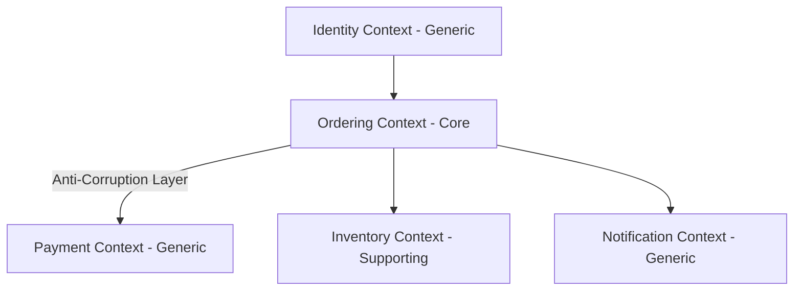

# Domain-Driven Design (DDD) Modeling Skill

## Overview
This skill guides the AI agent in applying Domain-Driven Design (DDD) to decompose complex business logic into clean, decoupled, and maintainable software models. It bridges domain experts' mental models with software architecture by establishing strict transactional boundaries, explicit domain terminology, and resilient context interactions.

---

## When to Use This Skill
- Designing complex domain models with rich business logic (e.g., fintech, e-commerce, healthcare, logistics).
- Decomposing a large system into modular microservices or modular monolith components.
- Decoupling legacy systems using Anti-Corruption Layers (ACL).
- Defining clear transactional consistency boundaries to avoid distributed data corruption.

---

## Input Context Required
1. Requirements specification or PRD (from `01-requirements-spec`).
2. Domain terminology, business rules, workflows, and actor roles.
3. Integration constraints with existing legacy systems or external APIs.

---

## Step-by-Step Execution Workflow

### Step 1: Ubiquitous Language Definition
Create a living glossary defining terms precisely as used by business and technical teams. Resolve homonyms (same word, different meanings in different contexts) and synonyms.
- *Example*: In "Billing", an `Account` is a financial balance ledger. In "Auth", an `Account` is a set of login credentials. Explicitly distinguish these!

### Step 2: Strategic DDD - Bounded Context Identification
Decompose the problem space into distinct Bounded Contexts:
1. **Core Domain**: The primary competitive differentiator of the business (invest maximum engineering craft here).
2. **Supporting Subdomain**: Custom domain logic needed to support the core, but not the primary differentiator.
3. **Generic Subdomain**: Standard solutions that could use off-the-shelf software (e.g., notification delivery, authentication).

### Step 3: Context Mapping & Integration Relationships
Define how contexts interact and integrate:
- **Partnership**: Two teams cooperate closely on coordinated releases.
- **Shared Kernel**: A shared subset of domain model and code (use sparingly).
- **Customer / Supplier (Upstream / Downstream)**: Downstream needs depend on Upstream deliverables.
- **Conformist**: Downstream conforms unconditionally to upstream model.
- **Anti-Corruption Layer (ACL)**: Downstream translates upstream concepts via adapters/facades to keep its own model pure.
- **Open Host Service (OHS) / Published Language (PL)**: Upstream provides standard public API (e.g., REST/OpenAPI or Protobuf).

### Step 4: Tactical DDD - Domain Model Decomposition
For each Bounded Context, construct the tactical model:
1. **Entities**: Objects defined by identity and lifecycle (e.g., `Order` with `OrderId`).
2. **Value Objects**: Immutable objects defined solely by their attributes with no conceptual identity (e.g., `Money { amount: 100, currency: 'USD' }`, `Address`, `EmailAddress`). Always validate invariants on construction!
3. **Aggregates & Aggregate Roots**:
   - Identify the Aggregate Root: The single entity through which all external modifications must pass.
   - Rule of Thumb: Make aggregates as small as possible while protecting true business invariants.
   - Enforce consistency: Only one aggregate should be modified per database transaction.
4. **Domain Events**: Dispatched when a significant state change occurs (e.g., `OrderPlacedEvent`, `PaymentFailedEvent`). Past-tense naming.
5. **Domain Services**: Pure business logic operations that naturally do not belong to a single entity or value object.
6. **Repositories**: Abstraction for storing and reconstituting complete aggregate roots from persistence.

---

## Output Deliverables Template

Generate a domain model blueprint:

```markdown
# Domain Model Architecture: [System / Subsystem Name]

## 1. Ubiquitous Language Glossary
| Term | Context | Definition | Allowed Invariants |
| :--- | :--- | :--- | :--- |
| `Order` | Ordering | The commercial purchase agreement | Must contain >= 1 line item |
| `LedgerEntry` | Billing | Immutable debit or credit record | Amount cannot be zero |

## 2. Bounded Context Map


## 3. Context Relationships
- **Ordering -> Payment**: Ordering uses ACL to decouple from Stripe/PayPal API changes.
- **Ordering -> Inventory**: Asynchronous domain event consumption (`OrderPlaced` triggers stock reservation).

## 4. Aggregate Specification: [Aggregate Root Name]
- **Aggregate Root**: `Order`
- **Internal Entities**: `OrderItem`
- **Value Objects**: `Money`, `ShippingAddress`, `OrderStatus`
- **Business Invariants Protected**:
  1. An order cannot be checked out with total amount <= 0.
  2. Once state is `Shipped`, items cannot be removed or updated.
- **Emitted Domain Events**:
  - `OrderCreated(orderId, customerId, timestamp)`
  - `OrderPaid(orderId, paymentReferenceId)`
  - `OrderCancelled(orderId, reason)`
```

---

## Quality Checklist & Guardrails
- [ ] Are Value Objects strictly immutable with equality determined by attribute values?
- [ ] Does every Aggregate enforce its own consistency boundaries without reaching into foreign aggregates?
- [ ] Are references between aggregates made by Identity (`CustomerId`, `OrderId`), NOT direct object references?
- [ ] Are Domain Events named in the past tense?
- [ ] Is persistence logic (SQL/ORM) strictly separated from domain entities?

---

## Companion Skills
- **Preceding Step**: `01-requirements-spec`
- **Next Step**: `03-system-architecture-design` and `07-database-modeling-and-migrations`.
- **Implementation**: `10-clean-architecture-and-solid`.
