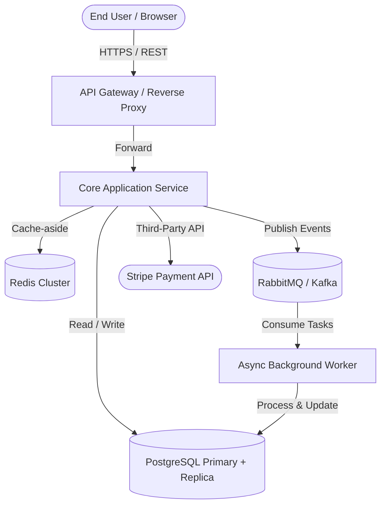

# System Architecture & High-Level Design Skill

## Overview
This skill guides the AI agent in synthesizing requirements and domain boundaries into high-level system architecture blueprints. It enforces balanced trade-offs between complexity, operational overhead, scalability, fault tolerance, and developer velocity using industry-proven architectural patterns.

---

## When to Use This Skill
- Formulating the initial technical architecture for a greenfield system.
- Evaluating architectural transitions (e.g., monolith to modular services, synchronous REST to event-driven streams).
- Documenting system topology, component interactions, and data storage boundaries.
- Auditing existing architecture for scalability bottlenecks and Single Points of Failure (SPOF).

---

## Input Context Required
1. Requirements & NFRs from `01-requirements-spec` (TPS, latency SLAs, uptime targets).
2. Domain contexts & boundaries from `02-domain-driven-design`.
3. Team size, deployment constraints, and cloud/infrastructure environment.

---

## Step-by-Step Execution Workflow

### Step 1: Architectural Paradigm Selection
Evaluate and justify the architectural style based on business scale and team dynamics:
- **Modular Monolith**: Default choice for small-to-medium teams. Low operational complexity, shared database with strict logical boundaries, single deployment unit.
- **Microservices**: For multi-team organizations requiring independent deployment cadences and specialized tech stacks. High operational overhead (requires distributed tracing, CI/CD maturity, service mesh).
- **Event-Driven Architecture (EDA)**: For decoupled, highly asynchronous workloads with high burst traffic and reactive downstream consumers.
- **CQRS / Event Sourcing**: For read-heavy vs write-heavy workloads with complex auditing or temporal replay requirements.

### Step 2: C4 Model Blueprinting
Structure the architecture across four levels of granularity:
1. **Level 1 - System Context**: Shows the system within its ecosystem (users, external software systems, payment gateways).
2. **Level 2 - Container Diagram**: Shows high-level executable units (Web App, API Gateway, Background Worker, Relational DB, Redis Cache, Message Queue).
3. **Level 3 - Component Diagram**: Zooms into a specific container to show internal controllers, services, and repositories.
4. **Level 4 - Code Diagram**: Class and interface relationships (reserved for complex domain components).

### Step 3: Distributed Systems Trade-off Analysis (CAP & PACELC)
Explicitly document consistency vs availability trade-offs:
- **Consistency vs Availability**: In partition events (P), choose between Consistency (CP - e.g., banking ledger) or Availability (AP - e.g., social feed).
- **PACELC Formulation**: If there is no partition (Else), balance Latency (L) vs Consistency (C).
- **Data Consistency Guarantees**: Strong consistency (ACID) for core ledger vs Eventual consistency (BASE) for read models and search indices.

### Step 4: Resilience & High Availability (HA) Planning
Eliminate Single Points of Failure (SPOF):
- **Redundancy**: Multi-AZ deployments, active-passive vs active-active database replicas.
- **Failover**: Automated health checks, DNS failover, circuit breakers on external HTTP calls.
- **Graceful Degradation**: Static cache fallbacks when recommendations/search services are down.

---

## Output Deliverables Template

Generate a structured System Architecture Document:

```markdown
# System Architecture Document: [System Name]

## 1. Architectural Overview & Style Justification
- **Selected Style**: [e.g., Modular Monolith with Asynchronous Worker Queues]
- **Justification**: [Trade-off matrix vs Microservices or Serverless]

## 2. C4 Context Diagram (Mermaid)


## 3. Container Specification Table
| Container / Service | Tech Stack | Responsibility | Scaling Strategy | Data Store |
| :--- | :--- | :--- | :--- | :--- |
| `API Gateway` | Nginx / Envoy | SSL Termination, Rate Limiting, Routing | Horizontal (Auto-scale on CPU > 70%) | Stateless |
| `Core API` | Node.js / Go / Java | Core business logic, GraphQL / REST | Horizontal (K8s HPA) | PostgreSQL |
| `Worker Engine` | Python / Go | Batch processing, report generation | Auto-scale based on queue depth | PostgreSQL |

## 4. Communication Protocols & Data Flow
- **Synchronous**: REST / gRPC with strict timeouts (default 2500ms max).
- **Asynchronous**: Message broker with persistent queues and Dead Letter Queues (DLQ).

## 5. Failure Domains & Disaster Recovery
- **RTO (Recovery Time Objective)**: < 15 minutes
- **RPO (Recovery Point Objective)**: < 1 minute (via WAL archiving)
- **Degraded Mode Strategy**: If cache fails, fall back to direct DB read with aggressive client-side caching.
```

---

## Quality Checklist & Guardrails
- [ ] Is there an unambiguous container diagram showing all storage, network, and compute components?
- [ ] Are synchronous vs asynchronous communication boundaries clearly demarcated?
- [ ] Are single points of failure (SPOF) identified and mitigated with redundancy?
- [ ] Does the architecture address scaling strategies (horizontal vs vertical, stateless compute)?
- [ ] Have latency and timeout budgets been allocated per hop?

---

## Companion Skills
- **Preceding Steps**: `01-requirements-spec`, `02-domain-driven-design`.
- **Accompanying Decision Record**: `04-architecture-decision-records`.
- **Implementation**: `05-api-contract-design`, `07-database-modeling-and-migrations`.
