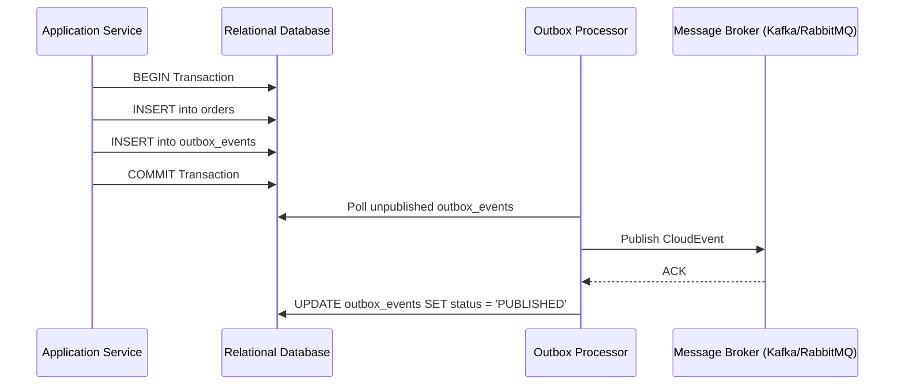

# Event & Messaging Architecture Design Skill

## Overview
This skill guides the AI agent in designing robust, decoupled, and fault-tolerant event-driven messaging systems. It ensures event schemas remain backwards-compatible, eliminates distributed data loss via the Transactional Outbox pattern, guarantees idempotent consumer execution, and establishes automated retry and Dead Letter Queue (DLQ) topologies.

---

## When to Use This Skill
- Decoupling microservices via asynchronous message queues or event streams.
- Designing domain event schemas and event publishing/consumption flows.
- Coordinating distributed workflows across services (Saga pattern).
- Preventing dual-write bugs where database writes succeed but message publishing fails.

---

## Input Context Required
1. Domain events identified in `02-domain-driven-design`.
2. System topology and broker choices (Kafka, RabbitMQ, SQS, Redis) from `03-system-architecture-design`.
3. Throughput, order-guarantee requirements (FIFO vs non-FIFO), and retention policies.

---

## Step-by-Step Execution Workflow

### Step 1: Event Schema Standards (CloudEvents Standard)
Standardize on the CNCF CloudEvents v1.0 specification for interoperability:
- **`id`**: Unique event ID (UUIDv4) for deduplication.
- **`source`**: URI identifying producer service (e.g., `urn:service:ordering-service`).
- **`specversion`**: `"1.0"`.
- **`type`**: Domain event name in past tense: `com.company.ordering.order.created.v1`.
- **`time`**: ISO-8601 UTC timestamp.
- **`datacontenttype`**: `"application/json"` or `"application/x-protobuf"`.
- **`data`**: Business payload.

### Step 2: The Transactional Outbox Pattern
Avoid dual-write failures (DB commit vs Message Bus publish) using an Outbox table within the same ACID database transaction:
1. Application writes business entity AND inserts an event record into `outbox_events` table inside a single SQL transaction.
2. A separate Outbox Relayer (CDC tool like Debezium or polling worker) reads `outbox_events` and publishes to the message broker.
3. Upon confirmed broker ACK, the event is marked as published or deleted.



### Step 3: Consumer Idempotency & Deduplication
Because distributed messaging delivers with **at-least-once** semantics, consumers must handle duplicate messages safely:
- Maintain an `idempotency_keys` or `processed_events` table:
  ```sql
  CREATE TABLE processed_events (
      event_id VARCHAR(64) PRIMARY KEY,
      consumer_group VARCHAR(64) NOT NULL,
      processed_at TIMESTAMP WITH TIME ZONE DEFAULT NOW()
  );
  ```
- Before handling, check/insert `(event_id, consumer_group)`. If key exists, acknowledge message immediately without re-processing.

### Step 4: Retry Topology & Dead Letter Queue (DLQ)
Design multi-tier retry with exponential backoff:
1. **Immediate Retry**: Up to 3 attempts with exponential backoff (e.g., 500ms, 1s, 2s) for transient network glitches.
2. **Delayed Retry Queue**: Route to a retry queue with TTL (e.g., 30s, 5m).
3. **Dead Letter Queue (DLQ)**: After max retries (e.g., 5), route unprocessable messages to DLQ.
4. **Alerting & Reprocessing**: Alert on DLQ depth > 0; provide automated re-drive CLI scripts.

### Step 5: Distributed Sagas (Orchestration vs Choreography)
- **Choreography**: Each service listens to events and publishes next events. Suitable for simple 2-3 step workflows.
- **Orchestration**: A dedicated Saga Orchestrator manages state and sends explicit command events, executing compensating transactions if any step fails. Mandatory for complex multi-step workflows.

---

## Output Deliverables Template

```json
{
  "specversion": "1.0",
  "id": "e2a4a754-0df5-4c07-b0a3-5c8a4175b312",
  "source": "/services/ordering",
  "type": "com.enterprise.order.placed.v1",
  "datacontenttype": "application/json",
  "time": "2026-10-07T13:10:00Z",
  "data": {
    "orderId": "ord_99812",
    "customerId": "cust_4410",
    "totalAmount": 149.99,
    "currency": "USD",
    "items": [
      { "sku": "PROD-A", "quantity": 2, "unitPrice": 49.99 },
      { "sku": "PROD-B", "quantity": 1, "unitPrice": 50.01 }
    ]
  }
}
```

---

## Quality Checklist & Guardrails
- [ ] Are events strictly immutable and named in the past tense?
- [ ] Is dual-write bug prevented using Transactional Outbox or CDC?
- [ ] Are consumers guaranteed idempotent via explicit event ID deduplication?
- [ ] Is every queue configured with a Dead Letter Queue (DLQ) and alerting policy?
- [ ] Is schema evolution forward and backward compatible (e.g., new fields optional)?

---

## Companion Skills
- **Preceding Step**: `02-domain-driven-design` and `05-api-contract-design`.
- **Implementation**: `13-concurrency-and-async-systems`.
- **Observability**: `21-observability-and-telemetry`.
