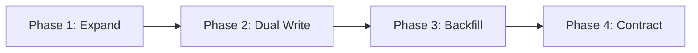

# Database Modeling & Zero-Downtime Migrations Skill

## Overview
This skill guides the AI agent in crafting performant, ACID-compliant, and evolvable database schemas. It ensures data integrity through strict relational constraints, designs efficient index hierarchies, and executes backwards-compatible migrations without locking tables or degrading production uptime.

---

## When to Use This Skill
- Designing new relational database tables (PostgreSQL, MySQL) or NoSQL document schemas.
- Formulating database migration scripts for evolving schemas in active production systems.
- Diagnosing slow queries by adding composite, unique, or partial indexes.
- Implementing the Expand and Contract pattern for non-breaking schema updates.

---

## Input Context Required
1. Domain entities and aggregates from `02-domain-driven-design`.
2. Query access patterns: What are the primary read filters, sorting requirements, and write frequencies?
3. Target database engine and version (e.g., PostgreSQL 16, MySQL 8).

---

## Step-by-Step Execution Workflow

### Step 1: Primary Key Strategy Selection
- **UUIDv7 / ULID**: Recommended default for distributed systems. 128-bit, time-ordered, avoids B-tree fragmentation, eliminates database-generated ID roundtrips.
- **BIGINT IDENTITY / SERIAL**: Good for internal-only tables with strictly centralized sequencing. Never expose raw serial IDs publicly (avoids enumeration attacks).

### Step 2: Relational Normalization & Tactical Denormalization
1. **Third Normal Form (3NF)**: Establish as baseline. Each non-key attribute depends on the key, the whole key, and nothing but the key.
2. **Tactical Denormalization**: Denormalize only when verified read performance bottlenecks require it (e.g., caching `order_total_cents` or `items_count`), and protect integrity using database triggers or strict application service transactions.
3. **Data Types**: Always use specific types (`TIMESTAMPTZ` instead of generic `TIMESTAMP`, `NUMERIC(12, 2)` or integer cents for monetary values, `JSONB` for flexible schema documents with indexing).

### Step 3: Indexing Engineering Rules
- **Foreign Keys**: ALWAYS add an index on foreign key columns to prevent full-table locks during cascaded updates/deletions.
- **Composite Index Ordering (ESR Rule)**:
  1. **E - Equality**: Columns filtered by `=` come first.
  2. **S - Sort**: Columns used in `ORDER BY` come next.
  3. **R - Range**: Columns filtered by `>`, `<`, `BETWEEN`, `LIKE` come last.
- **Partial Indexes**: For status flags (e.g., `WHERE status = 'PENDING'`), index only rows that match to save 90%+ index storage and memory.

### Step 4: The Zero-Downtime Migration Pattern (Expand & Contract)
Never perform breaking changes (renaming columns, changing types, dropping columns) in a single step!
Follow the 4-phase rollout:

1. **Expand**: Add the new column as nullable. Deploy migration.
2. **Dual Write**: Deploy application version that reads from old column but writes to both old and new columns.
3. **Backfill**: Run asynchronous background worker batch job to copy historical data from old column to new column.
4. **Contract**: Deploy app reading exclusively from new column. Finally, drop the old column and remove dual write.

### Step 5: Safe DDL Lock Avoidance (PostgreSQL Best Practices)
- Avoid blocking table locks:
  - Add indexes concurrently: `CREATE INDEX CONCURRENTLY idx_orders_customer_id ON orders(customer_id);`
  - Set safe lock timeouts before running DDL:
    ```sql
    SET lock_timeout = '2s';
    ```
  - Adding `NOT NULL` with default in Postgres 11+: Safe with constant defaults; for computed defaults, add column nullable first, then backfill, then add constraint `VALIDATE CONSTRAINT`.

---

## Output Deliverables Template

Generate versioned migration files (e.g., SQL / Flyway / Prisma):

```sql
-- Migration: V20261007_01__create_orders_table.sql
-- Description: Create initial orders schema with UUIDv7 PK and safe indexes

BEGIN;

SET lock_timeout = '3s';

CREATE TABLE IF NOT EXISTS orders (
    id UUID PRIMARY KEY DEFAULT gen_random_uuid(),
    customer_id UUID NOT NULL,
    status VARCHAR(32) NOT NULL DEFAULT 'PENDING',
    currency CHAR(3) NOT NULL DEFAULT 'USD',
    subtotal_cents BIGINT NOT NULL CHECK (subtotal_cents >= 0),
    tax_cents BIGINT NOT NULL DEFAULT 0 CHECK (tax_cents >= 0),
    total_cents BIGINT NOT NULL CHECK (total_cents >= 0),
    metadata JSONB,
    created_at TIMESTAMPTZ NOT NULL DEFAULT NOW(),
    updated_at TIMESTAMPTZ NOT NULL DEFAULT NOW()
);

-- Index foreign key reference
CREATE INDEX CONCURRENTLY IF NOT EXISTS idx_orders_customer_id
    ON orders(customer_id);

-- Partial index for active pending processing
CREATE INDEX CONCURRENTLY IF NOT EXISTS idx_orders_pending_processing
    ON orders(created_at)
    WHERE status = 'PENDING';

COMMIT;
```

---

## Quality Checklist & Guardrails
- [ ] Is every financial value stored in integer cents or `NUMERIC(19,4)` (never `FLOAT` or `DOUBLE`)?
- [ ] Are all foreign key columns backed by an index?
- [ ] Are timestamps explicitly timezone-aware (`TIMESTAMPTZ` / UTC)?
- [ ] Are indexes created using `CONCURRENTLY` to avoid blocking writes?
- [ ] Are schema alterations non-breaking and backwards-compatible with currently running code?

---

## Companion Skills
- **Preceding Step**: `02-domain-driven-design`.
- **Accompanying Cache**: `08-caching-and-data-stores`.
- **Implementation**: `10-clean-architecture-and-solid`.
