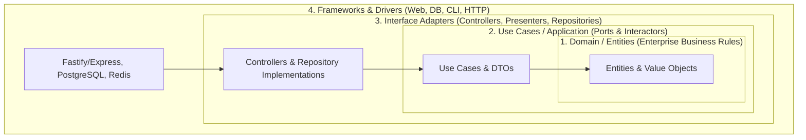

# Clean Architecture & SOLID Principles Skill

## Overview
This skill guides the AI agent in structuring software applications using Clean Architecture (Hexagonal / Ports & Adapters) and SOLID design principles. It ensures the business domain remains completely independent of frameworks, databases, UI, and external libraries, enabling rapid unit testing without mocks and effortless infrastructure swaps.

---

## When to Use This Skill
- Structuring a new microservice, backend application, or domain module.
- Decoupling business logic that is entangled with ORMs, web frameworks, or third-party APIs.
- Designing extensible component layers using Dependency Injection (DI).
- Preventing architectural decay and spaghetti dependencies.

---

## Input Context Required
1. Domain model, aggregates, and entities from `02-domain-driven-design`.
2. API and event contracts from `05-api-contract-design` and `06-event-and-messaging-design`.
3. Target programming language and framework.

---

## Step-by-Step Execution Workflow

### Step 1: The Dependency Inversion Rule
Enforce the fundamental rule: **Dependencies point inward only.**
- Inner layers know NOTHING about outer layers.
- The Domain layer cannot import Express, NestJS, FastAPI, Spring, Prisma, or TypeORM!


### Step 2: Layer Organization & Responsibilities
1. **Domain Layer (Innermost)**:
   - Contains pure business entities, value objects, and domain logic.
   - Zero external library dependencies (only language standard library).
2. **Application / Use Cases Layer**:
   - Orchestrates domain entities to execute user stories.
   - Defines **Ports (Interfaces)**: e.g., `OrderRepositoryPort`, `PaymentGatewayPort`, `NotificationServicePort`.
   - Defines request/response Data Transfer Objects (DTOs).
3. **Interface Adapters Layer**:
   - Implements ports (Adapters): e.g., `PostgresOrderRepository implements OrderRepositoryPort`.
   - Web controllers: Parse HTTP requests, validate with schemas, invoke use cases, format HTTP responses.
4. **Frameworks & Infrastructure Layer (Outermost)**:
   - Database connection pools, web server routing, third-party SDK clients.

### Step 3: Applying SOLID Principles Rigorously
- **S - Single Responsibility Principle**: A class or module should have one, and only one, reason to change (one actor).
- **O - Open/Closed Principle**: Software entities should be open for extension, but closed for modification (use strategy pattern or polymorphic interfaces).
- **L - Liskov Substitution Principle**: Subtypes must be substitutable for their base types without altering program correctness (no throwing `NotImplementedException`).
- **I - Interface Segregation Principle**: Clients should not be forced to depend on interfaces they do not use (prefer small, cohesive role interfaces).
- **D - Dependency Inversion Principle**: High-level modules should not depend on low-level modules; both should depend on abstractions.

### Step 4: Standard Project Directory Layout
```text
src/
├── domain/                      # Pure business logic
│   ├── entities/                # Order.ts, Customer.ts
│   ├── value-objects/           # Money.ts, Address.ts
│   └── exceptions/              # DomainException.ts
├── application/                 # Use cases and port contracts
│   ├── use-cases/               # CreateOrderUseCase.ts
│   ├── ports/                   # IOrderRepository.ts, IPaymentGateway.ts
│   └── dtos/                    # CreateOrderDTO.ts
├── infrastructure/              # Adapters & external tools
│   ├── database/                # PostgresOrderRepository.ts
│   ├── payment/                 # StripePaymentGateway.ts
│   └── logging/                 # PinoLogger.ts
└── presentation/                # External entrypoints
    ├── http/                    # OrderController.ts, routes.ts
    └── cli/                     # commands.ts
```

---

## Output Deliverables Template

Generate decoupled code following the ports and adapters structure:

```typescript
// 1. DOMAIN: src/domain/entities/Order.ts
export class Order {
  constructor(
    public readonly id: string,
    public readonly customerId: string,
    private _totalAmount: number,
    private _status: 'PENDING' | 'PAID' | 'CANCELLED' = 'PENDING'
  ) {
    if (_totalAmount <= 0) throw new Error('Order amount must be positive');
  }

  public pay(): void {
    if (this._status !== 'PENDING') throw new Error('Only pending orders can be paid');
    this._status = 'PAID';
  }

  get status() { return this._status; }
  get totalAmount() { return this._totalAmount; }
}

// 2. PORT: src/application/ports/IOrderRepository.ts
export interface IOrderRepository {
  findById(id: string): Promise<Order | null>;
  save(order: Order): Promise<void>;
}

// 3. USE CASE: src/application/use-cases/PayOrderUseCase.ts
export class PayOrderUseCase {
  constructor(private readonly orderRepo: IOrderRepository) {}

  async execute(orderId: string): Promise<void> {
    const order = await this.orderRepo.findById(orderId);
    if (!order) throw new Error('Order not found');
    order.pay();
    await this.orderRepo.save(order);
  }
}
```

---

## Quality Checklist & Guardrails
- [ ] Does the `domain/` folder have ZERO dependencies on frameworks, ORMs, or HTTP libraries?
- [ ] Are all external integrations abstracted behind interfaces (Ports)?
- [ ] Are dependencies injected via constructors rather than imported singletons?
- [ ] Are use cases testable in pure isolation using in-memory mock repositories?
- [ ] Do DTOs isolate internal domain entities from public API representations?

---

## Companion Skills
- **Preceding Step**: `02-domain-driven-design`.
- **Accompanying Patterns**: `11-design-patterns-and-idioms`.
- **Testing**: `15-test-driven-development`.
