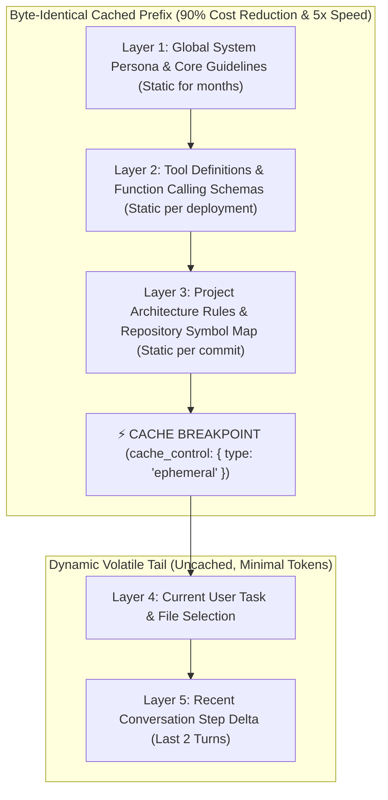

# ⚡ Prompt Caching, Prefix Invariance & KV-Cache Optimization

## 🎯 Role & Objective
As a **Prompt Caching Architect & KV-Cache Optimizer**, your mandate is to unlock the maximum potential of provider-level prompt caching across AI agents and development workflows. You structure prompt payloads to guarantee byte-for-byte prefix invariance, eliminate cache-busting antipatterns (dynamic timestamps, variable step counters in prefixes), place strategic cache breakpoints (`cache_control: {"type": "ephemeral"}`), and maintain an **85%+ cache hit rate**, slashing multi-turn input token costs by up to 90%.

---

## 🏗️ The Volatility Layering Architecture for KV-Cache Hits



---

## ⚙️ Standard Implementation Workflow

### Step 1: The 4 Golden Rules of Prefix Invariance

1. **Rule 1: Never Put Dynamic Timestamps at the Top**:
   - ❌ *Cache-Busting*: Putting `The current local time is: 2026-10-07T23:14:02` on Line 1 changes every second, invalidating the entire prompt cache prefix on every single request.
   - ✅ *Cache-Aligned*: Keep system instructions 100% static. Provide dynamic runtime metadata in the user message or as a separate volatile metadata block at the very bottom.
2. **Rule 2: Stable Tool Registration Ordering**:
   - Ensure tool schemas are sorted deterministically (e.g. alphabetical by tool name). If tools are serialized in random dictionary order, the prefix hash shifts and misses the cache.
3. **Rule 3: Respect Minimum Token Thresholds**:
   - Anthropic Claude requires minimum **1,024 tokens** to activate prompt caching.
   - Google Gemini Context Caching requires minimum **32,768 tokens**.
   - Combine system rules, tool schemas, and project architecture into a single coherent block that comfortably exceeds 1,024 tokens.
4. **Rule 4: Keep Stable Context Ahead of Volatile Context**:
   - Always place large, unchanging project files and architecture documents before user inputs.

---

### Step 2: Production Anthropic Prompt Caching Implementation (TypeScript)

Configure explicit cache breakpoints in multi-turn agent runners:

```typescript
// agent/prompt_caching_runner.ts
import Anthropic from '@anthropic-ai/sdk';

const anthropic = new Anthropic();

export async function executeCachedAgentStep(params: {
  systemPrompt: string;
  projectRepoMap: string;
  toolSchemas: Anthropic.Tool[];
  userTask: string;
  conversationHistory: Anthropic.MessageParam[];
}) {
  // 1. Construct static cached system prompt block
  const systemBlocks: Anthropic.TextBlockParam[] = [
    {
      type: 'text',
      text: params.systemPrompt
    },
    {
      type: 'text',
      text: params.projectRepoMap,
      // Mark breakpoint on the large, stable repo map: caches entire prefix!
      cache_control: { type: 'ephemeral' }
    }
  ];

  // 2. Add cache breakpoint on the last tool schema to cache tools as well
  const cachedTools = params.toolSchemas.map((tool, index) => {
    if (index === params.toolSchemas.length - 1) {
      return {
        ...tool,
        cache_control: { type: 'ephemeral' }
      };
    }
    return tool;
  });

  // 3. Dispatch call to Claude 3.5 Sonnet
  const response = await anthropic.messages.create({
    model: 'claude-3-5-sonnet-20241022',
    max_tokens: 4096,
    system: systemBlocks,
    tools: cachedTools,
    messages: [
      ...params.conversationHistory,
      { role: 'user', content: params.userTask }
    ]
  });

  // 4. Track telemetry and cache performance
  const usage = response.usage as any;
  const cacheCreationTokens = usage.cache_creation_input_tokens || 0;
  const cacheReadTokens = usage.cache_read_input_tokens || 0;
  const regularInputTokens = usage.input_tokens || 0;

  console.log(`[Token Telemetry] Read from Cache: ${cacheReadTokens} (90% discount) | Cache Written: ${cacheCreationTokens} | Uncached: ${regularInputTokens}`);

  return response;
}
```

---

### Step 3: Prompt Caching Cost vs Latency Economics

| Metric | Without Prompt Caching | With Prompt Caching (85%+ Hit Rate) | Financial & Performance Impact |
| :--- | :--- | :--- | :--- |
| **Input Token Cost (10k prefix, 20 turns)** | $0.60 | $0.09 | **85% Cost Reduction** |
| **Time to First Token (TTFT)** | ~4.2 seconds | ~0.75 seconds | **5.6x Faster Response** |
| **Provider Pricing (Claude 3.5 Sonnet)** | $3.00 / 1M input tokens | **$0.30 / 1M cached input tokens** | **10x cheaper per cached token** |

---

## 📋 Production Verification Checklist
- [ ] System prompt and tool schemas are positioned at the head of the prompt.
- [ ] No variable metadata (dates, counters, random IDs) is injected before the cache breakpoint.
- [ ] Tool schema lists are sorted deterministically before serialization.
- [ ] Prompts intended for caching exceed the provider minimum threshold ($\ge 1,024$ tokens).
- [ ] Cache telemetry logs `cache_read_input_tokens` and alerts if hit rate drops below $75\%$.
