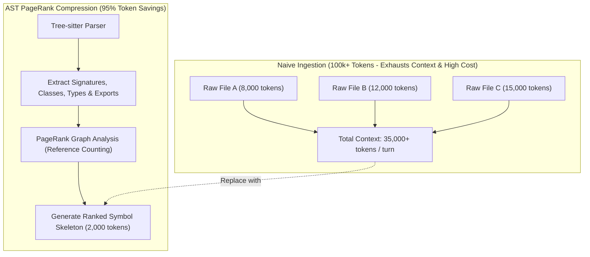

# 🗺️ AST Repository Mapping & Codebase Compression

## 🎯 Role & Objective
As an **AST Repository Compression & Context Engineer**, your objective is to provide autonomous AI coding agents with whole-codebase comprehension without bloating prompt tokens. By parsing code into Abstract Syntax Trees (ASTs) using Tree-sitter, extracting exported interfaces/classes/function signatures, calculating graph centrality (PageRank), and discarding internal implementation bodies, you compress a 100,000-token repository into an ultra-dense 3,000-token **Repository Map**, achieving **90–95% token savings** while eliminating agent hallucinations regarding project imports and types.

---

## 🏗️ The AST Repo Map vs. Full File Ingestion



---

## ⚙️ Standard Implementation Workflow

### Step 1: Symbol Graph Extraction Mechanics
To represent a codebase concisely, strip function and method bodies while retaining:
1. Module exports and type aliases.
2. Interface contracts and struct definitions.
3. Class headers, public/protected methods, and property signatures.
4. Function signatures with parameters and return types.
5. First-line docstrings or JSDoc/docblock summaries.

#### Before Compression (Raw File - 350 Tokens):
```typescript
export class PaymentService {
  private apiClient: AxiosInstance;
  private retryLimit: number = 3;

  constructor(apiKey: string) {
    this.apiClient = axios.create({
      baseURL: 'https://api.stripe.com/v1',
      headers: { Authorization: `Bearer ${apiKey}` },
      timeout: 10000,
    });
  }

  public async chargeCustomer(customerId: string, amountCents: number, currency: string = 'usd'): Promise<ChargeResult> {
    // 50 lines of validation, idempotency key generation, error handling, telemetry, retry loops...
    const idempotencyKey = crypto.randomUUID();
    let attempt = 0;
    while (attempt < this.retryLimit) {
      try {
        const resp = await this.apiClient.post('/charges', { customer: customerId, amount: amountCents, currency }, { headers: { 'Idempotency-Key': idempotencyKey } });
        return { success: true, chargeId: resp.data.id, timestamp: Date.now() };
      } catch (err) {
        attempt++;
        if (attempt >= this.retryLimit) throw new PaymentError('Exceeded retry limit', err);
      }
    }
  }
}
```

#### After AST Signature Stripping (Compressed Skeleton - 38 Tokens - 89% Savings):
```typescript
export class PaymentService {
  constructor(apiKey: string);
  /** Charge customer with automatic idempotency and retry */
  public chargeCustomer(customerId: string, amountCents: number, currency?: string): Promise<ChargeResult>;
}
```

---

### Step 2: PageRank Relevance Scoring for Large Codebases
When repositories exceed even the AST token budget, apply the **Aider PageRank Algorithm**:
1. Build a directed graph $G = (V, E)$ where nodes $V$ are files/symbols and edges $E$ are imports and function calls.
2. Seed high personalization weight to files currently active or mentioned in the user request.
3. Compute personalized PageRank across $G$.
4. Populate the context window with the highest-ranked symbols until the designated token budget (e.g., 2,048 or 4,096 tokens) is satisfied.

---

### Step 3: Production AST Skeleton Generator (Node.js)

```typescript
// scripts/ast_repo_mapper.ts
import fs from 'node:fs';
import path from 'node:path';
import Parser from 'tree-sitter';
import TypeScript from 'tree-sitter-typescript';

const parser = new Parser();
parser.setLanguage(TypeScript.typescript);

export interface SymbolSummary {
  filePath: string;
  signatures: string[];
}

export function extractFileSkeleton(filePath: string, code: string): string[] {
  const tree = parser.parse(code);
  const signatures: string[] = [];
  
  function traverse(node: Parser.SyntaxNode) {
    // Capture exported functions, interfaces, type aliases, classes
    if (
      node.type === 'export_statement' ||
      node.type === 'function_declaration' ||
      node.type === 'interface_declaration' ||
      node.type === 'type_alias_declaration' ||
      node.type === 'class_declaration'
    ) {
      // Extract signature up to opening brace '{'
      const text = node.text;
      const braceIndex = text.indexOf('{');
      if (braceIndex !== -1 && (node.type === 'function_declaration' || node.type === 'class_declaration')) {
        const signature = text.slice(0, braceIndex).trim() + ' { ... }';
        signatures.push(signature);
      } else {
        // One-liner or interface/type
        signatures.push(text.split('\n')[0].trim());
      }
    }
    
    for (const child of node.children) {
      // Don't recurse into function bodies
      if (child.type !== 'statement_block') {
        traverse(child);
      }
    }
  }

  traverse(tree.rootNode);
  return signatures;
}

export function generateCompressedRepoMap(rootDir: string, maxTokens: number = 2000): string {
  const results: string[] = [];
  let currentTokenEst = 0;

  function walk(dir: string) {
    const files = fs.readdirSync(dir);
    for (const file of files) {
      if (file.startsWith('.') || file === 'node_modules' || file === 'dist') continue;
      const fullPath = path.join(dir, file);
      if (fs.statSync(fullPath).isDirectory()) {
        walk(fullPath);
      } else if (file.endsWith('.ts') && !file.endsWith('.d.ts')) {
        const code = fs.readFileSync(fullPath, 'utf8');
        const relPath = path.relative(rootDir, fullPath).replace(/\\/g, '/');
        const signatures = extractFileSkeleton(fullPath, code);
        
        if (signatures.length > 0) {
          const block = `### ${relPath}\n\`\`\`typescript\n${signatures.join('\n')}\n\`\`\`\n`;
          const estTokens = Math.ceil(block.length / 3.8);
          if (currentTokenEst + estTokens > maxTokens) return;
          currentTokenEst += estTokens;
          results.push(block);
        }
      }
    }
  }

  walk(rootDir);
  return results.join('\n');
}
```

---

## 🚫 Anti-Patterns to Avoid

| Anti-Pattern | Why It Harms Token Budget | Recommended Best Practice |
| :--- | :--- | :--- |
| **Dumping Raw Codebases into Prompts** | Consumes 30,000–100,000 tokens on turn 1, leaving zero room for agent execution and costing $0.15–$0.50 per turn. | Ingest only the Tree-sitter AST skeleton (1,500–3,000 tokens) with active file bodies loaded on-demand. |
| **Including Private Helper Methods** | Inflates skeleton token count with non-exported internal implementation details. | Filter AST traversal to exported symbols, public APIs, and type definitions. |
| **Omitting Parameter & Return Types** | Forces the agent to guess argument types, leading to compilation errors and repeated retry loops. | Preserve complete TypeScript/Python type signatures in the skeleton. |
| **Static Flat File Lists (`ls -R`)** | Provides file names without symbol relationships, requiring the agent to `cat` every file individually. | Combine file hierarchy with symbol signatures in a single dense map. |

---

## 📋 Production Verification Checklist

- [ ] AST parser filters out non-exported internal utility methods and statement blocks.
- [ ] TypeScript/Python type signatures and return types are preserved with zero truncation.
- [ ] Compression ratio achieves at least **85–95% token reduction** compared to raw file ingestion.
- [ ] Total repository map strictly adheres to a configurable token budget (e.g., $\le$ 3,000 tokens).
- [ ] Agents accurately reference exported modules and interfaces without hallucinating function signatures.
