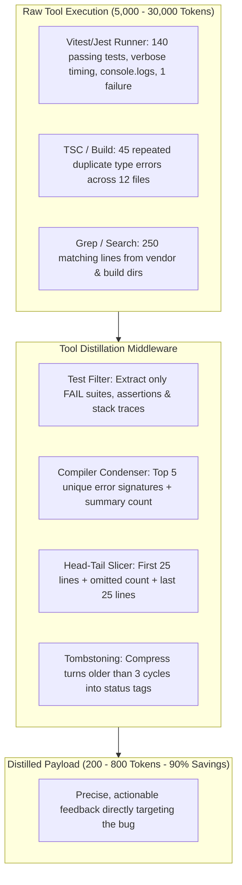

# ✂️ Tool Output Distillation & Truncation Middleware

## 🎯 Role & Objective
As a **Tool Output Distillation & Context Budgeting Engineer**, your objective is to prevent catastrophic context exhaustion caused by runaway tool execution outputs. Command-line outputs (test suites, package installs, build traces, and grep searches) frequently dump 5,000–50,000 tokens of redundant output into an agent's context window in a single turn. You design and enforce deterministic distillation middleware that extracts critical error deltas, assertion failures, and stack traces while stripping noise, achieving **80–95% output token reduction** and keeping agents responsive and cost-effective.

---

## 🏗️ Verbose Output Explosion vs. Intelligent Distillation



---

## ⚙️ Standard Implementation Workflow

### Step 1: Head-Tail Slicing with Preserved Line Counts
When a tool emits generic console output exceeding 100 lines (or ~2,000 tokens), never truncate blindly at line 100 (which cuts off the final exit summary or error trace). Apply **Head-Tail Preserved Slicing**:
- Preserve the first $K$ lines (initialization and command flags).
- Omit intermediate lines, replacing them with a deterministic marker: `[... Omitted X lines of repetitive log output ...]`.
- Preserve the last $M$ lines (exit status, failure summary, stack traces).

---

### Step 2: Specialized Distillation Filters

#### 1. Test Runner Filter (Jest / Vitest / Pytest)
Passing tests burn context without providing actionable debugging signal. Filter raw test output:
- ❌ **Raw**: Emits 200 `✓ test passed` lines plus console debug logs (12,000 tokens).
- ✅ **Distilled**: Extract only suites matching `FAIL`, the failed test name, assertion diff, and file/line location:
  ```text
  [TEST RUNNER SUMMARY: 48 passed, 1 failed]
  FAIL src/auth/token.service.spec.ts > TokenService > should verify JWT signature
  AssertionError: expected 'INVALID' to equal 'VALID'
    at TokenService.verify (src/auth/token.service.ts:42:11)
  ```

#### 2. TypeScript / ESLint Error Condenser
When a refactor breaks a type definition, `tsc` may emit 200 identical error lines. Condense to unique error categories:
- Group errors by `TS<code_id>`.
- Display the first 2 instances of each error code.
- Report remaining instances as a count: `+ 34 additional TS2322 errors omitted`.

#### 3. Git Diff / Lockfile Exclusions
When running `git diff` or inspecting modified files:
- Automatically exclude `package-lock.json`, `pnpm-lock.yaml`, `yarn.lock`, minified bundles, and generated sourcemaps.
- Limit patch context to 3 lines (`git diff -U3`).

---

### Step 3: Ephemeral Tool Result Tombstoning (Compacting Past Turns)
In an agent loop spanning 10+ turns, raw tool results from Turn 2 (e.g., an initial 2,000-token directory listing) remain in prompt memory, costing tokens on every single subsequent turn.
- **Tombstoning Rule**: Once a tool output is older than 2–3 turns and has been acted upon, replace its payload in the conversation history with a compact tombstone marker:
  ```json
  {
    "role": "tool",
    "tool_call_id": "call_123",
    "content": "[Tombstoned: 'run_tests' executed. 1 test failed (fixed in turn 4)]"
  }
  ```

---

### Step 4: Production Distillation Middleware (TypeScript)

```typescript
// agent/tool_distillation_middleware.ts

export interface DistillationOptions {
  maxLines?: number;
  headLines?: number;
  tailLines?: number;
}

export class ToolDistillationMiddleware {
  public static distillCommandOutput(rawOutput: string, toolName: string, options: DistillationOptions = {}): string {
    const headLines = options.headLines ?? 25;
    const tailLines = options.tailLines ?? 25;
    const maxLines = options.maxLines ?? 80;

    // 1. Vitest / Jest Specialized Filter
    if (rawOutput.includes('FAIL') && (rawOutput.includes('Test Suites:') || rawOutput.includes('Tests:'))) {
      return this.distillTestOutput(rawOutput);
    }

    // 2. TypeScript Compiler Filter
    if (rawOutput.includes('error TS') && rawOutput.length > 3000) {
      return this.distillTscOutput(rawOutput);
    }

    // 3. Generic Head-Tail Slicer
    const lines = rawOutput.split('\n');
    if (lines.length > maxLines) {
      const omittedCount = lines.length - (headLines + tailLines);
      const head = lines.slice(0, headLines).join('\n');
      const tail = lines.slice(-tailLines).join('\n');
      return `${head}\n\n[... Tool Output Distillation: ${omittedCount} intermediate lines omitted for token efficiency ...]\n\n${tail}`;
    }

    return rawOutput;
  }

  private static distillTestOutput(output: string): string {
    const lines = output.split('\n');
    const failureLines: string[] = [];
    let capturingFailure = false;

    for (const line of lines) {
      if (line.includes('FAIL') || line.includes('●') || line.includes('AssertionError')) {
        capturingFailure = true;
      }
      if (line.includes('Test Suites:') || line.includes('Tests:') || line.includes('Snapshots:')) {
        failureLines.push(line);
        capturingFailure = false;
      }
      if (capturingFailure) {
        failureLines.push(line);
      }
    }

    return failureLines.length > 0 
      ? `[Distilled Test Failures Only]:\n${failureLines.join('\n')}`
      : output.slice(0, 2000);
  }

  private static distillTscOutput(output: string): string {
    const lines = output.split('\n').filter(l => l.includes('error TS'));
    const uniqueErrors = new Map<string, string[]>();

    for (const line of lines) {
      const match = line.match(/(error TS\d+):/);
      const code = match ? match[1] : 'other';
      if (!uniqueErrors.has(code)) uniqueErrors.set(code, []);
      const list = uniqueErrors.get(code)!;
      if (list.length < 2) list.push(line);
    }

    const condensed: string[] = [];
    for (const [code, samples] of uniqueErrors.entries()) {
      condensed.push(...samples);
      const totalForCode = lines.filter(l => l.includes(code)).length;
      if (totalForCode > 2) {
        condensed.push(`  ... and ${totalForCode - 2} more ${code} occurrences.`);
      }
    }

    return `[Distilled TypeScript Compilation Errors - ${lines.length} total errors]:\n${condensed.join('\n')}`;
  }
}
```

---

## 🚫 Anti-Patterns to Avoid

| Anti-Pattern | Why It Harms Token Budget | Recommended Best Practice |
| :--- | :--- | :--- |
| **Passing Raw Test Dumps** | 500 passing tests waste 15,000 tokens repeating checkmarks. | Intercept test stdout and isolate only failed test assertions and stack traces. |
| **Head-Only Truncation (`head -n 50`)** | Drops the bottom of command logs where error summaries and exit codes are printed. | Use balanced Head-Tail slicing preserving both initial configuration and final exit summaries. |
| **Retaining Old Turn Results Forever** | Re-sends outputs from turn 1 on turns 2, 3, 4... generating $O(N^2)$ quadratic token inflation. | Tombstone historical tool results older than 2 turns with 1-line summary tags. |
| **Streaming Raw Lockfile Diffs** | A package upgrade can generate 8,000 lines of `package-lock.json` changes into prompt context. | Automatically filter out lockfiles and compiled artifacts from tool outputs. |

---

## 📋 Production Verification Checklist

- [ ] Tool output middleware intercepts all command execution results before appending to context.
- [ ] Test runners isolate `FAIL` suites and assertion diffs, dropping passing test suites.
- [ ] Compiler and linter outputs collapse repetitive error codes into top samples plus count.
- [ ] Head-Tail slicing guarantees preservation of critical bottom-of-file exit codes.
- [ ] Historical tool results older than 2–3 turns are tombstoned with concise summary markers.
