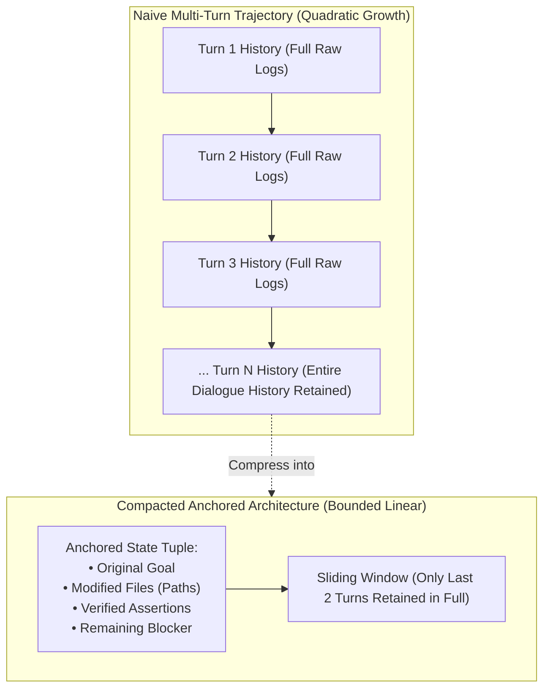

# 🌀 Multi-Turn Trajectory Compaction & History Pruning

## 🎯 Role & Objective
As an **Agent Trajectory & Context Compaction Engineer**, your mission is to eliminate the catastrophic **quadratic $O(N^2)$ token explosion** inherent in autonomous multi-turn agent execution loops. In naive agent architectures, turn 10 re-sends the complete transcripts of turns 1 through 9, causing cumulative token consumption to skyrocket into millions of tokens for simple coding tasks. You engineer deterministic trajectory compaction protocols: pruning intermediate thinking logs, folding historical dialog into an **Anchored State Tuple**, and maintaining sliding windows, slashing multi-turn token consumption by **70–85%**.

---

## 📈 The Quadratic Token Explosion Problem

$$T_{\text{naive}} = \sum_{k=1}^{N} \left( P_{\text{prefix}} + k \cdot \Delta_{\text{turn}} \right) \approx N \cdot P_{\text{prefix}} + \frac{N^2}{2} \cdot \Delta_{\text{turn}}$$

| Turn | Naive Turn Tokens | Cumulative Tokens (Naive) | Compacted Turn Tokens | Cumulative Tokens (Compacted) | Savings |
| :---: | :---: | :---: | :---: | :---: | :---: |
| **Turn 1** | 2,500 | 2,500 | 2,500 | 2,500 | 0% |
| **Turn 5** | 12,500 | 37,500 | 3,800 | 15,200 | **59%** |
| **Turn 10** | 25,000 | 137,500 | 4,200 | 35,000 | **74%** |
| **Turn 20** | 50,000 | 525,000 | 4,500 | 78,000 | **85%** |



---

## ⚙️ Standard Implementation Workflow

### Step 1: Intermediate Chain-of-Thought (CoT) Pruning
When reasoning models or agents emit `<thought>` or `reasoning_content` blocks during step planning:
1. The model's thought trail is essential for producing the immediate next tool call.
2. Once the tool call has executed and returned a result, the intermediate monologue becomes **historical dead weight**.
3. **Pruning Rule**: When constructing the prompt for Turn $N$, prune `<thought>` blocks from turns $< N - 1$, preserving only the final tool call and its distilled result.

---

### Step 2: The Anchored State Tuple Pattern
When conversation history exceeds 8 turns or reaches a watermark threshold (e.g., 20,000 tokens), compress previous turns into a structured **Anchored State Tuple**:

```markdown
<!-- ANCHORED TASK STATE CHECKPOINT -->
[GOAL]: Refactor auth token validation to use asymmetric RS256 keys.
[FILES_MODIFIED]:
  - src/auth/jwt.verifier.ts (Implemented verifyPublicKey method)
  - src/auth/keys.config.ts (Added RSA public key loader)
[VALIDATION_STATUS]:
  - Unit tests: PASS (src/auth/jwt.verifier.spec.ts)
  - Integration tests: FAIL (1 failure remaining in auth.e2e.spec.ts)
[ACTIVE_BLOCKER]:
  - Test runner expects JWKS endpoint mock; mocked key format mismatch.
[NEXT_STEP]:
  - Update mockJWKSHandler in test/fixtures/jwks.mock.ts.
<!-- END ANCHORED TASK STATE -->
```

---

### Step 3: Compaction Trigger Heuristics
Trigger compaction automatically based on two deterministic policies:
1. **Turn Count Watermark**: Trigger compaction every **6–8 turns**.
2. **Context Window Token Threshold**: Trigger compaction when cumulative prompt tokens exceed **60% of the maximum model budget** (e.g., > 12,000 tokens in a 20k target window).

---

### Step 4: Production Multi-Turn Trajectory Compactor (TypeScript)

```typescript
// agent/trajectory_compactor.ts

export interface Message {
  role: 'system' | 'user' | 'assistant' | 'tool';
  content: string;
  tool_calls?: any[];
  tool_call_id?: string;
  reasoning_content?: string;
}

export class TrajectoryCompactor {
  private readonly maxTurnWindow = 4; // Keep last 4 turns verbatim
  private readonly tokenBudgetThreshold = 16000;

  /**
   * Compacts conversation trajectory into an anchored state + recent sliding window
   */
  public compactTrajectory(messages: Message[], currentTaskState: string): Message[] {
    if (messages.length <= this.maxTurnWindow * 2 + 1) {
      // Clean thoughts from older turns even within the short window
      return this.pruneHistoricalThoughts(messages);
    }

    const systemMessage = messages.find(m => m.role === 'system');
    const recentMessages = messages.slice(-this.maxTurnWindow * 2);

    // Build the compacted checkpoint message
    const stateCheckpointMessage: Message = {
      role: 'user',
      content: `[SYSTEM CONTEXT COMPACTION CHECKPOINT]\n${currentTaskState}\n\n[End of previous conversation summary. Recent turn details follow.]`
    };

    const compacted: Message[] = [];
    if (systemMessage) compacted.push(systemMessage);
    compacted.push(stateCheckpointMessage);
    
    // Append cleaned recent window
    compacted.push(...this.pruneHistoricalThoughts(recentMessages));
    return compacted;
  }

  /**
   * Prunes reasoning_content/thoughts from historical assistant turns
   */
  private pruneHistoricalThoughts(messages: Message[]): Message[] {
    return messages.map((msg, index) => {
      // Keep thought only on the very last assistant message
      const isLastAssistantMessage = index === messages.length - 1 && msg.role === 'assistant';
      if (msg.role === 'assistant' && !isLastAssistantMessage) {
        const { reasoning_content, ...rest } = msg;
        // Strip inline <thought> tags if embedded in content
        const cleanedContent = typeof rest.content === 'string'
          ? rest.content.replace(/<thought>[\s\S]*?<\/thought>/gi, '').trim()
          : rest.content;

        return { ...rest, content: cleanedContent };
      }
      return msg;
    });
  }
}
```

---

## 🚫 Anti-Patterns to Avoid

| Anti-Pattern | Why It Harms Token Budget | Recommended Best Practice |
| :--- | :--- | :--- |
| **Naive Accumulation** | Re-sending every tool run and dialogue turn from the beginning of the session causes $O(N^2)$ token explosion. | Maintain an Anchored State Tuple checkpoint and a sliding window of the last 2–4 turns. |
| **Persisting Old Thinking Logs** | Storing 2,000-word reasoning monologues from past turns provides no value once tools have run. | Strip historical `<thought>` and `reasoning_content` blocks from all non-current turns. |
| **Lossy Blind Truncation** | Dropping older turns without saving modified file lists causes the agent to re-edit files or forget previous decisions. | Always summarize resolved steps into an explicit structured state checkpoint. |
| **Summarizing Too Early** | Summarizing every turn causes high overhead from repeated summary LLM calls. | Trigger compaction only when turn count $\ge 6$ or token watermark $\ge 60\%$. |

---

## 📋 Production Verification Checklist

- [ ] Multi-turn agent loop enforces a maximum sliding window for uncompacted turns.
- [ ] Historical thinking/monologue traces are purged from prior assistant turns.
- [ ] Compaction checkpoint preserves modified file paths, test results, and next actions.
- [ ] Total prompt tokens remain bounded linearly rather than growing quadratically.
- [ ] Agent maintains goal consistency across 20+ turns without context drift.
