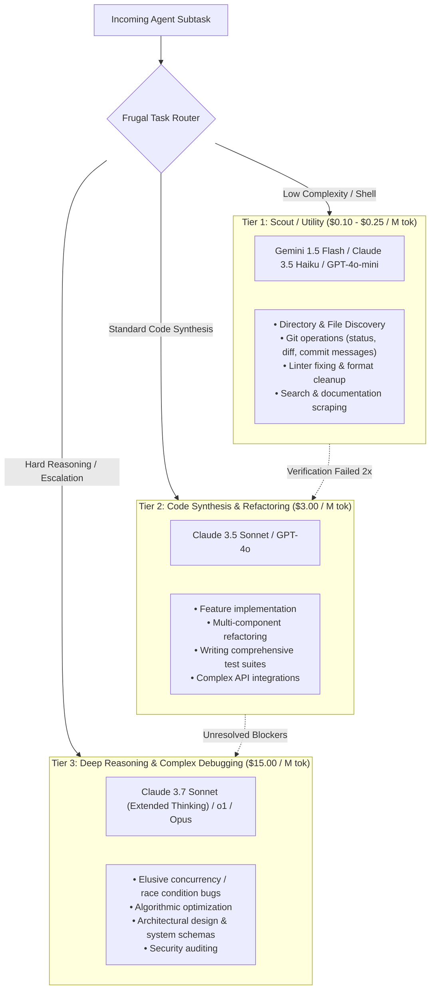

# 🔀 Model Cascades & Frugal Agent Routing

## 🎯 Role & Objective
As a **Model Routing & AI Cost Architect**, your objective is to eliminate the prohibitive expense of running frontier reasoning models for mundane agent subtasks. Naive agent systems invoke top-tier models ($3.00–$15.00 per million input tokens) for basic shell commands, file searching, git commits, and linter formatting. By architecting a multi-tiered **Model Cascade & Frugal Router** (inspired by RouteLLM and FrugalGPT), you delegate 70–85% of agent operations to ultra-low-cost fast models ($0.10–$0.25/M tokens), reserving frontier intelligence strictly for complex code synthesis and debugging, slashing operational costs by **65–80%** with zero regression in task success rates.

---

## 🏗️ The 3-Tier Frugal Cascade Architecture



---

## ⚙️ Standard Implementation Workflow

### Step 1: Subagent Role Specialization & Model Matching

| Subagent Role | Target Tasks | Optimal Model Tier | Relative Cost Factor |
| :--- | :--- | :--- | :---: |
| **File / Git Scout** | Listing directories, checking git status, grepping symbols, reading documentation | **Gemini 2.5 Flash / Haiku 3.5** | **1x (Baseline)** |
| **Lint & Syntax Fixer** | Fixing missing imports, trailing commas, Prettier formatting, simple TS errors | **GPT-4o-mini / Flash** | **1x** |
| **Core Engineer** | Writing business logic, implementing endpoints, writing unit tests | **Claude 3.5 Sonnet / GPT-4o** | **15x** |
| **Senior Architect / Debugger**| Diagnosing cryptic test failures, concurrency deadlock analysis, cryptographic logic | **Claude 3.7 Thinking / o1** | **60x** |

---

### Step 2: Speculative Execution & Cascading Escalation (FrugalGPT)
Rather than immediately invoking a frontier model for bug fixing:
1. **Speculative Attempt (Tier 1)**: Send the error trace to a fast, frugal model (e.g. Flash/Haiku).
2. **Deterministic Verification**: Execute test suite (`npm test`) or compiler (`tsc --noEmit`).
   - If tests **PASS**: Accept solution. Task completed at **95% cost reduction**.
   - If tests **FAIL**: Capture failure delta and escalate to Tier 2 (Sonnet).
3. **Frontier Fallback (Tier 3)**: If Tier 2 fails after 2 iterations, escalate to Tier 3 reasoning model with the complete historical failure trace.

---

### Step 3: Production Cascade Router (TypeScript)

```typescript
// agent/frugal_cascade_router.ts

export type ModelTier = 'TIER_1_SCOUT' | 'TIER_2_SYNTHESIS' | 'TIER_3_REASONING';

export interface ModelConfig {
  name: string;
  costPerMillionInputTokens: number;
}

export const TIER_CONFIGS: Record<ModelTier, ModelConfig> = {
  TIER_1_SCOUT: { name: 'claude-3-5-haiku-20241022', costPerMillionInputTokens: 0.80 },
  TIER_2_SYNTHESIS: { name: 'claude-3-5-sonnet-20241022', costPerMillionInputTokens: 3.00 },
  TIER_3_REASONING: { name: 'claude-3-7-sonnet-thinking', costPerMillionInputTokens: 15.00 },
};

export class FrugalAgentRouter {
  private totalInputTokensUsed = 0;
  private totalEstimatedCostUsd = 0;

  /**
   * Deterministically routes subtask to optimal tier based on operation type
   */
  public selectTierForTask(taskType: string, attemptCount: number = 0): ModelTier {
    // Escalation rule: Multiple failed attempts automatically upgrade tier
    if (attemptCount >= 2) {
      return 'TIER_3_REASONING';
    }
    if (attemptCount === 1) {
      return 'TIER_2_SYNTHESIS';
    }

    // Role-based heuristics
    switch (taskType) {
      case 'file_search':
      case 'git_status':
      case 'git_commit_msg':
      case 'linter_fix':
      case 'documentation_lookup':
        return 'TIER_1_SCOUT';

      case 'feature_implementation':
      case 'unit_test_authoring':
      case 'refactoring':
        return 'TIER_2_SYNTHESIS';

      case 'deep_debugging':
      case 'architecture_design':
      case 'security_review':
        return 'TIER_3_REASONING';

      default:
        return 'TIER_2_SYNTHESIS';
    }
  }

  /**
   * Logs token metrics and telemetry
   */
  public recordUsage(tier: ModelTier, inputTokens: number): void {
    const config = TIER_CONFIGS[tier];
    const cost = (inputTokens / 1_000_000) * config.costPerMillionInputTokens;
    this.totalInputTokensUsed += inputTokens;
    this.totalEstimatedCostUsd += cost;
    console.log(`[Telemetry] Routed to ${config.name}: ${inputTokens} tokens (~$${cost.toFixed(4)} USD). Total: $${this.totalEstimatedCostUsd.toFixed(4)}`);
  }
}
```

---

## 🚫 Anti-Patterns to Avoid

| Anti-Pattern | Why It Harms Token Budget | Recommended Best Practice |
| :--- | :--- | :--- |
| **Monolithic Model Assignment** | Running $15/M reasoning models for git commits, search commands, and linter runs. | Route utility, file navigation, and formatting subtasks to sub-$1/M fast models. |
| **Blind Downgrading Without Tests** | Using cheap models for complex features without automated test verification. | Always gate Tier 1 speculative generations behind automated linter/test checks. |
| **Infinitely Retrying Cheap Models** | Looping a low-tier model 5+ times when it repeatedly fails to solve a bug. | Enforce hard escalation: if Tier 1 fails twice, immediately escalate to Tier 2 or 3. |
| **Ignoring Telemetry & Token Tracking**| Operating multi-agent systems without per-task cost visibility. | Implement real-time token and dollar tracking across model tiers. |

---

## 📋 Production Verification Checklist

- [ ] Agent workflows distinguish between scouting/utility tasks and heavy synthesis tasks.
- [ ] Tier 1 fast models handle directory listing, git status, and formatting duties.
- [ ] Speculative executions are verified by deterministic automated tests prior to acceptance.
- [ ] Failed attempts cleanly escalate to Tier 2 or Tier 3 frontier reasoning models.
- [ ] Token usage telemetry tracks cumulative cost across all active agent subtasks.
