# 📦 Schema Minification & Compact Tool Calling

## 🎯 Role & Objective
As a **Tool Schema Optimizer & Compact Interface Engineer**, your mandate is to eradicate prompt bloat caused by verbose JSON Schema definitions injected into every agent turn. Naive function calling interfaces provide sprawling JSON schemas with redundant descriptions, deep nesting, and verbose parameter docstrings, wasting 2,000–5,000 tokens on tool definitions alone before the user prompt even begins. By minifying tool schemas, leveraging concise TypeScript interfaces (TypeChat pattern), compact parameter keys, and structured enum serialization, you slash tool definition overhead by **60% to 75%** while increasing model adherence and preventing tool hallucination.

---

## 🏗️ The Schema Bloat vs. Minified Representation

```mermaid
flowchart TD
    subgraph BloatedSchemas["❌ Naive Verbose JSON Schema (3,800 Tokens / Turn)"]
        V1["Standard OpenAPI / JSONSchema Spec"]
        V2["Long descriptions on every property: 'This parameter represents the absolute path...'"]
        V3["Multi-nested 'type', 'properties', 'required', 'additionalProperties': false"]
        V4["Verbose enum lists and descriptive error schemas"]
        V1 --> V2 --> V3 --> V4
        V4 --> V_OUT["3,800 tokens injected on every single conversation turn"]
    end

    subgraph MinifiedSchemas["✅ Minified Compact Tool Definitions (950 Tokens / Turn - 75% Savings)"]
        M1["Concise TypeScript Type Definitions (TypeChat Pattern)"]
        M2["Terse, precise parameter doc-hints instead of paragraph descriptions"]
        M3["Flattened parameter dictionaries with idiomatic typing"]
        M4["Minified JSON Schema serialization (whitespace & schema metadata stripped)"]
        M1 --> M2 --> M3 --> M4
        M4 --> M_OUT["950 tokens per turn (byte-cached and token-dense)"]
    end
```



---

## ⚙️ Standard Implementation Workflow

### Step 1: The Token Cost of Verbose JSON Schema vs. TypeScript Types

#### ❌ Verbose Standard JSON Schema (~280 Tokens):
```json
{
  "name": "edit_file_content",
  "description": "Edits a specific file on the local filesystem by replacing target text with new text. The target text must match exactly.",
  "parameters": {
    "type": "object",
    "properties": {
      "filePath": {
        "type": "string",
        "description": "The full absolute path of the file that you wish to modify on the local filesystem."
      },
      "startLine": {
        "type": "integer",
        "description": "The 1-based index representing the starting line number in the file where the replacement will occur."
      },
      "endLine": {
        "type": "integer",
        "description": "The 1-based index representing the ending line number in the file where the replacement ends."
      },
      "targetText": {
        "type": "string",
        "description": "The exact original content that needs to be replaced in the specified file range."
      },
      "replacementText": {
        "type": "string",
        "description": "The new replacement content that will substitute the target content."
      }
    },
    "required": ["filePath", "startLine", "endLine", "targetText", "replacementText"],
    "additionalProperties": false
  }
}
```

#### ✅ Minified Compact Schema (~72 Tokens — 74% Reduction):
```json
{
  "name": "edit_file",
  "description": "Replaces exact target substring in file range with replacement string.",
  "parameters": {
    "type": "object",
    "properties": {
      "file": { "type": "string", "description": "Absolute path" },
      "start": { "type": "integer" },
      "end": { "type": "integer" },
      "target": { "type": "string" },
      "replacement": { "type": "string" }
    },
    "required": ["file", "start", "end", "target", "replacement"]
  }
}
```

---

### Step 2: Automated Schema Minification Engine (TypeScript)

Deploy an automated middleware that sanitizes and minifies raw tool definitions prior to LLM dispatch:

```typescript
// agent/schema_minifier.ts

export interface RawToolDefinition {
  name: string;
  description: string;
  parameters: Record<string, any>;
}

export function minifyToolDefinition(tool: RawToolDefinition): RawToolDefinition {
  // 1. Strip redundant whitespace and trim descriptions
  const cleanDescription = tool.description
    .replace(/\s+/g, ' ')
    .trim()
    .replace(/^(This function|This tool allows the agent to|Used to)\s+/i, '');

  // 2. Deep clean parameters object
  const cleanParameters = pruneJsonSchemaProperties(tool.parameters);

  return {
    name: tool.name,
    description: cleanDescription,
    parameters: cleanParameters
  };
}

function pruneJsonSchemaProperties(schema: any): any {
  if (!schema || typeof schema !== 'object') return schema;
  if (Array.isArray(schema)) return schema.map(pruneJsonSchemaProperties);

  const pruned: Record<string, any> = {};

  // Preserve essential fields only
  const allowedKeys = new Set(['type', 'properties', 'required', 'items', 'enum', 'description']);

  for (const [key, value] of Object.entries(schema)) {
    // Drop useless schema bloat
    if (key === '$schema' || key === 'additionalProperties' || key === 'title') continue;

    if (allowedKeys.has(key)) {
      if (key === 'description' && typeof value === 'string') {
        // Truncate descriptions longer than 80 chars if not crucial
        pruned[key] = value.length > 80 ? value.slice(0, 77) + '...' : value;
      } else {
        pruned[key] = pruneJsonSchemaProperties(value);
      }
    }
  }

  return pruned;
}
```

---

### Step 3: TypeChat Compact TypeScript Schema Pattern

Modern models (Claude 3.5, GPT-4o, Gemini 2.5) understand compact TypeScript interface definitions far more natively than verbose JSON schemas, using fewer tokens:

```typescript
// Compact tool definition string injected into agent instructions (~65 tokens)
export const AGENT_TOOLS_TYPESCRIPT_CONTRACT = `
interface AgentTools {
  // Read file lines (1-indexed, max 800 lines)
  readFile(path: string, startLine?: number, endLine?: number): string;
  
  // Replace target code block with new code
  editFile(path: string, startLine: number, endLine: number, target: string, replacement: string): boolean;
  
  // Run powershell/bash command with timeout in ms
  exec(cmd: string, cwd: string, timeoutMs?: number): { stdout: string; exitCode: number };
}
`;
```

---

## 🚫 Anti-Patterns to Avoid

| Anti-Pattern | Why It Harms Token Budget | Recommended Best Practice |
| :--- | :--- | :--- |
| **Paragraph Descriptions** | Writing essay-length docstrings for simple string parameters. | Use concise 3–6 word parameter descriptions or rely on self-describing variable names (`startLine`). |
| **Deep Nested Objects in Tools** | Passing multi-layered configuration trees inside tool arguments. | Flatten tool arguments into flat primitive objects (`path`, `target`, `replacement`). |
| **Unpruned Schema Metadata** | Leaving `$schema: "http://json-schema.org/draft-07/schema#"` and titles. | Strip all non-essential JSON Schema metadata before prompt injection. |
| **Dynamic Tool Set per Step** | Changing the registered tools between steps invalidates prompt caches. | Keep a stable, minified tool set at the front to maintain prompt caching benefits. |

---

## 📋 Production Verification Checklist

- [ ] All tool schemas have `$schema`, `additionalProperties`, and redundant `title` attributes stripped.
- [ ] Parameter descriptions are concise (<10 words) and omit patronizing explanatory filler.
- [ ] Tool argument properties are flattened to avoid multi-level object nestings.
- [ ] Schema minifier middleware runs automatically in CI or agent initialization.
- [ ] Tool schemas are deterministically sorted to preserve byte-identical KV prompt cache hits.
