# 🎯 Scoped Line-Range & Diff-Anchored Context

## 🎯 Role & Objective
As a **Scoped Context & Line-Range Optimization Engineer**, your objective is to eliminate the catastrophic token waste of dumping entire files into the agent context window. Naive agents routinely load 1,500-line source files into context simply to inspect or edit a 10-line helper function, wasting 8,000+ tokens per inspection that compound across every subsequent conversation turn. By enforcing targeted **line-range slicing** (`StartLine` to `EndLine`), localized AST function boundaries, and diff-anchored editing windows, you slash file ingestion tokens by **85% to 95%** while dramatically improving model reasoning accuracy by eliminating distracting file noise.

---

## 🏗️ Whole-File vs. Scoped Line-Range Reading

```mermaid
flowchart TD
    subgraph WholeFile["❌ Naive Full-File Ingestion (8,500 Tokens)"]
        W1["Whole File Loaded: user_service.ts (1,800 lines)"]
        W2["Imports & Type Definitions (400 lines)"]
        W3["Unrelated Methods A, B, C, D (1,200 lines)"]
        W4["Target Function 'validateUserTier' (35 lines)"]
        W1 --> W2 --> W3 --> W4
        W4 --> W_BURN["8,500 Tokens burned into context! Repeats every step."]
    end

    subgraph ScopedSlice["✅ Scoped Line-Range & AST Node Slicing (280 Tokens - 96% Savings)"]
        S1["grep / symbol index: locate 'validateUserTier' at Line 412"]
        S2["AST / Slice Window: lines 405 to 455 (50 lines total)"]
        S3["Targeted Context Injection with File Path & Line Numbers"]
        S1 --> S2 --> S3
        S3 --> S_SAVE["Only 280 Tokens consumed. Zero noise. Precise edits."]
    end
```



---

## ⚙️ Standard Implementation Workflow

### Step 1: The Three-Phase Context Localization Strategy

When inspecting or editing existing code:

1. **Phase 1: Symbol / Regex Discovery**:
   - Never open the full file blindly.
   - Use `grep_search` or an AST indexer to locate the exact symbol, function name, or line number.
   - Output: `src/services/billing.ts:Line 342: function calculateTax()`.

2. **Phase 2: Scoped Window Ingestion**:
   - Query only `StartLine = 335` to `EndLine = 375` (a 40-line padding buffer around the target).
   - This provides sufficient local context (parameter types, enclosing scope, return value) without ingesting 1,500 lines of unrelated logic.

3. **Phase 3: Diff-Anchored Replacement**:
   - Execute edits using targeted range replacement (`replace_file_content` with specific `StartLine` and `EndLine`).
   - Never overwrite the entire file with rewritten content when only modifying a single method.

---

### Step 2: Automated AST Function Boundary Extractor (TypeScript)

Use Tree-sitter or AST parsers to calculate the exact start and end line of the enclosing function, allowing automated scoped extraction:

```typescript
// agent/scoped_context_extractor.ts
import * as ts from 'typescript';
import * as fs from 'fs';

export interface ScopedCodeSlice {
  filePath: string;
  symbolName: string;
  startLine: number;
  endLine: number;
  content: string;
  tokenEstimate: number;
}

export function extractSymbolSlice(
  filePath: string,
  targetSymbolName: string,
  paddingLines: number = 5
): ScopedCodeSlice | null {
  const fileContent = fs.readFileSync(filePath, 'utf8');
  const sourceFile = ts.createSourceFile(
    filePath,
    fileContent,
    ts.ScriptTarget.Latest,
    true
  );

  let targetNode: ts.Node | null = null;

  function visit(node: ts.Node) {
    if (
      (ts.isFunctionDeclaration(node) ||
        ts.isMethodDeclaration(node) ||
        ts.isClassDeclaration(node) ||
        ts.isInterfaceDeclaration(node)) &&
      node.name?.getText(sourceFile) === targetSymbolName
    ) {
      targetNode = node;
      return;
    }
    ts.forEachChild(node, visit);
  }

  visit(sourceFile);

  if (!targetNode) return null;

  const startPos = (targetNode as ts.Node).getStart(sourceFile);
  const endPos = (targetNode as ts.Node).getEnd();

  const startLine = Math.max(1, sourceFile.getLineAndCharacterOfPosition(startPos).line + 1 - paddingLines);
  const endLine = sourceFile.getLineAndCharacterOfPosition(endPos).line + 1 + paddingLines;

  const lines = fileContent.split('\n');
  const sliceContent = lines.slice(startLine - 1, endLine).join('\n');

  // Estimate tokens (~4 characters per token)
  const tokenEstimate = Math.ceil(sliceContent.length / 4);

  return {
    filePath,
    symbolName: targetSymbolName,
    startLine,
    endLine,
    content: sliceContent,
    tokenEstimate
  };
}
```

---

### Step 3: Comparative Token Economics: Whole-File vs. Scoped Slice

| Metric | Whole-File Reading | Scoped Window (50 Lines) | AST Node Extraction |
| :--- | :--- | :--- | :--- |
| **Tokens Consumed per File View** | 4,000 – 12,000 tokens | 250 – 400 tokens | 120 – 250 tokens |
| **Token Reduction** | Baseline (0%) | **-93% to -96%** | **-97% to -98%** |
| **Context Window Longevity** | Fills in 5–8 turns | Sustains 50+ turns | Sustains 100+ turns |
| **Edit Accuracy (Diff Precision)** | 68% (Model truncates or hallucinates unchanged code) | **94%** (Exact replacement of lines) | **96%** (Targeted node diff) |

---

## 🚫 Anti-Patterns to Avoid

| Anti-Pattern | Why It Harms Token Budget | Recommended Best Practice |
| :--- | :--- | :--- |
| **Blind `cat` or Full View** | Loading entire files without line limits into prompt history. | Always supply `startLine` and `endLine` parameters when reading code. |
| **Whole-File Rewrites for Minor Edits** | Emitting 500 lines of unchanged code just to update one parameter. | Use surgical contiguous diff tools (`replace_file_content`) anchored to line numbers. |
| **Multiple Redundant File Reads** | Reading the exact same file 3 times across consecutive turns. | Rely on agent memory or compact AST symbols instead of re-reading raw files. |
| **Ignoring Grep Line Matches** | Reading from line 1 when grep already told you the match is at line 842. | Anchor `startLine` directly to the grep line match minus 10 lines of context. |

---

## 📋 Production Verification Checklist

- [ ] File reading tool calls specify explicit `StartLine` and `EndLine` ranges.
- [ ] No file reading operation exceeds 150 lines unless strictly required for full-file creation.
- [ ] Symbol searches (`grep_search`) precede code file reads to identify exact line coordinates.
- [ ] File modifications use targeted diff replacement rather than whole-file overwriting.
- [ ] Injected context chunks include line number annotations to ensure replacement accuracy.
