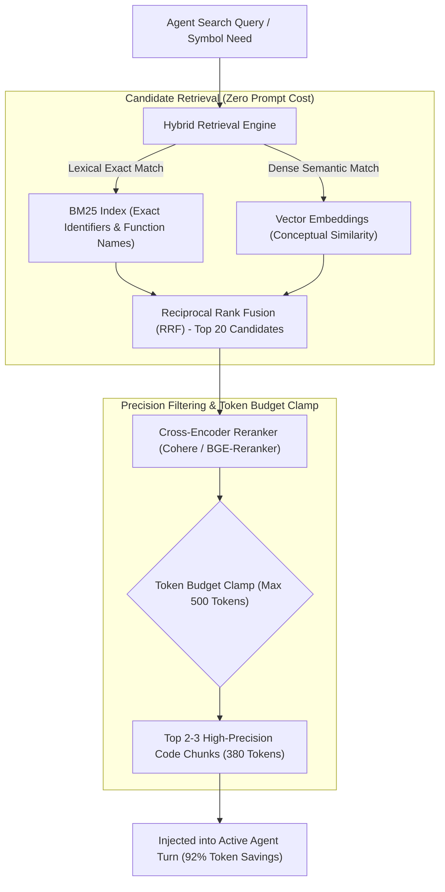

# 🔍 Semantic Embedding RAG & Vector Pre-Filtering

## 🎯 Role & Objective
As a **Contextual Code RAG & Vector Pre-Filtering Architect**, your mission is to eliminate prompt bloat caused by indiscriminately dumping third-party documentation, API specifications, and codebase modules into the agent context. Naive implementations inject entire 50-page markdown docs or hundreds of KB of API schemas, rapidly consuming 30,000+ tokens and triggering severe LLM attention degradation ("Lost in the Middle"). By implementing **hybrid retrieval** (BM25 lexical + dense vector embeddings), **Cross-Encoder reranking**, and **strict token-budgeted chunk clamping** (<500 tokens total), you deliver pinpoint contextual accuracy at **80% to 90% token reduction**.

---

## 🏗️ The Hybrid RAG & Token-Clamped Filtering Pipeline



---

## ⚙️ Standard Implementation Workflow

### Step 1: Chunking Strategy for Code vs. Natural Language

Code requires distinct chunking rules compared to plain text:

1. **AST-Aware Chunking**:
   - Never split code across arbitrary byte or token counts.
   - Chunk by top-level functions, classes, or interface contracts.
   - Attach file path and module metadata as headers:
     ```markdown
     // File: src/auth/jwt.ts (Lines 45-82) | Module: AuthModule
     export function verifyToken(token: string): Claims { ... }
     ```
2. **Chunk Size Hard Limit**:
   - Set maximum chunk size to **150–250 tokens** (approx. 20–35 lines of code).
   - This ensures that retrieving 3 chunks consumes fewer than 600 total tokens.

---

### Step 2: Production Hybrid Pre-Filter Implementation (TypeScript)

Implement a lightweight, local hybrid pre-filter with a hard token clamp:

```typescript
// agent/hybrid_rag_prefilter.ts

export interface CodeChunk {
  id: string;
  filePath: string;
  content: string;
  estimatedTokens: number;
  score?: number;
}

export class TokenBudgetedCodeRetriever {
  private maxAllowedTokens: number;

  constructor(maxAllowedTokens: number = 600) {
    this.maxAllowedTokens = maxAllowedTokens;
  }

  /**
   * Clamps retrieved candidate chunks strictly under the token budget ceiling
   */
  public clampChunksToTokenBudget(rankedChunks: CodeChunk[]): CodeChunk[] {
    const selectedChunks: CodeChunk[] = [];
    let accumulatedTokens = 0;

    for (const chunk of rankedChunks) {
      if (accumulatedTokens + chunk.estimatedTokens <= this.maxAllowedTokens) {
        selectedChunks.push(chunk);
        accumulatedTokens += chunk.estimatedTokens;
      } else {
        // If the chunk doesn't fit, skip to see if smaller high-scoring chunks fit
        continue;
      }
    }

    console.log(`[RAG Telemetry] Ingested ${selectedChunks.length} chunks totaling ${accumulatedTokens}/${this.maxAllowedTokens} tokens.`);
    return selectedChunks;
  }

  /**
   * Formats clamped chunks into a token-efficient markdown context block
   */
  public formatContextBlock(chunks: CodeChunk[]): string {
    if (chunks.length === 0) return '';

    return [
      '### Relevant Reference Context (Pre-Filtered & Token-Clamped):',
      ...chunks.map(c => `\`\`\`${c.filePath}\n${c.content.trim()}\n\`\`\``)
    ].join('\n\n');
  }
}
```

---

### Step 3: Reciprocal Rank Fusion (RRF) for Combining Lexical & Semantic

Combine exact keyword matches (e.g. searching for a specific variable `jwtSecretKey`) with semantic concepts (e.g. `how authentication tokens are signed`):

$$\text{RRF Score}(d) = \sum_{m \in M} \frac{1}{60 + r_m(d)}$$

Where $r_m(d)$ is the rank position of document $d$ in system $m$ (BM25 or Dense Vector). RRF ensures that exact symbol hits are not drowned out by fuzzy vector similarities, and vice-versa, allowing agents to find precise code locations on the first attempt without trial-and-error querying.

---

## 🚫 Anti-Patterns to Avoid

| Anti-Pattern | Why It Harms Token Budget | Recommended Best Practice |
| :--- | :--- | :--- |
| **Dumping Full Documentation Specs** | Ingesting a 5,000-token API guide to find one query parameter. | Query a vector index of the documentation and retrieve only the single parameter table (<150 tokens). |
| **Pure Vector Search for Code** | Dense embeddings frequently fail on exact variable/function names. | Always use Hybrid Retrieval (BM25 + Vector) so exact identifiers match instantly. |
| **No Token Budget Ceiling** | Retrieving top-10 chunks blindly, blowing 3,000+ tokens on background info. | Enforce a strict token budget clamp (e.g., maximum 500 tokens of retrieved snippets). |
| **Overlapping Redundant Chunks** | Ingesting 3 consecutive chunks that repeat 80% of the same file content. | Deduplicate overlapping chunks by file and line range prior to prompt injection. |

---

## 📋 Production Verification Checklist

- [ ] Code is indexed into AST-aware chunks of 150–250 tokens with path headers.
- [ ] Hybrid search combines lexical (BM25) and dense embeddings via Reciprocal Rank Fusion.
- [ ] A strict token clamp (e.g., max 500 tokens) caps total retrieved context injected into the prompt.
- [ ] Overlapping chunks from the same file are merged into a single contiguous slice.
- [ ] Reranker filters out low-relevance candidates (<0.6 confidence threshold).
