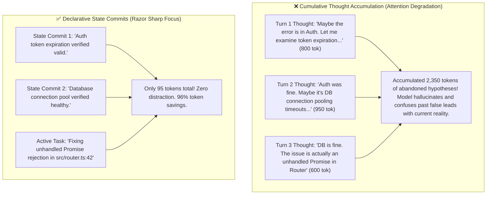

# 🧠 Attention De-Poisoning & Scratchpad Pruning

## 🎯 Role & Objective
As an **Attention Hygiene & Scratchpad Pruning Specialist**, your mandate is to maintain razor-sharp agent focus and prevent context bloat caused by accumulating historical reasoning chains. In extended autonomous agent workflows, models produce thousands of tokens of internal scratchpad musings, speculative hypotheses, and dead-end analysis logs. Carrying these verbose thought trails across multiple turns not only inflates input token costs quadratically ($O(N^2)$), but also poisons the LLM's cross-attention mechanisms—causing models to get distracted by earlier abandoned ideas. By replacing historical scratchpad chatter with concise **declarative state commits**, you slash multi-turn token compounding by **70% to 85%** and restore peak reasoning fidelity.

---

## 🏗️ Attention Degradation vs. De-Poisoned Context



---

## ⚙️ Standard Implementation Workflow

### Step 1: The Scratchpad Lifecycle: Active vs. Historical

1. **Active Turn (During Reasoning)**:
   - Allow the model full freedom to use chain-of-thought (`<thought>` tags, scratchpads, intermediate checklists) to solve the immediate dilemma.
2. **Post-Turn (Before Next Dispatch)**:
   - Strip the verbose internal reasoning text from the conversation history.
   - Replace it with a single declarative **State Commit** describing only:
     - What concrete action was executed.
     - What fact was established.
     - What the next immediate objective is.

---

### Step 2: Automated Conversation De-Poisoning Middleware (TypeScript)

Deploy an automated middleware that sanitizes prior turns in the message array before sending to the model API:

```typescript
// agent/attention_hygiene_middleware.ts

export interface AgentMessage {
  role: 'user' | 'assistant' | 'system' | 'tool';
  content: string;
  thought?: string;
  toolCalls?: any[];
}

export class AttentionDePoisoner {
  /**
   * Cleans past turns, retaining thoughts ONLY on the most recent assistant turn
   */
  public sanitizeHistory(messages: AgentMessage[]): AgentMessage[] {
    const total = messages.length;

    return messages.map((msg, index) => {
      const isLatestTurn = index >= total - 2;

      // Never prune system or user messages
      if (msg.role !== 'assistant') return msg;

      // Preserve thoughts on the active/immediate turn
      if (isLatestTurn) return msg;

      // Prune past assistant messages
      let sanitizedContent = msg.content;

      // 1. Strip <thought>...</thought> or <scratchpad>...</scratchpad> blocks
      sanitizedContent = sanitizedContent.replace(/<thought>[\s\S]*?<\/thought>/gi, '');
      sanitizedContent = sanitizedContent.replace(/<scratchpad>[\s\S]*?<\/scratchpad>/gi, '');

      // 2. Strip rambling conversational introspection prefixes
      sanitizedContent = sanitizedContent.replace(/^(I will now think about|Let me analyze|Thinking Step-by-Step:)[\s\S]*?\n\n/i, '');

      // 3. Compact whitespace
      sanitizedContent = sanitizedContent.trim();

      // If the message was purely internal thinking, replace with a declarative marker
      if (!sanitizedContent && msg.toolCalls && msg.toolCalls.length > 0) {
        sanitizedContent = `[Executed ${msg.toolCalls.length} tool action(s)]`;
      }

      return {
        ...msg,
        content: sanitizedContent,
        thought: undefined // Delete raw thought payload
      };
    });
  }
}
```

---

### Step 3: Tombstoning Large Tool Results After Consumption

When an agent reads a 600-line file or runs a verbose git diff in Turn 2, that data is only needed for Turn 2's reasoning. By Turn 4, it is toxic context bloat:

```typescript
export function tombstoneExpiredToolOutputs(messages: AgentMessage[], maxAgeTurns: number = 3): AgentMessage[] {
  const currentTurn = messages.length;

  return messages.map((msg, idx) => {
    if (msg.role !== 'tool') return msg;

    const age = currentTurn - idx;
    if (age > maxAgeTurns && msg.content.length > 300) {
      // Replace bulky historical output with a compact tombstone
      return {
        ...msg,
        content: `[Tool Result Tombstone: Output (${msg.content.length} chars) consumed in turn ${idx}. Content omitted to maintain context budget.]`
      };
    }
    return msg;
  });
}
```

---

## 🚫 Anti-Patterns to Avoid

| Anti-Pattern | Why It Harms Token Budget | Recommended Best Practice |
| :--- | :--- | :--- |
| **Preserving All Past Chain-of-Thought** | Accumulating thousands of rambling thought tokens across 20 turns. | Strip historical thinking blocks; preserve thoughts only on the immediately preceding turn. |
| **Preserving Dead Investigation Leads**| Carrying hypotheses that were proven false into all future turns. | Summarize refuted paths into a 1-sentence declarative exclusion: "Verified issue is not in CORS." |
| **Never Tombstoning Tool Outputs** | Keeping 500 lines of linter logs from 10 steps ago in active memory. | Tombstone verbose tool responses after 2–3 turns once their decisions are enacted. |
| **Repetitive Planning Memos** | Emitting identical 50-line checklists at the start of every message. | Update an anchored state summary file or overwrite the single existing progress memo. |

---

## 📋 Production Verification Checklist

- [ ] `<thought>` and scratchpad tags from turns older than $T-2$ are stripped from API payloads.
- [ ] Large historical tool outputs (>300 chars) are tombstoned after 3 turns.
- [ ] Refuted hypotheses are condensed into declarative exclusion statements.
- [ ] Attention de-poisoner runs automatically in the agent request pipeline.
- [ ] Input tokens per turn remain linear or bounded, rather than growing quadratically.
