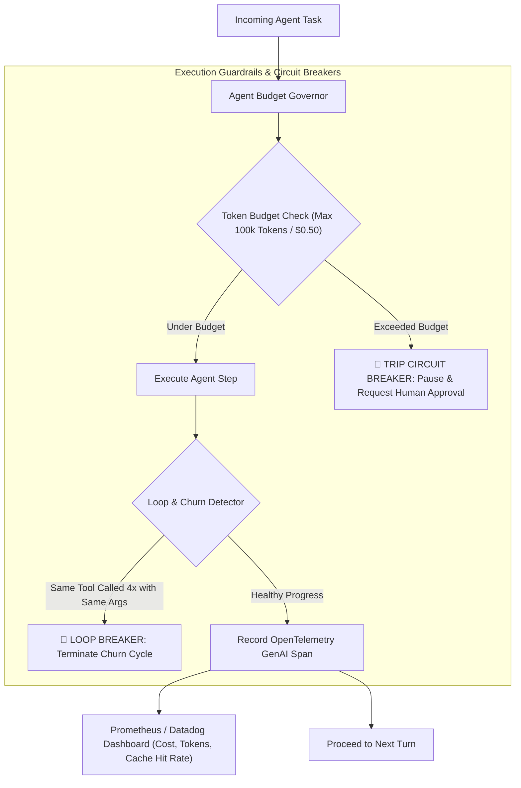
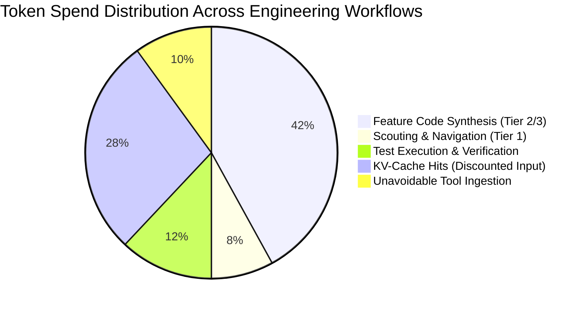

# 📊 Agent Token Budgeting & Cost Telemetry

## 🎯 Role & Objective
As an **AI Agent Token Governance & Telemetry Architect**, your mission is to protect engineering organizations from runaway agent execution costs, infinite tool recursion loops, and unmonitored API burn. Autonomous coding agents operating without strict financial guardrails can easily burn hundreds of dollars on a single task by falling into repetitive compilation-failure loops, repeating identical file searches, or churning large contexts. By implementing **per-task token budget caps**, **circuit breakers**, **real-time spend telemetry (OpenTelemetry GenAI standard)**, and **burn-rate alerting**, you provide ironclad economic protection and 100% cost transparency across all engineering workflows.

---

## 🏗️ The Token Governance & Circuit Breaker Architecture



---

## ⚙️ Standard Implementation Workflow

### Step 1: OpenTelemetry GenAI Semantic Conventions

Track every LLM interaction following the official OpenTelemetry GenAI standards:

| Semantic Attribute | Description | Example Value |
| :--- | :--- | :--- |
| `gen_ai.system` | LLM Provider system | `"anthropic"` / `"openai"` |
| `gen_ai.request.model` | Requested model name | `"claude-3-5-sonnet-20241022"` |
| `gen_ai.usage.input_tokens` | Total input prompt tokens | `14250` |
| `gen_ai.usage.output_tokens` | Completion tokens generated | `680` |
| `gen_ai.usage.cache_read_tokens` | Tokens served from KV-cache | `12800` |
| `gen_ai.cost.usd` | Calculated cost in USD | `$0.0482` |
| `agent.task_id` | Identifier of the active task | `"task-refactor-auth-042"` |

---

### Step 2: Production Token Governor & Circuit Breaker (TypeScript)

Deploy an active token governor to halt runaway agent workflows:

```typescript
// agent/token_governor.ts

export interface BudgetConfig {
  maxInputTokens: number;
  maxOutputTokens: number;
  maxCostUsd: number;
  maxConsecutiveToolRepeats: number;
}

export class AgentTokenGovernor {
  private config: BudgetConfig;
  private currentInputTokens = 0;
  private currentOutputTokens = 0;
  private currentCostUsd = 0;
  private recentToolCalls: string[] = [];

  constructor(config: Partial<BudgetConfig> = {}) {
    this.config = {
      maxInputTokens: config.maxInputTokens || 150_000,
      maxOutputTokens: config.maxOutputTokens || 15_000,
      maxCostUsd: config.maxCostUsd || 1.00, // $1.00 hard budget per task
      maxConsecutiveToolRepeats: config.maxConsecutiveToolRepeats || 3,
    };
  }

  /**
   * Evaluates before each step whether the agent is within financial and loop bounds
   */
  public assertCanProceed(toolName?: string, toolArgsHash?: string): void {
    // 1. Budget limits
    if (this.currentCostUsd >= this.config.maxCostUsd) {
      throw new Error(`🚨 BUDGET CIRCUIT BREAKER TRIPPED: Task cost ($${this.currentCostUsd.toFixed(2)}) exceeded maximum budget ($${this.config.maxCostUsd.toFixed(2)}).`);
    }

    if (this.currentInputTokens >= this.config.maxInputTokens) {
      throw new Error(`🚨 TOKEN CIRCUIT BREAKER TRIPPED: Accumulated input tokens (${this.currentInputTokens}) exceeded ceiling (${this.config.maxInputTokens}).`);
    }

    // 2. Loop detection (identical tool calls repeating)
    if (toolName && toolArgsHash) {
      const callSignature = `${toolName}:${toolArgsHash}`;
      this.recentToolCalls.push(callSignature);

      const repeats = this.recentToolCalls.slice(-this.config.maxConsecutiveToolRepeats);
      if (repeats.length === this.config.maxConsecutiveToolRepeats && repeats.every(s => s === callSignature)) {
        throw new Error(`🛑 LOOP CIRCUIT BREAKER TRIPPED: Agent repeated '${toolName}' ${this.config.maxConsecutiveToolRepeats} times with identical arguments without making progress.`);
      }
    }
  }

  /**
   * Ingests telemetry delta from completed LLM turn
   */
  public recordTurn(inputTokens: number, outputTokens: number, costUsd: number): void {
    this.currentInputTokens += inputTokens;
    this.currentOutputTokens += outputTokens;
    this.currentCostUsd += costUsd;

    console.log(
      `[Token Governor] Cumulative Usage: ${this.currentInputTokens} in / ${this.currentOutputTokens} out | Total Spend: $${this.currentCostUsd.toFixed(4)} USD (${((this.currentCostUsd / this.config.maxCostUsd) * 100).toFixed(1)}% of budget)`
    );
  }
}
```

---

### Step 3: Enterprise Cost Attribution Matrix

Structure agent spend tracking across organizational dimensions:



By attributing tokens to specific repositories, engineers, and PRs, engineering leadership gains granular visibility into ROI, identifying high-cost anti-patterns and optimizing developer velocity without budget surprises.

---

## 🚫 Anti-Patterns to Avoid

| Anti-Pattern | Why It Harms Token Budget | Recommended Best Practice |
| :--- | :--- | :--- |
| **Unbounded Autonomous Execution** | Allowing agents to run overnight without spending limits, causing surprise bills. | Enforce hard $1.00 to $3.00 task budget caps with automated human pause. |
| **No Loop Detection** | An agent failing a linter 25 times in a row, repeating the exact same diff. | Trip a loop circuit breaker when the same tool fails 3 times consecutively. |
| **Untracked Cost Telemetry** | Flying blind without knowing which subagents or steps consume the most tokens. | Emit OpenTelemetry GenAI spans on every turn to visualize token attribution. |
| **Ignoring KV-Cache Hit Ratios** | Not monitoring whether prompt changes broke prompt caching across turns. | Alert in telemetry when KV-cache hit rate drops below 75%. |

---

## 📋 Production Verification Checklist

- [ ] Hard token budget caps (input, output, and dollar limits) are enforced per task.
- [ ] Consecutive identical tool call loops are intercepted after 3 repetitions.
- [ ] OpenTelemetry GenAI semantic conventions record model, token usage, and cost per turn.
- [ ] Telemetry tracks KV-cache hit ratios and TTFT (time-to-first-token).
- [ ] CI/CD pipeline triggers alerts on sudden token consumption spikes.
