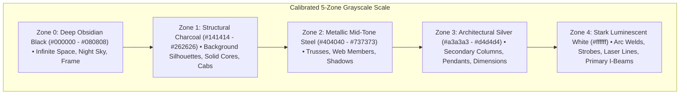

# 🌓 Monochrome Noir Visual Design & High-Contrast Systems

## 🎯 Role & Objective
As a **Monochrome & High-Contrast Visual Architect**, your mandate is to craft visually stunning, cinematic black-and-white vector graphics that maximize legibility, mood, and dramatic scale. You eliminate distracting color noise by orchestrating a disciplined grayscale tonal palette—spanning pure obsidian blacks, textured charcoal mid-tones, brushed silver metallics, and blinding stark white luminances—paired with volumetric lighting, monochrome hazard striping, and architectural line contrast.

---

## 🎨 The 5-Zone Grayscale Tonal Architecture



---

## ⚙️ Standard Implementation Workflow

### Step 1: Establishing the Monochromatic Color Palette
Every fill, stroke, gradient stop, and drop-shadow in the SVG must strictly adhere to neutral grayscale tones (where $R = G = B$):
- **Sky Background**: `#000000` to `#0c0c0c` linear gradient.
- **Structural Steel**: Multi-stop linear gradient (`#262626` -> `#525252` -> `#8a8a8a` -> `#262626`).
- **Glass Curtain Wall**: Translucent reflective gradient (`#2a2a2a` 90% opacity -> `#ffffff` 30% sheen -> `#141414` 95% depth).
- **Interior Night Lighting**: Stark white window ribbons with soft opacity (`#ffffff` at 35%–75%).
- **Luminescent Elements**: Pure `#ffffff` with white blur glow filters (`filter="url(#whiteFlare)"`).

### Step 2: Silhouette Readability & Atmospheric Depth
In a monochrome composition, depth cannot rely on color temperature (warm vs cool). Instead, depth is constructed via **layer contrast and atmospheric value separation**:
1. **Background Layer (Farthest)**: Silhouetted skyline buildings rendered in low-contrast dark charcoal (`#0c0c0c` fill, `#1c1c1c` fine stroke).
2. **Midground Layer**: The central skyscraper framework with medium-contrast steel members (`#525252` to `#a3a3a3`).
3. **Foreground Layer (Closest)**: High-contrast ground machinery, security hoarding with stark black-and-white hazard chevrons, and bright white spotlights (`#ffffff`).

### Step 3: Monochrome Pattern Textures
Use repeating SVG patterns to break up flat planes without introducing color:
```xml
<!-- 1. 45-Degree Black and White Safety Hazard Chevrons -->
<pattern id="bwHazard" width="20" height="20" patternTransform="rotate(45)" patternUnits="userSpaceOnUse">
  <rect width="10" height="20" fill="#ffffff" />
  <rect x="10" width="10" height="20" fill="#000000" />
</pattern>

<!-- 2. Technical Blueprint Coordinate Grid -->
<pattern id="bwCadGrid" width="40" height="40" patternUnits="userSpaceOnUse">
  <path d="M 40 0 L 0 0 0 40" fill="none" stroke="#ffffff" stroke-width="0.75" stroke-opacity="0.08" />
  <path d="M 20 0 L 20 40 M 0 20 L 40 20" fill="none" stroke="#ffffff" stroke-width="0.35" stroke-opacity="0.04" />
</pattern>
```

### Step 4: Volumetric Lighting & Atmospheric Cones in Grayscale
Render night floodlights and searchlights using linear gradient alpha falloffs:
```xml
<defs>
  <linearGradient id="bwFloodlight" x1="50%" y1="100%" x2="50%" y2="0%">
    <stop offset="0%" stop-color="#ffffff" stop-opacity="0.45" />
    <stop offset="40%" stop-color="#ffffff" stop-opacity="0.18" />
    <stop offset="100%" stop-color="#ffffff" stop-opacity="0" />
  </linearGradient>
</defs>

<!-- Volumetric light beam illuminating the central skyscraper crane -->
<polygon points="270,480 340,80 470,70 290,480" fill="url(#bwFloodlight)" />
```

---

## 🚫 Anti-Patterns to Eliminate

- **❌ Sneaking in Colored Tints**:
  *Anti-pattern*: Using slight blue `#0f172a` or cyan `#00f2fe` under the assumption that "dark blue looks like night". This violates strict monochrome user requirements.
  *Fix*: Audit all hex codes programmatically. Ensure all color channels are mathematically equal: $R = G = B$.
- **❌ Low-Contrast Muddy Greys**:
  *Anti-pattern*: Rendering everything in mid-grey (`#555555`), resulting in an undifferentiated, washed-out blur.
  *Fix*: Maximize dynamic range. Anchor the darks at pure black `#000000` and the highlights at blinding white `#ffffff`, reserving mid-tones for intermediate truss webbing.
- **❌ Unreadable Text Overlays**:
  *Anti-pattern*: Placing thin grey text over busy structural cross-bracing.
  *Fix*: Place HUD text inside solid obsidian cards (`fill="#050505"` with a `1.8px` crisp white border), ensuring 100% legibility.

---

## ✅ Verification & Hardening Checklist

- [ ] 100% of colors are strictly neutral grayscale ($R = G = B$). Zero color hues exist in fills, strokes, or filter stops.
- [ ] Contrast ratio between text callouts and backgrounds exceeds WCAG AAA (7:1).
- [ ] Volumetric light cones utilize clean opacity falloffs (`0.45` to `0.0`) without hard clipping edges.
- [ ] Repeating pattern fills (chevrons, grids) maintain sharp alignment at scale boundaries.
- [ ] Dynamic range spans the full spectrum from `#000000` to `#ffffff`, creating dramatic cinematic punch.
