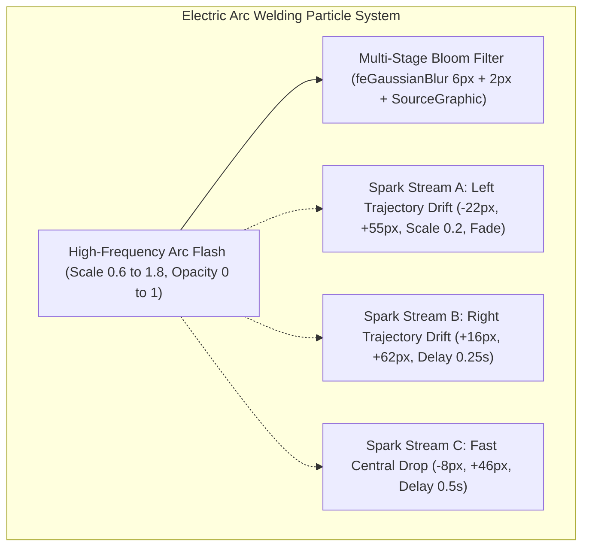

# ⚡ Vector Particle Emitters & Volumetric Lighting Effects

## 🎯 Role & Objective
As a **Vector Particle & Lighting Effects Specialist**, your mandate is to simulate dynamic atmospheric phenomena—including electric arc welding flares, cascading molten spark showers, pulsating concrete slurry pipelines, and sweeping laser leveling datum lines—entirely inside SVG and CSS keyframes without third-party particle libraries or JavaScript runtime overhead.

---

## 🏗️ SVG Particle & Flare Pipeline



---

## ⚙️ Standard Implementation Workflow

### Step 1: High-Frequency Electric Arc Flash Simulation
Real electric welding arcs do not pulse sinusoidally—they flicker erratically at stochastic high frequencies:
```css
@keyframes weldArcFlash {
  0%, 100% { opacity: 0; transform: scale(0.6); }
  10%      { opacity: 1; transform: scale(1.6); }
  15%      { opacity: 0.15; transform: scale(0.8); }
  22%      { opacity: 1; transform: scale(1.8); }
  28%      { opacity: 0.3; transform: scale(0.9); }
  35%      { opacity: 0.95; transform: scale(1.4); }
  45%, 95% { opacity: 0; }
}
```
*Glow Bloom Filter:*
```xml
<filter id="whiteFlare" x="-60%" y="-60%" width="220%" height="220%">
  <feGaussianBlur stdDeviation="6" result="blur1" />
  <feGaussianBlur stdDeviation="2" result="blur2" />
  <feMerge>
    <feMergeNode in="blur1" />
    <feMergeNode in="blur2" />
    <feMergeNode in="SourceGraphic" />
  </feMerge>
</filter>
```

### Step 2: Cascading Spark Particle Emitters
Simulate falling molten metal droplets under gravitational acceleration and horizontal velocity drift:
```css
/* Particle Stream 1: Drifts left, falls 55px, shrinks and decays */
@keyframes sparkDrop1 {
  0%   { transform: translate(0, 0) scale(1); opacity: 1; }
  100% { transform: translate(-22px, 55px) scale(0.2); opacity: 0; }
}

/* Particle Stream 2: Drifts right, falls 62px */
@keyframes sparkDrop2 {
  0%   { transform: translate(0, 0) scale(1); opacity: 1; }
  100% { transform: translate(16px, 62px) scale(0.2); opacity: 0; }
}
```
*SVG Particle Station Node:*
```xml
<g transform="translate(440, 135)">
  <!-- Arc Flare Core -->
  <circle cx="0" cy="0" r="16" fill="#ffffff" filter="url(#whiteFlare)" class="anim-weld-flash1" />
  <circle cx="0" cy="0" r="6" fill="#ffffff" class="anim-weld-flash1" />
  <!-- Spark Droplets with Staggered Delays -->
  <circle cx="-3" cy="0" r="1.8" fill="#ffffff" class="anim-spark1" />
  <circle cx="3" cy="0" r="2" fill="#ffffff" class="anim-spark2" />
  <circle cx="0" cy="0" r="1.5" fill="#ffffff" class="anim-spark3" />
</g>
```

### Step 3: Pulsating Slurry & Fluid Mechanics via Dashoffset
Simulate fluid or material flow along pipelines without animating vector vertices:
```css
@keyframes concreteFlowPulse {
  0%   { stroke-dashoffset: 80; }
  100% { stroke-dashoffset: 0; }
}
.anim-concrete-pump {
  stroke-dasharray: 8 14;
  animation: concreteFlowPulse 1.6s linear infinite;
}
```

### Step 4: CAD Laser Leveling Elevation Scanner Line
Simulate a sweeping theodolite laser inspecting floor elevations:
```css
@keyframes laserScanVertical {
  0%   { transform: translateY(0px); opacity: 0.85; }
  50%  { transform: translateY(300px); opacity: 1; }
  100% { transform: translateY(0px); opacity: 0.85; }
}
.anim-laser-scan {
  animation: laserScanVertical 7.5s ease-in-out infinite;
}
```
*Laser Assembly in SVG:*
```xml
<g class="anim-laser-scan" transform="translate(0, 130)">
  <line x1="340" y1="0" x2="670" y2="0" stroke="#ffffff" stroke-width="2" filter="url(#laserLineGlow)" opacity="0.9" />
  <rect x="675" y="-9" width="85" height="18" rx="2" fill="#000000" stroke="#ffffff" stroke-width="1.5" />
  <text x="717" y="3" fill="#ffffff" font-family="'JetBrains Mono', monospace" font-size="7.5" font-weight="900" text-anchor="middle">DATUM ±0.01mm</text>
</g>
```

---

## 🚫 Anti-Patterns to Eliminate

- **❌ Infinite Particle Spawning**:
  *Anti-pattern*: Attempting to spawn hundreds of individual DOM circles in loops. In SVG, every node adds to DOM weight and slows the browser engine.
  *Fix*: Reuse 3 to 5 key particle emitter nodes with asynchronous `animation-delay` and randomized trajectory keyframes.
- **❌ Heavy Multi-Pass SVG Filters**:
  *Anti-pattern*: Stacking 5+ Gaussian blur layers with large radiuses (`stdDeviation="30"`). This bogs down mobile GPU compositor memory.
  *Fix*: Cap `stdDeviation` between 2 and 6. Use two clean merge stages (`blur1` + `blur2`).
- **❌ Unbounded Laser Beams**:
  *Anti-pattern*: Drawing laser lines spanning the entire canvas edge-to-edge.
  *Fix*: Constrain laser bounds to the actual structural envelope (`x1="340"` to `x2="670"`).

---

## ✅ Verification & Hardening Checklist

- [ ] Welding arc flash exhibits high-frequency stochastic flicker rather than slow harmonic fades.
- [ ] Spark particles decay simultaneously in scale (`scale(0.2)`) and opacity (`opacity: 0`).
- [ ] Fluid and conveyor pipelines use `stroke-dashoffset` for zero-reflow 60 FPS performance.
- [ ] Laser scanlines incorporate bloom glow filters while maintaining crisp text calibration flags.
- [ ] Aviation obstruction strobes operate with dual-rate blink intervals (0.9s fast strobe, 1.4s slow strobe).
