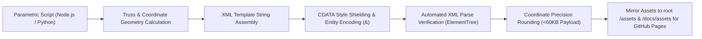

# 🤖 Parametric SVG Generation, Asset Optimization & CI Validation

## 🎯 Role & Objective
As an **Automated SVG Asset Engineer & Vector Optimization Specialist**, your mandate is to build robust, programmatic generator pipelines (Node.js/Python) that synthesize complex vector graphics mathematically. You enforce strict XML well-formedness, sanitize assets for GitHub Camo image proxy compliance, wrap styles in protected CDATA blocks, and optimize payloads to sub-60KB budgets for instantaneous page load and zero runtime errors.

---

## 🏗️ Parametric Vector Build & Optimization Pipeline



---

## ⚙️ Standard Implementation Workflow

### Step 1: Programmatic Truss & Grid Generation
Rather than manually hand-coding repetitive structural steel lattices, generate them with mathematical loops:
```javascript
// scripts/generate_truss.js
function generateLatticeTruss(startX, startY, bayWidth, bayHeight, count) {
  let chords = `<line x1="${startX}" y1="${startY}" x2="${startX + bayWidth * count}" y2="${startY}" stroke="#ffffff" stroke-width="2.5" />`;
  let pathD = `M ${startX} ${startY}`;
  
  for (let i = 0; i < count; i++) {
    const x1 = startX + i * bayWidth;
    const x2 = startX + (i + 1) * bayWidth;
    const yTop = startY - bayHeight;
    const yBottom = startY;
    // Triangular Web Diagonal
    pathD += ` L ${x1 + bayWidth / 2} ${yTop} L ${x2} ${yBottom}`;
  }
  return chords + `\n<path d="${pathD}" stroke="#737373" stroke-width="1.5" fill="none" />`;
}
```

### Step 2: Strict XML Well-Formedness & Entity Rules
Any SVG embedded in a web markdown document or loaded as an image must conform to strict XML standards:
1. **The CDATA Style Shield**:
   Always enclose `<style>` rules inside a CDATA block:
   ```xml
   <style>
     <![CDATA[
       @keyframes pulse { 0%, 100% { opacity: 0; } 50% { opacity: 1; } }
       .hud-item > text { font-weight: 700; }
     ]]>
   </style>
   ```
2. **Escaping Literal Ampersands**:
   Never use raw `&` in XML attributes or text nodes. Always write `&amp;`:
   ```xml
   <!-- Correct -->
   <text>CRANE OPERATIONS &amp; SAFETY</text>
   ```
3. **Closing Every Tag**:
   Every XML element must be closed explicitly (`<line ... />`, `<path ... />`, `<rect ... />`).

### Step 3: Automated Validation Test in CI/CD
Incorporate automated XML syntax verification into build scripts:
```python
# test_svg_validity.py
import xml.etree.ElementTree as ET
import glob

def test_all_svgs():
    svg_files = glob.glob("assets/**/*.svg", recursive=True) + glob.glob("docs/assets/**/*.svg", recursive=True)
    for fpath in svg_files:
        try:
            tree = ET.parse(fpath)
            root = tree.getroot()
            assert root.tag.endswith('svg'), f"{fpath} root tag must be svg"
            print(f"✅ VALID: {fpath}")
        except Exception as err:
            raise RuntimeError(f"❌ INVALID XML in {fpath}: {err}")

if __name__ == "__main__":
    test_all_svgs()
```

### Step 4: Asset Payload Budgeting & Asset Mirroring
1. **Coordinate Precision Budget**: Limit floating point coordinate numbers to maximum 1 decimal place (`x="435.5"` rather than `x="435.489218491"`).
2. **Reuse Through Defs**: Define repeating elements (hazard patterns, coordinate grids, linear gradients) once in `<defs>` and reference them via `url(#id)`.
3. **Dual Deployment Mirroring**:
   Always mirror generated visual assets across:
   - Root project directory: `assets/<asset-name>.svg` (for README.md and repo browsing).
   - Documentation directory: `docs/assets/<asset-name>.svg` (for GitHub Pages hosting from the `/docs` branch root).

---

## 🚫 Anti-Patterns to Eliminate

- **❌ Unescaped Ampersands in Text or Comments**:
  *Anti-pattern*: `<text>Crane & Hoist</text>`. XML parsers immediately halt execution with an `invalid token` error.
  *Fix*: Always encode as `&amp;` in text elements and replace `&` with `and` in developer comments.
- **❌ Unmirrored Assets for GitHub Pages**:
  *Anti-pattern*: Linking `` in `docs/index.html`. When GitHub Pages deploys the `/docs` folder as web root, relative parent navigation fails with 404 Not Found.
  *Fix*: Maintain synced copies in `docs/assets/`.
- **❌ Bloated Asset Payloads (>200KB)**:
  *Anti-pattern*: Inefficient manual vector dumps that slow down repository README loading times.
  *Fix*: Keep complex multi-building architectural scenes under 60KB through coordinate optimization and pattern reuse.

---

## ✅ Verification & Hardening Checklist

- [ ] Generator script compiles and exports assets deterministically.
- [ ] Strict XML parser (`xml.etree.ElementTree`) passes 100% of generated SVGs without syntax errors.
- [ ] Styles are wrapped inside `<![CDATA[ ... ]]>` to protect CSS syntax from parser issues.
- [ ] All ampersands in text nodes are encoded as `&amp;`.
- [ ] Assets are mirrored to both `assets/` and `docs/assets/` to ensure zero broken links on GitHub Pages.
- [ ] Total SVG payload remains under 60KB while rendering rich multi-story high-rise details.
