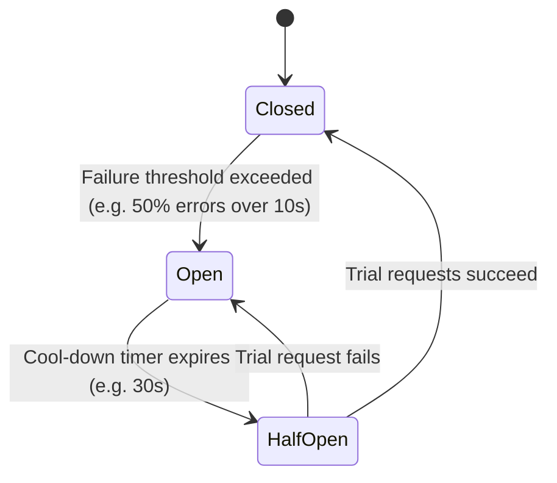

# Resilience Engineering & Error Handling Skill

## Overview
This skill guides the AI agent in implementing defensive resilience patterns that prevent cascading failures across distributed systems. It establishes clear distinctions between operational and programming errors, enforces strict deadline propagation, and stabilizes services under network volatility and high load.

---

## When to Use This Skill
- Calling third-party APIs or external microservices over the network.
- Preventing catastrophic cascading outages when downstream dependencies fail.
- Implementing rate limiting, retry policies, and circuit breakers.
- Structuring domain exception hierarchies and global error translation middleware.

---

## Input Context Required
1. System topology and dependencies from `03-system-architecture-design`.
2. SLA latency budgets and timeouts from `01-requirements-spec`.
3. Target resilience libraries (e.g., Cockatiel for TS, Resilience4j for Java, Polly for .NET, Tenacity for Python).

---

## Step-by-Step Execution Workflow

### Step 1: Error Categorization & Taxonomy
Differentiate errors strictly:
1. **Operational Errors (Expected & Handled)**:
   - Network timeouts, invalid user input, resource conflicts, rate limit exceeded.
   - *Action*: Handle gracefully, translate to domain exceptions, return user-friendly errors, retry if idempotent.
2. **Programmer Errors (Bugs)**:
   - Null reference, type mismatch, failed assertion, out-of-bounds index.
   - *Action*: Fail fast, log structured stack trace with correlation ID, notify alerts, do NOT retry.

### Step 2: The Exponential Backoff with Full Jitter Formula
Never retry at fixed intervals or with synchronized backoff, which causes thundering herds on recovering servers.
Use AWS Full Jitter:
$$\text{Sleep} = \text{random}(0, \min(M, B \times 2^{\text{attempt}}))$$
- $B$ = Base delay (e.g., 100ms)
- $M$ = Max delay cap (e.g., 5000ms)
- *Rules*: Only retry idempotent operations (`GET`, `PUT`, or mutations with `Idempotency-Key`). Never retry `4xx` client validation errors!

### Step 3: Circuit Breaker State Machine
Wrap unstable downstream integrations with a circuit breaker:

- **Closed**: Requests flow normally. Failures increment error counter.
- **Open**: Requests fail immediately with `CircuitBreakerOpenException` without hitting downstream service. Fallback executed.
- **Half-Open**: Allows limited canary requests through to test downstream health.

### Step 4: Bulkhead Pattern (Resource Isolation)
Isolate resource pools so that the failure of one non-critical integration does not consume all threads, database connections, or CPU:
- Separate HTTP client connection pools for critical (Payment) vs non-critical (Analytics).
- Isolate queue worker concurrency by task priority.

### Step 5: Rate Limiting & Throttling
Protect system capacity using the **Token Bucket** or **Sliding Window Counter** algorithm:
- Return HTTP `429 Too Many Requests`.
- Include rate limit headers:
  - `RateLimit-Limit`: Maximum requests per window.
  - `RateLimit-Remaining`: Remaining capacity.
  - `RateLimit-Reset`: UTC epoch seconds until quota refresh.
  - `Retry-After`: Seconds to wait before next attempt.

---

## Output Deliverables Template

Generate resilient integration wrapper:

```typescript
// Resilient HTTP Client with Timeout, Retry, and Circuit Breaker
import { CircuitBreakerPolicy, RetryPolicy, ConsecutiveBreaker, handleAll } from 'cockatiel';

export class ResilientPaymentClient {
  private retry = RetryPolicy.handleAll()
    .exponential({
      maxAttempts: 3,
      initialDelay: 200,
      maxDelay: 2000,
    });

  private breaker = CircuitBreakerPolicy.handleAll()
    .circuitBreaker(10_000, new ConsecutiveBreaker(5));

  async chargeCustomer(payload: ChargeRequest): Promise<ChargeResponse> {
    try {
      // Execute within combined retry + circuit breaker policy
      return await this.retry.execute(() =>
        this.breaker.execute(async () => {
          const controller = new AbortController();
          const timeout = setTimeout(() => controller.abort(), 3000); // Strict 3s timeout

          try {
            const res = await fetch('https://api.payments.com/v1/charges', {
              method: 'POST',
              headers: { 'Content-Type': 'application/json' },
              body: JSON.stringify(payload),
              signal: controller.signal,
            });

            if (!res.ok) throw new Error(`HTTP Error: ${res.status}`);
            return await res.json();
          } finally {
            clearTimeout(timeout);
          }
        })
      );
    } catch (error) {
      if (this.breaker.isOpen) {
        // Fallback: Queue for offline delayed settlement
        return this.fallbackOfflineQueue(payload);
      }
      throw new PaymentProcessingException('Payment processing unavailable', { cause: error });
    }
  }

  private fallbackOfflineQueue(payload: ChargeRequest): ChargeResponse {
    // Queue offline task & return pending status
    return { status: 'PENDING_OFFLINE', chargeId: null };
  }
}
```

---

## Quality Checklist & Guardrails
- [ ] Is every network call protected by a strict, non-zero timeout?
- [ ] Is exponential backoff enhanced with random jitter?
- [ ] Are retries restricted strictly to idempotent operations?
- [ ] Are circuit breakers deployed for all third-party external APIs?
- [ ] Are 4xx user errors separated from 5xx infrastructure failures?

---

## Companion Skills
- **Preceding Step**: `05-api-contract-design`.
- **Implementation**: `10-clean-architecture-and-solid`.
- **Observability**: `21-observability-and-telemetry`.
