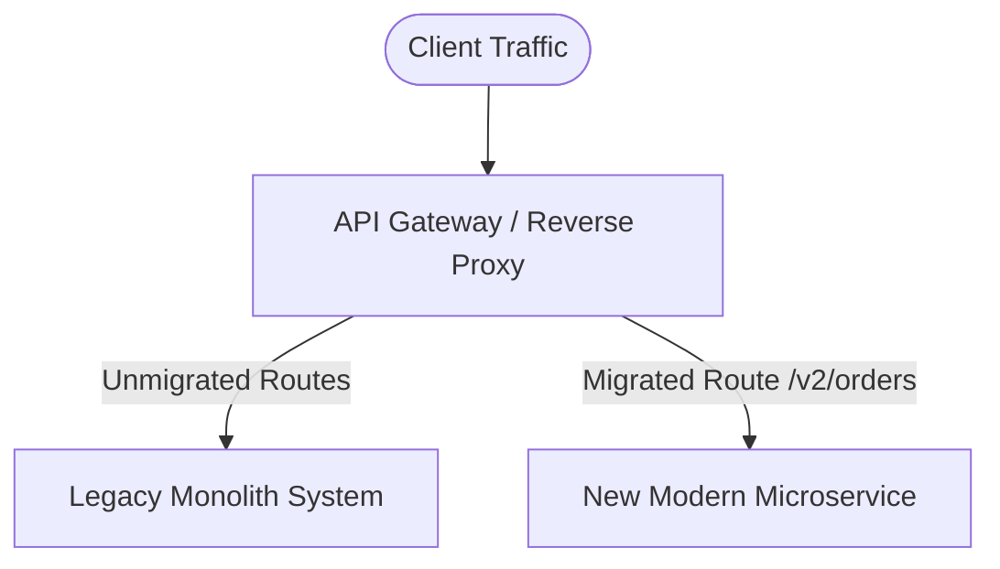

# Refactoring & Technical Debt Reduction Skill

## Overview
This skill guides the AI agent in transforming legacy, tangled, or brittle code into clean, modular, and maintainable software without altering external observable behavior. It establishes safety nets using characterization tests and applies disciplined refactoring patterns in micro-increments.

---

## When to Use This Skill
- Modernizing legacy codebases or paying down accumulated technical debt.
- Decomposing large monolithic functions ("Brain Methods") or bloated classes.
- Migrating monolithic subsystems using the Strangler Fig pattern.
- Preparing a codebase for a new feature (Kent Beck rule: *"Make the change easy, then make the easy change"*).

---

## Input Context Required
1. Code to be refactored and existing test coverage.
2. Target architecture guidelines from `10-clean-architecture-and-solid`.
3. Observed bugs, code smells, or high cyclomatic complexity scores.

---

## Step-by-Step Execution Workflow

### Step 1: The Two Hats Rule (Kent Beck Discipline)
When writing software, wear only one hat at a time:
- **Adding Feature Hat**: Add new capabilities, add new tests, make them pass. Do NOT restructure existing code.
- **Refactoring Hat**: Restructure code to improve readability and design. Do NOT add features or change observable behavior! Tests must stay green on every single commit.

### Step 2: Establish Safety Nets (Characterization Tests)
If the legacy code lacks tests, NEVER refactor blindly:
1. Write **Characterization Tests (Golden Master)**: Capture the *current* behavior of the system as-is, bugs and all.
2. Feed multiple inputs (happy path, edge cases, malformed data) and assert the current outputs.
3. Lock these tests down before touching a single line of production code.

### Step 3: Fowler's Core Refactoring Catalog
Apply micro-refactorings systematically:
- **Extract Method / Function**: Break 100-line methods into small, 5-15 line semantic functions with descriptive names.
- **Introduce Parameter Object**: Replace methods taking 5+ loose parameters with a dedicated typed interface or object.
- **Replace Conditional with Polymorphism**: Replace massive `switch (type)` statements with polymorphic strategy classes.
- **Decompose Conditional**: Extract complex boolean expressions into descriptive predicate methods:
  ```typescript
  // Before
  if (user.age >= 18 && user.country === 'US' && user.hasValidLicense && !user.isSuspended)
  // After
  if (this.isEligibleToDrive(user))
  ```
- **Replace Magic Numbers with Constants**: Replace raw literals (`86400`, `0.0825`) with named constants (`SECONDS_IN_A_DAY`, `STATE_SALES_TAX_RATE`).

### Step 4: Large-Scale Migration: The Strangler Fig Pattern
To replace a legacy monolithic service without a risky "big bang" rewrite:
1. Introduce an API Gateway or routing proxy in front of the legacy system.
2. Build the new capability as a modern microservice or modular component.
3. Route traffic for that specific route (e.g., `/api/v2/billing`) to the new service while proxying all other traffic to legacy.
4. Repeat until the legacy system has no remaining traffic and can be safely decommissioned.



### Step 5: Branch by Abstraction
When refactoring a core internal subsystem in-place:
1. Introduce an interface (abstraction) over the existing implementation.
2. Point all callers to the abstraction.
3. Create the new improved implementation of that abstraction.
4. Switch callers to the new implementation via a feature flag.
5. Delete the obsolete implementation.

---

## Output Deliverables Template

Generate refactoring plan & execution log:

```markdown
# Refactoring Plan: Extract Pricing Engine from OrderService

## Target Code Smell
- `OrderService.process()` has 380 lines and cyclomatic complexity of 24.
- Embedded discount rules, tax lookup, and currency conversions.

## Safety Protocol
- [x] Characterization test suite created in `tests/legacy/pricing.char.spec.ts` (18 scenarios).
- [x] Baseline test run: 100% passing.

## Step-by-Step Micro-Commits
1. **Commit 1**: Extract `calculateTax()` pure private method. Verify tests.
2. **Commit 2**: Extract `calculateDiscount()` pure private method. Verify tests.
3. **Commit 3**: Create `IPricingStrategy` interface and move calculations to `StandardPricingStrategy`.
4. **Commit 4**: Inject `IPricingStrategy` into `OrderService` constructor. Verify tests.
5. **Commit 5**: Remove dead legacy code. Run complete integration test suite.
```

---

## Quality Checklist & Guardrails
- [ ] Were characterization tests established before modifying legacy code?
- [ ] Does every micro-refactoring preserve green test status?
- [ ] Were behavioral changes strictly avoided during the refactoring session?
- [ ] Has cyclomatic complexity decreased significantly?
- [ ] Has dead or unreachable code been eliminated?

---

## Companion Skills
- **Preceding Step**: `18-code-review-and-audit`.
- **Target Architecture**: `10-clean-architecture-and-solid`.
- **Testing Guard**: `15-test-driven-development`.
