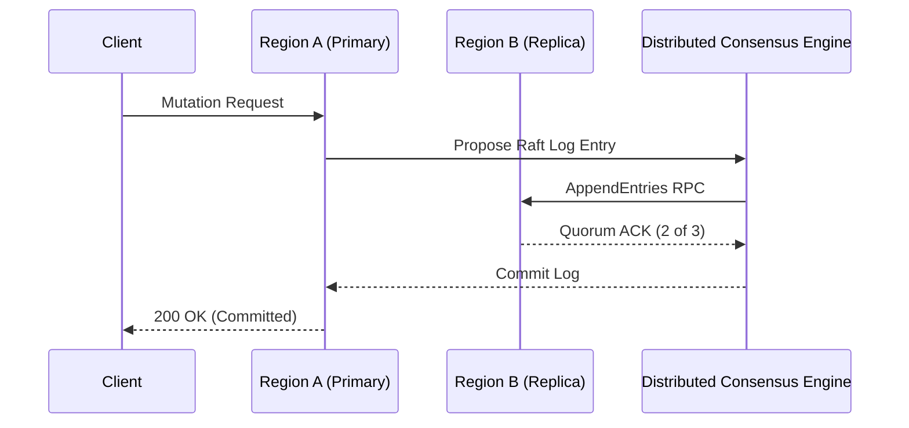

# Deep Technical Research & RFC Authoring Skill

## Overview
This skill guides the AI agent in operating as a Principal Research Engineer or Staff Architect. It provides a structured methodology to investigate complex, ambiguous technical domains, synthesize state-of-the-art whitepapers and open-source implementations, run empirical proof-of-concept (PoC) spikes, and author persuasive, highly structured Requests for Comments (RFCs).

---

## When to Use This Skill
- Investigating unfamiliar technologies, protocols, or algorithmic approaches for a new system.
- Synthesizing academic papers, industry benchmarks, or competitive technical implementations.
- Authoring an RFC to propose major architectural shifts, new infrastructure, or cross-cutting standards.
- Executing a time-boxed technical spike to eliminate "unknown unknowns" before sprint planning.

---

## Input Context Required
1. Problem statement or architectural dilemma (e.g., "Which distributed consensus protocol fits our multi-region replication need?").
2. Technical constraints: latency budgets, throughput, hardware/cloud boundaries, compliance mandates.
3. Target audience: Engineering team, Staff/Principal review committee, VP of Engineering.

---

## Step-by-Step Execution Workflow

### Step 1: Deep Research Scoping & Literature Review
1. **Clarify the Core Question**: Frame the inquiry with extreme specificity (e.g., not "How does Kafka work?", but "How does Kafka's Kraft consensus compare to Raft-based Redpanda for tail latency under 100k msg/sec?").
2. **Prior Art & Source Triangulation**:
   - Industry Engineering Blogs: Netflix, Uber, Meta, Stripe, Cloudflare, Figma architecture posts.
   - Academic & Whitepaper Literature: ACM, IEEE, USENIX, OSDI, arXiv systems papers.
   - GitHub Open Source Source Code: Inspecting actual implementations, issue trackers, and open PR discussions.
3. **Synthesis & Evidence Extraction**: Extract empirical benchmark numbers, known production edge cases, and operational pitfalls.

### Step 2: Time-Boxed Technical Spike (Proof of Concept)
Do not build full production code during research. Run a focused spike:
1. **Define Hypothesis**: *"Hypothesis: Vector search via pgvector on 1M 1536-dim embeddings achieves p95 query latency < 35ms on a 4-vCPU Postgres instance."*
2. **Time-Box**: Allocate strict time limit (e.g., 2 to 4 hours of agent prototyping).
3. **Minimal Test Harness**: Write scratch benchmark script to simulate real data distributions.
4. **Record Empirical Results**: Capture latency percentiles (p50, p95, p99), CPU/memory profiles, and failure modes.

### Step 3: Formal RFC Authoring (The Industry Standard)
Draft the proposal using the proven RFC structure (Uber / Rust RFC model):
1. **Title & Metadata**: RFC ID, Author, Sponsor, Date, Status (Draft, Under Review, Approved, Superseded).
2. **Executive Summary**: 1-paragraph summary of the problem, proposed solution, and primary outcome.
3. **Motivation & Business Drivers**: Why solve this now? What happens if we do nothing?
4. **Detailed Technical Design**: Architecture, data flow diagrams, APIs, state management, schema changes.
5. **Drawbacks & Risks**: Honest accounting of operational overhead, migration difficulty, or increased latency.
6. **Alternatives Considered**: Enumerate at least 2-3 viable alternatives and explain why they were rejected.
7. **Unresolved Questions**: Open unknowns to be decided during the review period.

### Step 4: RFC Review & Consensus Facilitation
Guide the review process:
- Categorize feedback into: Clarification, Minor Enhancement, Major Architectural Concern.
- Drive to consensus by proposing concrete compromises or benchmarking contested assumptions.

---

## Output Deliverables Template

Generate formal RFC file in `docs/rfcs/RFC-XXXX-[title].md`:

```markdown
# RFC-[NUMBER]: [Title - e.g., Multi-Region Active-Active Database Replication]

- **Status**: [Draft | In Review | Approved | Rejected]
- **Author(s)**: [Name / AI Principal Engineer]
- **Reviewers**: [Staff Engineers, Tech Leads]
- **Target Implementation Date**: QX 202X

## 1. Summary
[A concise 3-5 sentence elevator pitch explaining what is proposed and the immediate benefit.]

## 2. Motivation & Problem Statement
- **Current State**: [Describe pain points, latency bottlenecks, or scaling limits.]
- **Impact of Inaction**: [e.g., At current 25% MoM growth, primary database IOPS will saturate in 4 months.]
- **Expected Outcomes**: [e.g., Global p99 read latency reduced from 650ms to <40ms.]

## 3. Prior Art & Research Findings
- **Academic / Industry Precedents**: [e.g., Google Spanner TrueTime vs CockroachDB Hybrid Logical Clocks.]
- **Empirical Spike Benchmark**:
  - *Harness*: 50,000 synthetic mutations/sec across 3 simulated cloud regions.
  - *Result*: Average cross-region consensus latency: 38ms (within 50ms SLA).

## 4. Proposed Technical Design


### Detailed Component Changes
- **Data Storage**: [Schema alterations, partition keys, conflict resolution policies]
- **API Changes**: [Header propagation, idempotency token handling]

## 5. Drawbacks & Trade-Offs
- Operational complexity of managing multi-region network partitions.
- Eventual consistency lag on secondary reporting views (up to 200ms).

## 6. Alternatives Considered
| Alternative | Reason for Rejection |
| :--- | :--- |
| **Option A: Pure Async Read Replicas** | High risk of dirty reads immediately after write; violates financial audit rules. |
| **Option B: Third-Party Managed SaaS** | Annual cost exceeds $180k; strict GDPR data sovereignty violations. |

## 7. Migration & Rollout Plan
- **Phase 1**: Dual-write shadow testing without serving client reads (2 weeks).
- **Phase 2**: Internal employee canary routing (1 week).
- **Phase 3**: 10% -> 50% -> 100% customer traffic ramp.

## 8. Unresolved Questions
- [ ] What is the exact fallback behavior during an Atlantic fiber submarine cable cut?
```

---

## Quality Checklist & Guardrails
- [ ] Is the research backed by real-world benchmarks or authoritative documentation?
- [ ] Does the RFC evaluate at least two genuine alternatives (avoiding straw-man comparisons)?
- [ ] Are migration and rollback strategies documented alongside the happy path?
- [ ] Are failure modes, partition behaviors, and operational overhead transparently addressed?

---

## Companion Skills
- **Preceding Thought**: `24-principal-systems-thinking`.
- **Downstream Architecture**: `03-system-architecture-design` and `04-architecture-decision-records`.
