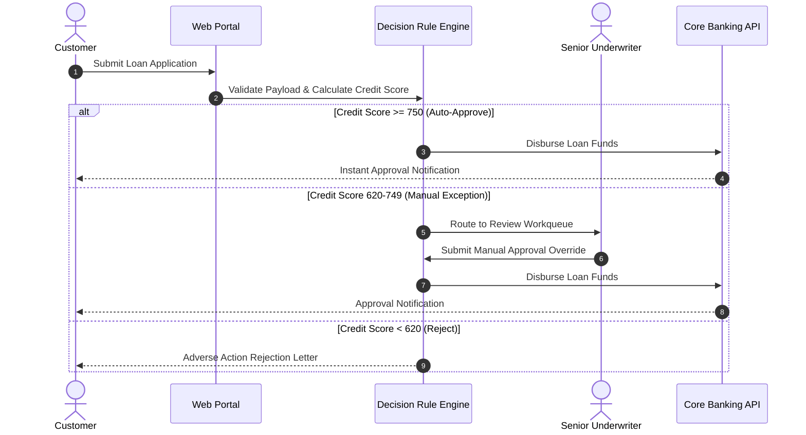

# Business Analysis & BPMN Process Modeling Skill

## Overview
This skill guides the AI agent in acting as a Lead Business Analyst (CBAP / BABOK). It translates complex organizational workflows, operational bottlenecks, and business policies into rigorous visual process models (BPMN 2.0), stakeholder governance frameworks (RACI), and value stream analyses that form the foundation for software system automation.

---

## When to Use This Skill
- Deconstructing manual, paper-based, or legacy enterprise business workflows.
- Mapping end-to-end multi-departmental business processes across swimlanes.
- Conducting Gap Analysis between current operational realities (AS-IS) and future automated systems (TO-BE).
- Documenting complex business rules and decision logic matrices for developers.

---

## Input Context Required
1. Organizational actors, departments, and customer journey touchpoints.
2. High-level business problem or inefficiency (e.g., "Loan approvals take 14 days and involve 4 manual spreadsheets").
3. Regulatory constraints, approval hierarchies, and compliance requirements.

---

## Step-by-Step Execution Workflow

### Step 1: Stakeholder Identification & RACI Governance
Define roles and decision rights:
- **R - Responsible**: The "doer" who executes the task or activity.
- **A - Accountable**: The single person with final veto/decision authority (only ONE 'A' per activity!).
- **C - Consulted**: Subject Matter Experts (SMEs) providing two-way input before the decision.
- **I - Informed**: Stakeholders updated on progress/outcomes via one-way communication.

### Step 2: AS-IS Process Mapping (The Current Reality)
Document the current workflow honestly without idealizing it:
1. Identify all handoffs between departments or spreadsheets (handoffs are where 80% of errors occur).
2. Measure **Lead Time** (total elapsed clock time from request to fulfillment) vs. **Process Time** (actual hands-on work time).
3. Compute **Process Cycle Efficiency (PCE)**:
   $$\text{PCE} = \frac{\text{Value-Added Processing Time}}{\text{Total Elapsed Lead Time}} \times 100\%$$
   *(In inefficient enterprise processes, PCE is frequently < 5%).*

### Step 3: BPMN 2.0 TO-BE Workflow Architecture
Design the optimized, automated future state using standard BPMN 2.0 elements:
- **Pools & Swimlanes**: Separate pools for external entities (Customer); swimlanes for internal actors (Sales, Underwriting, Core Engine).
- **Events**: Start Event (circle), Intermediate Timer/Message Event (double circle), End Event (thick circle).
- **Activities / Tasks**: User Tasks (manual human action), Service Tasks (automated software execution).
- **Gateways**:
  - Exclusive (`XOR`): Exactly one path taken based on condition.
  - Parallel (`AND`): All outgoing paths executed concurrently.
  - Inclusive (`OR`): One or more paths taken based on matching conditions.

### Step 4: Gap Analysis (People, Process, Technology)
Structure the transformation delta across three pillars:
| Domain | Current State (AS-IS) | Future State (TO-BE) | Gap / Action Required |
| :--- | :--- | :--- | :--- |
| **Process** | Manual email approval loop | Automated rule-engine triage | Implement BPMN service workflow |
| **Technology** | Disconnected Excel sheets | Centralized PostgreSQL DB | Migrate data models; build API |
| **People** | Manual data entry clerks | Exception handling specialists | Upskilling and operational runbooks |

### Step 5: Business Decision Rule Matrices (DMN)
Extract opaque `if-else` business rules into explicit decision tables:
| Rule # | Customer Tier | Credit Score | Loan Amount | Decision | Approval Authority |
| :---: | :--- | :--- | :--- | :--- | :--- |
| 1 | Premier | > 750 | <= $250,000 | **Auto-Approve** | Automated Engine |
| 2 | Standard | 650 - 750 | <= $100,000 | **Auto-Approve** | Automated Engine |
| 3 | Any | < 620 | Any | **Auto-Reject** | Automated Engine |
| 4 | Any | 620 - 750 | > $100,000 | **Manual Review** | Senior Underwriter |

---

## Output Deliverables Template

Generate Business Process Blueprint in `docs/business-analysis/process-[name].md`:

```markdown
# Business Process Specification: Commercial Loan Origination

## 1. Stakeholder RACI Matrix
| Activity / Milestone | Customer | Loan Officer | Risk Underwriter | Tech Lead | VP Credit (Sponsor) |
| :--- | :---: | :---: | :---: | :---: | :---: |
| Submit Loan Application | R | I | I | I | I |
| Verify KYC & Documents | I | R | C | I | A |
| Risk Score Evaluation | I | I | R | C | A |
| Final Approval Sign-off | I | I | C | I | A |

## 2. BPMN 2.0 TO-BE Workflow (Mermaid)


## 3. Value Stream Metrics
- **Current AS-IS Lead Time**: 11 business days (PCE = 3.2%).
- **Target TO-BE Lead Time**: < 15 minutes for 75% auto-approved applications; < 24 hours for exceptions (Target PCE > 65%).
```

---

## Quality Checklist & Guardrails
- [ ] Is there exactly one Accountable ('A') owner assigned per activity in the RACI matrix?
- [ ] Are BPMN decision gateways explicit with mutually exclusive conditions?
- [ ] Are Lead Time and Processing Time quantified with empirical baselines?
- [ ] Have business policy rules been extracted into standalone decision tables?
- [ ] Does the TO-BE model eliminate redundant manual data handoffs?

---

## Companion Skills
- **Requirements Formulation**: Feeds directly into `01-requirements-spec`.
- **Domain Modeling**: Connects to `02-domain-driven-design`.
- **Org Alignment**: `31-team-topologies-and-org-design`.
