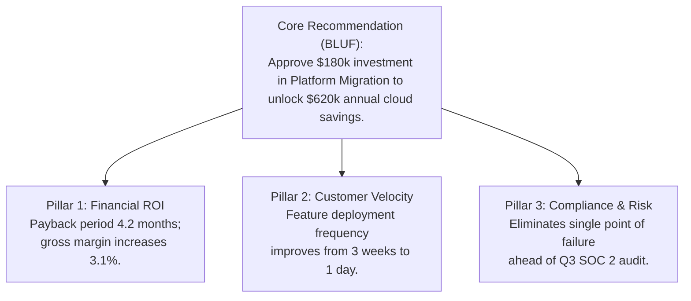

# Executive Stakeholder Communication & Technical Leadership Skill

## Overview
This skill guides the AI agent in operating as a Technical Chief of Staff, VP of Engineering, or Chief Technology Officer (CTO). It masters the art of executive communication by translating deep technical architecture, technical debt refactoring, and infrastructure investments into the universal language of business: revenue growth, operating margin, risk mitigation, and strategic speed.

---

## When to Use This Skill
- Pitching major technical investments (e.g., cloud migration, architecture rewrite, platform build) to the C-suite or Board.
- Authoring 1-page executive decision memos (BLUF format).
- Delivering Steering Committee project updates with Red/Amber/Green (RAG) governance.
- Translating complex technical postmortems or risks into executive-friendly business impact summaries.

---

## Input Context Required
1. Technical initiative details, architectural proposals, or incident reports from preceding skills.
2. Target executive audience (CEO, CFO, Board of Directors, Steering Committee).
3. Financial costs, headcount requirements, and business ROI timeline.

---

## Step-by-Step Execution Workflow

### Step 1: The Minto Pyramid Principle (Lead with the Answer)
Never present to executives using the chronological "mystery novel" structure where the conclusion is hidden on the final slide.
Follow the **Minto Pyramid**:
1. **Answer First (The Top of the Pyramid)**: State the core recommendation and dollar impact in the first 30 seconds.
2. **Supporting Pillars (3 Key Arguments)**: Group evidence into MECE categories (Mutually Exclusive, Collectively Exhaustive).
3. **Data & Technical Details (The Base)**: Kept in the appendix, brought out only if questioned.



### Step 2: The SCQA Framework for Business Framing
Frame every proposal using the proven narrative sequence:
- **S - Situation**: Establish agreed-upon current context (e.g., *"Our customer base doubled to 500k active users this year."*)
- **C - Complication**: The business friction or bottleneck that threatens success (e.g., *"Our core database latency has tripled, causing 8% checkout drop-off and costing ~$45,000/month in lost sales."*)
- **Q - Question**: The natural strategic question (e.g., *"How do we scale checkout throughput before Black Friday?"*)
- **A - Answer**: Your definitive, well-researched proposal.

### Step 3: Translating Technical Jargon to Executive Currency
Always bridge the vocabulary gap:
| What Engineers Say (Jargon) | What Executives Hear (Confusion) | What You MUST Say (Business Value) |
| :--- | :--- | :--- |
| "We need to decouple this into microservices." | "Engineers want to play with new toys." | "We need to allow independent team deployments so we can ship marketing features in 2 days instead of 3 weeks." |
| "The technical debt in our codebase is terrible." | "You wrote bad code; why pay twice?" | "Legacy dependencies are slowing down engineer delivery by 40%, costing us ~$350,000/year in lost developer productivity." |
| "We have event loop starvation and high thread contention." | "Meaningless technical noise." | "Under peak load, 12 out of 100 customers experience frozen checkout screens, directly depressing Q4 revenue." |

### Step 4: Steering Committee RAG Status Reporting
Enforce rigorous, honest traffic light status:
- **🟢 Green**: On track for scope, budget, and timeline. No executive intervention needed.
- **🟡 Amber**: Milestones at risk due to emerging friction. Team has a mitigation plan; executive awareness requested.
- **🔴 Red**: Milestone will be missed or budget exceeded **unless executive intervenes right now** (e.g., unblocking vendor legal review, resolving cross-departmental staffing dispute). Always pair RED with an explicit decision request!

---

## Output Deliverables Template

Generate 1-Page Executive Memo in `docs/executive/memo-[title].md`:

```markdown
# Executive Decision Memo: Core Platform Modernization Investment

- **To**: Executive Committee (CEO, CFO, CTO)
- **From**: Principal Architecture Lead / VP Engineering
- **Date**: YYYY-MM-DD
- **Decision Requested**: Approval for $150,000 capital expenditure over Q3 for Core Platform Modernization.

---

### Executive Summary (BLUF - Bottom Line Up Front)
We recommend migrating our legacy billing and checkout engine to an event-driven architecture over a 12-week sprint. This investment will:
1. **Increase Annual Gross Profit by $420,000** through reduced transaction failures and lower cloud hosting fees.
2. **Accelerate Time-to-Market by 5x**, allowing new partner payment integrations to launch in 4 days rather than 3 weeks.
3. **Achieve Full Payback within 4.3 months** with an estimated 3-year ROI of 280%.

---

### Key Business Arguments (MECE)

#### 1. Financial Returns & Cloud Economics
- Eliminates $22,000/month in third-party legacy licensing and over-provisioned database compute.
- Recovers an estimated $13,000/month in abandoned carts currently caused by 3+ second payment processing latency.

#### 2. Competitive Agility & Team Velocity
- Today, our 25 engineers spend 32% of their sprint bandwidth maintaining legacy billing workarounds.
- Decoupling the engine reclaims ~400 engineering hours/month, accelerating our 2027 enterprise roadmap delivery.

#### 3. Risk Mitigation & Compliance
- The current monolithic engine violates SOC 2 separation-of-duties mandates. This initiative natively isolates credit card PII into a zero-trust compliance boundary, securing our enterprise customer pipeline.

---

### Investment & Resource Plan
| Phase | Duration | Capital Required | Headcount Allocation |
| :--- | :--- | :--- | :--- |
| **Phase 1: Architecture & Spike** | Weeks 1-3 | $25,000 | 2 Senior Engineers |
| **Phase 2: Migration & Dual Run** | Weeks 4-9 | $95,000 | 4 Engineers + 1 QA |
| **Phase 3: Cutover & Decommission** | Weeks 10-12 | $30,000 | 2 Engineers + 1 DevOps |
| **Total** | **12 Weeks** | **$150,000** | **Net Zero New Hires** |

---

### What Happens If We Do Nothing?
Maintaining the status quo will cause checkout failure rates to escalate from 2.1% to an estimated 6.5% during peak holiday volume, exposing the company to ~$180k in direct revenue loss and jeopardizing two enterprise customer renewals.
```

---

## Quality Checklist & Guardrails
- [ ] Is the document structured with the conclusion and ROI stated in the very first paragraph (BLUF)?
- [ ] Is all technical jargon translated into financial and business metrics (revenue, margin, speed, risk)?
- [ ] Is every RAG "Red" status accompanied by a clear executive decision request?
- [ ] Are proposals framed using the SCQA narrative structure?
- [ ] Is the cost of inaction clearly articulated alongside the investment cost?

---

## Companion Skills
- **Financial Modeling**: `29-cloud-economics-and-finops`.
- **Product Alignment**: `27-product-strategy-and-market-research`.
- **Architecture Validation**: `03-system-architecture-design`.
