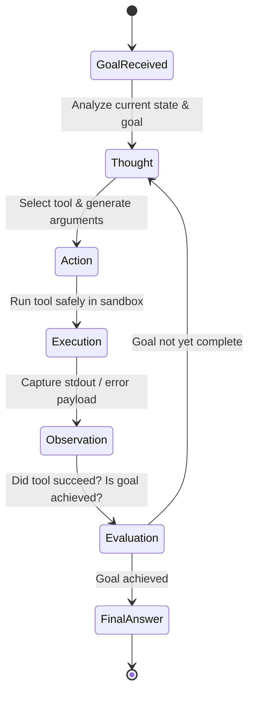

# Autonomous AI Agent Design & Tool Calling Skill

## Overview
This skill guides the AI agent in architecting autonomous AI agents and collaborative multi-agent systems. It moves beyond single-prompt completions by establishing recursive execution loops (ReAct), typed tool/function calling with self-healing error recovery, hierarchical multi-agent delegation, and safety guardrails against runaway execution.

---

## When to Use This Skill
- Designing autonomous workflows where an AI model reasons, calls APIs, inspects results, and iterates.
- Implementing tool-calling schemas with strict JSON Schema parameter validation.
- Structuring multi-agent systems with specialized personas (e.g., Architect, Coder, Reviewer).
- Managing multi-tier agent memory across working scratchpads and vector retrieval.

---

## Input Context Required
1. High-level goal and available environmental tools (APIs, database clients, bash shells, web search).
2. Boundary constraints: Maximum iterations, maximum budget/tokens, execution timeouts.
3. Criticality tier: Does the agent execute reversible read operations or high-risk mutations (deleting data, spending funds)?

---

## Step-by-Step Execution Workflow

### Step 1: The ReAct Reasoning Loop (Reason + Act)
Enforce the fundamental agentic cycle:

- **Thought**: The agent articulates its internal reasoning before taking action.
- **Action**: The agent produces a typed JSON tool call.
- **Observation**: The execution harness returns the concrete result (or error).
- **Self-Healing Loop**: If a tool returns an error (e.g., `SyntaxError` or `HTTP 404`), the error is fed directly back into the conversation context so the agent can self-correct on the next iteration.

### Step 2: Tool Specification & Typed JSON Schema
Never pass vague tool descriptions. Define strict JSON Schemas with explicit argument constraints:
```json
{
  "name": "execute_database_query",
  "description": "Executes a read-only SQL query against the customer database. Rejects write mutations.",
  "parameters": {
    "type": "object",
    "properties": {
      "query": {
        "type": "string",
        "description": "SQL SELECT query to execute"
      },
      "max_rows": {
        "type": "integer",
        "description": "Maximum number of rows to return (1-500)",
        "default": 50
      }
    },
    "required": ["query"]
  }
}
```

### Step 3: Multi-Tier Agent Memory Architecture
Separate memory into three operational tiers:
1. **Working Memory (Short-Term Scratchpad)**:
   - Current conversation window, recent tool outputs, and active plan checklist.
2. **Episodic Memory (Experience & History)**:
   - Vector database storing transcripts of past completed tasks, enabling the agent to recall: *"How did we resolve this specific deployment failure last week?"*
3. **Semantic Memory (Core Knowledge & Rules)**:
   - System prompt instructions, domain ontology, and architectural standards (`SKILL.md` files).

### Step 4: Multi-Agent Orchestration Patterns
Select the orchestration topology matching task complexity:
- **Hierarchical (Supervisor & Workers)**: A primary planner agent breaks the user goal into a task DAG and dispatches subtasks to specialized worker agents (e.g., Research Agent, Code Generator Agent, QA Agent). The supervisor evaluates worker outputs and enforces quality gates.
- **Sequential Pipeline**: Output of Agent A becomes input to Agent B (e.g., PRD Generator -> Tech Spec Writer -> Test Writer).
- **Debate / Pair Programming**: Two agents with opposing instructions (e.g., Author vs. Auditor) critique and refine artifacts iteratively.

### Step 5: Safety Guardrails & Human-in-the-Loop (HITL)
Prevent catastrophic accidents and runaway loops:
- **Maximum Step Cap**: Enforce hard limit (e.g., max 15 tool iterations per invocation). If exceeded, pause and request guidance.
- **Destructive Action Intercept (HITL)**:
  - Classify tools into **Safe** (`view_file`, `grep_search`, `read_api`) and **Potentially Destructive** (`delete_record`, `deploy_service`, `execute_payment`).
  - Require explicit interactive user confirmation before executing any destructive action!

---

## Output Deliverables Template

Generate production Agent Runner loop snippet:

```typescript
// Autonomous ReAct Agent Loop with Guardrails and Error Recovery
export class AutonomousAgent {
  private maxIterations = 10;
  private messageHistory: Message[] = [];

  constructor(
    private readonly systemPrompt: string,
    private readonly tools: Record<string, ToolDefinition>,
    private readonly llmClient: LLMClient
  ) {}

  async run(userGoal: string): Promise<string> {
    this.messageHistory = [
      { role: 'system', content: this.systemPrompt },
      { role: 'user', content: userGoal },
    ];

    let iteration = 0;

    while (iteration < this.maxIterations) {
      iteration++;

      // 1. Invoke LLM with available tool schemas
      const response = await this.llmClient.complete({
        messages: this.messageHistory,
        tools: Object.values(this.tools).map((t) => t.schema),
      });

      this.messageHistory.push(response.message);

      // 2. Check if agent finished without tool calls
      if (!response.toolCalls || response.toolCalls.length === 0) {
        return response.message.content || 'Task completed.';
      }

      // 3. Execute tool calls safely
      for (const call of response.toolCalls) {
        const tool = this.tools[call.function.name];

        if (!tool) {
          this.messageHistory.push({
            role: 'tool',
            tool_call_id: call.id,
            content: `Error: Tool '${call.function.name}' does not exist.`,
          });
          continue;
        }

        // Check for Human-in-the-Loop authorization on mutating actions
        if (tool.isDestructive) {
          const approved = await requestUserApproval(call.function.name, call.function.arguments);
          if (!approved) {
            this.messageHistory.push({
              role: 'tool',
              tool_call_id: call.id,
              content: 'Execution cancelled: User declined permission for this action.',
            });
            continue;
          }
        }

        try {
          const args = JSON.parse(call.function.arguments);
          const result = await tool.execute(args);
          this.messageHistory.push({
            role: 'tool',
            tool_call_id: call.id,
            content: JSON.stringify(result),
          });
        } catch (error: any) {
          // Self-healing: Feed error back to agent to self-correct
          this.messageHistory.push({
            role: 'tool',
            tool_call_id: call.id,
            content: `Tool Execution Error: ${error.message}. Please adjust parameters and retry.`,
          });
        }
      }
    }

    throw new Error(`Agent exceeded maximum step limit of ${this.maxIterations} iterations.`);
  }
}
```

---

## Quality Checklist & Guardrails
- [ ] Are tool parameters defined with strict JSON Schemas and types?
- [ ] Is an iteration ceiling enforced to prevent infinite execution loops?
- [ ] Are tool execution errors returned into the prompt context for self-healing?
- [ ] Are destructive actions protected by Human-in-the-Loop approval gates?
- [ ] Is working memory summarized or truncated when approaching token limits?

---

## Companion Skills
- **Knowledge Retrieval**: `33-llm-and-rag-system-architecture`.
- **System Thinking**: `24-principal-systems-thinking`.
- **Resilience**: `12-resilience-and-error-handling`.
