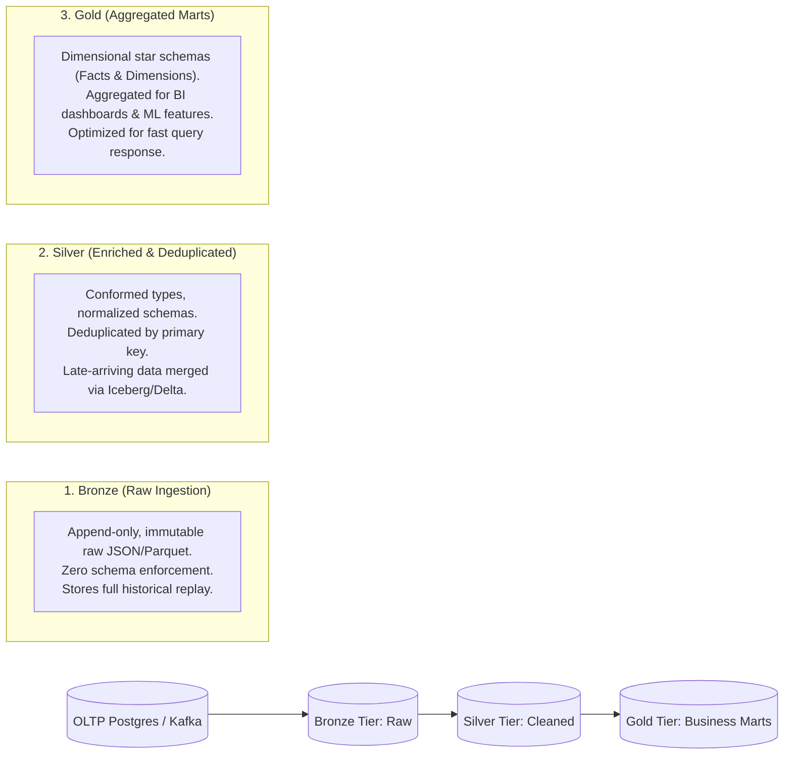

# Data Pipeline & Streaming Architecture Skill

## Overview
This skill guides the AI agent in engineering robust, scalable data platforms and analytical data pipelines. It bridges operational transactional systems (OLTP) and analytical warehouses/lakehouses (OLAP) using the Medallion Architecture, ensures schema stability via formal Data Contracts, and enforces data quality and idempotent processing across both batch and real-time streaming engines.

---

## When to Use This Skill
- Designing a centralized analytics data platform, modern data stack, or streaming pipeline.
- Implementing the Medallion Lakehouse architecture (Bronze, Silver, Gold tiers).
- Transitioning from slow batch ETL to real-time event stream processing (Kafka, Flink, Spark).
- Defining formal Data Contracts between software microservices and data engineering teams.

---

## Input Context Required
1. Upstream data sources (PostgreSQL CDC via Debezium, application event streams, third-party webhook feeds).
2. Latency requirements (real-time sub-second, hourly micro-batch, or daily batch).
3. Target analytical storage (Snowflake, BigQuery, Databricks, ClickHouse, Apache Iceberg on S3).

---

## Step-by-Step Execution Workflow

### Step 1: The Medallion Lakehouse Architecture
Structure data flow into three strictly decoupled quality layers:


### Step 2: Streaming Stream-Table Duality & Watermarks
When processing continuous events (e.g., Apache Flink or Kafka Streams):
1. **Event Time vs. Processing Time**:
   - Always process based on **Event Time** (when the user actually took the action in UTC), NOT Processing Time (when the server received it).
2. **Watermarking & Late-Arriving Data**:
   - Set an explicit bounded out-of-orderness watermark (e.g., allow up to 10 minutes of late data):
     `Watermark = MaxEventTime - 10 minutes`.
   - Events arriving beyond the watermark are routed to a late-events dead-letter side output.
3. **Idempotent Upserts**:
   - Merge incoming micro-batches using Iceberg / Delta Lake `MERGE INTO` operations matching on `(entity_id, updated_at)`.

### Step 3: Formal Data Contracts (Producer-Consumer Decoupling)
Never let software engineers change a database column name and silently break 40 downstream dashboards!
Enforce a formal **Data Contract** before emitting events:
- Specifies exact field names, data types, nullability, semantic definitions, and SLA freshness.
- Validated via CI/CD before breaking schema changes can be deployed.

### Step 4: Analytical Data Modeling with dbt (Data Build Tool)
Organize SQL transformations modularly:
- **Staging models (`stg_`)**: 1-to-1 view on Bronze tables with basic type casting and column renaming.
- **Intermediate models (`int_`)**: Join related entities and calculate business domain logic.
- **Marts (`fct_`, `dim_`)**: Final Star Schema tables optimized for query speed (e.g., `fct_orders`, `dim_customers`).

### Step 5: Automated Data Quality Testing (Great Expectations / Soda)
Embed automated quality assertions into the pipeline:
- **Freshness**: Alert if no new records ingested within last 60 minutes.
- **Uniqueness**: Primary keys in Silver and Gold must be strictly unique.
- **Volume Anomalies**: Alert if row count drops by >20% compared to typical day-of-week baseline.
- **Referential Integrity**: Every `order.customer_id` must exist in `dim_customers`.

---

## Output Deliverables Template

### 1. Data Contract Specification (`contracts/orders-contract.yaml`)
```yaml
contract_version: "1.0.0"
dataset: "com.enterprise.analytics.orders"
owner: "checkout-stream-team"
freshness_sla: "15 minutes"

schema:
  - name: order_id
    type: string
    format: uuid
    nullable: false
    description: "Unique synthetic identifier for the order."
  - name: customer_id
    type: string
    format: uuid
    nullable: false
  - name: order_status
    type: string
    allowed_values: ["PENDING", "COMPLETED", "CANCELLED", "REFUNDED"]
  - name: total_amount_cents
    type: integer
    minimum: 0
    nullable: false
  - name: order_timestamp_utc
    type: timestamp
    nullable: false
```

### 2. dbt Staging Model (`models/staging/stg_orders.sql`)
```sql
-- Staging layer: Pure cleaning and type casting from raw bronze table
with raw_source as (
    select * from {{ source('bronze_lakehouse', 'raw_orders_stream') }}
),

cleaned as (
    select
        id::text as order_id,
        customer_id::text as customer_id,
        upper(status) as order_status,
        (amount * 100)::bigint as total_amount_cents,
        timezone('UTC', created_at) as order_timestamp_utc,
        _ingested_at as ingested_at
    from raw_source
    where id is not null
)

select * from cleaned
```

---

## Quality Checklist & Guardrails
- [ ] Is raw ingestion append-only in the Bronze layer without destructive overwrites?
- [ ] Are stream processing calculations anchored in Event Time rather than server Processing Time?
- [ ] Are Data Contracts agreed upon and enforced via CI schema checks?
- [ ] Are downstream analytical models structured into Fact and Dimension tables (Star Schema)?
- [ ] Are automated data tests (freshness, null checks, uniqueness) run prior to promoting data?

---

## Companion Skills
- **Upstream Events**: `06-event-and-messaging-design`.
- **Database Modeling**: `07-database-modeling-and-migrations`.
- **Data Analytics**: `28-data-analytics-and-experimentation`.
