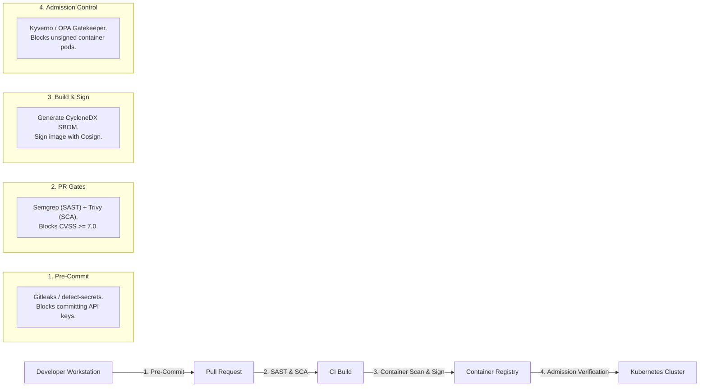

# DevSecOps & Software Supply Chain Security Skill

## Overview
This skill guides the AI agent in acting as a DevSecOps Lead and Application Security Architect. It shifts security leftward by embedding automated static analysis (SAST), secret scanning, Software Composition Analysis (SCA), and Software Bill of Materials (SBOM) generation directly into pull requests and CI/CD pipelines, securing against supply chain poisoning attacks.

---

## When to Use This Skill
- Integrating automated security gates into GitHub Actions or GitLab CI pipelines.
- Auditing container images and codebases for CVE vulnerabilities using Trivy and Semgrep.
- Generating and publishing a cryptographically verified Software Bill of Materials (SBOM).
- Signing container images using Sigstore / Cosign and enforcing admission control in Kubernetes.

---

## Input Context Required
1. CI/CD pipeline definition and programming languages from `20-containerization-and-devops`.
2. Target container registry and Kubernetes admission controller.
3. Vulnerability remediation SLA targets (CVSS scoring).

---

## Step-by-Step Execution Workflow

### Step 1: The Shift-Left Security Pipeline Stages
Embed security checks progressively from developer workstation to production deployment:


### Step 2: Static Application Security Testing (SAST with Semgrep)
Run lightweight, semantic AST rules on every pull request to catch logic and injection vulnerabilities:
- Catch SQL injection, unsanitized HTML sinks, hardcoded credentials, and insecure cryptographic ciphers.
- Block PR merge if a `CRITICAL` or `HIGH` rule is violated.

### Step 3: Container Vulnerability Scanning (Trivy)
Scan production container base images for OS package vulnerabilities:
- Reject images with unpatched Critical vulnerabilities.
- Run automated daily registry scans for newly published zero-day CVEs.

### Step 4: Software Bill of Materials (SBOM) Generation
Generate machine-readable inventory of all dependencies, licenses, and packages:
- Use **CycloneDX** or **SPDX** standard format.
- Attach SBOM to container image as an attestation layer in OCI registries.

### Step 5: Cryptographic Container Signing (Cosign / Sigstore)
Ensure only artifacts built by your official CI pipeline can ever run in production:
1. CI job builds Docker image.
2. Cosign signs the image hash using GitHub OIDC identity (keyless signing).
3. Kubernetes admission controller (Kyverno or OPA Gatekeeper) inspects signature:
   - If signed by official CI identity $\implies$ Pod scheduled.
   - If signature missing or forged $\implies$ Pod execution rejected!

---

## Output Deliverables Template

Generate hardened DevSecOps GitHub Actions Workflow (`.github/workflows/security-scan.yml`):

```yaml
name: DevSecOps Pipeline

on:
  push:
    branches: [main]
  pull_request:
    branches: [main]

jobs:
  sast-scan:
    name: Semgrep SAST Scan
    runs-on: ubuntu-latest
    steps:
      - uses: actions/checkout@v4
      - uses: returntocorp/semgrep-action@v1
        with:
          config: >-
            p/security-audit
            p/secrets
            p/owasp-top-ten
        env:
          SEMGREP_RULES: --error

  container-and-sbom:
    name: Build, Scan & Sign Container
    needs: [sast-scan]
    runs-on: ubuntu-latest
    permissions:
      contents: read
      packages: write
      id-token: write # Required for Cosign keyless OIDC signing

    steps:
      - uses: actions/checkout@v4

      - name: Build Local Container
        run: docker build -t app:scan .

      - name: Trivy Vulnerability Scan
        uses: aquasecurity/trivy-action@master
        with:
          image-ref: 'app:scan'
          format: 'table'
          exit-code: '1' # Fail CI if Critical CVE exists
          ignore-unfixed: true
          severity: 'CRITICAL,HIGH'

      - name: Generate CycloneDX SBOM
        uses: CycloneDX/gh-node-module-generatebom@v1
        with:
          output: 'bom.json'

      - name: Install Cosign
        uses: sigstore/cosign-installer@v3

      - name: Sign Container Image (Keyless)
        run: |
          cosign sign --yes ghcr.io/${{ github.repository }}:sha-${{ github.sha }}
```

---

## Quality Checklist & Guardrails
- [ ] Is pre-commit secret scanning (Gitleaks) active to prevent accidental API key leaks?
- [ ] Does CI fail automatically if unpatched Critical CVEs are detected?
- [ ] Is a CycloneDX or SPDX SBOM generated for every release artifact?
- [ ] Are container images cryptographically signed with Cosign before deployment?
- [ ] Does Kubernetes admission control enforce signature verification for running pods?

---

## Companion Skills
- **Threat Modeling**: `09-security-and-threat-modeling`.
- **Container Builds**: `20-containerization-and-devops`.
- **Compliance Audits**: `30-compliance-governance-and-risk`.
