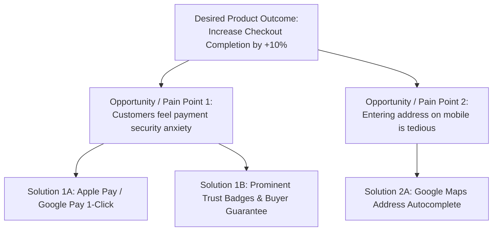

# User Research & Usability Testing (UXR) Skill

## Overview
This skill guides the AI agent in operating as a Lead UX Researcher and Product Designer. It ensures software systems solve genuine, validated human problems rather than fabricated requirements. It eliminates confirmation bias during customer discovery using "The Mom Test", structures continuous discovery habits, and evaluates prototypes empirically using Think-Aloud usability protocols and the System Usability Scale (SUS).

---

## When to Use This Skill
- Validating problem statements and customer pain points before writing PRDs or code.
- Conducting customer discovery interviews without asking leading or biased questions.
- Testing user interface prototypes or workflows for usability friction and drop-offs.
- Benchmarking software usability quantitatively using the System Usability Scale (SUS).

---

## Input Context Required
1. Target user personas, customer segment, and assumed value proposition from `27-product-strategy-and-market-research`.
2. Core workflows under evaluation (e.g., onboarding, checkout, search filters).
3. Prototype or interface under test (wireframes, staging UI, or live feature).

---

## Step-by-Step Execution Workflow

### Step 1: Customer Discovery Interviewing (The Mom Test Framework)
Never ask customers: *"Would you buy a product that does X?"* People will lie to be polite!
Follow Rob Fitzpatrick's **The Mom Test** rules:
1. **Rule 1: Talk about their life instead of your idea.**
   - *Bad*: "Do you think our AI-powered automated spreadsheet tool is cool?"
   - *Good*: "Walk me through how you updated your financial forecast last Monday. What took the most time?"
2. **Rule 2: Ask about specific instances in the past, never hypothetical futures.**
   - *Bad*: "How much would you pay for an automated reporting tool?"
   - *Good*: "What software tools did you purchase for your team in the last 6 months? How was that budget approved?"
3. **Rule 3: Talk less and listen more.**
   - Keep your speech to $< 20\%$ of the interview time. Never defend your design during an interview!

### Step 2: The Opportunity Solution Tree (Teresa Torres)
Connect customer pain points to software releases:


### Step 3: Moderated Usability Testing (The Think-Aloud Protocol)
Observe real humans interacting with the interface:
1. **Script the Task**: Give open-ended scenario prompts: *"Imagine you want to invite your accountant to review your March invoice. How would you do that?"*
2. **The Think-Aloud Directive**: Instruct the participant: *"Please verbalize everything going through your head as you click—what you are looking at, what you expect to happen, and any moments of confusion."*
3. **Observer Discipline**: Never guide the user, explain buttons, or intervene when they get stuck. Note friction points silently.

### Step 4: Quantitative Usability Measurement (System Usability Scale - SUS)
Administer the 10-item standard SUS questionnaire immediately after the test session:
- Participants score 10 questions on a 1-5 Likert scale (Alternating positive and negative statements).
- Calculate SUS score ($0 - 100$ scale):
  - **Score > 80.3**: Grade A (Exceptional usability).
  - **Score = 68.0**: Industry average baseline (Grade C).
  - **Score < 50.0**: Grade F (Severe usability failure; reject release).

### Step 5: Empathy Mapping & Journey Synthesis
Map user findings across four quadrants:
- **Says**: Direct quotes spoken by participants.
- **Thinks**: Unspoken beliefs, doubts, and expectations.
- **Does**: Observable physical actions, clicks, and pauses.
- **Feels**: Emotional states (Frustration, Confusion, Relief, Delight).

---

## Output Deliverables Template

Generate User Research Synthesis in `docs/uxr/research-synthesis-[topic].md`:

```markdown
# User Research Synthesis: Mobile Checkout Friction Study

## 1. Study Overview
- **Methodology**: 8 Moderated Usability Sessions (Think-Aloud Protocol) + Post-Test SUS.
- **Participants**: Target demographic mobile shoppers aged 25-45.
- **Overall SUS Score**: **61.5 / 100 (Grade D - Below Average)**.

## 2. Core Findings & Usability Friction Points
| Finding | Severity | Evidence / User Quote | Recommended Architectural Fix |
| :--- | :---: | :--- | :--- |
| **Address Form Fatigue** | High | 6 of 8 users abandoned on step 2: *"Why do I have to type city and state if I already entered zip code?"* | Integrate automated address auto-complete API (PostalCode lookup). |
| **Payment Security Hesitation** | Medium | 4 of 8 users hesitated on CVV input: *"Is this site secure?"* | Add Apple Pay native sheet; place 256-bit encryption badge near pay button. |
| **Hidden Error Validation** | Blocker | 3 users clicked 'Submit' with empty phone field; error banner was off-screen. | Inline sticky field validation with auto-scroll to first error. |

## 3. Empathy Map Summary
- **Says**: *"I just want to buy this before my subway arrives."*
- **Thinks**: *"Is this going to charge my card twice if I tap again?"*
- **Does**: Taps pay button multiple times when spinner doesn't appear immediately.
- **Feels**: Anxiety during loading; annoyance at redundant form inputs.

## 4. Next Step Handoff
- Findings transferred to [`01-requirements-spec`](file:///d:/Exploring%20new%20ideas/All%20AI%20skills/skills/01-requirements-spec/SKILL.md) for User Story acceptance criteria refinement.
```

---

## Quality Checklist & Guardrails
- [ ] Were interview questions anchored in past behavior rather than hypothetical opinions (Mom Test compliant)?
- [ ] Was the researcher silent during usability tests without coaching the participant?
- [ ] Is System Usability Scale (SUS) measured and compared against the 68.0 industry average?
- [ ] Are identified UX issues categorized by severity (Blocker, High, Medium, Low)?
- [ ] Do usability findings directly inform PRD user stories and frontend component specs?

---

## Companion Skills
- **Product Strategy**: `27-product-strategy-and-market-research`.
- **Requirements Formulation**: `01-requirements-spec`.
- **Frontend Implementation**: `14-frontend-architecture-and-state`.
