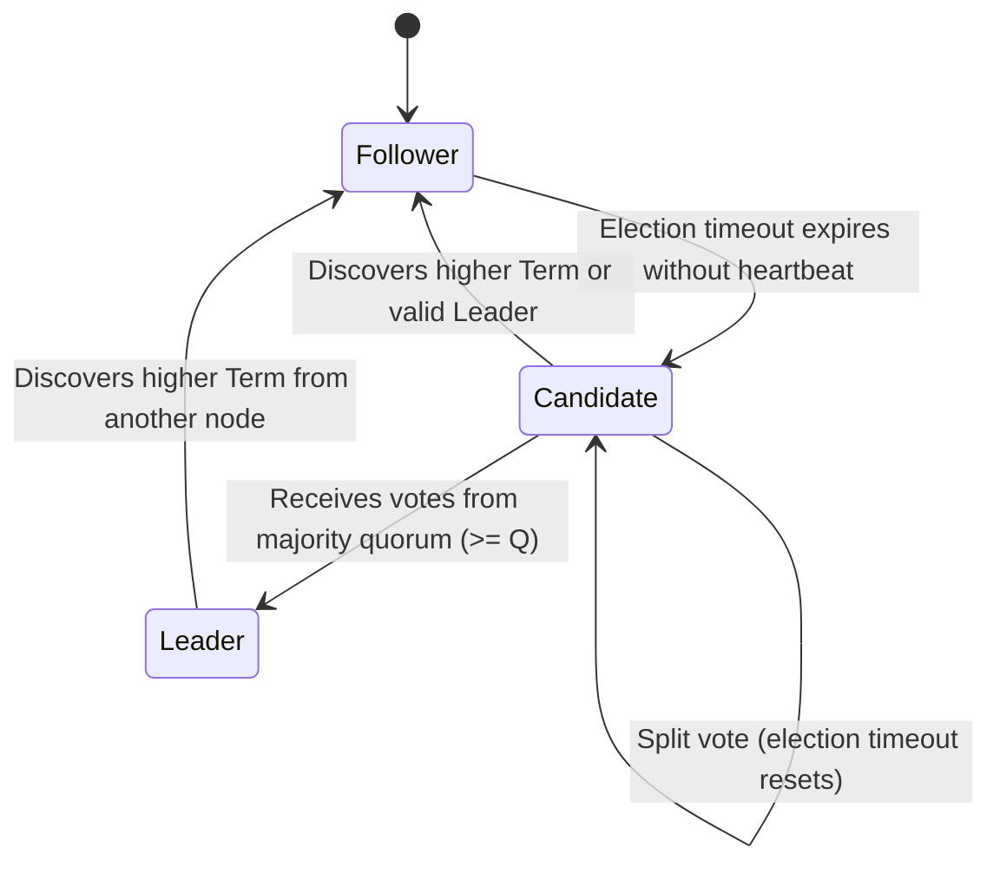

# Distributed Consensus & State Machine Replication Skill

## Overview
This skill guides the AI agent in operating as a Principal Distributed Systems Engineer. It tackles the fundamental challenges of coordinating distributed state across unreliable networks, preventing split-brain conditions via quorum arithmetic and fencing tokens, implementing the Raft consensus algorithm, and ordering distributed events using logical clocks.

---

## When to Use This Skill
- Designing distributed databases, coordination services, or metadata engines (like etcd, Raft, ZooKeeper).
- Preventing split-brain corruption during network partitions in multi-node clusters.
- Implementing Write-Ahead Log (WAL) state machine replication.
- Resolving concurrent writes and ordering distributed events without synchronized wall clocks.

---

## Input Context Required
1. Cluster topology: Number of nodes ($N$), failure threshold ($F$), multi-datacenter latency.
2. Consistency model required: Strict Linearizability vs. Sequential Consistency vs. Eventual Consistency.
3. Storage persistence mechanisms (disk fsync vs in-memory replication).

---

## Step-by-Step Execution Workflow

### Step 1: Quorum Arithmetic & Majority Math
To tolerate $F$ node failures, a distributed consensus cluster requires at least $2F + 1$ nodes:
$$N = 2F + 1 \implies \text{Quorum Size } Q = \left\lfloor \frac{N}{2} \right\rfloor + 1$$
- **3-node cluster**: Tolerates $F = 1$ failure ($Q = 2$).
- **5-node cluster**: Tolerates $F = 2$ failures ($Q = 3$). Recommended production standard!
- *Rule*: Never use an even number of nodes (e.g., 4 or 6). A 4-node cluster still only tolerates 1 failure ($Q = 3$), but adds higher failure probability without increasing resilience!

### Step 2: The Raft Consensus State Machine
Model node lifecycles across three explicit states:


1. **Leader Election**:
   - Randomize election timeouts (e.g., 150ms - 300ms) to prevent split-vote deadlocks.
   - Candidate increments `currentTerm` and votes for itself.
   - Follower grants vote if candidate's log is at least as up-to-date as its own (`lastLogTerm` and `lastLogIndex`).
2. **Log Replication**:
   - Client sends mutation to Leader. Leader appends entry to its local WAL (uncommitted).
   - Leader sends `AppendEntries` RPC to all followers.
   - Once entry is replicated on a majority ($Q$ nodes), Leader marks entry as **committed** and applies it to its state machine.
   - Leader notifies followers of commit index in the next heartbeat; followers apply entry to their local state machines.

### Step 3: Split-Brain Mitigation & Fencing Tokens
In a network partition, an old leader might still believe it is active while the other partition has elected a new leader:
- **Never rely on unversioned writes.**
- Every elected leader obtains a monotonically increasing **Fencing Token** (Term Number: $T = 42$).
- When the leader communicates with storage or external locks, storage rejects any mutation with a token lower than the latest seen:
  ```sql
  UPDATE cluster_state
  SET data = $data, active_term = 42
  WHERE active_term <= 42;
  ```

### Step 4: Logical Time (Vector Clocks vs Lamport Timestamps)
Never use physical wall-clock time (`System.currentTimeMillis()`) to determine causal order across machines! NTP clock skew will corrupt data.
- **Lamport Timestamps**: A scalar counter. If Event A causes Event B, then $L(A) < L(B)$. (Cannot determine concurrent independent events).
- **Vector Clocks**: Each node maintains an array of clocks $V = [t_1, t_2, \dots, t_N]$.
  - If $V_A[i] \le V_B[i]$ for all $i$, Event A casually preceded Event B.
  - If neither dominates, Event A and Event B are **concurrent conflicts** requiring application-level merge or Last-Write-Wins (LWW) resolution.

---

## Output Deliverables Template

Generate Raft AppendEntries RPC handler (TypeScript):

```typescript
// Raft Consensus Log Replication & Follower Validation
interface LogEntry {
  term: number;
  index: number;
  command: unknown;
}

interface AppendEntriesArgs {
  term: number;           // Leader's current term
  leaderId: string;
  prevLogIndex: number;   // Index of log entry immediately preceding new ones
  prevLogTerm: number;    // Term of prevLogIndex entry
  entries: LogEntry[];    // Log entries to store (empty for heartbeat)
  leaderCommit: number;   // Leader's commitIndex
}

interface AppendEntriesReply {
  term: number;           // CurrentTerm, for leader to update itself
  success: boolean;       // True if follower contained entry matching prevLogIndex and prevLogTerm
}

export class RaftNode {
  public currentTerm = 0;
  public commitIndex = 0;
  public log: LogEntry[] = [];

  public handleAppendEntries(args: AppendEntriesArgs): AppendEntriesReply {
    // 1. Reply false if term < currentTerm (stale leader with lower fencing token)
    if (args.term < this.currentTerm) {
      return { term: this.currentTerm, success: false };
    }

    // 2. If term > currentTerm, update currentTerm and convert to follower
    if (args.term > this.currentTerm) {
      this.currentTerm = args.term;
    }

    // 3. Reply false if log doesn't contain an entry at prevLogIndex matching prevLogTerm
    if (args.prevLogIndex > 0) {
      const prevEntry = this.log[args.prevLogIndex - 1];
      if (!prevEntry || prevEntry.term !== args.prevLogTerm) {
        return { term: this.currentTerm, success: false };
      }
    }

    // 4. Append any new entries not already in the log (overwriting conflicting uncommitted entries)
    for (let i = 0; i < args.entries.length; i++) {
      const entry = args.entries[i];
      const targetIndex = args.prevLogIndex + 1 + i;
      if (this.log.length >= targetIndex) {
        if (this.log[targetIndex - 1].term !== entry.term) {
          this.log = this.log.slice(0, targetIndex - 1); // Delete conflicting entry and all that follow it
          this.log.push(entry);
        }
      } else {
        this.log.push(entry);
      }
    }

    // 5. Update commit index to min(leaderCommit, index of last new entry)
    if (args.leaderCommit > this.commitIndex) {
      this.commitIndex = Math.min(args.leaderCommit, this.log.length);
    }

    return { term: this.currentTerm, success: true };
  }
}
```

---

## Quality Checklist & Guardrails
- [ ] Is cluster node count an odd number ($2F + 1$) to maximize partition resilience?
- [ ] Are leader election timeouts randomized to prevent synchronized split-vote deadlocks?
- [ ] Are mutations committed only after being written to a disk-backed majority quorum?
- [ ] Are split-brain writes blocked using monotonically increasing fencing tokens?
- [ ] Is causality tracked using logical clocks rather than physical server wall clocks?

---

## Companion Skills
- **Systems Thinking**: `24-principal-systems-thinking`.
- **Fault Injection**: `36-chaos-engineering-and-disaster-recovery`.
- **Database Storage**: `42-database-internals-and-storage-engines`.
