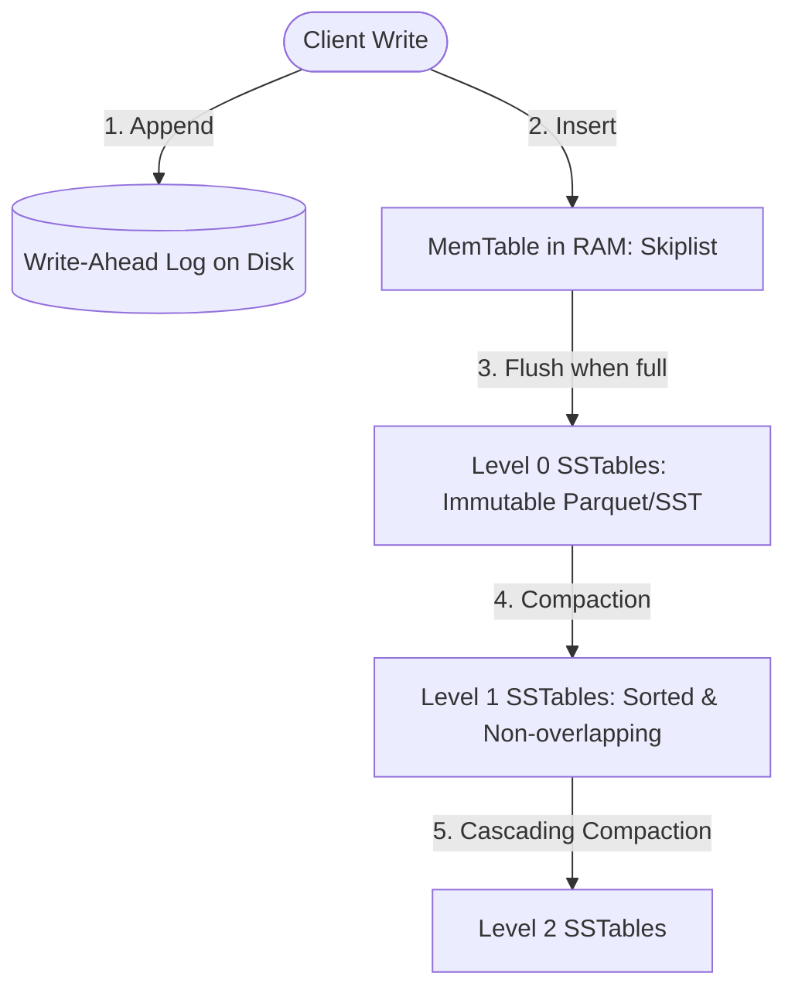

# Database Internals & Storage Engine Engineering Skill

## Overview
This skill guides the AI agent in operating as a Database Systems Engineer and Storage Engine Architect. It dives beneath high-level ORMs and SQL abstractions to analyze how bits are organized on persistent media. By evaluating B-Tree page hierarchies against Log-Structured Merge-Trees (LSM-Trees), tuning compaction algorithms, and balancing the RUM Conjecture (Read/Write/Space Amplification), systems achieve peak hardware utilization.

---

## When to Use This Skill
- Choosing between B-Tree databases (PostgreSQL, MySQL) and LSM-Tree engines (RocksDB, Cassandra, ScyllaDB, ClickHouse).
- Diagnosing write amplification, disk thrashing, or high p99 read latency on high-throughput databases.
- Designing custom embedded key-value stores or time-series engines.
- Tuning compaction strategies (Size-Tiered vs. Leveled) and Bloom filter false-positive ratios.

---

## Input Context Required
1. Workload profile: Read-heavy (90% reads / 10% writes) vs. Write-heavy (high-ingestion logs, metrics, financial ticks).
2. Data mutation frequency: In-place updates vs. append-only streams.
3. Hardware characteristics: NVMe SSD endurance (TBW limits), memory footprint, IOPS limits.

---

## Step-by-Step Execution Workflow

### Step 1: Storage Engine Paradigm: B-Tree vs. LSM-Tree
Select the foundational data structure based on workload physics:

| Characteristic | B-Tree Engine (Postgres, InnoDB) | LSM-Tree Engine (RocksDB, Cassandra) |
| :--- | :--- | :--- |
| **Mutation Model** | In-place updates on fixed disk pages (8KB-16KB) | Out-of-place append-only sequential writes |
| **Write Performance** | Slower; requires random disk I/O and doublewrite buffers | Extremely fast; writes hit in-memory MemTable + WAL |
| **Point Read Performance** | Fast & deterministic ($O(\log N)$ page traversals) | Can be slower; may search MemTable + multiple SSTables |
| **Range Scan Performance** | Optimal (B+ Tree leaf nodes linked sequentially) | Requires multi-way merge sort across SSTable iterators |
| **SSD Endurance** | High write amplification from random page dirties | Low write amplification on initial ingestion; compaction adds write cycles |

### Step 2: The LSM-Tree Anatomy
Understand how writes flow from RAM to disk:

1. **MemTable**: An in-memory sorted data structure (Skiplist or Red-Black Tree).
2. **Write-Ahead Log (WAL)**: Sequential append log ensuring durability across crashes.
3. **SSTable (Sorted String Table)**: Immutable on-disk file containing sorted keys and values, an index block, and a **Bloom Filter**.
4. **Tombstones**: Deletes do not immediately remove data; they write a deletion marker (`Tombstone`) that suppresses earlier records during compactions.

### Step 3: Compaction Strategies (Size-Tiered vs. Leveled)
Tune how SSTables are merged to manage the storage triangle:
- **Size-Tiered Compaction Strategy (STCS)**:
  - Merges SSTables of similar sizes into a larger table.
  - *Best for*: Write-heavy workloads.
  - *Trade-off*: High temporary space overhead (requires up to 50% free disk space to run compaction!).
- **Leveled Compaction Strategy (LCS)**:
  - Data partitioned into levels ($L_0, L_1, L_2$). Each level is $10\times$ larger than the previous. Levels $\ge 1$ contain strictly non-overlapping key ranges.
  - *Best for*: Read-heavy workloads; guarantees only 1 SSTable per level needs checking during point reads.
  - *Trade-off*: Higher write amplification as tables are repeatedly rewritten into higher levels.

### Step 4: The RUM Conjecture & Amplification Math
Every storage engine trades off between three dimensions—optimizing two degrades the third:
1. **Write Amplification Factor (WAF)**:
   $$\text{WAF} = \frac{\text{Total Bytes Written to Disk}}{\text{Total Bytes Requested by Client}}$$
   *(High WAF prematurely wears out enterprise SSD flash memory).*
2. **Read Amplification (RAF)**:
   Number of disk bytes read per byte of client payload. Mitigated using Bloom filters.
3. **Space Amplification (SAF)**:
   $$\text{SAF} = \frac{\text{Total Disk Storage Consumed}}{\text{Size of Decompressed Unique Data}}$$
   *(High SAF means paying for disk space consumed by superseded versions and tombstones).*

### Step 5: Bloom Filter Sizing
Avoid disk seeks for non-existent keys:
- Sized via bit array $m$ and number of hashes $k$:
  $$m = -\frac{n \ln p}{(\ln 2)^2}$$
- Where $n$ is key count and $p$ is acceptable false-positive probability.
- Sizing rule: At 10 bits per key, Bloom filter false-positive rate is only ~1%, eliminating 99% of useless disk seeks on read misses.

---

## Output Deliverables Template

Generate LSM Storage Engine Evaluation in `docs/architecture/storage-engine-evaluation.md`:

```markdown
# Storage Engine Evaluation: High-Throughput Ingestion Engine

## 1. Workload Specification
- **Write Ingestion**: 80,000 time-series ticks/sec (Peak: 140,000/sec).
- **Read Pattern**: 95% range queries by `(tenant_id, timestamp)`; 5% point lookups.
- **Data Retention**: 90-day rolling window (~18 TB raw data).

## 2. Engine Selection: LSM-Tree (RocksDB / ScyllaDB) vs B-Tree (PostgreSQL)
- **Verdict**: **Adopt LSM-Tree Engine (RocksDB backend)**.
- **Justification**: A B-Tree engine updating secondary indexes would generate massive random I/O and a WAF $> 25$, saturating SSD IOPS limits within weeks. RocksDB buffers writes in MemTables and writes sequentially, reducing ingestion WAF to $< 3$.

## 3. Compaction Strategy Configuration
- **Selected Strategy**: **Leveled Compaction (LCS)**.
- **Bloom Filter Bits/Key**: 10 bits (Target false-positive rate: 1.0%).
- **Target File Size**: 64 MB per SSTable.
- **Estimated Space Amplification (SAF)**: 1.15 (15% overhead from uncompacted versions).
```

---

## Quality Checklist & Guardrails
- [ ] Is storage engine chosen according to read vs write workload physics?
- [ ] Has Write Amplification Factor (WAF) been evaluated against SSD endurance limits?
- [ ] Are Bloom filters sized to keep false-positive disk seeks under 1%?
- [ ] Is free disk headroom allocated to permit maximum compaction file expansion?
- [ ] Are tombstones monitored to prevent high read latency over deleted key ranges?

---

## Companion Skills
- **Distributed Consensus**: `41-distributed-consensus-and-replication`.
- **Relational DDL**: `07-database-modeling-and-migrations`.
- **Low-Latency Tuning**: `43-high-performance-and-low-latency`.
