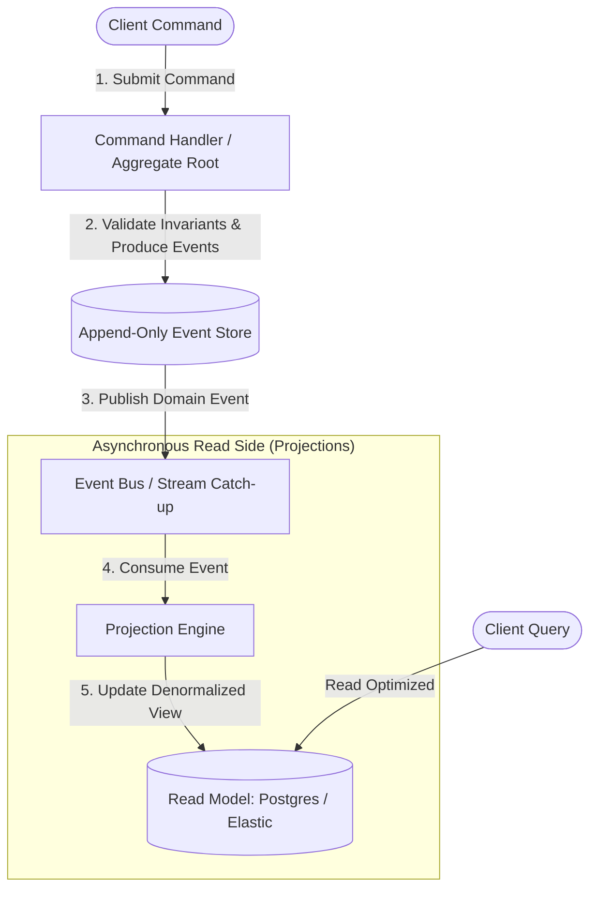

# Event Sourcing & CQRS Architecture Skill

## Overview
This skill guides the AI agent in implementing **Event Sourcing** and **Command Query Responsibility Segregation (CQRS)** based on Greg Young’s architectural patterns. Instead of overwriting mutable rows in traditional CRUD databases, systems capture every state transition as an immutable, append-only domain event. By separating command mutations from read queries, architectures achieve auditability, high write throughput, and time-travel replay capabilities.

---

## When to Use This Skill
- Building systems requiring strict regulatory auditability, ledger provenance, or temporal reconstruction (fintech, healthcare, logistics, legal workflows).
- Decoupling high-frequency write operations from complex, multi-dimensional read queries.
- Eliminating relational object-relational impedance mismatches during aggregate persistence.
- Replaying historical events to populate new read models, search indices, or ML training pipelines.

---

## Input Context Required
1. Domain events, aggregates, and business invariants from `02-domain-driven-design`.
2. Target Event Store (EventStoreDB, Apache Kafka, PostgreSQL with append-only event table).
3. Read model storage (PostgreSQL read views, Elasticsearch, MongoDB, Redis).

---

## Step-by-Step Execution Workflow

### Step 1: The Core CQRS & Event Sourcing Architecture
Decouple the Command (Write) model completely from the Query (Read) model:


### Step 2: Aggregate State Reconstitution & Snapshots
Never store the mutable current state in the primary database:
1. **Reconstitution**: To load an aggregate, query the Event Store for all events matching `stream_id = "Order-123"` ordered by `version ASC`.
2. **Apply / Fold**: Iterate through events sequentially, mutating in-memory state:
   $$\text{State}_N = \text{reduce}(\text{apply}, \text{Events}_{1 \dots N})$$
3. **Snapshotting**:
   - For long-lived aggregates (e.g., bank accounts with 10,000 transactions), replaying every event is slow.
   - Take a **Snapshot** every 100 events: Store serialized aggregate state at version 100.
   - On load, fetch the latest snapshot (v100), then replay *only* events where $\text{version} > 100$.

### Step 3: Optimistic Concurrency Control (OCC) on Event Streams
Prevent concurrent competing commands from corrupting the stream:
- Client loads aggregate at version $V = 4$.
- Client attempts appending new event:
  ```sql
  INSERT INTO event_store (stream_id, version, event_type, payload)
  VALUES ('Order-123', 5, 'OrderPaid', $payload);
  ```
- If another worker already inserted version 5, unique constraint `(stream_id, version)` triggers `ConcurrencyConflictException`. Abort and retry.

### Step 4: Event Schema Evolution (The Upcaster Pattern)
Because event streams are **immutable forever**, never rewrite historical database rows when an event schema changes!
Use an in-memory **Upcaster**:
- When reading `OrderCreated_v1` from the database, intercept it in memory before giving it to the aggregate.
- Transform `OrderCreated_v1` into `OrderCreated_v2` by applying default values for newly added fields.

### Step 5: Asynchronous Projection Engines
Project events into read-optimized SQL or document views:
- Projections track their own progress using a persistent **Checkpoint / Watermark**:
  `UPDATE projection_checkpoints SET last_processed_position = 49201 WHERE projection_name = 'order_summary_view';`
- If the read model database is corrupted or a new search index is introduced, reset checkpoint to 0 and replay the entire event store to rebuild views!

---

## Output Deliverables Template

Generate Event Sourced Aggregate Root (TypeScript):

```typescript
// Event Sourced Aggregate Root with Reducer and Optimistic Concurrency
export interface DomainEvent {
  id: string;
  streamId: string;
  version: number;
  timestamp: string;
  type: string;
  data: unknown;
}

export class OrderAggregate {
  public id: string = '';
  public version: number = 0;
  public status: 'PENDING' | 'PAID' | 'CANCELLED' = 'PENDING';
  public totalCents: number = 0;
  private uncommittedEvents: DomainEvent[] = [];

  // 1. Rehydrate aggregate from historical events
  public static loadFromHistory(streamId: string, history: DomainEvent[]): OrderAggregate {
    const aggregate = new OrderAggregate();
    aggregate.id = streamId;
    for (const event of history) {
      aggregate.apply(event, false);
    }
    return aggregate;
  }

  // 2. Command Execution (Validates Invariants)
  public pay(paymentReference: string): void {
    if (this.status !== 'PENDING') {
      throw new Error(`Cannot pay order in status ${this.status}`);
    }

    const event: DomainEvent = {
      id: crypto.randomUUID(),
      streamId: this.id,
      version: this.version + 1,
      timestamp: new Date().toISOString(),
      type: 'OrderPaid',
      data: { paymentReference, paidAt: new Date().toISOString() },
    };

    this.apply(event, true);
  }

  // 3. Event Application (Pure State Mutation)
  private apply(event: DomainEvent, isNew: boolean): void {
    switch (event.type) {
      case 'OrderCreated':
        this.status = 'PENDING';
        this.totalCents = (event.data as any).totalCents;
        break;
      case 'OrderPaid':
        this.status = 'PAID';
        break;
      case 'OrderCancelled':
        this.status = 'CANCELLED';
        break;
    }

    this.version = event.version;
    if (isNew) {
      this.uncommittedEvents.push(event);
    }
  }

  public getUncommittedEvents(): DomainEvent[] {
    return [...this.uncommittedEvents];
  }

  public markEventsAsCommitted(): void {
    this.uncommittedEvents = [];
  }
}
```

---

## Quality Checklist & Guardrails
- [ ] Are events strictly immutable with zero `UPDATE` or `DELETE` statements on the Event Store?
- [ ] Is optimistic concurrency verified via unique stream version constraints?
- [ ] Are historical events evolved using in-memory Upcasters rather than mutating past logs?
- [ ] Are long-lived streams protected by periodic snapshotting (e.g., every 100 events)?
- [ ] Are read projections idempotent and able to rebuild views from scratch on replay?

---

## Companion Skills
- **Domain Modeling**: `02-domain-driven-design`.
- **Event Messaging**: `06-event-and-messaging-design`.
- **Clean Architecture**: `10-clean-architecture-and-solid`.
