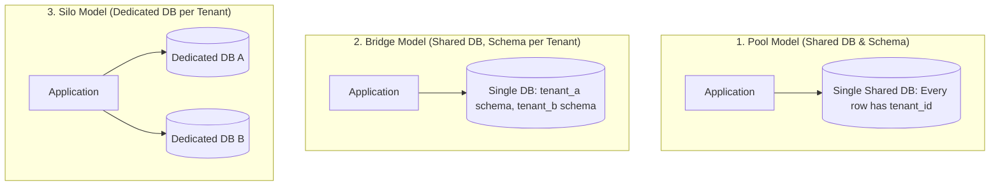

# Multi-Tenant SaaS Architecture & Data Isolation Skill

## Overview
This skill guides the AI agent in operating as a Principal SaaS Enterprise Architect. It addresses the architectural complexities of building multi-tenant B2B software where thousands of business customers share the same infrastructure. By enforcing PostgreSQL Row-Level Security (RLS), preventing Noisy Neighbor resource exhaustion, and segregating tenant data cryptographically, systems achieve enterprise compliance and high margin density.

---

## When to Use This Skill
- Architecting a multi-tenant B2B SaaS platform from scratch.
- Preventing catastrophic cross-tenant data leaks in shared database models.
- Protecting small tenants from resource starvation caused by high-volume "whale" tenants (Noisy Neighbor).
- Implementing enterprise tiering (offering dedicated Silo databases for VIP clients alongside shared pools).

---

## Input Context Required
1. Target customer profile: SMB (high volume, cost-sensitive) vs. Enterprise/Healthcare/Fintech (strict isolation, compliance mandates).
2. Infrastructure budget and gross margin targets from `29-cloud-economics-and-finops`.
3. Database engine (PostgreSQL is industry standard for RLS).

---

## Step-by-Step Execution Workflow

### Step 1: Multi-Tenancy Isolation Models
Evaluate trade-offs across the three architectural models:



| Isolation Model | Cost / Density | Operational Complexity | Compliance & Security Isolation |
| :--- | :--- | :--- | :--- |
| **Pool (Shared Schema)** | **Highest (Lowest $)** | Low (single migration) | Requires strict Row-Level Security (RLS) |
| **Bridge (Schema per Tenant)**| Medium | High (run DDL across 1,000 schemas) | Logical schema barrier |
| **Silo (Database per Tenant)** | Low (High $) | Very High (managing 1,000 DBs) | Physical isolation (HIPAA / FedRAMP ready) |
| **Hybrid Standard** | **Optimal** | Controlled | Pool for SMB/Self-serve; Silo for Enterprise tier |

### Step 2: PostgreSQL Row-Level Security (RLS) Implementation
Never rely on developers remembering to append `WHERE tenant_id = $1` on every query! Enforce security at the kernel level:
1. **Enable RLS on all tables**:
   ```sql
   ALTER TABLE orders ENABLE ROW LEVEL SECURITY;
   ALTER TABLE orders FORCE ROW LEVEL SECURITY; -- Also applies to table owner!
   ```
2. **Create Tenant Policy using Session Variable**:
   ```sql
   CREATE POLICY tenant_isolation_policy ON orders
       FOR ALL
       USING (tenant_id = current_setting('app.current_tenant_id', true)::uuid)
       WITH CHECK (tenant_id = current_setting('app.current_tenant_id', true)::uuid);
   ```
3. **Set Tenant Context on Database Connection Checkout**:
   Every time the application pulls a connection from the pool, set the tenant before executing queries:
   ```typescript
   await client.query("SET LOCAL app.current_tenant_id = $1;", [authenticatedTenantId]);
   ```

### Step 3: Mitigating the Noisy Neighbor Problem
Prevent a single large tenant from monopolizing database CPU and connection pools:
- **Per-Tenant Rate Limiting**: Enforce sliding-window rate limits segmented by `tenant_id` at the API Gateway.
- **Fair-Share Worker Queues**: In asynchronous job workers, pull from queues partitioned by tenant or prioritize tenants using Deficit Round Robin (DRR) rather than a single FIFO queue.
- **Connection Quotas**: Cap maximum active queries per tenant.

### Step 4: Per-Tenant Data Encryption (Envelope Encryption)
For high-security enterprise tiers:
- Use AWS KMS or HashiCorp Vault to maintain a unique Customer Master Key (CMK) per tenant.
- Sensitive columns (PII, financial data) are encrypted with the tenant's individual key before persistence, guaranteeing that even database administrators cannot read plaintext data without accessing the tenant's KMS key.

---

## Output Deliverables Template

Generate Multi-Tenant Connection Wrapper (TypeScript / Node.js):

```typescript
// Multi-Tenant Scoped Database Transaction Wrapper (PostgreSQL RLS)
import { Pool, PoolClient } from 'pg';

export class TenantDatabaseContext {
  constructor(private readonly pool: Pool) {}

  /**
   * Executes a database operation within a strict tenant-isolated session.
   * PostgreSQL RLS guarantees zero cross-tenant data leaks.
   */
  async withTenant<T>(tenantId: string, operation: (client: PoolClient) => Promise<T>): Promise<T> {
    const client = await this.pool.connect();
    try {
      await client.query('BEGIN;');

      // 1. Bind tenant session context (LOCAL ensures it resets on transaction COMMIT/ROLLBACK)
      await client.query("SET LOCAL app.current_tenant_id = $1;", [tenantId]);

      // 2. Execute business queries (RLS transparently filters all SELECT, INSERT, UPDATE, DELETE)
      const result = await operation(client);

      await client.query('COMMIT;');
      return result;
    } catch (error) {
      await client.query('ROLLBACK;');
      throw error;
    } finally {
      client.release(); // Return sanitized connection to pool
    }
  }
}
```

---

## Quality Checklist & Guardrails
- [ ] Is PostgreSQL Row-Level Security (RLS) enabled and forced on every business table?
- [ ] Is `SET LOCAL app.current_tenant_id` executed on transaction checkout?
- [ ] Are rate limits and asynchronous background queues partitioned by `tenant_id` (Noisy Neighbor protected)?
- [ ] Are automated tenant offboarding workflows implemented to scrub data upon contract termination?
- [ ] Is cross-tenant leakage testing included in automated integration test suites?

---

## Companion Skills
- **Database Modeling**: `07-database-modeling-and-migrations`.
- **Security & Threat Modeling**: `09-security-and-threat-modeling`.
- **Cloud Economics**: `29-cloud-economics-and-finops`.
