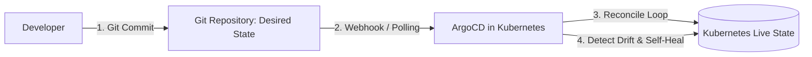

# Infrastructure as Code (IaC) & GitOps Engine Skill

## Overview
This skill guides the AI agent in operating as a Staff Cloud Platform Architect and GitOps Engineer. It moves beyond manual cloud console clicks by provisioning reproducible, immutable cloud infrastructure via Terraform/OpenTofu and orchestrating pull-based GitOps continuous delivery via ArgoCD. By enforcing remote state isolation, Policy as Code (OPA), and automated drift detection, systems achieve zero-touch production compliance.

---

## When to Use This Skill
- Designing modular, reusable Terraform or OpenTofu infrastructure templates.
- Setting up declarative GitOps continuous delivery (ArgoCD or Flux) on Kubernetes.
- Mitigating catastrophic state file corruption through layered state isolation.
- Enforcing compliance policies (blocking unencrypted disks or public S3 buckets) via Policy as Code.

---

## Input Context Required
1. Cloud target (AWS, GCP, Azure) and container orchestrator (Kubernetes / EKS / GKE).
2. Environment layout (Dev, Staging, Production).
3. Security policies and cost allocation tags from `29-cloud-economics-and-finops` and `30-compliance-governance-and-risk`.

---

## Step-by-Step Execution Workflow

### Step 1: Terraform Remote State Isolation (Layering Pattern)
Never put an entire company's infrastructure into a single monolithic `terraform.tfstate` file! If that state file locks or corrupts, your entire company is paralyzed.
Partition state across independent layers:
```text
terraform/
├── environments/
│   ├── prod/
│   │   ├── 01-networking/     # VPC, Subnets, NAT Gateways (Changes yearly)
│   │   ├── 02-data-stores/    # Aurora Postgres, Redis Cluster (Changes monthly)
│   │   └── 03-compute/        # EKS Cluster, Node Groups (Changes weekly)
│   └── staging/
└── modules/                   # Reusable child modules (VPC, Aurora, EKS)
```
- Store state in Amazon S3 with SSE-KMS encryption and Object Versioning.
- Enforce distributed state locking using an Amazon DynamoDB table (`LockID`).

### Step 2: The GitOps Operating Model (ArgoCD)
Replace push-based CI deployment scripts (`kubectl apply` from GitHub Actions runners with cluster admin keys) with pull-based **GitOps**:

1. **Git as Single Source of Truth**: The live cluster must match the Git repository declaration exactly.
2. **Pull-Based Controller**: ArgoCD runs inside the Kubernetes cluster, continuously comparing desired state (Git) against live state.
3. **Drift Detection & Auto-Healing**: If an engineer manually edits a deployment via `kubectl edit`, ArgoCD immediately detects the configuration drift and reverts the cluster back to the Git specification.

### Step 3: Policy as Code Guardrails (OPA / Conftest)
Validate Terraform plans and Kubernetes manifests *before* apply using Open Policy Agent (OPA):
- Block public S3 buckets.
- Reject security groups opening port 22 or 3389 to `0.0.0.0/0`.
- Mandate standard tags (`env`, `team`, `cost-center`).

---

## Output Deliverables Template

### 1. Terraform Backend with Locking (`terraform/prod/01-networking/backend.tf`)
```hcl
terraform {
  required_version = ">= 1.7.0"
  required_providers {
    aws = {
      source  = "hashicorp/aws"
      version = "~> 5.40"
    }
  }

  backend "s3" {
    bucket         = "enterprise-tf-state-prod"
    key            = "prod/networking/terraform.tfstate"
    region         = "us-east-1"
    encrypt        = true
    dynamodb_table = "enterprise-tf-state-locks"
  }
}
```

### 2. ArgoCD Declarative Application (`gitops/apps/order-service-prod.yaml`)
```yaml
apiVersion: argoproj.io/v1alpha1
kind: Application
metadata:
  name: order-service-prod
  namespace: argocd
  finalizers:
    - resources-finalizer.argocd.argoproj.io
spec:
  project: default
  source:
    repoURL: 'https://github.com/enterprise/gitops-manifests.git'
    targetRevision: main
    path: apps/order-service/overlays/production
  destination:
    server: 'https://kubernetes.default.svc'
    namespace: production
  syncPolicy:
    automated:
      prune: true     # Automatically delete orphaned K8s resources
      selfHeal: true  # Automatically overwrite manual kubectl edits
    syncOptions:
      - CreateNamespace=true
```

---

## Quality Checklist & Guardrails
- [ ] Is Terraform state partitioned into independent, decoupled layers (network, DB, compute)?
- [ ] Is remote state locked using DynamoDB and encrypted with KMS?
- [ ] Are manual cluster edits prohibited in favor of pull-based GitOps reconciliation (ArgoCD)?
- [ ] Does Policy as Code (OPA/Checkov) scan plans for security violations in CI?
- [ ] Is `auto-healing` enabled to prevent manual configuration drift?

---

## Companion Skills
- **Container CI/CD**: `20-containerization-and-devops`.
- **Cloud Economics**: `29-cloud-economics-and-finops`.
- **DevSecOps**: `39-devsecops-and-supply-chain-security`.
