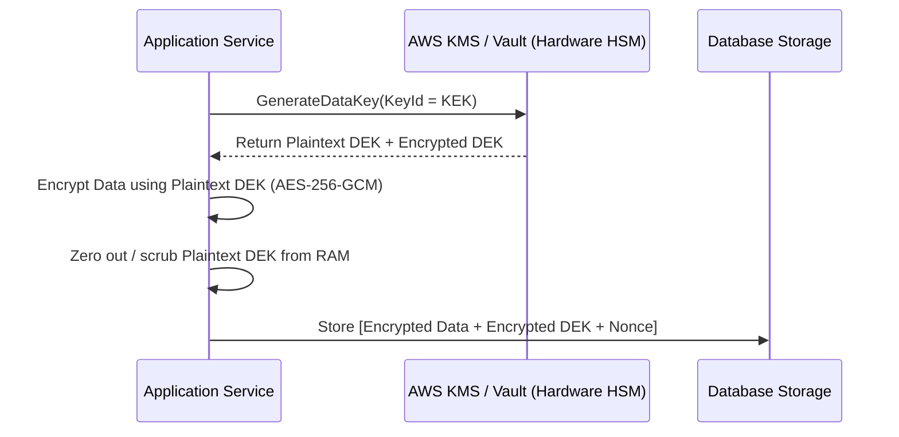

# Applied Cryptography & Enterprise Data Protection Skill

## Overview
This skill guides the AI agent in operating as an Applied Cryptography Architect and Security Engineer. It establishes mathematically sound, NIST-compliant cryptographic mechanisms across modern software applications. By implementing **Envelope Encryption** (KEK/DEK), Authenticated Encryption (AES-GCM), memory-hard password hashing (Argon2id), and HMAC webhook signing, systems protect sensitive data against breaches and ciphertext tampering.

---

## When to Use This Skill
- Encrypting sensitive data at rest (PII, credit card tokens, medical records) at the field level.
- Designing high-volume envelope encryption workflows using AWS KMS or HashiCorp Vault.
- Generating and verifying HMAC webhook signatures (e.g., Stripe/GitHub style webhooks).
- Implementing secure password hashing and multi-version cryptographic key rotation.

---

## Input Context Required
1. Sensitivity tier of data (PII, Financial, ePHI) from `09-security-and-threat-modeling`.
2. Cloud Key Management Service (AWS KMS, GCP Cloud KMS, HashiCorp Vault Transit engine).
3. Encryption performance and latency budgets.

---

## Step-by-Step Execution Workflow

### Step 1: The Golden Rule of Cryptography
> *"Never invent your own cryptographic algorithms or primitives. Never implement your own AES or RSA math. Always use battle-tested, standard libraries (libsodium, Web Crypto API, OpenSSL, Google Tink)."*

### Step 2: Authenticated Encryption with Associated Data (AEAD)
Never use legacy modes like AES-CBC without HMAC (vulnerable to padding oracle attacks).
Always use **AEAD (AES-256-GCM or ChaCha20-Poly1305)**:
- **Confidentiality**: Encrypts the plaintext payload.
- **Integrity & Authenticity**: Generates a 128-bit authentication tag. If an attacker modifies even a single bit of ciphertext, decryption fails instantly with an integrity error.
- **Initialization Vector (IV / Nonce)**: **MUST be cryptographically random and UNIQUE for every single encryption operation.** Never reuse a nonce with the same key!

### Step 3: Envelope Encryption Architecture
Sending large payloads to AWS KMS over network is slow and expensive. Use **Envelope Encryption**:

1. **Key Encryption Key (KEK)**: Stored securely inside the Hardware Security Module (HSM). Never leaves KMS.
2. **Data Encryption Key (DEK)**: Ephemeral symmetric key generated to encrypt the local payload.
3. **Decryption**: To read, send *only* the small Encrypted DEK to KMS to decrypt; then use the returned plaintext DEK to decrypt the local payload.

### Step 4: Webhook Signing via HMAC-SHA256
Prevent webhook spoofing and replay attacks:
1. Producer computes signature over `timestamp + "." + payload`:
   $$\text{Signature} = \text{HMAC-SHA256}(\text{SecretKey}, \text{timestamp} + "." + \text{payload})$$
2. Producer sends header: `X-Signature: t=1711200000,v1=5d41402...`
3. Consumer validates:
   - Check that `timestamp` is within allowed drift window (e.g., within 5 minutes) to prevent **replay attacks**.
   - Compute expected HMAC and compare using **constant-time string comparison** (`crypto.timingSafeEqual`) to prevent **timing attacks**!

### Step 5: Password Hashing (Argon2id)
Never use plain SHA-256 or MD5 for passwords! Use memory-hard hashing:
- **Argon2id** (Winner of the Password Hashing Competition):
  - Memory cost: $\ge 64\,\text{MB}$ ($65,536\,\text{KB}$).
  - Time cost: $\ge 3$ iterations.
  - Parallelism: 4 threads.
  - Highly resistant to GPU and ASIC brute-force password cracking rigs.

---

## Output Deliverables Template

Generate field-level Envelope Encryption module (TypeScript):

```typescript
// Field-Level AES-256-GCM Envelope Encryption Wrapper
import crypto from 'crypto';

interface EncryptedPayload {
  ciphertextBase64: string;
  ivBase64: string;
  authTagBase64: string;
}

export class FieldCrypto {
  private static readonly ALGORITHM = 'aes-256-gcm';
  private static readonly IV_LENGTH = 12; // 96-bit standard nonce for GCM

  /**
   * Encrypts plaintext using AES-256-GCM and a local Data Encryption Key (DEK).
   */
  public static encrypt(plaintext: string, dekBytes: Buffer): EncryptedPayload {
    const iv = crypto.randomBytes(this.IV_LENGTH);
    const cipher = crypto.createCipheriv(this.ALGORITHM, dekBytes, iv);

    let ciphertext = cipher.update(plaintext, 'utf8', 'base64');
    ciphertext += cipher.final('base64');

    const authTag = cipher.getAuthTag();

    return {
      ciphertextBase64: ciphertext,
      ivBase64: iv.toString('base64'),
      authTagBase64: authTag.toString('base64'),
    };
  }

  /**
   * Decrypts ciphertext and verifies cryptographic authentication tag.
   */
  public static decrypt(payload: EncryptedPayload, dekBytes: Buffer): string {
    const iv = Buffer.from(payload.ivBase64, 'base64');
    const authTag = Buffer.from(payload.authTagBase64, 'base64');

    const decipher = crypto.createDecipheriv(this.ALGORITHM, dekBytes, iv);
    decipher.setAuthTag(authTag);

    let decrypted = decipher.update(payload.ciphertextBase64, 'base64', 'utf8');
    decrypted += decipher.final('utf8'); // Throws Error if ciphertext was tampered with!

    return decrypted;
  }
}
```

---

## Quality Checklist & Guardrails
- [ ] Are symmetric encryptions executed using AEAD (AES-256-GCM or ChaCha20-Poly1305)?
- [ ] Is a fresh, cryptographically secure IV/nonce generated for every single encryption?
- [ ] Are HMAC signatures compared using constant-time algorithms (`timingSafeEqual`)?
- [ ] Are passwords hashed using Argon2id with $\ge 64\,\text{MB}$ memory cost?
- [ ] Are Plaintext Data Encryption Keys (DEKs) zeroed out of memory immediately after use?

---

## Companion Skills
- **Threat Modeling**: `09-security-and-threat-modeling`.
- **SaaS Architecture**: `45-multi-tenant-saas-architecture`.
- **Compliance Audits**: `30-compliance-governance-and-risk`.
