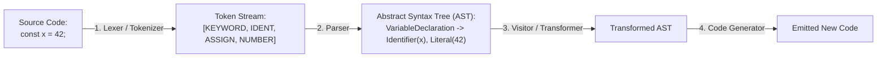

# AST Tooling, Codemods & Static Analysis Skill

## Overview
This skill guides the AI agent in operating as a Staff Developer Tooling and Compiler Systems Engineer. It unlocks meta-programming mastery by manipulating code directly at the **Abstract Syntax Tree (AST)** level. By authoring automated codemods (jscodeshift), custom architectural linter rules (ESLint/Semgrep), and type-safe Domain-Specific Languages (DSLs), engineering organizations can refactor millions of lines of code across hundreds of repositories effortlessly.

---

## When to Use This Skill
- Migrating large-scale codebases across breaking API changes (e.g., upgrading framework versions across 50 repos).
- Enforcing custom architectural invariants (e.g., forbidding imports between domain layers) via custom lint rules.
- Building custom internal Developer Experience (DevEx) CLI tools and code scaffolding generators.
- Creating custom query parsers or configuration Domain-Specific Languages (DSLs).

---

## Input Context Required
1. Source language (TypeScript, JavaScript, Python, Go, Rust) and parser runtime.
2. Target transformation: Current AST pattern to identify and desired replacement AST structure.
3. Code formatting preservation requirements (Prettier / whitespace preservation).

---

## Step-by-Step Execution Workflow

### Step 1: The Compiler Pipeline (Source Code to AST)
Understand how source code becomes an Abstract Syntax Tree:


### Step 2: AST Node Inspection & Visitor Pattern
Inspect and manipulate trees using visitors:
- **`Identifier`**: Variable or function names (e.g., `calculateTotal`).
- **`CallExpression`**: A function being called: `foo(a, b)` (contains `callee` and `arguments`).
- **`ImportDeclaration`**: An import statement (contains `source` and `specifiers`).
- **Visitor Pattern**: Hooks that trigger when entering/exiting specific node types:
  ```typescript
  CallExpression(path) {
    if (path.node.callee.name === 'deprecatedFunction') {
      // Replace with new API
    }
  }
  ```

### Step 3: Authoring Automated Codemods (jscodeshift)
Migrate thousands of files in parallel without manual error:
1. Parse file into AST.
2. Find target nodes using selector matching.
3. Replace nodes in-place.
4. Output regenerated code while preserving existing indentation.

### Step 4: Custom Architectural Boundary Lint Rules
Enforce Clean Architecture boundaries automatically in CI:
- Write an ESLint rule that inspects `ImportDeclaration`:
  - If a file path matches `src/domain/**` and its import path matches `src/infrastructure/**` $\implies$ Report error: *"Architectural violation: Domain layer must not import from Infrastructure layer!"*

---

## Output Deliverables Template

Generate automated jscodeshift Codemod (`codemods/migrate-logger.ts`):

```typescript
// Codemod: Migrate deprecated `console.log` calls to structured `logger.info()`
import { API, FileInfo } from 'jscodeshift';

export default function transformer(file: FileInfo, api: API): string {
  const j = api.jscodeshift;
  const root = j(file.source);

  // 1. Find all calls to `console.log(...)`
  const consoleCalls = root.find(j.CallExpression, {
    callee: {
      type: 'MemberExpression',
      object: { name: 'console' },
      property: { name: 'log' },
    },
  });

  if (consoleCalls.length === 0) {
    return file.source; // No changes needed
  }

  // 2. Replace `console.log` with `logger.info`
  consoleCalls.replaceWith((nodePath) => {
    return j.callExpression(
      j.memberExpression(j.identifier('logger'), j.identifier('info')),
      nodePath.node.arguments
    );
  });

  // 3. Ensure `import { logger } from './logger';` is present at top of file
  const hasLoggerImport = root.find(j.ImportDeclaration, {
    source: { value: './logger' },
  }).length > 0;

  if (!hasLoggerImport) {
    const importDecl = j.importDeclaration(
      [j.importSpecifier(j.identifier('logger'))],
      j.literal('./logger')
    );
    root.get().node.program.body.unshift(importDecl);
  }

  return root.toSource({ quote: 'single' });
}
```

---

## Quality Checklist & Guardrails
- [ ] Is the codemod tested against edge cases (nested closures, aliased imports, comments)?
- [ ] Does the codemod preserve surrounding code formatting and comments?
- [ ] Are custom lint rules integrated into CI to prevent architectural regressions?
- [ ] Is transformation idempotent (running the codemod twice produces identical output)?
- [ ] Are codemod runs verified via automated unit test harnesses (`defineTest`)?

---

## Companion Skills
- **Clean Architecture Enforcement**: `10-clean-architecture-and-solid`.
- **Refactoring Strategy**: `19-refactoring-and-debt-reduction`.
- **Code Review**: `18-code-review-and-audit`.
