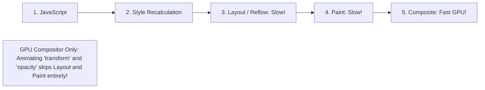

# Web Animations & 60 FPS UI Performance Skill

## Overview
This skill guides the AI agent in operating as a Super Expert UI Motion and Frontend Performance Engineer. It bridges visual design and browser engine rendering pipelines. By animating exclusively on the GPU compositor thread (`transform` and `opacity`), eliminating layout thrashing, utilizing spring physics (Framer Motion), and virtualizing massive data sets (TanStack Virtual), interfaces feel native, organic, and silky smooth at a locked 60/120 FPS.

---

## When to Use This Skill
- Designing fluid micro-interactions, drag-and-drop interfaces, modals, and page transitions.
- Eliminating frame drops, jank, and stutter during user scrolling or animations.
- Rendering massive datasets (tables, feeds, logs with 10,000+ items) without DOM bloat.
- Coordinating shared layout transitions (expanding cards, tab indicators) using the FLIP technique.

---

## Input Context Required
1. Target frame rate (60 FPS on standard devices, 120 FPS on ProMotion/high-refresh screens).
2. Motion library (Framer Motion, GSAP, Tailwind transitions, CSS animations).
3. Data cardinality: Does the UI render 10 items or 100,000 rows?

---

## Step-by-Step Execution Workflow

### Step 1: The Browser Rendering Pipeline (The 60 FPS Budget)
To hit 60 FPS, every frame has a hard budget of **16.6 milliseconds** (or 8.3ms for 120 FPS):

- **The Golden Rule**: Animate **ONLY** two properties: `transform` and `opacity`.
- **Properties to NEVER animate**: `width`, `height`, `top`, `left`, `margin`, `padding` (these trigger expensive Layout Reflows across the entire DOM tree).

### Step 2: Eliminating Layout Thrashing & Forced Synchronous Layouts
Never interleave reading geometry and writing styles inside loops:
```javascript
// BAD: Triggers forced synchronous layout on every iteration!
elements.forEach(el => {
  const width = el.offsetWidth; // READ triggers Layout calculation
  el.style.width = (width + 10) + 'px'; // WRITE invalidates layout
});

// GOOD: Batch all reads first, then batch all writes!
const widths = elements.map(el => el.offsetWidth);
elements.forEach((el, i) => {
  el.style.transform = `scaleX(${(widths[i] + 10) / widths[i]})`;
});
```

### Step 3: Framer Motion Layout Animations (The FLIP Technique)
Use the **FLIP** algorithm (First, Last, Invert, Play) to animate layout shifts automatically:
- **`layout` prop**: Tell Framer Motion to record the initial bounding box (First), let the DOM re-render in new position (Last), calculate delta (Invert), and animate via `transform` (Play).
- **`layoutId`**: Animate an element morphing between two completely separate components (e.g., active navigation pill indicator or card expansion modal).
- **Spring Physics**: Use springs instead of artificial durations for natural physics:
  `transition={{ type: 'spring', stiffness: 350, damping: 25 }}`.

### Step 4: DOM Virtualization for Massive Data (TanStack Virtual)
Rendering 10,000 DOM nodes destroys memory and crashes mobile browsers:
- Use **Virtualization**: Render *only* the ~25 items visible in the current viewport window.
- As the user scrolls, recycling DOM nodes dynamically at 60 FPS using absolute translation transforms:
  ```tsx
  const virtualizer = useVirtualizer({
    count: items.length,
    getScrollElement: () => parentRef.current,
    estimateSize: () => 48, // 48px row height
  });
  ```

---

## Output Deliverables Template

Generate 60 FPS Morphing Card Component (React / Framer Motion):

```tsx
// 60 FPS Shared Layout Morphing Card with Framer Motion Springs
import React, { useState } from 'react';
import { motion, AnimatePresence } from 'framer-motion';

interface CardItem {
  id: string;
  title: string;
  description: string;
}

export function ExpandableCardList({ items }: { items: CardItem[] }) {
  const [selectedId, setSelectedId] = useState<string | null>(null);

  const selectedItem = items.find((i) => i.id === selectedId);

  return (
    <div className="grid grid-cols-2 gap-4 p-6">
      {items.map((item) => (
        <motion.div
          key={item.id}
          layoutId={`card-container-${item.id}`}
          onClick={() => setSelectedId(item.id)}
          className="border rounded-xl p-4 bg-white shadow-sm cursor-pointer hover:shadow-md"
          transition={{ type: 'spring', stiffness: 400, damping: 30 }}
        >
          <motion.h3 layoutId={`card-title-${item.id}`} className="font-bold text-lg">
            {item.title}
          </motion.h3>
          <p className="text-gray-500 text-sm mt-1">Click to expand details</p>
        </motion.div>
      ))}

      {/* Expanded Modal Overlay */}
      <AnimatePresence>
        {selectedItem && (
          <div className="fixed inset-0 z-50 flex items-center justify-center bg-black/40 backdrop-blur-sm p-4">
            <motion.div
              layoutId={`card-container-${selectedItem.id}`}
              className="bg-white rounded-2xl p-6 max-w-lg w-full shadow-2xl relative"
              transition={{ type: 'spring', stiffness: 400, damping: 30 }}
            >
              <motion.h3 layoutId={`card-title-${selectedItem.id}`} className="font-bold text-2xl mb-3">
                {selectedItem.title}
              </motion.h3>
              <p className="text-gray-700 leading-relaxed">{selectedItem.description}</p>
              <button
                type="button"
                onClick={() => setSelectedId(null)}
                className="mt-6 bg-gray-900 text-white px-4 py-2 rounded-lg text-sm"
              >
                Close
              </button>
            </motion.div>
          </div>
        )}
      </AnimatePresence>
    </div>
  );
}
```

---

## Quality Checklist & Guardrails
- [ ] Are animations restricted to GPU compositor properties (`transform`, `opacity`)?
- [ ] Is layout thrashing eliminated by batching DOM reads before DOM writes?
- [ ] Are massive lists (>100 items) virtualized via TanStack Virtual?
- [ ] Are micro-interactions powered by natural spring physics rather than linear ease?
- [ ] Is `prefers-reduced-motion` honored for accessibility compliance?

---

## Companion Skills
- **Frontend Architecture**: `14-frontend-architecture-and-state`.
- **Local-First Sync**: `55-offline-first-indexeddb-and-local-sync`.
- **DevTools Profiling**: `60-fullstack-debugging-and-devtools-profiling`.
