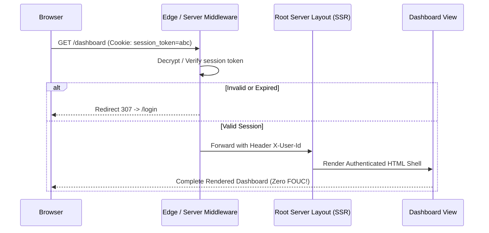

# Full-Stack Auth, Sessions & Passkeys Skill

## Overview
This skill guides the AI agent in operating as a Fullstack Identity & Authentication Architect. It moves beyond insecure localStorage token patterns by establishing ironclad **HttpOnly, Secure, SameSite** cookie sessions, biometric hardware **Passkeys (FIDO2 / WebAuthn)**, and seamless server-side session hydration. By eliminating Flash of Unauthenticated Content (FOUC) and enforcing CSRF defenses, user identity remains frictionless and tamper-proof.

---

## When to Use This Skill
- Implementing authentication in modern fullstack frameworks (Next.js, Remix, SvelteKit).
- Migrating from vulnerable localStorage JWTs to secure HttpOnly cookie sessions.
- Adding biometric hardware Passkeys (Touch ID, Face ID, Windows Hello) via WebAuthn.
- Hydrating user sessions in SSR layouts without flickering or client-side redirect loops.

---

## Input Context Required
1. Auth provider strategy: Self-hosted database sessions (Auth.js / Lucide Auth) vs. managed identity (Clerk, Supabase Auth, Kinde).
2. Authentication methods: Email/password, OAuth2 social (Google, GitHub), Magic links, Passkeys.
3. Multi-tenancy: Does the session require active organization switching (`org_id`)?

---

## Step-by-Step Execution Workflow

### Step 1: The Token Storage Rule (Never Use localStorage)
Storing access tokens in `localStorage` or `sessionStorage` leaves applications vulnerable:
- **Any XSS vulnerability** (from an infected npm package or user input) can execute `localStorage.getItem('token')` and permanently exfiltrate the session!
- **The Golden Rule**: Store session tokens exclusively in **HttpOnly, Secure, SameSite=Lax** cookies:
  - `HttpOnly`: JavaScript cannot read the cookie (`document.cookie` returns empty).
  - `Secure`: Cookie transmitted only over encrypted HTTPS.
  - `SameSite=Lax`: Automatically blocks Cross-Site Request Forgery (CSRF) on cross-origin requests.

### Step 2: Fullstack Session Hydration in SSR (Zero FOUC)
Eliminate the ugly "Flash of Unauthenticated Content" where a user sees a login button for 0.5s before page re-renders:


### Step 3: WebAuthn & Biometric Passkeys (The Passwordless Future)
Implement FIDO2 / WebAuthn for phishing-resistant logins:
1. **Registration**:
   - Server generates cryptographic challenge.
   - Browser prompts Touch ID / Face ID via `navigator.credentials.create()`.
   - Device generates asymmetric key pair in hardware Secure Enclave.
   - Client sends public key to server; private key never leaves user's physical device!
2. **Authentication**:
   - Server issues new challenge.
   - User touches biometric sensor; device signs challenge with private key.
   - Server verifies signature against stored public key. Phishing is mathematically impossible!

### Step 4: Multi-Tenant Organization Context Switching
For B2B SaaS applications where a user belongs to multiple companies:
- Store `active_org_id` in the encrypted session cookie or verified JWT claim.
- When the user switches workspaces in the UI, execute a Server Action that updates the active session cookie and triggers `revalidatePath('/')`, re-rendering the entire tenant workspace instantly.

---

## Output Deliverables Template

Generate WebAuthn Passkey Registration Handler (TypeScript):

```typescript
// WebAuthn Passkey Client Registration (TypeScript)
export async function registerPasskey(userEmail: string): Promise<boolean> {
  // 1. Fetch challenge from server
  const challengeRes = await fetch('/api/auth/passkey/generate-options', {
    method: 'POST',
    headers: { 'Content-Type': 'application/json' },
    body: JSON.stringify({ email: userEmail }),
  });
  const options = await challengeRes.json();

  // Convert base64 challenge to ArrayBuffer
  options.challenge = Uint8Array.from(atob(options.challenge), (c) => c.charCodeAt(0));
  options.user.id = Uint8Array.from(atob(options.user.id), (c) => c.charCodeAt(0));

  // 2. Trigger native device biometric prompt (Touch ID / Face ID)
  const credential = (await navigator.credentials.create({
    publicKey: options,
  })) as PublicKeyCredential;

  if (!credential) return false;

  // 3. Send public key attestation back to server to store
  const rawId = btoa(String.fromCharCode(...new Uint8Array(credential.rawId)));
  const response = credential.response as AuthenticatorAttestationResponse;

  const verifyRes = await fetch('/api/auth/passkey/verify-registration', {
    method: 'POST',
    headers: { 'Content-Type': 'application/json' },
    body: JSON.stringify({
      id: credential.id,
      rawId,
      attestationObject: btoa(String.fromCharCode(...new Uint8Array(response.attestationObject))),
      clientDataJSON: btoa(String.fromCharCode(...new Uint8Array(response.clientDataJSON))),
    }),
  });

  return verifyRes.ok;
}
```

---

## Quality Checklist & Guardrails
- [ ] Are session tokens stored strictly in HttpOnly, Secure, SameSite cookies (never localStorage)?
- [ ] Is server-side session verification enforced in middleware to prevent FOUC?
- [ ] Are Passkey authentication challenges verified using constant-time cryptographic checks?
- [ ] Is user logout configured to invalidate both local cookies and server-side session stores?
- [ ] Are multi-tenant organization switches validated server-side against tenant membership tables?

---

## Companion Skills
- **Threat Modeling**: `09-security-and-threat-modeling`.
- **SSR Frameworks**: `52-ssr-rsc-and-modern-fullstack-frameworks`.
- **Applied Cryptography**: `47-applied-cryptography-and-data-protection`.
