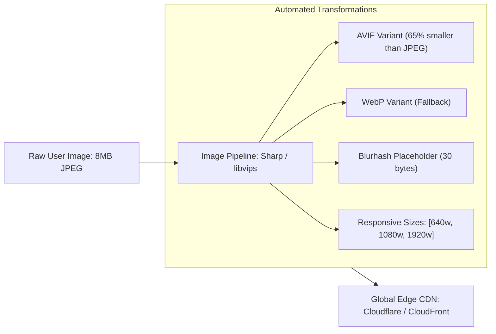

# Media Processing, Video Streaming & Edge CDN Delivery Skill

## Overview
This skill guides the AI agent in operating as a Fullstack Media Infrastructure and Edge Computing Engineer. Media assets account for $> 70\%$ of web bandwidth and are the leading cause of poor Core Web Vitals (LCP/CLS). By implementing automated image pipelines (AVIF/WebP with Blurhash placeholders), adaptive bitrate video streaming (HLS), and edge compute middleware (Cloudflare Workers / Vercel Edge), web applications load instantly worldwide.

---

## When to Use This Skill
- Optimizing high-resolution images to eliminate page bloat and pass Core Web Vitals (LCP $< 2.5s$, CLS $< 0.1$).
- Generating responsive `srcset` image variants and Blurhash Low-Quality Image Placeholders (LQIP).
- Building video streaming platforms using HTTP Live Streaming (HLS) and adaptive bitrate transcoding.
- Running edge routing, geolocation personalization, or edge caching headers (`stale-while-revalidate`).

---

## Input Context Required
1. Asset ingestion source: User uploads (avatars, product photos, videos) vs. static marketing assets.
2. Target CDN platform: Cloudflare (Workers/Images), AWS CloudFront + S3, Fastly, or Vercel Edge.
3. Bandwidth and storage budget constraints from `29-cloud-economics-and-finops`.

---

## Step-by-Step Execution Workflow

### Step 1: The Modern Image Optimization Pipeline
Never serve raw JPEGs or PNGs uploaded by users! Pass them through an automated processing pipeline:

1. **Format Negotiation**: Inspect browser `Accept` header. If `image/avif` supported $\implies$ serve AVIF; else serve WebP.
2. **Responsive `srcset`**:
   ``
3. **Cumulative Layout Shift (CLS) Elimination**: Always define explicit `aspect-ratio` or `width`/`height` attributes so the browser reserves layout space before image download completes.
4. **Blurhash LQIP**: Embed a 30-character hash directly into SSR HTML to render an instant blurred backdrop while the full image loads.

### Step 2: Adaptive Bitrate Video Streaming (HLS / m3u8)
Never serve monolithic 500 MB MP4 files (stalls mobile playback and wastes user data):
- Use **FFmpeg** to transcode videos into segmented **HTTP Live Streaming (HLS)**:
  - Segments video into small 6-second `.ts` chunks.
  - Generates a master `.m3u8` playlist with multiple quality streams (1080p, 720p, 480p, 360p).
  - The video player (Hls.js / Video.js) measures real-time network throughput and dynamically up-shifts or down-shifts resolution without buffering!

### Step 3: Edge CDN Caching & Edge Functions
Leverage global edge nodes close to the user:
- **`stale-while-revalidate` Header**:
  `Cache-Control: public, max-age=3600, stale-while-revalidate=86400`
  - Serves cached version instantly ($< 15\text{ms}$ at the edge) while revalidating origin in the background.
- **Edge Middleware (Cloudflare Workers)**:
  - Inspect `request.cf.country` to customize currency/language at the edge without hitting origin databases.

---

## Output Deliverables Template

### 1. Automated Sharp Image Pipeline Module (Node.js)
```typescript
import sharp from 'sharp';
import { encode } from 'blurhash';

interface ProcessedImageOutput {
  avifBuffer: Buffer;
  webpBuffer: Buffer;
  blurhash: string;
  width: number;
  height: number;
}

export async function processImageUpload(rawBuffer: Buffer): Promise<ProcessedImageOutput> {
  const metadata = await sharp(rawBuffer).metadata();
  const width = metadata.width || 1080;
  const height = metadata.height || 720;

  // 1. Generate AVIF (Maximum compression quality)
  const avifBuffer = await sharp(rawBuffer)
    .resize({ width: 1920, withoutEnlargement: true })
    .avif({ quality: 65, effort: 6 })
    .toBuffer();

  // 2. Generate WebP (Universal modern fallback)
  const webpBuffer = await sharp(rawBuffer)
    .resize({ width: 1920, withoutEnlargement: true })
    .webp({ quality: 75 })
    .toBuffer();

  // 3. Generate 30-byte Blurhash string for instant placeholder rendering
  const { data, info } = await sharp(rawBuffer)
    .resize(32, 32, { fit: 'inside' })
    .ensureAlpha()
    .raw()
    .toBuffer({ resolveWithObject: true });

  const blurhash = encode(new Uint8ClampedArray(data), info.width, info.height, 4, 3);

  return { avifBuffer, webpBuffer, blurhash, width, height };
}
```

### 2. FFmpeg HLS Transcoding Script (`scripts/transcode-hls.sh`)
```bash
#!/usr/bin/env bash
# Transcode MP4 to Multi-Bitrate HLS Streaming Playlist
INPUT="$1"
OUTPUT_DIR="$2"

mkdir -p "$OUTPUT_DIR"

ffmpeg -i "$INPUT" \
  -filter_complex \
  "[0:v]split=3[v1,v2,v3]; \
   [v1]scale=w=1920:h=1080[v1out]; \
   [v2]scale=w=1280:h=720[v2out]; \
   [v3]scale=w=854:h=480[v3out]" \
  -map "[v1out]" -c:v:0 libx264 -b:v:0 5000k -maxrate:v:0 5350k -bufsize:v:0 7500k \
  -map "[v2out]" -c:v:1 libx264 -b:v:1 2800k -maxrate:v:1 3000k -bufsize:v:1 4200k \
  -map "[v3out]" -c:v:2 libx264 -b:v:2 1400k -maxrate:v:2 1500k -bufsize:v:2 2100k \
  -map a:0 -c:a aac -b:a 128k \
  -f hls \
  -hls_time 6 \
  -hls_playlist_type vod \
  -master_pl_name master.m3u8 \
  -var_stream_map "v:0,a:0 v:1,a:0 v:2,a:0" \
  "$OUTPUT_DIR/stream_%v.m3u8"
```

---

## Quality Checklist & Guardrails
- [ ] Are images served in AVIF/WebP formats with explicit width/height to eliminate CLS?
- [ ] Are Low-Quality Image Placeholders (Blurhash) embedded into SSR HTML?
- [ ] Are large video files transcoded into HLS with adaptive bitrate streaming?
- [ ] Is `stale-while-revalidate` configured on CDN edge caching headers?
- [ ] Are user-uploaded files sanitized and scanned before storage?

---

## Companion Skills
- **UI Performance**: `56-web-animations-and-60fps-ui-performance`.
- **Cloud Economics**: `29-cloud-economics-and-finops`.
- **Edge Networking**: `37-api-gateway-and-service-mesh`.
