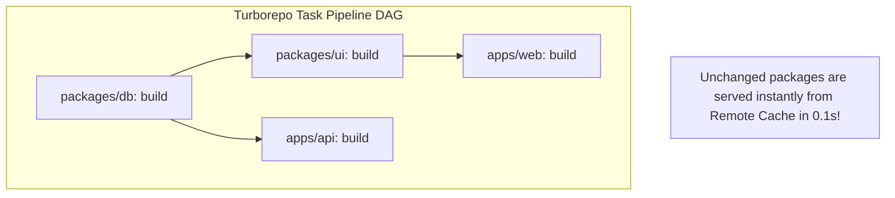

# Full-Stack Monorepo & Turborepo Architecture Skill

## Overview
This skill guides the AI agent in operating as a Fullstack Monorepo and Tooling Architect. As engineering teams grow, maintaining multiple disconnected repositories leads to fragmented types, duplicated libraries, and painful cross-repo releases. By organizing fullstack projects into a **Turborepo with pnpm workspaces**, teams share design systems, database schemas, and TypeScript types across web, mobile, and backend apps with blazing-fast **Remote Build Caching**.

---

## When to Use This Skill
- Managing multiple applications (Next.js web, admin portal, backend API, mobile Expo app) in a unified repository.
- Sharing database schemas (Prisma/Drizzle) and UI components across apps with zero code duplication.
- Slashing CI/CD pipeline build times from 20 minutes to $< 60$ seconds using Remote Caching.
- Enforcing consistent linting, formatting, and TypeScript configurations across an entire organization.

---

## Input Context Required
1. Application portfolio: Web frontends, backend microservices, mobile apps.
2. Package manager: **pnpm** (strongly recommended for symlinked hard-link speed and space savings) or Bun.
3. Target build system: Turborepo or Nx.

---

## Step-by-Step Execution Workflow

### Step 1: The Modern Monorepo Topology
Structure repositories into `apps/` (deployable services) and `packages/` (shared internal libraries):
```text
enterprise-monorepo/
├── apps/
│   ├── web/                   # Customer-facing Next.js App
│   ├── admin/                 # Internal Vite Admin Portal
│   └── api/                   # Fastify / Node.js Backend API
├── packages/
│   ├── ui/                    # Shared Tailwind React component library
│   ├── db/                    # Drizzle / Prisma ORM schema & migrations
│   ├── api-contracts/         # tRPC routers & Zod validation schemas
│   ├── tsconfig/              # Shared base tsconfig.json configurations
│   └── eslint-config/         # Shared ESLint & Prettier rules
├── package.json               # Root scripts & devDependencies
├── pnpm-workspace.yaml        # Workspace package patterns
└── turbo.json                 # Task execution pipeline DAG
```

### Step 2: pnpm Workspaces & Internal Linking
Declare workspace patterns in `pnpm-workspace.yaml`:
```yaml
packages:
  - "apps/*"
  - "packages/*"
```
- In `apps/web/package.json`, import internal packages cleanly using the workspace protocol:
  ```json
  {
    "dependencies": {
      "@enterprise/ui": "workspace:*",
      "@enterprise/db": "workspace:*",
      "@enterprise/api-contracts": "workspace:*"
    }
  }
  ```

### Step 3: Turborepo Pipeline Orchestration (`turbo.json`)
Define the Directed Acyclic Graph (DAG) for tasks:
- **`dependsOn: ["^build"]`**: Ensure dependencies build *before* the consumer builds.
- **`outputs`**: Specify which directories to cache (`dist/**`, `.next/**`).
- **`inputs`**: Specify which files trigger a cache invalidation.



### Step 4: Remote Build Caching in CI/CD
Never re-compile or re-test code that has not changed:
- Connect Turborepo to a Remote Cache (Vercel Remote Cache or self-hosted S3 cache).
- When an engineer or CI runner executes `pnpm build`, Turborepo checks the hash of all input files.
- If identical $\implies$ Turborepo downloads the cached build artifacts in 0.5s with a `>>> FULL TURBO` cache hit!

---

## Output Deliverables Template

Generate Turborepo Configuration (`turbo.json`):

```json
{
  "$schema": "https://turbo.build/schema.json",
  "ui": "tui",
  "tasks": {
    "topo": {
      "dependsOn": ["^topo"]
    },
    "build": {
      "dependsOn": ["^build"],
      "outputs": [".next/**", "!.next/cache/**", "dist/**", "build/**"],
      "env": ["NODE_ENV", "NEXT_PUBLIC_*"]
    },
    "test": {
      "dependsOn": ["^build"],
      "outputs": ["coverage/**"],
      "inputs": ["src/**/*.tsx", "src/**/*.ts", "test/**/*.ts"]
    },
    "lint": {
      "dependsOn": ["^topo"]
    },
    "typecheck": {
      "dependsOn": ["^topo"],
      "outputs": []
    },
    "dev": {
      "cache": false,
      "persistent": true
    }
  }
}
```

---

## Quality Checklist & Guardrails
- [ ] Are internal packages linked using the pnpm workspace protocol (`workspace:*`)?
- [ ] Does `turbo.json` declare task dependencies (`^build`) and outputs accurately?
- [ ] Is Remote Caching enabled in CI to eliminate redundant compilations?
- [ ] Are package exports properly typed using modern `exports` fields in `package.json`?
- [ ] Are circular dependencies between internal packages strictly prohibited?

---

## Companion Skills
- **Type-Safe RPC**: `51-end-to-end-type-safety-and-trpc`.
- **AST Codemods**: `48-ast-codemods-and-developer-tooling`.
- **Container CI/CD**: `20-containerization-and-devops`.
