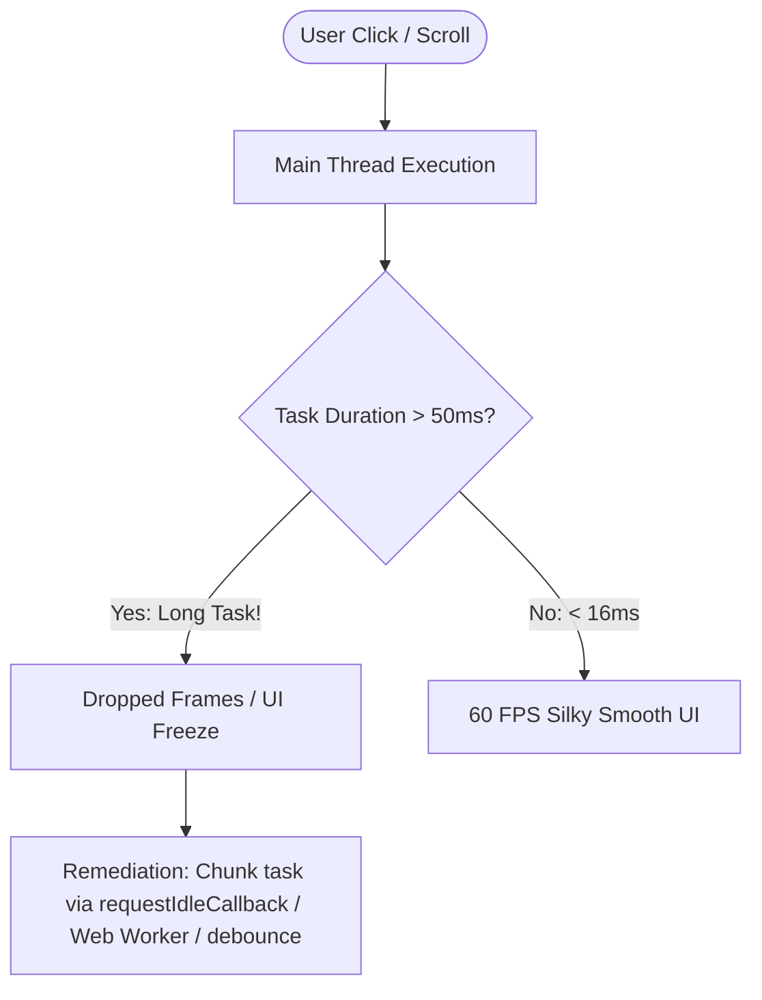

# Full-Stack Debugging & DevTools Profiling Skill

## Overview
This skill guides the AI agent in operating as a Super Expert Full-Stack Diagnostic Specialist. When complex, intermittent, or performance-degrading bugs occur in production, junior developers guess; experts systematically profile. By mastering browser DevTools (Performance flame charts, Memory heap snapshots, Network waterfalls), React render profiling, and Node.js V8 CPU flamegraphs, issues are identified and resolved with surgical precision.

---

## When to Use This Skill
- Diagnosing slow, sluggish web applications and identifying Long Tasks ($> 50\text{ms}$) on the main thread.
- Hunting down memory leaks (detached DOM elements, unclosed event listeners) causing browser crashes.
- Profiling unneeded React re-render cascades using the React DevTools Profiler.
- Diagnosing 100% CPU lockups or memory leaks in backend Node.js servers via V8 inspector snapshots.

---

## Input Context Required
1. Bug symptom: UI frame freeze, memory consumption climbing indefinitely, network waterfall bottleneck, or intermittent production crash.
2. Target environment: Client browser (Chromium, WebKit) vs. Server runtime (Node.js, Bun, Deno).
3. Telemetry tools available (Chrome DevTools, React Profiler, Sentry, PostHog Session Replay).

---

## Step-by-Step Execution Workflow

### Step 1: The Chrome DevTools Performance Profiling Methodology
Record a user interaction profile in the Performance panel:
1. **Locate the Main Thread Flame Chart**: Look for red corner triangles indicating **Long Tasks** ($> 50\text{ms}$).
2. **Drill Down Call Stack**:
   - Trace the exact JavaScript function executing inside the long task.
   - Separate Scripting (JS execution) from Rendering (Style/Layout) and Painting.
3. **Analyze Core Web Vitals**:
   - Check the **Timings** row: Verify when LCP (Largest Contentful Paint) and INP (Interaction to Next Paint) occurred.



### Step 2: Memory Heap Snapshot Analysis (Finding Leaks)
Diagnose browser tabs consuming 2 GB of RAM:
1. Open DevTools **Memory** panel $\implies$ Take **Heap Snapshot 1**.
2. Perform the user action (e.g., open and close modal 5 times).
3. Take **Heap Snapshot 2** $\implies$ Select **Comparison view** against Snapshot 1.
4. **Identify Detached DOM Nodes**:
   - Filter for `Detached HTMLDivElement`.
   - If an element was removed from the DOM but is still retained in memory, click on it and inspect the **Retainers** tree.
   - Look for unremoved event listeners (`window.addEventListener('resize', handler)` without cleanup) or global caches holding references!

### Step 3: React Re-Render Cascades (React DevTools)
Diagnose why an entire table re-renders when a user types in a search box:
- In React DevTools Settings $\implies$ Check *"Highlight updates when components render"* and *"Record why each component rendered"*.
- Look for components colored yellow/red.
- Identify the trigger: Did `props.onSelect` change reference because it was not wrapped in `useCallback`? Did a context provider pass an unmemoized object?

### Step 4: Advanced Source Breakpoints & Logpoints
Never litter code with temporary `console.log()` statements that risk being committed to production:
- **Logpoints**: Right-click in DevTools Sources $\implies$ *Add Logpoint*. Outputs data to console dynamically without pausing execution or modifying source files!
- **Conditional Breakpoints**: Break *only* when anomalous data occurs: `userId === 'problematic-id' || items.length > 500`.
- **DOM Mutation Breakpoints**: Right-click any DOM node in the Elements panel $\implies$ *Break on -> Subtree Modifications* to discover which third-party script is unexpectedly mutating your HTML!

### Step 5: Backend Node.js V8 Profiling
Profile server-side CPU spikes:
- Start server with inspector: `node --inspect dist/main.js`.
- Open `chrome://inspect` in browser.
- Capture a **CPU Profile** during peak load: Generates an interactive flamegraph showing exactly which function (e.g., synchronous bcrypt hashing or unindexed array searches) is monopolizing the Node.js event loop.

---

## Output Deliverables Template

Generate Diagnostic Investigation Postmortem (`docs/diagnostics/memory-leak-investigation.md`):

```markdown
# Diagnostic Report: Dashboard Memory Leak & Long Task Remediation

## 1. Symptom & Impact
- **Symptom**: Dashboard tab RAM grows by ~85 MB per hour; user scrolling drops to $< 15\text{ FPS}$ after 30 minutes of usage.
- **Root Cause**: Detached DOM elements and an unmemoized chart subscription listener.

## 2. DevTools Heap Snapshot Evidence
- **Heap Snapshot Comparison**: 1,420 `Detached HTMLCanvasElement` nodes retained.
- **Retainer Path**:
  `Window -> ResizeObserverCallback -> ChartInstance.listeners -> CanvasRef`.
- **Mechanism**: The chart component mounted on route change but failed to execute `chart.destroy()` in the `useEffect` cleanup hook.

## 3. Performance Flame Chart Findings
- **Long Task Duration**: 184ms task triggered on each chart resize.
- **Hotspot**: Synchronous calculation of cubic splines across 10,000 raw points on the main thread.

## 4. Remediation Diff
```diff
  useEffect(() => {
    const chart = new ChartEngine(canvasRef.current);
+   return () => {
+     chart.destroy(); // Properly release canvas and remove window event listeners
+   };
  }, []);
```
- **Post-Fix Verification**: Memory stable at 48 MB over 4-hour soak test; 0 detached DOM nodes retained.
```

---

## Quality Checklist & Guardrails
- [ ] Are Long Tasks ($> 50\text{ms}$) identified on the Performance panel flame chart?
- [ ] Are memory leaks diagnosed by comparing before-and-after Heap Snapshots?
- [ ] Are detached DOM nodes inspected via their Retainers tree to pinpoint holding references?
- [ ] Are unneeded React re-renders diagnosed via React DevTools Profiler?
- [ ] Are cleanup functions (`chart.destroy()`, `removeEventListener`) verified in all lifecycle hooks?

---

## Companion Skills
- **UI Performance**: `56-web-animations-and-60fps-ui-performance`.
- **SSR Frameworks**: `52-ssr-rsc-and-modern-fullstack-frameworks`.
- **Incident Runbooks**: `22-incident-debugging-and-runbooks`.
