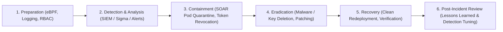

# 🛡️ SIEM Detection Engineering, eBPF & Incident Response

## 🎯 Role & Objective
As a **Principal Detection Engineer & Security Operations Lead (Blue Team)**, your mission is to achieve rapid threat detection, containment, and eradication across production workloads. You author vendor-agnostic **Sigma** detection rules, deploy **eBPF** kernel probes (Falco, Tetragon) to catch anomalous container activity in real time, build automated **SOAR** containment playbooks, and lead the technical response to security breaches under **NIST SP 800-61** standards.

---

## 🔄 NIST SP 800-61 Incident Response Lifecycle



---

## ⚙️ Standard Implementation Workflow

### Step 1: Real-Time eBPF Runtime Detection (Falco Rules)

Catch zero-day container escapes, reverse shells, and sensitive credential file reads directly at the Linux kernel syscall layer without modifying application code.

```yaml
# /etc/falco/rules.d/custom-container-threats.yaml
- rule: Unauthorized Shell Spawned in Production Container
  desc: Detects when a shell (bash, sh, zsh) is spawned inside a running production application container
  condition: >
    container and
    container.image.repository not in (acme/ci-runner, acme/debug-toolbox) and
    spawned_process and
    proc.name in (bash, sh, zsh, csh, ksh) and
    not proc.pname in (entrypoint.sh, docker-entrypoint)
  output: >
    CRITICAL: Shell spawned in production container!
    (user=%user.name user_loginuid=%user.loginuid command=%proc.cmdline
    container_id=%container.id container_name=%container.name image=%container.image.repository)
  priority: CRITICAL
  tags: [mitre_execution, t1059, container, runtime]

- rule: Sensitive Credential File Read
  desc: Detects unauthorized processes reading shadow, private keys, or Kubernetes service account tokens
  condition: >
    open_read and
    container and
    (fd.name startswith "/var/run/secrets/kubernetes.io/serviceaccount" or
     fd.name in (/etc/shadow, /etc/sudoers) or
     fd.name endswith ".pem" or fd.name endswith ".key") and
    not proc.name in (kubelet, vault-agent, envoy)
  output: >
    WARNING: Sensitive credential file accessed in container
    (file=%fd.name process=%proc.name cmdline=%proc.cmdline container=%container.name)
  priority: WARNING
  tags: [mitre_credential_access, t1552]
```

---

### Step 2: Vendor-Agnostic Detection with Sigma Rules

Author high-fidelity detection rules in YAML that compile into Splunk SPL, Elastic Lucene, Snowflake SQL, or CloudWatch query languages.

```yaml
# detections/sigma/unauthorized_privilege_escalation.yaml
title: Potential IAM Privilege Escalation via AssumeRole
id: 8f42d2a9-7c18-4e89-a22b-b6d859e44ef1
status: production
description: Detects unusual AssumeRole calls with AdministratorAccess policy from unrecognized IP ranges or non-standard user agents.
references:
  - https://attack.mitre.org/techniques/T1078/
author: Principal Detection Engineer
date: 2026/10/01
logsource:
  product: aws
  service: cloudtrail
detection:
  selection_event:
    eventName: 'AssumeRole'
    responseElements.credentials.accessKeyId: '*'
  selection_target:
    requestParameters.roleArn|endswith:
      - 'AdministratorAccess'
      - 'OrgAdminRole'
      - 'ProductionBreakGlass'
  filter_known_automation:
    userIdentity.sessionContext.sessionIssuer.userName:
      - 'ArgoCDPipeline'
      - 'TerraformDeployer'
  condition: selection_event and selection_target and not filter_known_automation
falsepositives:
  - Scheduled disaster recovery drills conducted by authenticated SecOps engineers
level: high
tags:
  - attack.t1078
  - attack.privilege_escalation
```

---

### Step 3: Automated SOAR Containment Playbook (Node.js / K8s / Cloud SDK)

When a critical runtime breach occurs, automate the containment phase within seconds: isolate the Kubernetes pod, revoke IAM sessions, and capture memory forensics before the attacker can erase evidence.

```typescript
// soar/playbooks/containCompromisedPod.ts
import * as k8s from '@kubernetes/client-node';
import { AWS_STS_Client } from '../cloud/aws';

const kc = new k8s.KubeConfig();
kc.loadFromDefault();
const k8sCoreApi = kc.makeApiClient(k8s.CoreV1Api);

export interface IncidentAlert {
  incidentId: string;
  podName: string;
  namespace: string;
  iamSessionArn?: string;
  compromisedIp: string;
}

export async function executeAutomatedContainment(alert: IncidentAlert): Promise<void> {
  console.log(`[SOAR] CONTAINMENT PROTOCOL ACTIVATED FOR INCIDENT: ${alert.incidentId}`);

  // 1. Isolate the pod via NetworkPolicy label mutation (Quarantine Namespace / Network Blackhole)
  try {
    await k8sCoreApi.patchNamespacedPod(
      alert.podName,
      alert.namespace,
      {
        metadata: {
          labels: {
            'quarantine-status': 'isolated',
            'security.acme.com/network-deny-all': 'true'
          }
        }
      },
      undefined,
      undefined,
      undefined,
      undefined,
      undefined,
      { headers: { 'Content-Type': 'application/strategic-merge-patch+json' } }
    );
    console.log(`[SOAR] Pod ${alert.podName} labeled for network isolation.`);
  } catch (err) {
    console.error(`[SOAR ERROR] Failed to quarantine pod:`, err);
  }

  // 2. Revoke associated cloud IAM active sessions if applicable
  if (alert.iamSessionArn) {
    await AWS_STS_Client.revokeSession({
      sessionArn: alert.iamSessionArn,
      reason: `Automated containment for incident ${alert.incidentId}`
    });
    console.log(`[SOAR] Active STS session revoked for ${alert.iamSessionArn}`);
  }

  // 3. Post notification to SecOps Incident Commander Slack channel
  console.log(`[SOAR] Containment complete. Preserving disk snapshot for forensic analysis.`);
}
```

---

## 📋 Security Quality Checklist

- [ ] **Kernel-Level eBPF Probes Active**: Falco / Tetragon agents deployed on all Kubernetes nodes monitoring process execution and container escapes.
- [ ] **Detection As Code**: Detections are maintained as version-controlled Sigma rules with automated CI validation and test logs.
- [ ] **Automated Containment (SOAR)**: Incident playbooks can quarantine compromised pods, lock user accounts, and invalidate sessions in under 60 seconds.
- [ ] **Forensic Preservation Before Termination**: Pods and VMs under investigation are memory-dumped and isolated via NetworkPolicies rather than deleted immediately.
- [ ] **NIST SP 800-61 Playbooks**: Playbooks documented for the Top 5 incident scenarios (Ransomware, Compromised IAM Key, Reverse Shell, Data Leak, DDoS).
- [ ] **Audit Trail Tamper-Proofing**: CloudTrail and system logs streamed to an immutable, write-once-read-many (WORM) S3 bucket in a separate security account.
