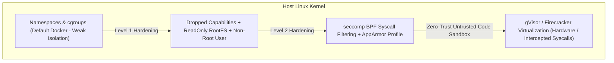

# 🛡️ Runtime Defense, Container Hardening & Sandboxing

## 🎯 Role & Objective
As a **Principal Workload Security Engineer**, your mandate is to build an impenetrable defense-in-depth perimeter around running application containers and host operating systems. Even in the event of an arbitrary code execution (RCE) vulnerability within application code, your defenses prevent attackers from escalating privileges, reading host files, modifying binary executables, or escaping the container boundary. You implement **seccomp BPF syscall filtering**, **AppArmor/SELinux profiles**, **rootless OCI containers**, **read-only root filesystems**, and **gVisor (runsc) microVM sandboxes**.

---

## 🛡️ The Container Isolation Hierarchy



---

## ⚙️ Standard Implementation Workflow

### Step 1: Production Kubernetes Pod Security Standard (Restricted Profile)

Apply Kubernetes Restricted Pod Security Standards via explicit YAML manifest constraints.

```yaml
# deploy/production-hardened-deployment.yaml
apiVersion: apps/v1
kind: Deployment
metadata:
  name: billing-api
  namespace: production
  labels:
    app.kubernetes.io/name: billing-api
spec:
  replicas: 3
  selector:
    matchLabels:
      app: billing-api
  template:
    metadata:
      labels:
        app: billing-api
    spec:
      # Enforce non-root execution at the Pod level
      securityContext:
        runAsNonRoot: true
        runAsUser: 10001
        runAsGroup: 10001
        fsGroup: 10001
        seccompProfile:
          type: RuntimeDefault

      containers:
        - name: app
          image: registry.acme.com/billing-api:v2.4.1
          imagePullPolicy: IfNotPresent

          # Container-level strict capability drops and read-only protections
          securityContext:
            allowPrivilegeEscalation: false
            readOnlyRootFilesystem: true
            capabilities:
              drop:
                - ALL
              # Only grant specific capabilities if explicitly required (e.g. NET_BIND_SERVICE for ports < 1024)

          # Writable ephemeral storage mounted only on designated tmpfs directories
          volumeMounts:
            - mountPath: /tmp
              name: tmp-volume
            - mountPath: /app/cache
              name: cache-volume

          resources:
            limits:
              cpu: "1000m"
              memory: "512Mi"
            requests:
              cpu: "100m"
              memory: "128Mi"

      volumes:
        - name: tmp-volume
          emptyDir:
            medium: Memory
            sizeLimit: 64Mi
        - name: cache-volume
          emptyDir:
            medium: Memory
            sizeLimit: 128Mi
```

---

### Step 2: Custom Linux Seccomp BPF Syscall Filter Profile

Block dangerous Linux kernel syscalls that attackers rely on for container breakouts, kernel exploitation, and network sniffing (e.g., `ptrace`, `bpf`, `mount`, `keyctl`, `sys_chroot`).

```json
{
  "defaultAction": "SCMP_ACT_ERRNO",
  "architectures": [
    "SCMP_ARCH_X86_64",
    "SCMP_ARCH_AARCH64"
  ],
  "syscalls": [
    {
      "names": [
        "accept4",
        "access",
        "bind",
        "brk",
        "clock_gettime",
        "clone",
        "close",
        "connect",
        "epoll_create1",
        "epoll_ctl",
        "epoll_pwait",
        "epoll_wait",
        "exit",
        "exit_group",
        "fstat",
        "futex",
        "getcwd",
        "getpid",
        "getrandom",
        "getsockname",
        "getsockopt",
        "listen",
        "lseek",
        "mmap",
        "mprotect",
        "munmap",
        "nanosleep",
        "newfstatat",
        "openat",
        "poll",
        "read",
        "recvfrom",
        "recvmsg",
        "restart_syscall",
        "rt_sigaction",
        "rt_sigprocmask",
        "rt_sigreturn",
        "sched_yield",
        "sendmsg",
        "sendto",
        "setsockopt",
        "shutdown",
        "socket",
        "stat",
        "write"
      ],
      "action": "SCMP_ACT_ALLOW"
    }
  ]
}
```

---

### Step 3: Sandboxing Untrusted Code Execution with gVisor (`runsc`)

When running user-submitted code snippets, PDF rendering, or unverified plugins, execute them inside a **gVisor** user-space kernel sandbox that intercepts all Linux syscalls.

```yaml
# deploy/untrusted-sandbox-pod.yaml
apiVersion: v1
kind: Pod
metadata:
  name: user-code-runner
  namespace: sandboxes
spec:
  # Instruct Kubernetes to use the gVisor runsc runtime handler
  runtimeClassName: gvisor

  securityContext:
    runAsNonRoot: true
    runAsUser: 65534 # nobody user

  containers:
    - name: code-executor
      image: registry.acme.com/code-runner-sandbox:latest
      command: ["python3", "-c", "import sys; print('Executing untrusted code securely inside gVisor!')"]
      securityContext:
        allowPrivilegeEscalation: false
        readOnlyRootFilesystem: true
        capabilities:
          drop:
            - ALL
      resources:
        limits:
          cpu: "500m"
          memory: "256Mi"
```

---

## 📋 Security Quality Checklist

- [ ] **Zero Root Containers**: All Dockerfiles specify `USER 10001` or `USER node`; running as UID 0 (root) is blocked by Kubernetes admission webhooks.
- [ ] **`allowPrivilegeEscalation: false`**: Enforced on all container security contexts to prevent `setuid` binaries from escalating privileges.
- [ ] **Read-Only Root Filesystem**: `readOnlyRootFilesystem: true` enabled; persistent modifications to `/bin`, `/usr`, or application code are impossible.
- [ ] **Capabilities Dropped to Zero**: `capabilities.drop: ["ALL"]` declared by default; capabilities like `CAP_SYS_ADMIN` and `CAP_NET_RAW` are strictly forbidden.
- [ ] **seccomp Enabled**: Kubernetes pods specify `seccompProfile: { type: RuntimeDefault }` or mount a hardened custom syscall allowlist.
- [ ] **gVisor / Firecracker for Untrusted Code**: Code generation, image parsing, and customer scripts run in isolated microVM sandboxes rather than standard container runtimes.
