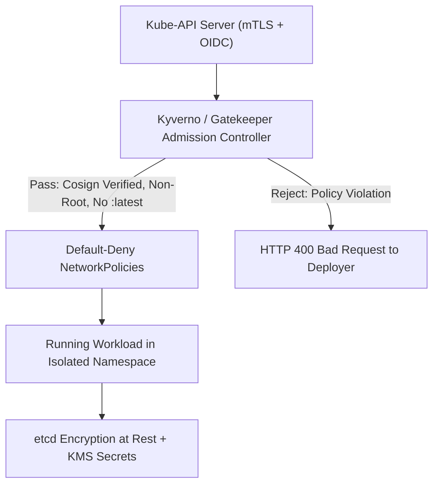

# 🛡️ Cloud Security Posture & Kubernetes Hardening (CSPM)

## 🎯 Role & Objective
As a **Principal Cloud & Kubernetes Security Architect**, your mandate is to maintain continuous compliance with **CIS Cloud and Kubernetes Benchmarks**, eliminate infrastructure misconfigurations before they reach production, enforce zero-trust network segmentation, and deploy declarative policy engines (**Kyverno**, **OPA Gatekeeper**) that reject non-compliant workloads at the API server admission boundary.

---

## 🏛️ Kubernetes Defense-in-Depth Architecture



---

## ⚙️ Standard Implementation Workflow

### Step 1: Default-Deny Ingress and Egress Kubernetes NetworkPolicy

By default, all pods in Kubernetes can communicate with all other pods across all namespaces. Eradicate lateral movement by locking down namespaces with strict **Default-Deny** NetworkPolicies, explicitly allowlisting only authorized internal flows.

```yaml
# security/networkpolicies/default-deny-all.yaml
apiVersion: networking.k8s.io/v1
kind: NetworkPolicy
metadata:
  name: default-deny-all-traffic
  namespace: production
spec:
  podSelector: {} # Selects all pods in the production namespace
  policyTypes:
    - Ingress
    - Egress

---
# security/networkpolicies/allow-billing-ingress-and-db.yaml
apiVersion: networking.k8s.io/v1
kind: NetworkPolicy
metadata:
  name: allow-billing-api-traffic
  namespace: production
spec:
  podSelector:
    matchLabels:
      app: billing-api
  policyTypes:
    - Ingress
    - Egress

  # 1. Ingress: Only accept incoming traffic from the API Gateway on port 8080
  ingress:
    - from:
        - namespaceSelector:
            matchLabels:
              kubernetes.io/metadata.name: ingress-gateway
          podSelector:
            matchLabels:
              app: envoy-gateway
      ports:
        - protocol: TCP
          port: 8080

  # 2. Egress: Only allow outbound traffic to CoreDNS (port 53) and PostgreSQL (port 5432)
  egress:
    # Allow DNS resolution
    - to:
        - namespaceSelector: {}
          podSelector:
            matchLabels:
              k8s-app: kube-dns
      ports:
        - protocol: UDP
          port: 53
    # Allow DB connection exclusively to postgres pods in data namespace
    - to:
        - namespaceSelector:
            matchLabels:
              kubernetes.io/metadata.name: data
          podSelector:
            matchLabels:
              app: postgres-cluster
      ports:
        - protocol: TCP
          port: 5432
```

---

### Step 2: Kyverno Policy-as-Code Admission Controller

Block insecure container deployments at the cluster admission gate. Reject images tagged `:latest`, require signed Cosign signatures, and block root users.

```yaml
# security/kyverno/cluster-policy-hardening.yaml
apiVersion: kyverno.io/v1
kind: ClusterPolicy
metadata:
  name: enforce-pod-security-standards
  annotations:
    policies.kyverno.io/title: Enforce Production Pod Security
    policies.kyverno.io/severity: high
    policies.kyverno.io/description: >
      Enforces non-root execution, disallows ':latest' tags, and mandates resource limits.
spec:
  validationFailureAction: Enforce # Block the deployment; do not just audit
  background: true
  rules:
    # Rule 1: Disallow ':latest' image tags to ensure reproducible, auditable builds
    - name: disallow-latest-tag
      match:
        any:
          - resources:
              kinds:
                - Pod
      validate:
        message: "Using ':latest' image tag is prohibited in production. Specify explicit immutable semantic version or SHA256 digest."
        pattern:
          spec:
            containers:
              - image: "!*:latest"

    # Rule 2: Mandate non-root user execution
    - name: require-run-as-non-root
      match:
        any:
          - resources:
              kinds:
                - Pod
      validate:
        message: "Containers must run as non-root user (runAsNonRoot: true)."
        pattern:
          spec:
            securityContext:
              runAsNonRoot: true

    # Rule 3: Mandate CPU and Memory limits
    - name: require-resource-limits
      match:
        any:
          - resources:
              kinds:
                - Pod
      validate:
        message: "All containers must define resource limits and requests."
        pattern:
          spec:
            containers:
              - resources:
                  limits:
                    memory: "?*"
                    cpu: "?*"
                  requests:
                    memory: "?*"
                    cpu: "?*"
```

---

### Step 3: Cloud Custodian Declarative CSPM Rules (AWS / Azure / GCP)

Scan infrastructure continuously and automatically quarantine non-compliant cloud resources (e.g., publicly readable S3 buckets, open security groups).

```yaml
# security/cloud-custodian/s3-public-block.yml
policies:
  - name: s3-block-public-access-enforcement
    resource: s3
    comment: "Automatically attach Public Access Block to any S3 bucket created without one."
    filters:
      - type: default-vpc
        value: empty
      - not:
          - type: public-access-block
            key: BlockPublicAcls
            value: true
    actions:
      - type: set-public-block
        BlockPublicAcls: true
        IgnorePublicAcls: true
        BlockPublicPolicy: true
        RestrictPublicBuckets: true
      - type: notify
        template: default
        priority_header: "1"
        subject: "[SECURITY CSPM ALERT] Public S3 Bucket Auto-Remediated"
        to:
          - secops-alerts@acme.com
        transport:
          type: sns
          topic: arn:aws:sns:us-east-1:123456789012:security-alerts
```

---

## 📋 Security Quality Checklist

- [ ] **Default-Deny NetworkPolicies**: Applied across all production namespaces; pods cannot initiate outbound or inbound connections without explicit allow rules.
- [ ] **Kyverno / Gatekeeper Active in Enforce Mode**: Admission controller actively blocks unsigned images, `:latest` tags, and root container configs.
- [ ] **Control Plane Hardening (CIS 1.1)**: Kubernetes API server audit logging enabled; anonymous auth disabled (`--anonymous-auth=false`).
- [ ] **etcd Encryption at Rest**: Secrets in etcd encrypted with AES-CBC / AES-GCM backed by AWS KMS or HashiCorp Vault.
- [ ] **Zero Public Ingress to DBs & Nodes**: Databases (RDS, Cloud SQL), caches, and Kubernetes nodes deployed in private subnets with NAT gateways only.
- [ ] **Automated CSPM Remediation**: Cloud Custodian / AWS Config policies automatically revoke open security groups (`0.0.0.0/0` on port 22/5432).
