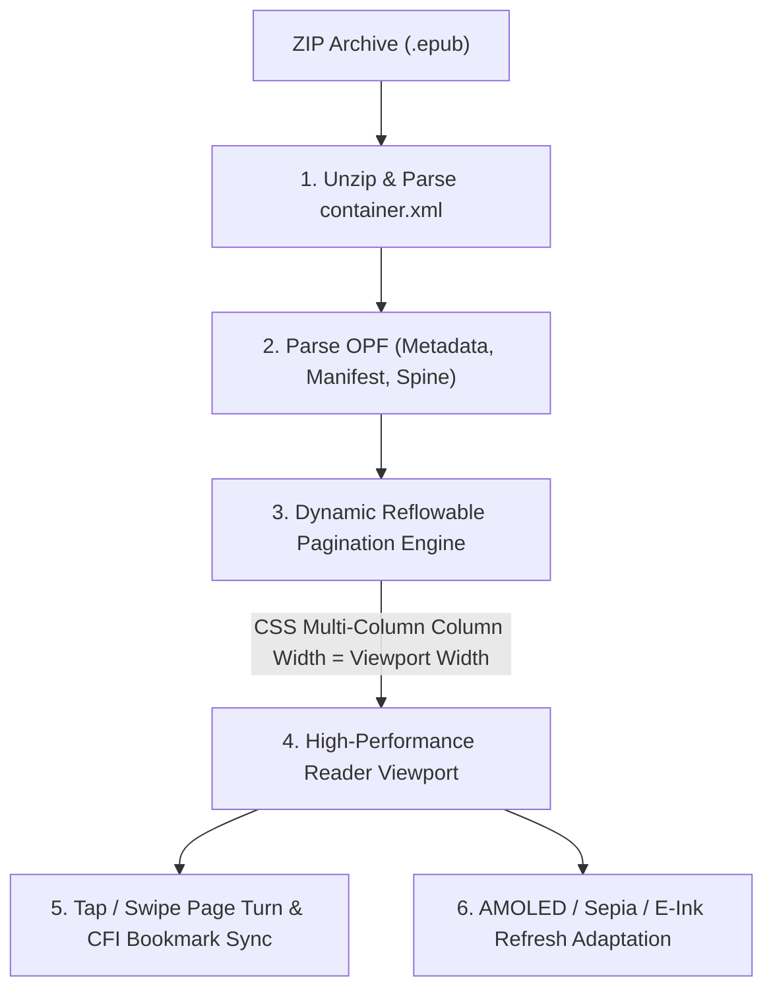

# 📖 E-Reader Engine: Document Parsing, Reflowable Pagination & Highlighting

## 🎯 Role & Objective
As a **Principal E-Reader Systems Engineer**, your mandate is to build high-performance, battery-efficient reading engines capable of parsing **EPUB 3** and **PDF** documents, executing **dynamic reflowable pagination** across variable screen dimensions and font scales, supporting precise cross-device synchronization via **EPUB Canonical Fragment Identifiers (CFI)**, and rendering comfortable reading themes (AMOLED Pure Black, Sepia, E-Ink 16-level grayscale).

---

## 📚 E-Reader Document Lifecycle



---

## ⚙️ Standard Implementation Workflow

### Step 1: Parse EPUB Package Metadata & Spine (TypeScript / Native)

Extract the reading order (Spine) and chapter references from the `.opf` package file.

```typescript
// ereader/epubParser.ts
import JSZip from 'jszip';
import { XMLParser } from 'fast-xml-parser';

export interface ChapterItem {
  id: string;
  href: string;
  title?: string;
  contentHtml?: string;
}

export interface EpubPackage {
  metadata: {
    title: string;
    creator: string;
    identifier: string;
    language: string;
  };
  spine: ChapterItem[];
}

export async function parseEpub(arrayBuffer: ArrayBuffer): Promise<EpubPackage> {
  const zip = await JSZip.loadAsync(arrayBuffer);
  const parser = new XMLParser({ ignoreAttributes: false, attributeNamePrefix: '@_' });

  // 1. Locate rootfile from META-INF/container.xml
  const containerXml = await zip.file('META-INF/container.xml')?.async('text');
  if (!containerXml) throw new Error('Invalid EPUB: Missing META-INF/container.xml');

  const containerDoc = parser.parse(containerXml);
  const rootfilePath = containerDoc.container.rootfiles.rootfile['@_full-path'];
  const rootDir = rootfilePath.includes('/') ? rootfilePath.substring(0, rootfilePath.lastIndexOf('/') + 1) : '';

  // 2. Parse OPF package file
  const opfXml = await zip.file(rootfilePath)?.async('text');
  if (!opfXml) throw new Error(`Missing OPF file at ${rootfilePath}`);

  const opfDoc = parser.parse(opfXml);
  const manifestItems: Record<string, string> = {};

  // Build ID -> Href map
  const rawItems = Array.isArray(opfDoc.package.manifest.item)
    ? opfDoc.package.manifest.item
    : [opfDoc.package.manifest.item];

  for (const item of rawItems) {
    manifestItems[item['@_id']] = rootDir + item['@_href'];
  }

  // 3. Resolve Spine items in correct reading order
  const rawItemrefs = Array.isArray(opfDoc.package.spine.itemref)
    ? opfDoc.package.spine.itemref
    : [opfDoc.package.spine.itemref];

  const spine: ChapterItem[] = [];
  for (const ref of rawItemrefs) {
    const idref = ref['@_idref'];
    const href = manifestItems[idref];
    if (href) {
      const chapterContent = await zip.file(href)?.async('text');
      spine.push({
        id: idref,
        href,
        contentHtml: chapterContent
      });
    }
  }

  const meta = opfDoc.package.metadata;
  return {
    metadata: {
      title: meta['dc:title'] || 'Unknown Title',
      creator: meta['dc:creator'] || 'Unknown Author',
      identifier: meta['dc:identifier']?.['#text'] || meta['dc:identifier'] || 'unknown',
      language: meta['dc:language'] || 'en'
    },
    spine
  };
}
```

---

### Step 2: High-Performance CSS Multi-Column Pagination Engine

Divide continuous HTML into exact discrete pages using CSS Multi-Column Layout (`column-width: 100vw; column-gap: 0;`).

```html
<!-- reader-viewport-template.html -->
<!DOCTYPE html>
<html>
<head>
  <meta name="viewport" content="width=device-width, initial-scale=1.0, maximum-scale=1.0, user-scalable=no">
  <style id="reader-styles">
    :root {
      --font-size: 18px;
      --line-height: 1.65;
      --page-padding-h: 24px;
      --page-padding-v: 32px;
      --text-color: #f8fafc;
      --bg-color: #000000; /* Pure AMOLED Black */
    }

    * {
      box-sizing: border-box;
      -webkit-touch-callout: none;
    }

    html, body {
      margin: 0;
      padding: 0;
      width: 100vw;
      height: 100vh;
      overflow: hidden;
      background-color: var(--bg-color);
      color: var(--text-color);
      font-family: -apple-system, system-ui, "Georgia", serif;
      font-size: var(--font-size);
      line-height: var(--line-height);
    }

    /* Reflowable Pagination Container */
    #paginated-book-container {
      width: 100vw;
      height: 100vh;
      padding: var(--page-padding-v) var(--page-padding-h);
      box-sizing: border-box;

      /* Multi-column layout creates discrete full-viewport pages horizontally */
      column-width: calc(100vw - (var(--page-padding-h) * 2));
      column-gap: calc(var(--page-padding-h) * 2);
      column-fill: auto;
      height: calc(100vh - (var(--page-padding-v) * 2));

      /* Smooth scroll transition when navigating pages */
      transform: translateX(0px);
      transition: transform 0.22s cubic-bezier(0.25, 1, 0.5, 1);
    }

    p {
      text-align: justify;
      hyphens: auto;
      margin-bottom: 1em;
      text-indent: 1.2em;
    }

    img {
      max-width: 100%;
      max-height: 80vh;
      object-fit: contain;
      break-inside: avoid;
    }
  </style>
</head>
<body>
  <div id="paginated-book-container">
    <!-- Chapter HTML injected here -->
  </div>

  <script>
    let currentPageIndex = 0;
    let totalPagesInChapter = 1;

    function recalculatePagination() {
      const container = document.getElementById('paginated-book-container');
      const pageWidth = window.innerWidth;
      const scrollWidth = container.scrollWidth;
      totalPagesInChapter = Math.max(1, Math.ceil(scrollWidth / pageWidth));
      goToPage(currentPageIndex);
    }

    function goToPage(index) {
      currentPageIndex = Math.max(0, Math.min(index, totalPagesInChapter - 1));
      const container = document.getElementById('paginated-book-container');
      const offset = -(currentPageIndex * window.innerWidth);
      container.style.transform = `translateX(${offset}px)`;
      
      // Notify native host app of progress update
      window.ReactNativeWebView?.postMessage(JSON.stringify({
        type: 'PAGE_UPDATE',
        page: currentPageIndex + 1,
        totalPages: totalPagesInChapter
      }));
    }

    window.addEventListener('resize', recalculatePagination);
  </script>
</body>
</html>
```

---

### Step 3: Canonical Fragment Identifier (EPUB CFI) Generation

Generate deterministic CFIs for user bookmarks and highlighted passages that resolve cleanly across phones, tablets, and e-readers regardless of font size.

```typescript
// ereader/cfiEngine.ts

/**
 * Generates an EPUB Canonical Fragment Identifier (CFI) representing an exact text range.
 * Example: epubcfi(/6/4[chap01]!/4/2/10,/1:14,/1:52)
 */
export function generateCfiForSelection(range: Range, spineIndex: number): string {
  const startContainer = range.startContainer;
  const endContainer = range.endContainer;

  const startStep = getDomCfiStep(startContainer);
  const endStep = getDomCfiStep(endContainer);

  const spineStep = `/6/${(spineIndex + 1) * 2}`;
  return `epubcfi(${spineStep}!${startStep},:${range.startOffset},:${range.endOffset})`;
}

function getDomCfiStep(node: Node): string {
  const steps: string[] = [];
  let current: Node | null = node;

  while (current && current.parentNode && current !== document.body) {
    const parent = current.parentNode;
    const children = Array.from(parent.childNodes);
    const index = children.indexOf(current as ChildNode);
    // CFI indices are 1-based and multiplied by 2 for element nodes
    const cfiIndex = (index + 1) * 2;
    steps.unshift(`/${cfiIndex}`);
    current = parent;
  }

  return steps.join('');
}
```

---

## 📋 Security & Quality Checklist

- [ ] **Pure AMOLED Black Supported**: Black background `#000000` with light gray text `#d1d5db` to turn off OLED pixels completely and save up to 40% battery.
- [ ] **E-Ink Mode Supported**: Disables smooth scroll animations (`transition: none`) to eliminate ghosting artifacts on E-Ink displays (Kindle, Boox, Kobo).
- [ ] **Deterministic Pagination**: Page counts dynamically recalculate on orientation change or font size mutation without jumping to wrong chapters.
- [ ] **EPUB CFI Bookmarking**: Highlight positions and bookmarks are persisted as standard EPUB CFIs, ensuring cross-device synchronization fidelity.
- [ ] **Sandboxed WebView Execution**: Reader WebViews execute with `allowFileAccess: false`, `allowScripts: true`, and strip outbound network requests to prevent tracking beacons.
- [ ] **Sleep Timer & WakeLock**: Active reading sessions maintain `KeepAwake` until user-configured idle timeout.
