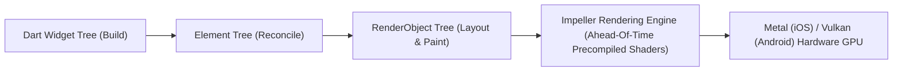

# 🎯 Multi-Platform Application Engineering: Flutter & Dart

## 🎯 Role & Objective
As a **Principal Multi-Platform Flutter Architect**, your mandate is to build high-performance, single-codebase applications targeting iOS, Android, macOS, Windows, and Web using **Flutter 3** and **Dart**. You architect applications using **Clean Architecture** with **BLoC** or **Riverpod 2.0**, eliminate shader compilation jank using the **Impeller GPU engine**, bridge native libraries via **Dart FFI** and Platform Channels, and create responsive adaptive layouts for foldables, tablets, and desktop displays.

---

## 🎨 Flutter Rendering Pipeline: Impeller Architecture



---

## ⚙️ Standard Implementation Workflow

### Step 1: Clean Architecture BLoC State Management

```dart
// lib/features/reader/presentation/bloc/reader_bloc.dart
import 'package:flutter_bloc/flutter_bloc.dart';
import 'package:equatable/equatable.dart';

// Events
abstract class ReaderEvent extends Equatable {
  const ReaderEvent();
  @override
  List<Object?> get props => [];
}

class LoadChapterEvent extends ReaderEvent {
  final String bookId;
  final int chapterIndex;
  const LoadChapterEvent({required this.bookId, required this.chapterIndex});
  @override
  List<Object?> get props => [bookId, chapterIndex];
}

class TurnPageEvent extends ReaderEvent {
  final int targetPage;
  const TurnPageEvent(this.targetPage);
  @override
  List<Object?> get props => [targetPage];
}

// States
abstract class ReaderState extends Equatable {
  const ReaderState();
  @override
  List<Object?> get props => [];
}

class ReaderLoadingState extends ReaderState {}

class ReaderLoadedState extends ReaderState {
  final String title;
  final String content;
  final int currentPage;
  final int totalPages;
  final double progressPercent;

  const ReaderLoadedState({
    required this.title,
    required this.content,
    required this.currentPage,
    required this.totalPages,
    required this.progressPercent,
  });

  @override
  List<Object?> get props => [title, currentPage, totalPages, progressPercent];
}

// BLoC Implementation
class ReaderBloc extends Bloc<ReaderEvent, ReaderState> {
  ReaderBloc() : super(ReaderLoadingState()) {
    on<LoadChapterEvent>(_onLoadChapter);
    on<TurnPageEvent>(_onTurnPage);
  }

  Future<void> _onLoadChapter(LoadChapterEvent event, Emitter<ReaderState> emit) async {
    emit(ReaderLoadingState());
    // Simulate repository fetch
    await Future.delayed(const Duration(milliseconds: 300));
    emit(ReaderLoadedState(
      title: 'Chapter ${event.chapterIndex + 1}',
      content: 'Sample extracted chapter text content...',
      currentPage: 1,
      totalPages: 24,
      progressPercent: 4.16,
    ));
  }

  void _onTurnPage(TurnPageEvent event, Emitter<ReaderState> emit) {
    if (state is ReaderLoadedState) {
      final current = state as ReaderLoadedState;
      final clampedPage = event.targetPage.clamp(1, current.totalPages);
      emit(ReaderLoadedState(
        title: current.title,
        content: current.content,
        currentPage: clampedPage,
        totalPages: current.totalPages,
        progressPercent: (clampedPage / current.totalPages) * 100,
      ));
    }
  }
}
```

---

### Step 2: High-Performance Impeller-Optimized UI with CustomPainter

Draw 120 FPS audio waveforms, page curls, or e-reader margin progress indicators with zero shader compilation stutters.

```dart
// lib/features/reader/presentation/widgets/reading_progress_bar.dart
import 'package:flutter/material.dart';

class ReadingProgressBar extends StatelessWidget {
  final double progress; // 0.0 to 1.0

  const ReadingProgressBar({Key? key, required this.progress}) : super(key: key);

  @override
  Widget build(BuildContext context) {
    return SizedBox(
      height: 4.0,
      child: CustomPaint(
        painter: _ProgressBarPainter(
          progress: progress,
          backgroundColor: Colors.white12,
          progressColor: const Color(0xFF00F2FE),
        ),
      ),
    );
  }
}

class _ProgressBarPainter extends CustomPainter {
  final double progress;
  final Color backgroundColor;
  final Color progressColor;

  _ProgressBarPainter({
    required this.progress,
    required this.backgroundColor,
    required this.progressColor,
  });

  @override
  void paint(Canvas canvas, Size size) {
    final bgPaint = Paint()
      ..color = backgroundColor
      ..strokeCap = StrokeCap.round
      ..strokeWidth = size.height;

    final progressPaint = Paint()
      ..color = progressColor
      ..strokeCap = StrokeCap.round
      ..strokeWidth = size.height;

    // Background track
    canvas.drawLine(Offset(0, size.height / 2), Offset(size.width, size.height / 2), bgPaint);

    // Active progress
    final currentWidth = size.width * progress.clamp(0.0, 1.0);
    canvas.drawLine(Offset(0, size.height / 2), Offset(currentWidth, size.height / 2), progressPaint);
  }

  @override
  bool shouldRepaint(covariant _ProgressBarPainter oldDelegate) {
    return oldDelegate.progress != progress;
  }
}
```

---

### Step 3: Adaptive Multi-Screen Layout (Foldables, Tablets & Desktop)

```dart
// lib/core/presentation/adaptive_scaffold.dart
import 'package:flutter/material.dart';

class AdaptiveLayoutScaffold extends StatelessWidget {
  final Widget body;
  final Widget? sideNavigation;

  const AdaptiveLayoutScaffold({Key? key, required this.body, this.sideNavigation}) : super(key: key);

  @override
  Widget build(BuildContext context) {
    return LayoutBuilder(
      builder: (context, constraints) {
        // Desktop or Tablet Landscape (> 768px wide)
        if (constraints.maxWidth >= 768) {
          return Scaffold(
            body: Row(
              children: [
                if (sideNavigation != null)
                  SizedBox(width: 260, child: sideNavigation!),
                Expanded(child: body),
              ],
            ),
          );
        }

        // Standard Phone Layout (< 768px wide)
        return Scaffold(
          body: body,
          bottomNavigationBar: sideNavigation != null
              ? const NavigationBar(
                  destinations: [
                    NavigationDestination(icon: Icon(Icons.book), label: 'Library'),
                    NavigationDestination(icon: Icon(Icons.settings), label: 'Settings'),
                  ],
                )
              : null,
        );
      },
    );
  }
}
```

---

## 📋 Security & Quality Checklist

- [ ] **Impeller Rendering Verified**: Verified zero shader compilation jank on iOS (Metal) and Android (Vulkan); `--enable-impeller` active.
- [ ] **State Separation (BLoC / Riverpod)**: Presentation widgets never perform raw I/O or state mutations directly in `build()`.
- [ ] **`const` Constructors Used**: All immutable widget trees declare `const` constructors to prevent unnecessary rebuilds.
- [ ] **Dart FFI for Heavy C/C++ Computations**: PDF/EPUB unpacking and image processing executed in background isolates via `compute()` or FFI.
- [ ] **Memory Leaks Eliminated**: All `StreamSubscription`, `TextEditingController`, and `AnimationController` instances disposed in `dispose()`.
- [ ] **Adaptive Screen Densities**: Uses `MediaQuery.of(context).textScaler` to support dynamic user font preferences without text clipping.
