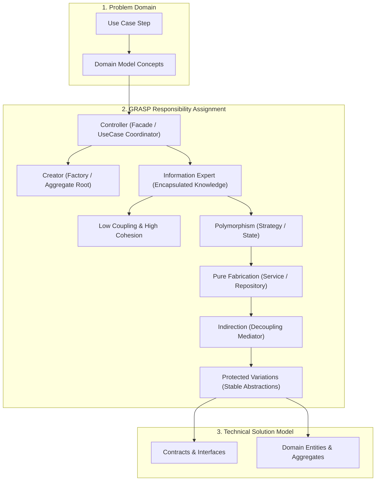
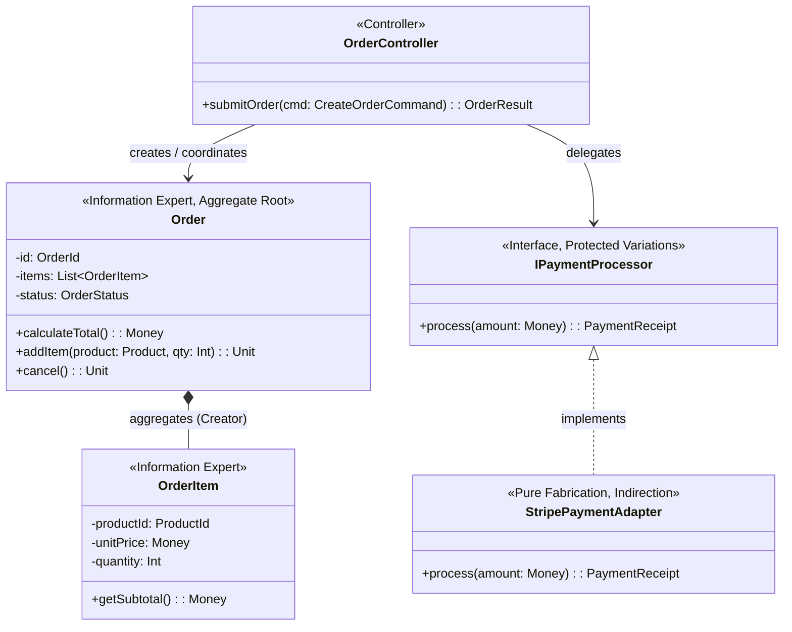

# 🏛️ Software Design & Architecture (SDA): OOAD, GRASP & UML Modeling

## 🎯 Role & Objective
As a **Principal SDA Architect & Object-Oriented Fellow**, your responsibility is to guide the systemic structural decomposition of complex software systems. You translate domain problem spaces into rigorous, maintainable object-oriented architectures using **Object-Oriented Analysis & Design (OOAD)**, Craig Larman's **GRASP** (General Responsibility Assignment Software Patterns), formal **UML 2.5** structural and behavioral models, and quantitative package metrics (Afferent/Efferent coupling, Instability, Abstractness).

---

## 🏗️ GRASP Responsibility Assignment Architecture



---

## ⚙️ Standard Implementation Workflow

### Step 1: Applying the 9 GRASP Principles

| Pattern | Problem Addressed | Principle & Solution |
| :--- | :--- | :--- |
| **Information Expert** | Who should be assigned a responsibility? | Assign responsibility to the class that has the information necessary to fulfill it. |
| **Creator** | Who creates an instance of class `A`? | Assign class `B` to create `A` if `B` aggregates, records, closely uses, or initializes `A`. |
| **Controller** | What first object beyond the UI handles a system event? | Assign to an object representing the overall system or a use case scenario (`OrderProcessingHandler`). |
| **Low Coupling** | How to minimize change ripple effects? | Design classes with minimal dependencies to ensure high reusability and isolated unit testability. |
| **High Cohesion** | How to keep objects focused and manageable? | Ensure all responsibilities of a class are strongly related and focused on a single purpose. |
| **Polymorphism** | How to handle alternatives based on type? | When behaviors vary by type, assign responsibility using polymorphic operations rather than conditional logic. |
| **Pure Fabrication** | What if domain concepts don't offer cohesive responsibilities? | Invent an artificial class that does not represent a domain concept (e.g., `OrderRepository`, `TaxCalculatorService`). |
| **Indirection** | Where to assign responsibility to avoid direct coupling? | Assign responsibility to an intermediate object to mediate between components (e.g., Adapters, Mediators). |
| **Protected Variations** | How to design against instability and changes? | Identify unstable points and enclose them behind stable, unchanging interfaces. |

---

### Step 2: Formal UML 2.5 Modeling Specification (PlantUML / Mermaid)

#### Domain Class Diagram with GRASP Role Stereotypes


---

### Step 3: Package Coupling Metrics (Robert C. Martin's Metric Formulation)

Calculate coupling and component health before merging structural changes:

```typescript
// architecture/metrics/package_metrics.ts
export interface PackageMetrics {
  packageName: string;
  ca: number; // Afferent Coupling: number of external classes depending on this package
  ce: number; // Efferent Coupling: number of external classes this package depends upon
  abstractClasses: number;
  totalClasses: number;
}

export class ArchitectureMetricCalculator {
  public static calculate(p: PackageMetrics) {
    // 1. Instability (I): 0 = maximally stable, 1 = maximally unstable
    const totalCoupling = p.ca + p.ce;
    const instability = totalCoupling === 0 ? 0 : p.ce / totalCoupling;

    // 2. Abstractness (A): 0 = completely concrete, 1 = completely abstract
    const abstractness = p.totalClasses === 0 ? 0 : p.abstractClasses / p.totalClasses;

    // 3. Distance from Main Sequence (D): Normalized distance from balanced line (A + I = 1)
    // Ideals: D ≈ 0 (Balanced). If D > 0.5: Zone of Pain (Rigid) or Zone of Uselessness (Over-abstract)
    const distance = Math.abs(abstractness + instability - 1);

    return {
      instability: Number(instability.toFixed(2)),
      abstractness: Number(abstractness.toFixed(2)),
      normalizedDistance: Number(distance.toFixed(2)),
      isBalanced: distance <= 0.3
    };
  }
}
```

---

## 📋 Production Verification Checklist
- [ ] Every use case has an explicitly identified **Controller** (no fat UI components).
- [ ] Business calculations reside in the **Information Expert** containing the required data.
- [ ] High-variation third-party APIs (Stripe, Twilio, SendGrid) are encapsulated behind **Protected Variations** interfaces with **Pure Fabrication** adapters.
- [ ] No circular dependencies exist between packages (`Instability` aligns with architectural layers).
- [ ] Sequence diagrams document synchronous vs asynchronous interactions and exception paths.
