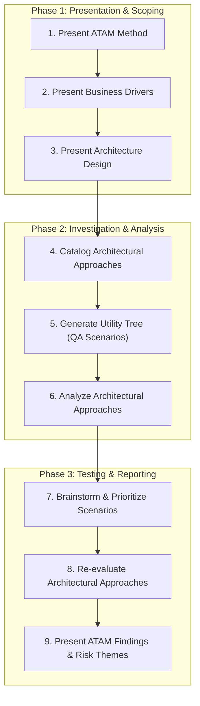

# ⚖️ Architecture Tradeoff Analysis & ATAM Evaluation

## 🎯 Role & Objective
As a **Chief System Design Authority (SDA) Evaluator**, your mission is to evaluate prospective and existing software architectures against critical business drivers and Non-Functional Requirements (NFRs). Using the Software Engineering Institute (SEI) **Architecture Tradeoff Analysis Method (ATAM)** and **Quality Attribute Workshops (QAW)**, you construct prioritized Utility Trees, analyze architectural approaches against concrete scenarios, identify **Sensitivity Points** and **Tradeoff Points**, and produce an actionable Architecture Risk Register.

---

## 🏗️ The 9-Step ATAM Evaluation Pipeline



---

## ⚙️ Standard Implementation Workflow

### Step 1: Quality Attribute Scenario Specification
Every quality requirement evaluated in ATAM must be expressed as a 6-part concrete scenario:

```markdown
### Scenario QA-01: Surge Ingestion Under Node Failure (Availability & Performance)
- **Source of Stimulus**: 25,000 IoT edge devices simultaneously transmitting telemetry.
- **Stimulus**: 5x sudden burst load (100,000 req/sec) while 1 of 3 database shards crashes.
- **Artifact**: Edge Ingestion API Gateway and Sharded Partition Store.
- **Environment**: Normal peak operating hours under network partition.
- **Response**: Ingestion gateway sheds non-critical telemetry, buffers transactions in Kafka, and fails over database replica within 8 seconds.
- **Response Measure**: 0 dropped transactions; p99 latency for critical alerts < 250ms; system recovery in < 15 seconds.
```

---

### Step 2: Utility Tree Construction & Prioritization (Importance, Difficulty)

Construct the hierarchical Utility Tree mapping business drivers to concrete scenarios:

| Quality Attribute | Attribute Refinement | Scenario ID | Scenario Summary | Priority (Imp, Diff) |
| :--- | :--- | :--- | :--- | :--- |
| **Performance** | Ingestion Latency | `SC-PERF-1` | p99 response time < 50ms for authenticated REST queries under 10k RPS. | `(High, Medium)` |
| **Availability** | Disaster Failover | `SC-AVAIL-1` | Primary region catastrophic loss; RTO < 60s, RPO < 5s using Multi-Region active-active replication. | `(High, High)` |
| **Modifiability** | Third-Party Provider Swap | `SC-MOD-1` | Replace payment gateway from Stripe to Adyen in < 3 engineer-days without modifying core domain entities. | `(Medium, Low)` |
| **Security** | Zero-Day Credential Leak | `SC-SEC-1` | Compromised database service account; access revoked and keys rotated in < 2 minutes with zero API downtime. | `(High, Medium)` |
| **Scalability** | Tenant Partition Growth | `SC-SCALE-1` | Scale from 100 enterprise tenants to 2,500 tenants without requiring schema rebuilds or manual sharding. | `(High, High)` |

---

### Step 3: Sensitivity, Tradeoff & Risk Analysis Template

Analyze each architectural approach against target scenarios:

```markdown
## Architectural Decision: Event Sourcing with CQRS & Read-Model Projections
- **Architectural Approaches**: Append-only log with Kafka, asynchronous projection workers updating Elasticsearch and PostgreSQL read models.

### 1. Sensitivity Points
- **S1 (Performance)**: Query response time is highly sensitive to the latency of projection workers updating read databases.
- **S2 (Availability)**: Ingestion availability is sensitive to Kafka cluster partition health.

### 2. Tradeoff Points
- **T1 (Modifiability vs Consistency)**: Adopting Event Sourcing provides high auditability and modifiability (replayable projections), but trades off Immediate Consistency for Eventual Consistency (users may experience replication lag of ~200ms).
- **T2 (Storage Cost vs Query Speed)**: Storing denormalized read-optimized projections increases total disk usage by 3.5x in exchange for sub-10ms query response times.

### 3. Risk Register & Non-Risks
- ⚠️ **Risk R-01**: Event schema evolution without upcasters will cause projection worker deserialization crashes upon deploying v2 events. (Mitigation: Enforce Avro schema registry compatibility rules).
- ✅ **Non-Risk NR-01**: Write throughput bottleneck is a non-risk because Kafka partitions scale horizontally across 32 broker nodes.
```

---

## 📋 ATAM Executive Evaluation Deliverables
- [ ] Comprehensive 6-part scenarios documented for all Tier-1 quality attributes.
- [ ] Completed Utility Tree with stakeholder consensus on `(Importance, Difficulty)` rankings.
- [ ] Formal tradeoff analysis linking architectural mechanisms to both positive and negative consequences.
- [ ] Cataloged **Risk Themes** categorized by systemic root cause (e.g., lack of automated circuit breakers, tight coupling to synchronous HTTP).
- [ ] Actionable mitigation roadmap scheduled into architecture runway epics.
