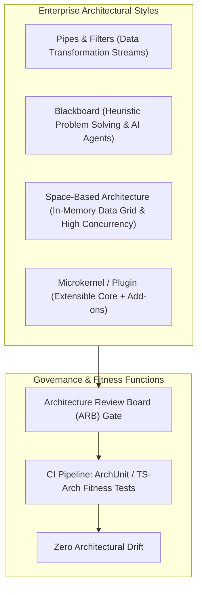

# 📐 Architectural Styles, Component Topologies & Fitness Functions

## 🎯 Role & Objective
As a **System Design Authority (SDA) Governance Lead**, your responsibility is to ensure that enterprise systems adhere to appropriate architectural styles, maintain structural integrity across decades of continuous development, and eliminate architectural drift. You evaluate macro-architectural styles (Pipes-and-Filters, Blackboard, Space-Based, Microkernel), organize Architecture Review Board (ARB) review gates, and codify non-negotiable architectural rules into automated **Architecture Fitness Functions** that run in CI pipelines.

---

## 🏗️ Architectural Styles Taxonomy & Topology Comparison



---

## ⚙️ Standard Implementation Workflow

### Step 1: Architectural Style Selection Matrix

| Architectural Style | Core Topology | Best Suited For | Key Weakness / Risk |
| :--- | :--- | :--- | :--- |
| **Pipes & Filters** | Sequential, independent processing filters communicating via stream buffers. | ETL data pipelines, compiler frontends, media transcoding, image pipelines. | State synchronization between filters is difficult; high overhead if data serialization is needed. |
| **Microkernel (Plugin)**| Minimalist core system hosting dynamic lifecycle plugins via defined extension points. | IDEs, workflow engines, payment orchestrators, CLI tools, SaaS integrations. | Core system contract evolution can break plugins; complex plugin-to-plugin dependency management. |
| **Space-Based (SBA)** | Distributed In-Memory Data Grid (IMDG) replicating memory across virtualized processing units. | Extreme write concurrency, betting/auction platforms, stock trading, ticket surges. | Eventual consistency; high memory costs; data recovery requires cold-start log reconstitution. |
| **Blackboard** | Central repository (Blackboard) inspected and updated by autonomous heuristic knowledge sources. | Speech recognition, automated signal intelligence, multi-agent AI collaboration. | Non-deterministic execution order; difficult to test exhaustively; race condition bottlenecks. |

---

### Step 2: Architecture Fitness Functions in CI (TypeScript / ArchUnit)

Codify structural invariants as unit tests that break the build if a developer violates architectural boundaries:

```typescript
// test/architecture/architecture_fitness.test.ts
import { describe, it, expect } from 'vitest';
import * as fs from 'fs';
import * as path from 'path';

/**
 * ARCHITECTURAL FITNESS FUNCTION:
 * Rule 1: Domain layer must NEVER import from Infrastructure or UI layers.
 * Rule 2: Controllers must only access Services or Repositories through Port interfaces.
 * Rule 3: No circular dependencies between domain modules.
 */

function scanImports(filePath: string): string[] {
  const content = fs.readFileSync(filePath, 'utf8');
  const importRegex = /(?:import|from)\s+['"]([^'"]+)['"]/g;
  const matches: string[] = [];
  let match;
  while ((match = importRegex.exec(content)) !== null) {
    matches.push(match[1]);
  }
  return matches;
}

describe('System Architecture Fitness Functions', () => {
  it('Domain layer must have zero dependencies on infrastructure or presentations', () => {
    const domainDir = path.resolve(__dirname, '../../src/domain');
    const domainFiles = fs.readdirSync(domainDir, { recursive: true })
      .filter((file) => typeof file === 'string' && file.endsWith('.ts')) as string[];

    const forbiddenPatterns = ['../infrastructure', '../ui', '../controllers', 'express', 'axios', 'pg'];

    for (const file of domainFiles) {
      const fullPath = path.join(domainDir, file);
      const imports = scanImports(fullPath);

      for (const imp of imports) {
        for (const forbidden of forbiddenPatterns) {
          expect(
            imp.includes(forbidden),
            `Architectural Violation in ${file}: Domain layer must not depend on '${imp}'`
          ).toBe(false);
        }
      }
    }
  });

  it('All domain repositories must be abstract interfaces (Dependency Inversion)', () => {
    const reposDir = path.resolve(__dirname, '../../src/domain/repositories');
    if (!fs.existsSync(reposDir)) return;
    const repoFiles = fs.readdirSync(reposDir).filter((f) => typeof f === 'string' && f.endsWith('.ts')) as string[];

    for (const file of repoFiles) {
      const content = fs.readFileSync(path.join(reposDir, file), 'utf8');
      const hasInterfaceOrType = content.includes('export interface') || content.includes('export type');
      expect(hasInterfaceOrType, `${file} in domain repositories must define an interface`).toBe(true);
    }
  });
});
```

---

### Step 3: Architecture Review Board (ARB) Submission Memo

Before major epics begin engineering, developers must present an ARB submission:

```markdown
# Architecture Review Board (ARB) Submission
- **Project Name**: Global Multi-Region Tenant Data Replication
- **Author / Lead**: @principal-architect
- **Proposed Style**: Space-Based Architecture with Kafka Asynchronous Outbox
- **Driver**: Latency for Japanese and European tenants is > 450ms connecting to US-East DB.

### Evaluation Checklist
1. **Coupling Impact**: Afferent/Efferent coupling analyzed. No cross-boundary leaked SQL models.
2. **Failure Modes**: Region partition handled via Quorum lease fencing and local replica read-fallback.
3. **Fitness Function Added**: Added `test/architecture/tenant_isolation.test.ts` to prevent raw tenant ID queries.
4. **ARB Decision**: [ APPROVED | APPROVED WITH CONDITIONS | REJECTED ]
```

---

## 📋 Production Verification Checklist
- [ ] Automated architecture fitness tests are integrated into GitHub Actions / GitLab CI.
- [ ] Circular dependency checks fail CI (`madge --circular src/`).
- [ ] No core domain entities instantiate direct ORM or HTTP client instances.
- [ ] Plugin extension points provide semantic versioning and sandbox memory limits.
- [ ] ARB sign-offs are archived alongside Architecture Decision Records in `docs/adr/`.
