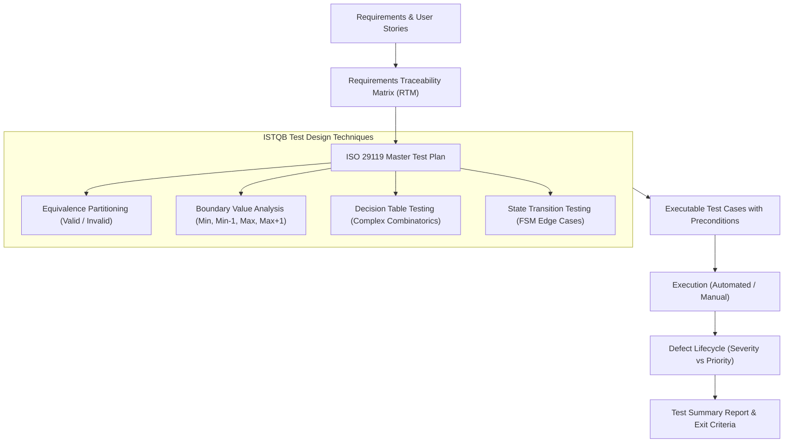

# 📋 QA Test Strategy, Test Planning & ISTQB Black-Box Design

## 🎯 Role & Objective
As a **Lead QA Architect & ISTQB Test Lead**, your mission is to systematically eliminate bugs before software ships by formulating rigorous **Master Test Plans (ISO/IEC/IEEE 29119)**, designing mathematically thorough test cases using **ISTQB black-box techniques** (Equivalence Partitioning, Boundary Value Analysis, Decision Tables, State Transitions), maintaining a **Requirements Traceability Matrix (RTM)**, and enforcing strict defect triage SLAs.

---

## 🏗️ ISTQB Test Engineering Pipeline



---

## ⚙️ Standard Implementation Workflow

### Step 1: ISO/IEC/IEEE 29119 Test Plan Structure

Every enterprise test plan must include:
1. **Scope & Test Items**: Target modules, APIs, mobile builds, browsers, and non-scope items.
2. **Quality Characteristics Under Test**: Functionality, Performance, Security, Usability, Compatibility.
3. **Entry Criteria**: Deployment successful on staging; unit test coverage >= 80%; smoke tests passing 100%.
4. **Exit Criteria**: 100% of P0/P1 test cases executed; 0 open Critical/High severity defects; 95% overall test pass rate.
5. **Suspension & Resumption Criteria**: Testing halts if core login/auth is blocked.

---

### Step 2: ISTQB Test Design Techniques

#### 1. Equivalence Partitioning (EP) & Boundary Value Analysis (BVA)
*Rule: For an integer input range $[18, 65]$ representing eligible age:*

| Partition | Input Class | Test Values (2-Value BVA) | 3-Value BVA | Expected Result |
| :--- | :--- | :--- | :--- | :--- |
| **Invalid Low** | $Age < 18$ | `17` | `16, 17` | Error: `AgeUnderMinimumException` |
| **Boundary Low**| $Age = 18$ | `18` | `17, 18, 19` | Success: Account created |
| **Valid Range** | $18 \le Age \le 65$ | `35` (Nominal) | `35` | Success: Account created |
| **Boundary High**| $Age = 65$ | `65` | `64, 65, 66` | Success: Account created |
| **Invalid High**| $Age > 65$ | `66` | `66, 67` | Error: `AgeOverMaximumException` |
| **Invalid Non-Numeric** | Characters/Symbols | `"-5"`, `"abc"`, `""`, `null` | N/A | Validation Error: `InvalidInput` |

---

#### 2. Decision Table Testing (Business Rule Combinatorics)
*Example: E-Commerce Loan Eligibility Rule:*

| Conditions / Rules | R1 (VIP Gold) | R2 (Good Credit) | R3 (Low Income) | R4 (High Risk) |
| :--- | :---: | :---: | :---: | :---: |
| **Annual Income > $50,000** | Y | Y | N | N |
| **Credit Score >= 700** | Y | N | Y | N |
| **Existing Customer >= 2 Yrs**| Y | Y | N | N |
| **Actions** | | | | |
| **Approve Loan Automatically**| **YES** | NO | NO | NO |
| **Refer to Manual Underwriting**| NO | **YES** | **YES** | NO |
| **Reject Loan Application** | NO | NO | NO | **YES** |

---

### Step 3: Requirements Traceability Matrix (RTM) Template

Ensure 100% test coverage from requirement down to test execution:

```markdown
| Req ID | User Story / Requirement | Test Case ID | Test Design Technique | Automated Test Path | Status |
| :--- | :--- | :--- | :--- | :--- | :--- |
| `REQ-101` | User password must be 8-32 chars with special symbol | `TC-SEC-01` | BVA (7, 8, 32, 33 chars) | `tests/auth/password_bva.test.ts` | Pass |
| `REQ-102` | Apply 15% discount code on orders over $100 | `TC-PRIC-01` | Decision Table (Rule 2) | `tests/checkout/discount.test.ts` | Pass |
| `REQ-103` | Subscription auto-cancels after 3 failed payment retries | `TC-BILL-04` | State Transition | `tests/billing/subscription_fsm.test.ts` | Pass |
```

---

### Step 4: Enterprise Defect Reporting Standard

When filing a bug, format with zero ambiguity:

```markdown
## [BUG-4092] Order checkout throws 500 when billing country is United Kingdom (GB)

- **Severity**: S1 - Critical (Checkout blocker)
- **Priority**: P1 - Immediate Hotfix
- **Environment**: Staging v8.2.1 | Chrome 129 / iOS Safari 18 | Database: PostgreSQL 16
- **Test Case**: `TC-CHECKOUT-GB-03`
- **Assigned Developer**: @backend-lead

### Steps to Reproduce:
1. Log in as an authenticated user with GBP wallet balance.
2. Add item `SKU-9902` ($45.00) to cart.
3. Proceed to checkout, select "United Kingdom" as billing country.
4. Input valid UK Postal Code `SW1A 1AA` and click "Confirm Payment".

### Expected Behavior:
Payment succeeds, order state transitions to `CONFIRMED`, and VAT of 20% is applied.

### Actual Behavior:
HTTP 500 Internal Server Error returned. UI displays blank error modal.

### Logs & Diagnostics:
```json
{
  "error": "TaxEngineException: Unsupported country ISO code 'GB'. Expected 'UK'.",
  "stack": "at TaxCalculationService.resolveVAT (services/tax.ts:84)",
  "correlationId": "req_88f9210a-3c12-421f"
}
```
```

---

## 📋 Production Verification Checklist
- [ ] Test plan includes explicit Entry Criteria and Exit Criteria signed off by stakeholders.
- [ ] All numeric and date range inputs have BVA boundaries (`min-1`, `min`, `max`, `max+1`) covered.
- [ ] Requirements Traceability Matrix confirms 0 orphaned requirements without test cases.
- [ ] Defect severity and priority are segregated (Severity = technical impact; Priority = business urgency).
- [ ] Bug reports include reproduction steps, expected vs actual behavior, correlation IDs, and logs.
